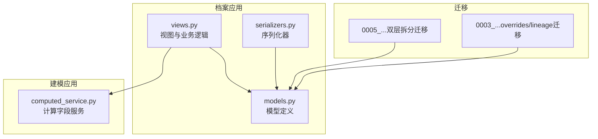
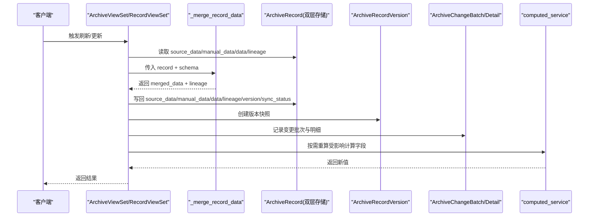
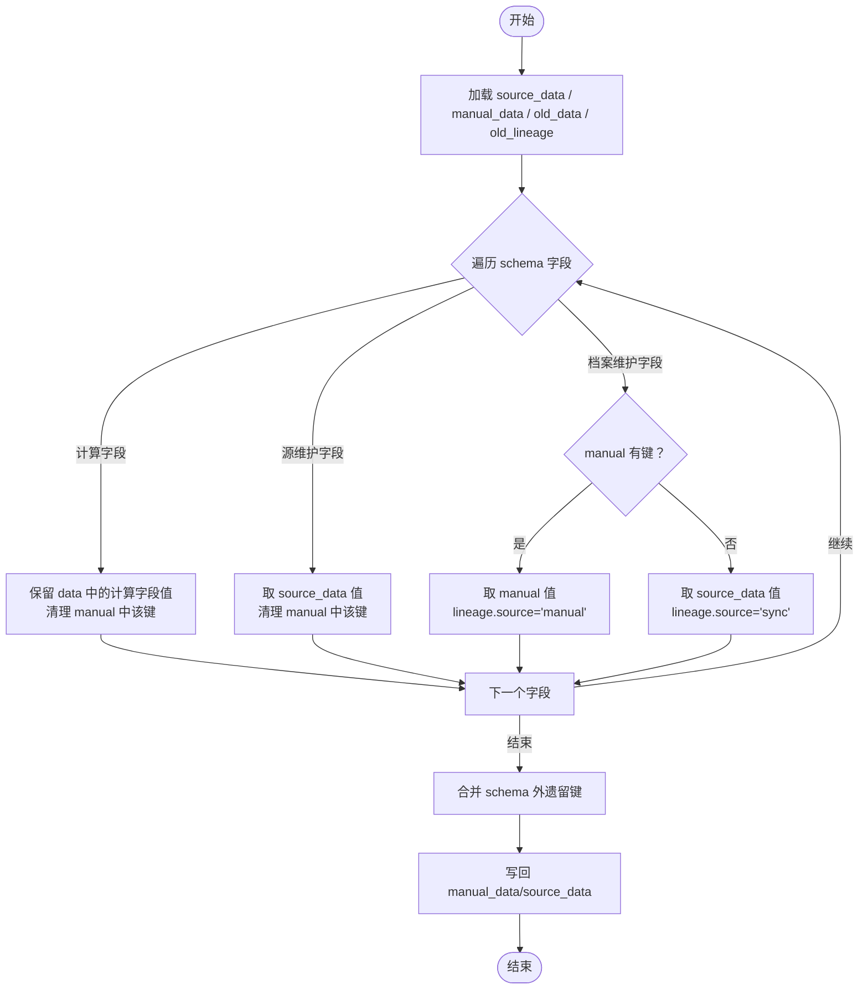
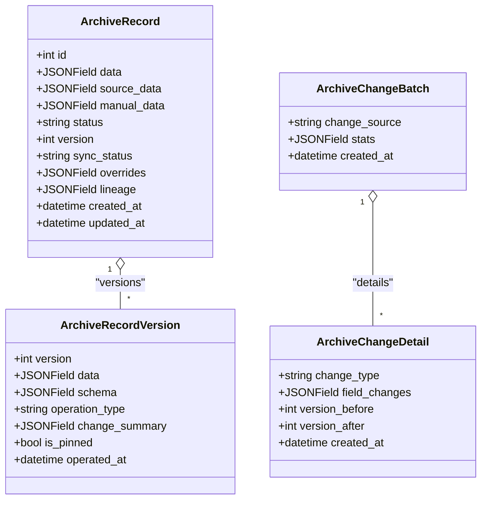
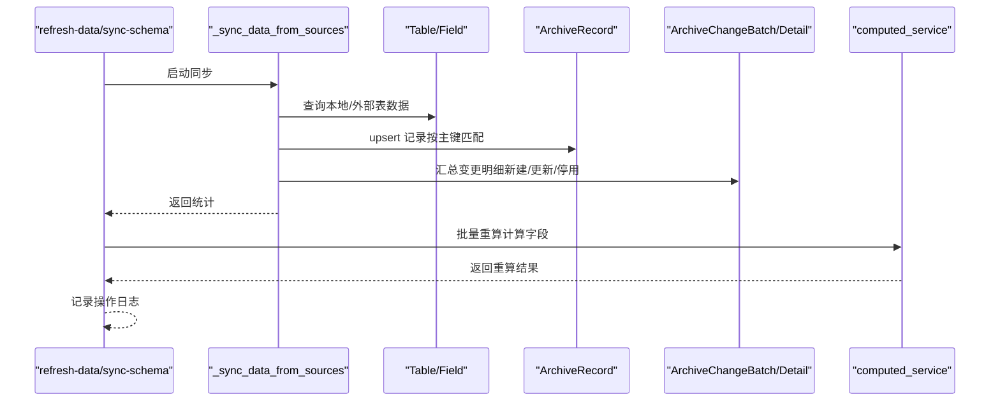
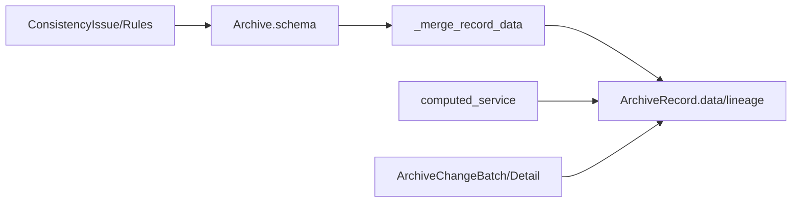

# 数据记录管理

<cite>
**本文引用的文件**   
- [models.py](file://backend/apps/archive/models.py)
- [views.py](file://backend/apps/archive/views.py)
- [serializers.py](file://backend/apps/archive/serializers.py)
- [computed_service.py](file://backend/apps/modeling/computed_service.py)
- [0005_archiverecord_manual_data_archiverecord_source_data_and_more.py](file://backend/apps/archive/migrations/0005_archiverecord_manual_data_archiverecord_source_data_and_more.py)
- [0003_archiverecord_lineage_archiverecord_overrides_and_more.py](file://backend/apps/archive/migrations/0003_archiverecord_lineage_archiverecord_overrides_and_more.py)
</cite>

## 目录
1. [简介](#简介)
2. [项目结构](#项目结构)
3. [核心组件](#核心组件)
4. [架构总览](#架构总览)
5. [详细组件分析](#详细组件分析)
6. [依赖关系分析](#依赖关系分析)
7. [性能考量](#性能考量)
8. [故障排查指南](#故障排查指南)
9. [结论](#结论)
10. [附录](#附录)

## 简介
本文件围绕 MetaData002 的“档案记录管理”能力，系统性阐述 ArchiveRecord 的双层存储架构与三层合并机制，覆盖 source_data（源同步底层）、manual_data（人工覆盖层）以及计算字段的融合策略；并详细说明字段级修正保护 overrides、血缘 lineage、软删除与版本控制、变更批次与明细、一致性检查等关键特性。文档同时提供端到端操作流程、最佳实践与性能优化建议，帮助读者快速掌握从创建到更新的全链路行为。

## 项目结构
- 模型定义位于 apps/archive/models.py，包含档案配置、档案记录、版本快照、同步日志、操作日志、变更批次与明细、一致性差异及规则等。
- 视图与业务逻辑集中在 apps/archive/views.py，涵盖 schema 生成、数据刷新、合并算法、一致性检查、回滚执行器等。
- 序列化器在 apps/archive/serializers.py，负责请求校验、双层拆分写入、版本与变更记录组装。
- 计算字段服务在 apps/modeling/computed_service.py，提供依赖解析、DAG 构建、重算调度与试算。
- 迁移脚本体现双层存储演进与历史数据拆分策略。

图表来源
- [models.py:33-73](file://backend/apps/archive/models.py#L33-L73)
- [views.py:161-223](file://backend/apps/archive/views.py#L161-L223)
- [serializers.py:121-183](file://backend/apps/archive/serializers.py#L121-L183)
- [computed_service.py:1-200](file://backend/apps/modeling/computed_service.py#L1-L200)
- [0005_archiverecord_manual_data_archiverecord_source_data_and_more.py:6-35](file://backend/apps/archive/migrations/0005_archiverecord_manual_data_archiverecord_source_data_and_more.py#L6-L35)
- [0003_archiverecord_lineage_archiverecord_overrides_and_more.py:14-23](file://backend/apps/archive/migrations/0003_archiverecord_lineage_archiverecord_overrides_and_more.py#L14-L23)

章节来源
- [models.py:1-379](file://backend/apps/archive/models.py#L1-L379)
- [views.py:1-800](file://backend/apps/archive/views.py#L1-L800)
- [serializers.py:1-552](file://backend/apps/archive/serializers.py#L1-L552)
- [computed_service.py:1-200](file://backend/apps/modeling/computed_service.py#L1-L200)
- [0005_archiverecord_manual_data_archiverecord_source_data_and_more.py:1-67](file://backend/apps/archive/migrations/0005_archiverecord_manual_data_archiverecord_source_data_and_more.py#L1-L67)
- [0003_archiverecord_lineage_archiverecord_overrides_and_more.py:1-49](file://backend/apps/archive/migrations/0003_archiverecord_lineage_archiverecord_overrides_and_more.py#L1-L49)

## 核心组件
- ArchiveRecord：档案记录主模型，采用双层存储（source_data、manual_data）+ 物化合并结果 data，并维护 overrides、lineage、status、version、sync_status 等元信息。
- ArchiveRecordVersion：版本快照，记录每次操作的完整数据快照与变更摘要，支持定版与回滚。
- ArchiveChangeBatch / ArchiveChangeDetail：变更批次与明细，统一记录源侧同步与档案侧编辑的变更轨迹。
- ConsistencyIssue / ConsistencyCheckRule：一致性差异与规则失效配置，用于发现并治理档案与源侧、组合字段成员间的不一致。
- 计算字段服务 computed_service：解析表达式、构建 DAG、按依赖顺序重算受影响的计算字段。

章节来源
- [models.py:33-110](file://backend/apps/archive/models.py#L33-L110)
- [models.py:206-272](file://backend/apps/archive/models.py#L206-L272)
- [models.py:274-332](file://backend/apps/archive/models.py#L274-L332)
- [computed_service.py:1-200](file://backend/apps/modeling/computed_service.py#L1-L200)

## 架构总览
下图展示数据记录的核心交互与数据流：视图层触发刷新或更新，调用合并函数完成三层合并，持久化双层存储与物化结果，并生成版本与变更日志；计算字段服务根据依赖进行增量重算。

图表来源
- [views.py:161-223](file://backend/apps/archive/views.py#L161-L223)
- [views.py:1530-1560](file://backend/apps/archive/views.py#L1530-L1560)
- [serializers.py:185-378](file://backend/apps/archive/serializers.py#L185-L378)
- [computed_service.py:300-330](file://backend/apps/modeling/computed_service.py#L300-L330)

## 详细组件分析

### 双层存储与三层合并机制
- 双层存储
  - source_data：源系统同步底层，整层替换，零比对，确保“源即真相”。
  - manual_data：人工覆盖层，仅允许 ownership=archive 的字段存在键，覆盖 source_data 对应字段。
  - data：物化合并结果，由 source_data 为底 + manual_data 覆盖 + 计算字段保留组成。
- 合并规则（逐字段）
  - 计算字段（source='computed'）：保留 data 现值，不允许人工覆盖。
  - 源维护字段（ownership='source'）：取 source_data，清理 manual_data 遗留键。
  - 档案维护字段（ownership='archive'）：优先 manual_data，否则回落到 source_data。
  - 遗留键处理：schema 外的历史键仍保留展示，但不再参与后续合并。
- 血缘 lineage
  - 人工命中 → source='manual'（保留原有登记信息），否则 source='sync'。
  - 每次合并重建 lineage，记录更新时间与来源。

图表来源
- [views.py:161-223](file://backend/apps/archive/views.py#L161-L223)

章节来源
- [views.py:161-223](file://backend/apps/archive/views.py#L161-L223)
- [0005_archiverecord_manual_data_archiverecord_source_data_and_more.py:6-35](file://backend/apps/archive/migrations/0005_archiverecord_manual_data_archiverecord_source_data_and_more.py#L6-L35)

### 字段级修正保护 overrides 与血缘 lineage
- overrides：记录字段级修正保护标记，包含 protected_by、protected_at、original_value 等，防止同步拉数时自动覆盖受保护字段。
- lineage：记录每个字段值的来源（manual/sync/resolve）与更新时间，便于溯源与审计。
- 更新流程中：
  - 人工修改 archive 字段 → 登记 overrides 并置 lineage.source='manual'。
  - 若新值回落至源层（等于 source_data 值）→ 解除 overrides 保护。

章节来源
- [models.py:52-57](file://backend/apps/archive/models.py#L52-L57)
- [serializers.py:259-279](file://backend/apps/archive/serializers.py#L259-L279)
- [0003_archiverecord_lineage_archiverecord_overrides_and_more.py:14-23](file://backend/apps/archive/migrations/0003_archiverecord_lineage_archiverecord_overrides_and_more.py#L14-L23)

### 记录的增删改查与软删除、版本控制
- 新增
  - 禁止档案端直接新增主数据记录（统一由源侧同步产生）。
  - 通过专用创建接口（如批量导入或内部通道）时，按 ownership 拆分写入 source_data/manual_data，并生成初始版本快照与操作日志。
- 更新
  - 拦截 source 维护字段的人工修改（Hub式约束）。
  - 双层写入：变更的 archive 字段写入 manual_data；当新值等于底层源值时移除键以回落。
  - 合并物化后更新 data、lineage、version、sync_status，并创建版本快照与操作日志。
  - 实时重算受影响计算字段。
- 软删除
  - perform_destroy 将 status 置为 DELETED，不物理删除；记录版本快照与操作日志。
- 版本控制
  - 每次变更递增 version，保存 data 与 schema 快照，支持对比与回滚。
  - 支持按时间点回滚（基于变更明细的版本映射）与按版本号回滚。

图表来源
- [models.py:33-110](file://backend/apps/archive/models.py#L33-L110)
- [models.py:206-272](file://backend/apps/archive/models.py#L206-L272)

章节来源
- [serializers.py:121-183](file://backend/apps/archive/serializers.py#L121-L183)
- [serializers.py:185-378](file://backend/apps/archive/serializers.py#L185-L378)
- [views.py:1563-1636](file://backend/apps/archive/views.py#L1563-L1636)
- [views.py:1674-1729](file://backend/apps/archive/views.py#L1674-L1729)

### 数据刷新与同步流程
- refresh-data：仅执行源数据整层拉取（换底重合并）+ 计算字段批量重算 + SYNC 操作日志，不重生成 schema、不 bump schema_version。
- sync-schema：重新生成 schema 并拉取数据，随后触发计算字段批量重算，记录操作日志。
- 同步过程
  - 构建 code→物理列映射，区分主表与其他表。
  - upsert 记录：匹配主键创建/更新，收集一致性检查所需值。
  - 停用清扫：源侧已删除的记录标记停用（只标不删），避免误删。
  - 变更日志：本轮有变更才建批次，零变更不产生噪声。

图表来源
- [views.py:930-1086](file://backend/apps/archive/views.py#L930-L1086)
- [views.py:1530-1560](file://backend/apps/archive/views.py#L1530-L1560)
- [computed_service.py:300-330](file://backend/apps/modeling/computed_service.py#L300-L330)

章节来源
- [views.py:930-1086](file://backend/apps/archive/views.py#L930-L1086)
- [views.py:1530-1560](file://backend/apps/archive/views.py#L1530-L1560)

### 一致性检查与差异治理
- 检查类型
  - composite_member：组合字段非主字段成员值≠主字段值。
  - archive_source_diff：档案侧人工覆盖与源侧数据差异。
  - orphan_source_record：源侧数据无法关联主表主键。
  - schema_drift：档案 schema 与当前建模结构不一致。
- 规则失效：ConsistencyCheckRule.disabled=True 的规则产生的差异不计入统计。
- 差异记录：ConsistencyIssue 与历史快照 ConsistencyIssueHistory，支持批量审核（reviewed/ignored/reopen）。

章节来源
- [views.py:396-601](file://backend/apps/archive/views.py#L396-L601)
- [models.py:274-332](file://backend/apps/archive/models.py#L274-L332)
- [models.py:334-362](file://backend/apps/archive/models.py#L334-L362)

### 计算字段重算与依赖解析
- 依赖解析：解析表达式引用，区分物理字段与计算字段依赖，检测环依赖。
- DAG 构建与拓扑排序：确定执行顺序，避免循环与重复计算。
- 增量重算：根据变更字段找到受影响计算字段，按执行顺序重算并回填 data。

章节来源
- [computed_service.py:1-200](file://backend/apps/modeling/computed_service.py#L1-L200)
- [computed_service.py:300-330](file://backend/apps/modeling/computed_service.py#L300-L330)

## 依赖关系分析
- ArchiveRecord 依赖 Archive.schema 决定字段归属与合并策略。
- 更新流程依赖 computed_service 进行计算字段重算。
- 变更日志与版本快照贯穿所有写操作，保证可追溯性。
- 一致性检查依赖建模侧 Field/StandardField/Table 的结构信息。

图表来源
- [views.py:161-223](file://backend/apps/archive/views.py#L161-L223)
- [computed_service.py:300-330](file://backend/apps/modeling/computed_service.py#L300-L330)
- [models.py:206-272](file://backend/apps/archive/models.py#L206-L272)

章节来源
- [views.py:161-223](file://backend/apps/archive/views.py#L161-L223)
- [computed_service.py:300-330](file://backend/apps/modeling/computed_service.py#L300-L330)
- [models.py:206-272](file://backend/apps/archive/models.py#L206-L272)

## 性能考量
- 双层存储优势
  - source_data 整层替换，避免逐字段比对开销，提升同步效率。
  - manual_data 仅含必要覆盖键，降低 JSON 体积与合并成本。
- 合并复杂度
  - 逐字段遍历 schema，时间复杂度 O(N)，N 为字段数；计算字段跳过覆盖，减少不必要写入。
- 批量与事务
  - 变更明细批量创建，减少 IO 次数；回滚与更新使用事务保障一致性。
- 计算字段重算
  - 增量重算仅影响依赖链上的字段，避免全量重算；拓扑排序保证执行顺序。
- 索引与查询
  - 对 archive/status 建立索引，加速列表与过滤；search 使用文本化 icontains 兼容 SQLite。
- 预检与零写入
  - refresh-preview 提供零写入预检，降低误操作风险与无效同步。

[本节为通用指导，不直接分析具体文件]

## 故障排查指南
- 同步失败
  - 查看 sync_stats.errors 与警告信息，定位表级异常；确认主键字段与映射正确。
- 计算字段重算失败
  - 检查表达式语法与依赖解析结果；关注 circular dependency 错误。
- 人工覆盖被覆盖
  - 检查 overrides 是否生效；确认 ownership 与 lineage 来源是否正确。
- 版本回滚无效
  - 确认目标版本快照存在且属于该记录；使用 _execute_field_rollback 分层写回。
- 一致性差异持续出现
  - 核对组合字段主字段设置；必要时禁用相关规则（ConsistencyCheckRule）。

章节来源
- [views.py:930-1086](file://backend/apps/archive/views.py#L930-L1086)
- [computed_service.py:1-200](file://backend/apps/modeling/computed_service.py#L1-L200)
- [views.py:2105-2200](file://backend/apps/archive/views.py#L2105-L2200)

## 结论
ArchiveRecord 的双层存储与三层合并机制，在保证“源即真相”的同时，赋予档案侧灵活的人工覆盖能力，并通过 overrides 与 lineage 实现字段级保护与可追溯。结合版本快照、变更批次与一致性检查，形成完整的 MDM 数据治理闭环。配合计算字段服务的增量重算与预检能力，系统在准确性、可维护性与性能之间取得良好平衡。

[本节为总结性内容，不直接分析具体文件]

## 附录
- 端到端操作流程（创建到更新）
  - 创建：通过专用接口（或内部通道）按 ownership 拆分写入 source_data/manual_data，生成初始版本与日志。
  - 更新：拦截 source 字段修改，双层写入并回落，合并物化，重算计算字段，记录版本与日志。
  - 软删除：状态置为 DELETED，保留数据快照，记录版本与日志。
  - 刷新：refresh-data 整层拉取 source_data，重算计算字段，生成变更批次与操作日志。
  - 回滚：按版本号或时间点恢复，分层写回并生成版本与日志。

[本节为流程概述，不直接分析具体文件]