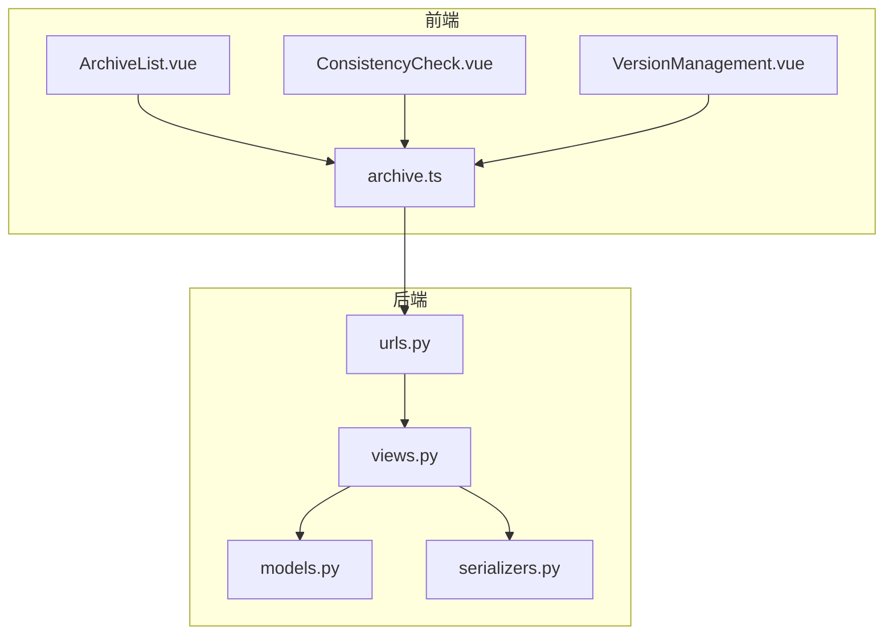
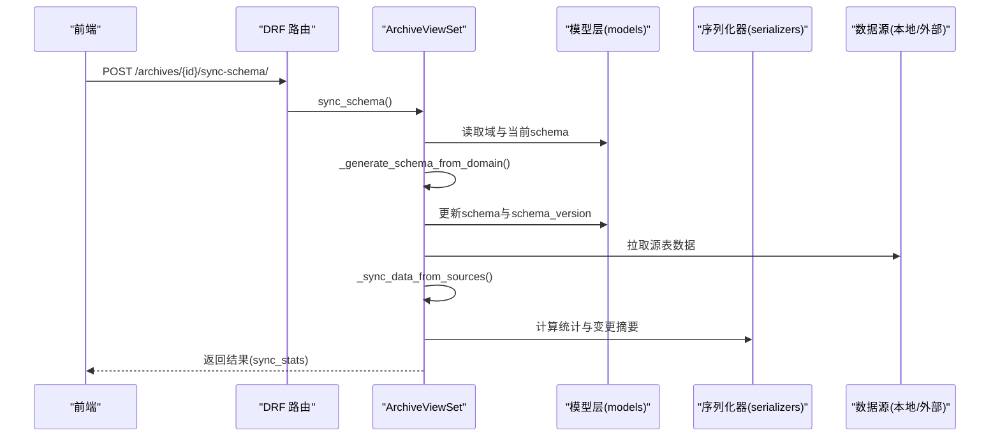
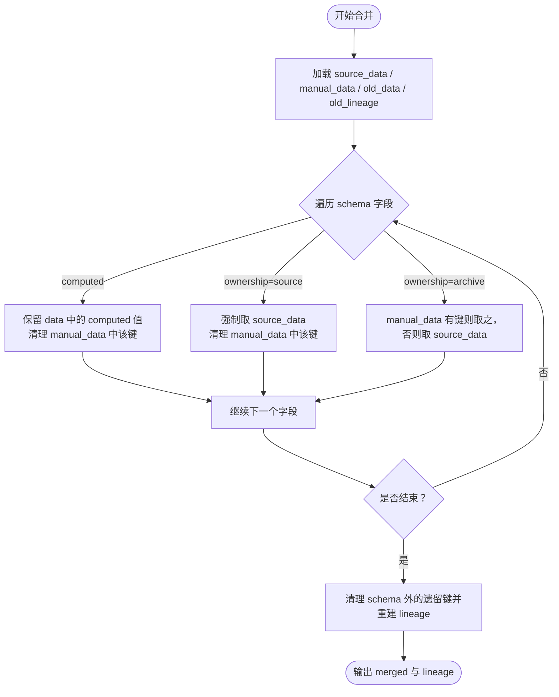
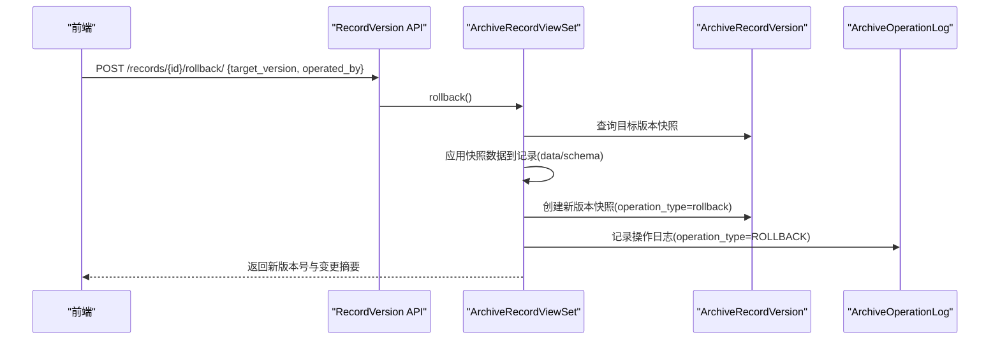
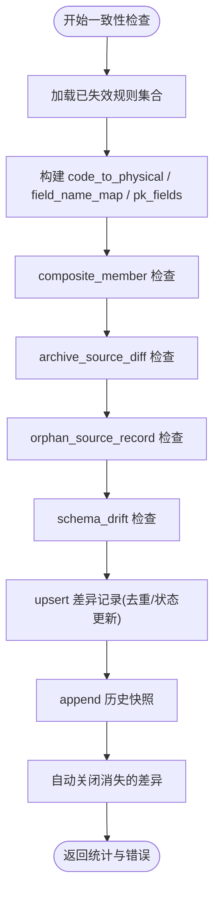
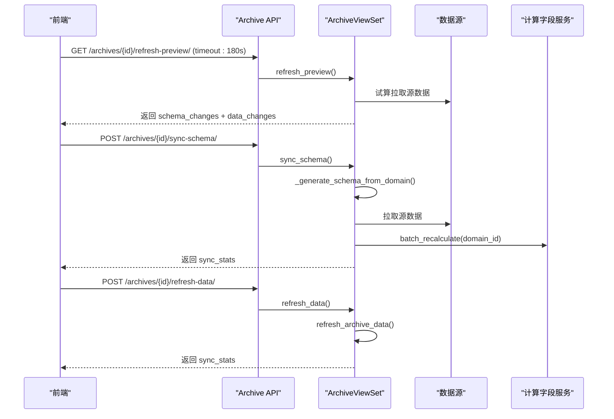
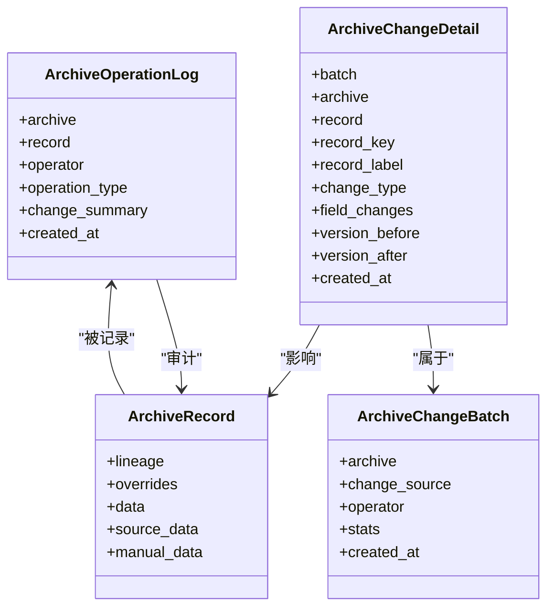
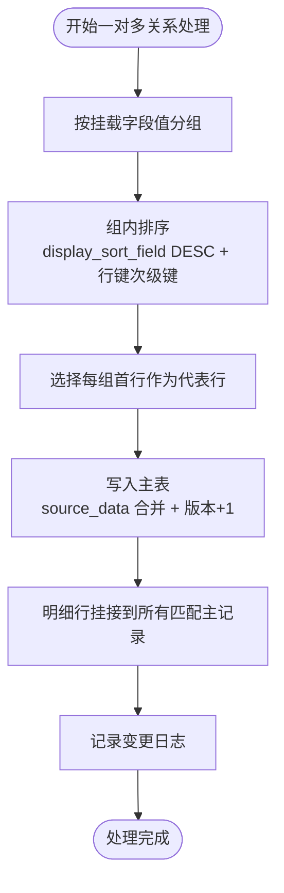
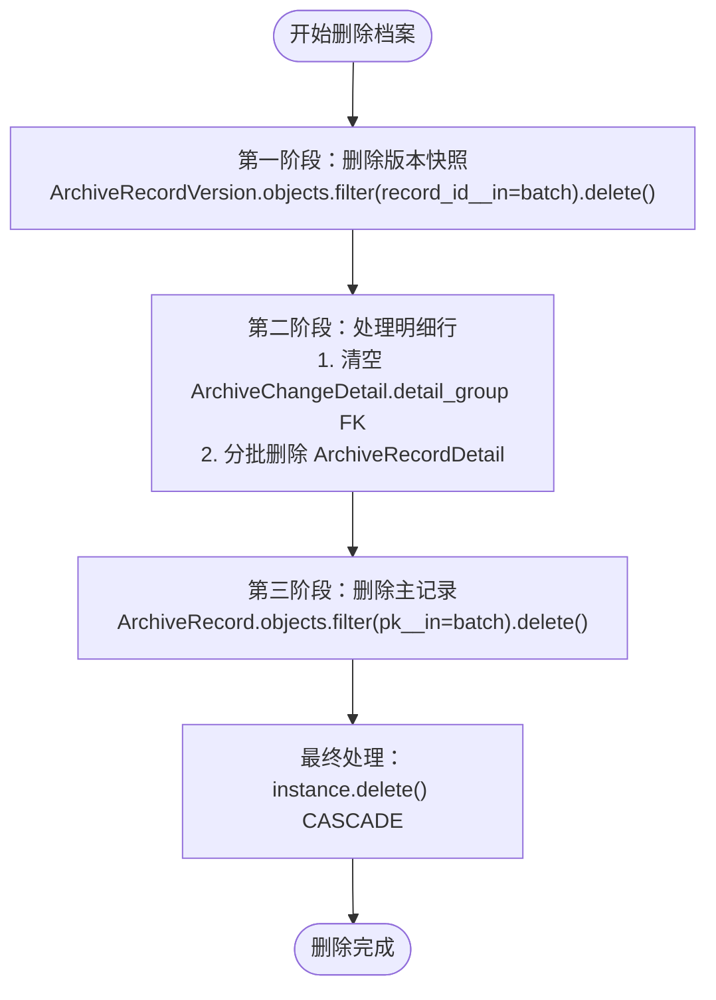
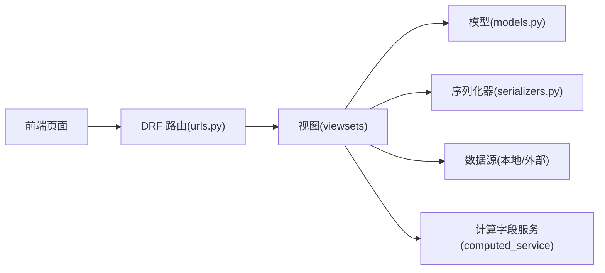

# 档案管理模块

<cite>
**本文引用的文件**   
- [backend/apps/archive/models.py](file://backend/apps/archive/models.py)
- [backend/apps/archive/views.py](file://backend/apps/archive/views.py)
- [backend/apps/archive/serializers.py](file://backend/apps/archive/serializers.py)
- [backend/apps/archive/urls.py](file://backend/apps/archive/urls.py)
- [frontend/src/api/archive.ts](file://frontend/src/api/archive.ts)
- [frontend/src/views/archive/ArchiveList.vue](file://frontend/src/views/archive/ArchiveList.vue)
- [frontend/src/views/archive/ConsistencyCheck.vue](file://frontend/src/views/archive/ConsistencyCheck.vue)
- [frontend/src/views/archive/VersionManagement.vue](file://frontend/src/views/archive/VersionManagement.vue)
- [backend/apps/archive/migrations/0013_consistencycheckrule_and_more.py](file://backend/apps/archive/migrations/0013_consistencycheckrule_and_more.py)
</cite>

## 更新摘要
**变更内容**   
- 档案记录删除操作性能优化：实现了针对SQLite数据库的批量删除策略，解决了999变量限制问题
- 新增三阶段删除机制：先删除ArchiveRecordVersion，再处理ArchiveRecordDetail的反向引用，最后删除ArchiveRecord实例
- 确保大数据量场景下的可靠删除操作，避免Django Collector combined_updates优化导致的SQL变量超限

## 目录
1. [简介](#简介)
2. [项目结构](#项目结构)
3. [核心组件](#核心组件)
4. [架构总览](#架构总览)
5. [详细组件分析](#详细组件分析)
6. [依赖关系分析](#依赖关系分析)
7. [性能考量](#性能考量)
8. [故障排查指南](#故障排查指南)
9. [结论](#结论)
10. [附录：配置与最佳实践](#附录配置与最佳实践)

## 简介
本模块为 MetaData002 的"档案管理"子系统，围绕"档案（Archive）"这一概念提供主数据建模、版本控制、一致性检查、API 数据同步与变更历史审计等能力。通过"双层存储 + Schema 快照 + 计算字段重算 + 批次化变更日志"，实现对多源数据的统一汇聚、人工覆盖保护、可回滚与可审计的数据治理闭环。

**最新更新**：档案记录删除操作经过重大性能优化，实现了针对SQLite数据库的批量删除策略，解决了999变量限制问题，确保大数据量场景下的可靠删除操作。

## 项目结构
后端采用 Django + DRF 的分层设计：
- models.py：定义档案、记录、版本、同步日志、操作日志、变更批次/明细、一致性差异及规则等模型。
- views.py：实现档案 CRUD、Schema 同步、数据刷新预检与执行、一致性检查、数据拉取合并、血缘与版本快照生成等核心逻辑。
- serializers.py：序列化器负责输入校验、双层拆分写入、版本快照创建、变更摘要构建、批量操作封装等。
- urls.py：注册 REST 路由，暴露档案、记录、版本、同步日志、操作日志、变更批次/明细、一致性问题与规则、数据服务 API 等接口。

前端以 Vue 3 + Ant Design Vue 为主，关键页面包括：
- ArchiveList.vue：档案列表、新建、刷新预检与确认更新，新增同步状态显示和超时错误处理。
- ConsistencyCheck.vue：一致性检查运行、结果分组展示、批量审核与失效规则管理。
- VersionManagement.vue：变更日志（批次+明细）时间线视图、导出、单条/整批回滚。
- archive.ts：统一的 API 调用封装，包含增强的超时配置。

**图表来源** 
- [backend/apps/archive/views.py](file://backend/apps/archive/views.py)
- [backend/apps/archive/models.py](file://backend/apps/archive/models.py)
- [backend/apps/archive/serializers.py](file://backend/apps/archive/serializers.py)
- [backend/apps/archive/urls.py](file://backend/apps/archive/urls.py)
- [frontend/src/api/archive.ts](file://frontend/src/api/archive.ts)
- [frontend/src/views/archive/ArchiveList.vue](file://frontend/src/views/archive/ArchiveList.vue)
- [frontend/src/views/archive/ConsistencyCheck.vue](file://frontend/src/views/archive/ConsistencyCheck.vue)
- [frontend/src/views/archive/VersionManagement.vue](file://frontend/src/views/archive/VersionManagement.vue)

**章节来源**
- [backend/apps/archive/models.py:1-541](file://backend/apps/archive/models.py#L1-L541)
- [backend/apps/archive/views.py:1-3978](file://backend/apps/archive/views.py#L1-L3978)
- [backend/apps/archive/serializers.py:1-552](file://backend/apps/archive/serializers.py#L1-L552)
- [backend/apps/archive/urls.py:1-21](file://backend/apps/archive/urls.py#L1-L21)
- [frontend/src/api/archive.ts:1-139](file://frontend/src/api/archive.ts#L1-L139)
- [frontend/src/views/archive/ArchiveList.vue:1-364](file://frontend/src/views/archive/ArchiveList.vue#L1-L364)
- [frontend/src/views/archive/ConsistencyCheck.vue:1-438](file://frontend/src/views/archive/ConsistencyCheck.vue#L1-L438)
- [frontend/src/views/archive/VersionManagement.vue:1-628](file://frontend/src/views/archive/VersionManagement.vue#L1-L628)

## 核心组件
- 档案（Archive）：每个域一个档案，保存 Schema 快照与版本号，作为数据结构的基线。
- 档案记录（ArchiveRecord）：主数据实例，采用双层存储（source_data 底层 + manual_data 覆盖），物化 data 为合并结果，维护 lineage 血缘与 overrides 修正保护。
- 档案记录明细（ArchiveRecordDetail）：子表关系保留的全部行，支持一对多挂载，双层存储同主记录。
- 版本快照（ArchiveRecordVersion）：每次增删改/回滚/定版/模型同步均产生快照，支持对比与回滚。
- 同步日志（ArchiveSyncLog）：记录一次从源侧拉取并合并的过程详情。
- 操作日志（ArchiveOperationLog）：记录所有关键操作的审计轨迹。
- 数据服务 API（ArchiveApi）：对外暴露档案数据，支持字段暴露、筛选条件与角色授权。
- 变更批次/明细（ArchiveChangeBatch / ArchiveChangeDetail）：按批次聚合变更，明细含字段级旧值→新值与版本映射。
- 一致性差异与规则（ConsistencyIssue / ConsistencyCheckRule / ConsistencyIssueHistory）：多种检查类型、规则失效与历史追踪。

**章节来源**
- [backend/apps/archive/models.py:1-541](file://backend/apps/archive/models.py#L1-L541)
- [backend/apps/archive/serializers.py:1-552](file://backend/apps/archive/serializers.py#L1-L552)

## 架构总览
档案模块的核心流程包括：
- Schema 同步：从域模型生成最新 Schema 快照，必要时触发数据拉取与计算字段重算。
- 数据刷新：仅拉取源数据换底重合并，零比对写入 source_data，再惰性合并到 data。
- 一致性检查：四种检查类型打包执行，产出差异清单与历史快照，支持规则失效。
- 变更历史：批次化记录新增/修改/停用/复活/回滚，支持单条或整批撤销。
- 版本控制：基于版本快照的回滚与定版机制，保障可追溯与可恢复。
- **删除优化**：三阶段批量删除机制，解决SQLite数据库999变量限制问题。

**图表来源** 
- [backend/apps/archive/views.py:275-329](file://backend/apps/archive/views.py#L275-L329)
- [backend/apps/archive/views.py:930-1085](file://backend/apps/archive/views.py#L930-L1085)
- [backend/apps/archive/serializers.py:1-552](file://backend/apps/archive/serializers.py#L1-L552)
- [backend/apps/archive/models.py:1-541](file://backend/apps/archive/models.py#L1-L541)

## 详细组件分析

### 档案与记录：双层存储与合并策略
- 双层存储：source_data 为底层（同步时整层替换），manual_data 为人工覆盖层（仅 ownership=archive 的字段有键）。
- 合并策略：data = source_data 为基础，archive 字段 manual_data 优先覆盖；computed 字段保留现有值；ownership=source 的字段强制取 source_data。
- 血缘与保护：lineage 记录字段来源与更新时间；overrides 对人工覆盖进行保护，防止同步覆盖。

**图表来源** 
- [backend/apps/archive/views.py:161-223](file://backend/apps/archive/views.py#L161-L223)

**章节来源**
- [backend/apps/archive/models.py:54-94](file://backend/apps/archive/models.py#L54-L94)
- [backend/apps/archive/views.py:161-223](file://backend/apps/archive/views.py#L161-L223)
- [backend/apps/archive/serializers.py:121-183](file://backend/apps/archive/serializers.py#L121-L183)

### 版本控制：快照、回滚与定版
- 快照：每次 CREATE/UPDATE/DELETE/ROLLBACK/PIN/SCHEMA_SYNC 均生成版本快照，包含 data、schema、change_summary 与操作人信息。
- 回滚：支持按目标版本回滚（恢复到该版本快照），以及按变更明细时间点回滚（撤销目标变更之后的所有变更）。
- 定版：可对某版本打「定版」标记，禁止后续修改，便于发布基线。

**图表来源** 
- [backend/apps/archive/serializers.py:380-433](file://backend/apps/archive/serializers.py#L380-L433)
- [backend/apps/archive/models.py:140-179](file://backend/apps/archive/models.py#L140-L179)

**章节来源**
- [backend/apps/archive/models.py:140-179](file://backend/apps/archive/models.py#L140-L179)
- [backend/apps/archive/serializers.py:380-433](file://backend/apps/archive/serializers.py#L380-L433)

### 一致性检查：四种规则与历史追踪
- 检查类型：
  - composite_member：组合字段非主字段成员值≠主字段值。
  - archive_source_diff：档案侧人工覆盖与源侧数据差异。
  - orphan_source_record：源侧数据无法关联主表主键。
  - schema_drift：档案 schema 与当前建模结构不一致。
- 规则失效：ConsistencyCheckRule 可按 check_type + field_code + member_source 粒度失效规则，避免噪声。
- 历史追踪：ConsistencyIssueHistory 每次检查 append 快照，形成变化轨迹。

**图表来源** 
- [backend/apps/archive/views.py:396-600](file://backend/apps/archive/views.py#L396-L600)
- [backend/apps/archive/models.py:274-379](file://backend/apps/archive/models.py#L274-379)
- [backend/apps/archive/migrations/0013_consistencycheckrule_and_more.py:1-79](file://backend/apps/archive/migrations/0013_consistencycheckrule_and_more.py#L1-L79)

**章节来源**
- [backend/apps/archive/views.py:396-600](file://backend/apps/archive/views.py#L396-L600)
- [backend/apps/archive/models.py:274-379](file://backend/apps/archive/models.py#L274-379)
- [backend/apps/archive/migrations/0013_consistencycheckrule_and_more.py:1-79](file://backend/apps/archive/migrations/0013_consistencycheckrule_and_more.py#L1-L79)

### API 数据同步：定时任务与手动触发

**更新**：增强了超时处理和用户反馈机制，支持大数据量场景的稳定运行。

- 手动触发：
  - refresh-preview：只读预检，比较 schema 变化与数据变化样本，不写库。**已增强超时时间至 180 秒**，支持约 20 万条数据量的预检场景。
  - sync-schema：先同步 schema，再拉取数据并触发计算字段重算。
  - refresh-data：仅拉取源数据换底重合并，不改变 schema。
- 定时任务：可通过 management command 或后台线程复用 refresh_archive_data 函数执行同步。
- 数据拉取：支持本地表与外部数据源（Oracle/SQL Server/MySQL/PostgreSQL），动态连接与 LIMIT 限制。

**图表来源** 
- [backend/apps/archive/views.py:331-394](file://backend/apps/archive/views.py#L331-L394)
- [backend/apps/archive/views.py:930-1085](file://backend/apps/archive/views.py#L930-L1085)
- [backend/apps/archive/views.py:1530-1560](file://backend/apps/archive/views.py#L1530-L1560)
- [frontend/src/api/archive.ts:16-25](file://frontend/src/api/archive.ts#L16-L25)

**章节来源**
- [backend/apps/archive/views.py:331-394](file://backend/apps/archive/views.py#L331-L394)
- [backend/apps/archive/views.py:930-1085](file://backend/apps/archive/views.py#L930-L1085)
- [backend/apps/archive/views.py:1530-1560](file://backend/apps/archive/views.py#L1530-L1560)
- [frontend/src/api/archive.ts:16-25](file://frontend/src/api/archive.ts#L16-L25)

### 变更历史记录：操作日志、审计追踪与数据血缘
- 操作日志（ArchiveOperationLog）：记录创建、更新、删除、回滚、同步、模型同步等操作，附带变更摘要。
- 变更批次/明细（ArchiveChangeBatch / ArchiveChangeDetail）：按批次聚合变更，明细含字段级旧值→新值、版本映射、记录标识与信息。
- 数据血缘（lineage）：记录每个字段值的来源（manual/sync/resolve）与更新时间，支持溯源。

**图表来源** 
- [backend/apps/archive/models.py:174-272](file://backend/apps/archive/models.py#L174-L272)
- [backend/apps/archive/serializers.py:456-527](file://backend/apps/archive/serializers.py#L456-527)

**章节来源**
- [backend/apps/archive/models.py:174-272](file://backend/apps/archive/models.py#L174-L272)
- [backend/apps/archive/serializers.py:456-527](file://backend/apps/archive/serializers.py#L456-527)

### 数据服务 API：对外暴露档案数据
- 配置项：path、exposed_fields、filter_conditions、auth_roles、status。
- 用途：将档案数据以 API 形式对外开放，支持字段子集暴露与权限控制。

**章节来源**
- [backend/apps/archive/models.py:139-172](file://backend/apps/archive/models.py#L139-L172)
- [backend/apps/archive/serializers.py:529-552](file://backend/apps/archive/serializers.py#L529-L552)

### 一对多关系支持：非主键挂载点架构改进

**重大更新**：档案同步系统经过重大架构改进，完全重构 `_sync_detail_rows` 方法以支持通过任意字段建立一对多关系。

- **非主键挂载点**：明细行现在可以通过任意字段（不限于主键）的值归属到多个主记录，实现真正的一对多场景。例如物料主表的 MATERIAL_GROUP 字段可以关联到分组头表的 GROUP_ID 字段。
- **分组处理逻辑**：`_sync_detail_rows` 方法按挂载字段值分组处理代表行，每组选择排序首行作为默认值写入主表，确保业务逻辑的正确性。
- **代表行写入优化**：使用 `_write_dimension_row` 公共写入逻辑，支持本表非空映射字段的 source_data 合并、版本+1 和变更明细记录。
- **确定性排序算法**：使用 display_sort_field 进行排序（空值垫底），结合行键次级键确保确定性，对齐第133轮方向锁定语义。

**图表来源** 
- [backend/apps/archive/views.py:1842-2151](file://backend/apps/archive/views.py#L1842-L2151)
- [backend/apps/archive/views.py:2714-2791](file://backend/apps/archive/views.py#L2714-L2791)

**章节来源**
- [backend/apps/archive/views.py:1842-2151](file://backend/apps/archive/views.py#L1842-L2151)
- [backend/apps/archive/views.py:2714-2791](file://backend/apps/archive/views.py#L2714-L2791)

### 前端超时处理增强：用户体验优化

**新增**：前端超时处理机制得到显著增强，提供更好的用户体验。

- **超时时间延长**：`refreshPreview` API 超时时间从 30 秒增加到 180 秒，支持大数据量预检场景。
- **友好错误提示**：当检测到超时错误时，显示具体的提示信息，告知用户数据量较大需要等待。
- **同步状态显示**：在按钮上显示"同步中..."状态，防止重复点击，提升交互体验。
- **错误分类处理**：区分超时错误和其他类型的错误，提供针对性的处理逻辑。

**章节来源**
- [frontend/src/api/archive.ts:33](file://frontend/src/api/archive.ts#L33)
- [frontend/src/views/archive/ArchiveList.vue:228-236](file://frontend/src/views/archive/ArchiveList.vue#L228-L236)

### 档案记录删除优化：三阶段批量删除机制

**重大更新**：档案记录删除操作经过重大性能优化，实现了针对SQLite数据库的批量删除策略，解决了999变量限制问题。

- **三阶段删除机制**：
  1. **第一阶段**：删除 ArchiveRecordVersion（无反向FK，可直接按record_id分批删除）
  2. **第二阶段**：处理 ArchiveRecordDetail 的反向引用，先清空 ArchiveChangeDetail.detail_group FK（SET_NULL），再分批删除明细行
  3. **第三阶段**：删除 ArchiveRecord（无SET_NULL反向FK，直接按PK分批删除）
  4. **兜底处理**：instance.delete() CASCADE 处理其余量小的关联（sync_logs/apis等）

- **批量策略**：
  - RECORD_BATCH = 500：ArchiveRecord PK 的批次大小
  - DETAIL_PK_BATCH = 200：ArchiveRecordDetail PK 的批次大小
  - 使用 itertools.islice 进行流式迭代，避免内存溢出

- **SQLite兼容性**：绕过 Django 6.0 Collector combined_updates 优化将过多 PK 塞入单条 UPDATE/SET NULL 语句导致的 SQLite 999 变量上限问题

**图表来源** 
- [backend/apps/archive/views.py:275-328](file://backend/apps/archive/views.py#L275-L328)

**章节来源**
- [backend/apps/archive/views.py:275-328](file://backend/apps/archive/views.py#L275-L328)

## 依赖关系分析
- 视图与模型：views.py 直接读写 models.py 定义的实体，并通过 serializers.py 完成输入输出校验与转换。
- 前端与后端：前端通过 archive.ts 调用后端路由，路由由 urls.py 注册到 DRF Router。
- 外部依赖：数据源连接（本地/外部数据库）、计算字段服务（computed_service）在同步后触发重算。

**图表来源** 
- [backend/apps/archive/urls.py:1-21](file://backend/apps/archive/urls.py#L1-L21)
- [backend/apps/archive/views.py:1-3978](file://backend/apps/archive/views.py#L1-L3978)
- [backend/apps/archive/models.py:1-541](file://backend/apps/archive/models.py#L1-L541)
- [backend/apps/archive/serializers.py:1-552](file://backend/apps/archive/serializers.py#L1-L552)

**章节来源**
- [backend/apps/archive/urls.py:1-21](file://backend/apps/archive/urls.py#L1-L21)
- [backend/apps/archive/views.py:1-3978](file://backend/apps/archive/views.py#L1-L3978)

## 性能考量
- 双层存储与零比对写入：source_data 整层替换，减少比对开销；data 惰性合并，降低频繁写入成本。
- 分页与限制：外部数据源查询使用 LIMIT/TOP 限制行数，避免大表全量扫描。
- 批量操作：变更明细与差异记录使用 bulk_create/bulk_update，提升写入效率。
- 索引优化：对常用查询字段建立索引（如 archive/status、created_at 等）。
- 计算字段重算：仅在必要时机触发，失败不影响主流程。
- **一对多关系优化**：通过挂载字段值分组处理，减少重复计算，提升大数据量场景下的处理效率。
- **超时优化**：预检 API 超时时间延长至 180 秒，支持约 20 万条数据量的稳定处理。
- **幂等性保证**：一对多关系处理确保相同数据不会重复创建，支持多次同步的幂等性。
- **删除性能优化**：三阶段批量删除机制，解决SQLite数据库999变量限制问题，确保大数据量场景下的可靠删除操作。

## 故障排查指南
- 同步失败：查看 sync-stats.errors 与操作日志，定位数据源连接或 SQL 语法问题。
- 一致性差异持续：检查规则是否失效，核对组合字段主字段设置，确认 source_data 与 manual_data 覆盖逻辑。
- 版本回滚无效：确认目标版本存在且未被定版锁定，检查变更记录的版本映射字段。
- 计算字段重算失败：查看 computed_recalculated.error，检查公式与依赖字段可用性。
- **预检超时**：如果预检超时，检查数据量大小和网络状况，考虑在非高峰时段执行。
- **一对多关系异常**：检查挂载字段配置是否正确，确认挂载字段值能够正确匹配到主记录。
- **代表行选择问题**：验证 display_sort_field 配置是否符合业务预期，检查排序逻辑是否正确。
- **删除操作失败**：检查是否存在大量关联数据，确认三阶段删除机制是否正常执行，关注SQLite数据库的变量限制问题。

**章节来源**
- [backend/apps/archive/views.py:930-1085](file://backend/apps/archive/views.py#L930-L1085)
- [backend/apps/archive/views.py:396-600](file://backend/apps/archive/views.py#L396-L600)
- [backend/apps/archive/serializers.py:380-433](file://backend/apps/archive/serializers.py#L380-L433)
- [backend/apps/archive/views.py:275-328](file://backend/apps/archive/views.py#L275-L328)

## 结论
档案管理模块通过"双层存储 + Schema 快照 + 一致性检查 + 批次化变更日志 + 版本控制"的组合，实现了主数据的统一汇聚、人工覆盖保护、可回滚与可审计的数据治理闭环。其 API 数据同步机制支持定时与手动触发，前端提供了直观的预检、检查与变更历史界面，满足复杂业务场景下的数据一致性与可追溯需求。

**最新更新**：经过重大性能优化的档案记录删除操作，特别是三阶段批量删除机制，有效解决了SQLite数据库999变量限制问题，确保了大数据量场景下的可靠删除操作。配合之前的一对多关系支持、前端超时处理增强等功能，整个系统在大规模数据场景下具备了更好的稳定性和可靠性。

## 附录：配置与最佳实践
- Schema 定义：
  - 通过域模型自动生成 Schema 快照，确保字段分组、类型与归属（ownership）正确。
  - 组合字段需设置主字段，以保证数据源头唯一与一致性检查有效。
- 字段约束与业务规则：
  - 使用 ownership 区分维护方（source/archive/computed），避免冲突。
  - 利用 overrides 保护人工覆盖字段，防止同步覆盖。
- 一致性检查：
  - 按需启用/失效规则，减少噪声；定期运行检查并处理差异。
- 数据同步：
  - 先预览再执行，关注 archive_owned_impact 告警，评估人工覆盖字段被波及风险。
  - **大数据量场景**：预检操作可能需要较长时间，请耐心等待或使用非高峰时段执行。
- 变更历史与回滚：
  - 使用批次视图快速定位变更，支持单条或整批撤销；注意源侧同步可能再次覆盖。
- 数据服务 API：
  - 合理配置 exposed_fields 与 filter_conditions，结合 auth_roles 控制访问权限。
- **一对多关系配置**：
  - 正确配置挂载字段（target_field），支持通过任意字段建立一对多关系。
  - 设置合适的 display_sort_field 以确保代表行选择的准确性。
  - 验证挂载字段值能够正确匹配到主记录，确保一对多关系的正确性。
- **性能优化建议**：
  - 对于大数据量场景，建议使用非高峰时段执行同步操作。
  - 合理配置行键列（row_key_field），确保明细行的唯一性和性能。
  - 监控同步过程中的警告和错误信息，及时调整配置。
- **删除操作最佳实践**：
  - 删除大型档案前，建议先备份相关数据。
  - 三阶段删除机制会自动处理复杂的关联关系，无需手动干预。
  - 如遇删除超时，检查数据库连接和锁情况，必要时分批次执行删除操作。

**章节来源**
- [backend/apps/archive/views.py:47-159](file://backend/apps/archive/views.py#L47-L159)
- [backend/apps/archive/views.py:800-928](file://backend/apps/archive/views.py#L800-928)
- [frontend/src/views/archive/ArchiveList.vue:262-315](file://frontend/src/views/archive/ArchiveList.vue#L262-315)
- [frontend/src/views/archive/ConsistencyCheck.vue:335-351](file://frontend/src/views/archive/ConsistencyCheck.vue#L335-351)
- [frontend/src/views/archive/VersionManagement.vue:547-583](file://frontend/src/views/archive/VersionManagement.vue#L547-583)
- [backend/apps/archive/views.py:275-328](file://backend/apps/archive/views.py#L275-L328)