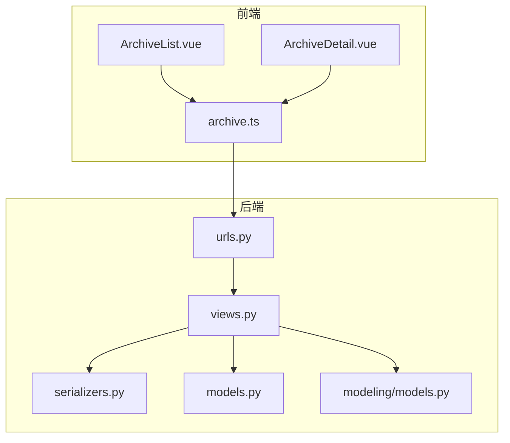
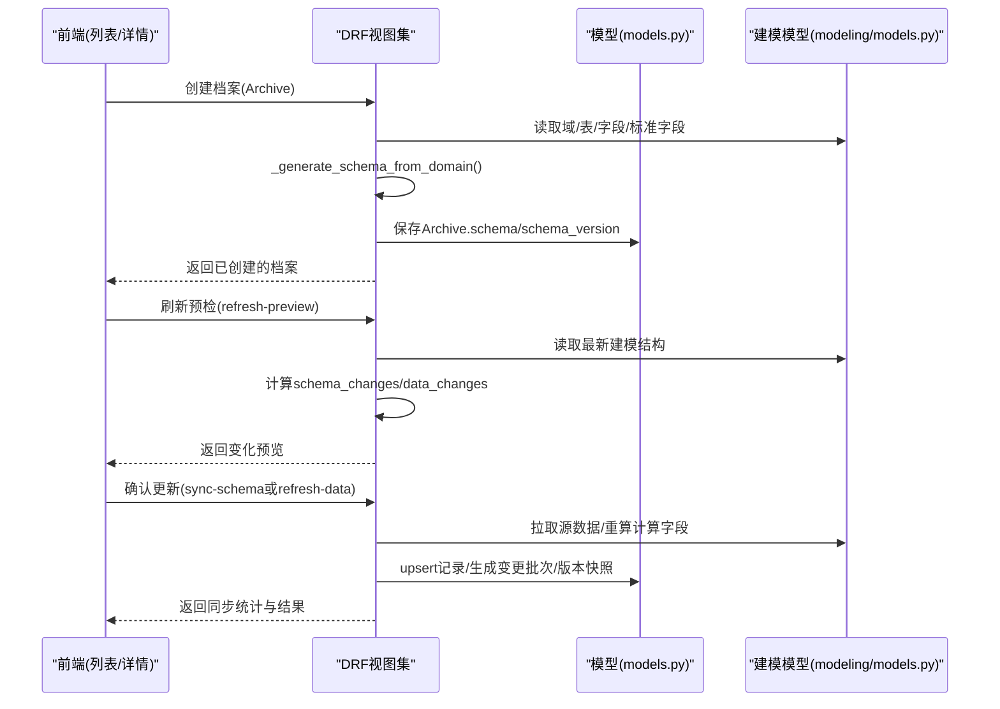
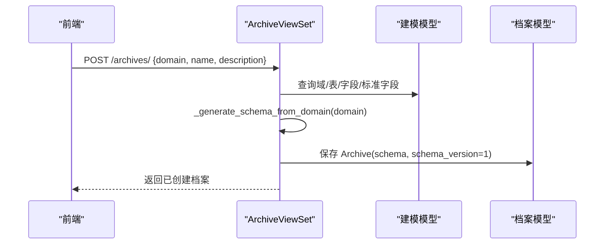
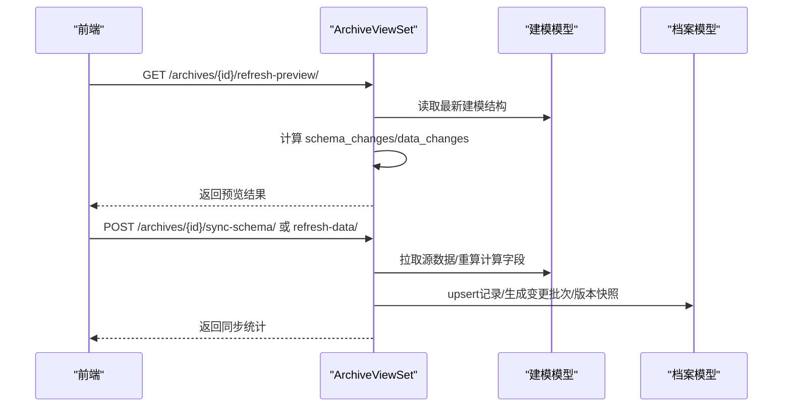
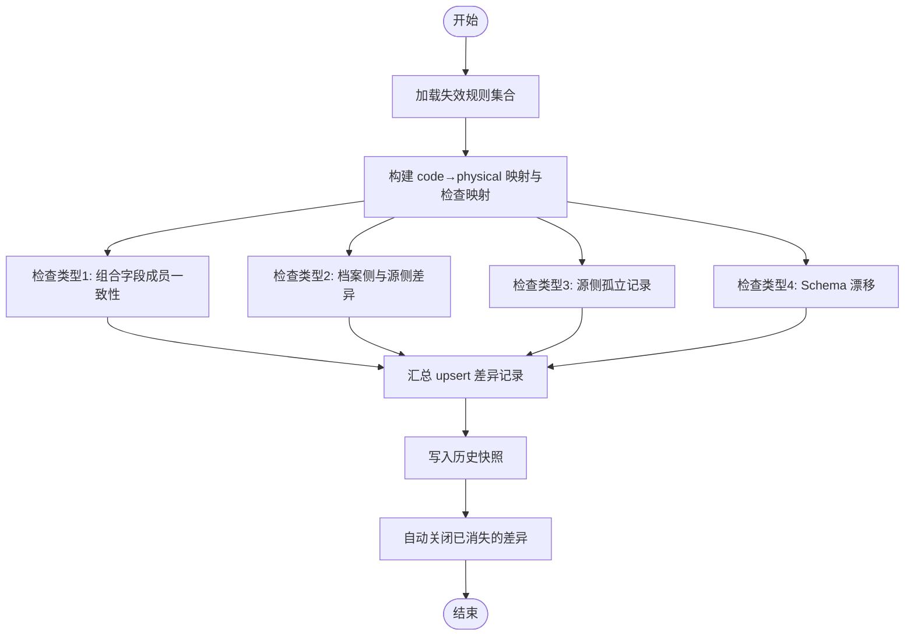
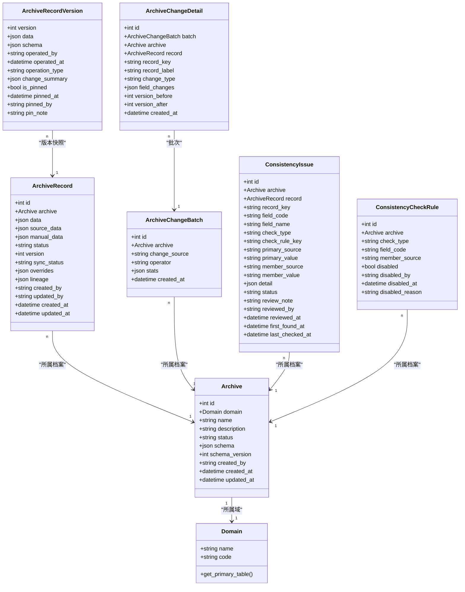

# 档案配置管理

<cite>
**本文引用的文件**   
- [backend/apps/archive/models.py](file://backend/apps/archive/models.py)
- [backend/apps/archive/views.py](file://backend/apps/archive/views.py)
- [backend/apps/archive/serializers.py](file://backend/apps/archive/serializers.py)
- [backend/apps/archive/urls.py](file://backend/apps/archive/urls.py)
- [backend/apps/modeling/models.py](file://backend/apps/modeling/models.py)
- [frontend/src/api/archive.ts](file://frontend/src/api/archive.ts)
- [frontend/src/views/archive/ArchiveList.vue](file://frontend/src/views/archive/ArchiveList.vue)
- [frontend/src/views/archive/ArchiveDetail.vue](file://frontend/src/views/archive/ArchiveDetail.vue)
</cite>

## 目录
1. [简介](#简介)
2. [项目结构](#项目结构)
3. [核心组件](#核心组件)
4. [架构总览](#架构总览)
5. [详细组件分析](#详细组件分析)
6. [依赖关系分析](#依赖关系分析)
7. [性能考量](#性能考量)
8. [故障排查指南](#故障排查指南)
9. [结论](#结论)
10. [附录：使用流程与示例](#附录使用流程与示例)

## 简介
本文件面向 MetaData002 的“档案配置管理”功能，围绕 Archive 模型的设计理念、字段含义（域关联、Schema 快照、状态管理等）、档案生命周期（草稿→发布→归档）、Schema 快照生成机制（从 StandardField 自动生成）、CRUD 接口与前端界面能力，以及完整的使用流程与最佳实践进行系统化说明。文档同时提供常见问题解决方案与实际配置示例路径，帮助使用者快速上手并稳定运维。

## 项目结构
后端采用 Django + DRF 的分层设计：
- models.py：定义档案领域数据模型（Archive、ArchiveRecord、版本、变更批次、一致性检查等）
- views.py：实现业务逻辑（Schema 同步、数据刷新、一致性检查、预览等）
- serializers.py：序列化器（校验、双层拆分、版本快照、变更日志等）
- urls.py：路由注册（RESTful 端点）
- modeling/models.py：建模侧基础模型（Domain、Table、Field、StandardField、ComputedField 等），为 Schema 生成与数据同步提供元数据支撑

前端基于 Vue 3 + Ant Design Vue：
- api/archive.ts：封装所有档案相关 API 调用
- views/archive/*：档案管理列表、详情、一致性检查、版本管理等页面

图表来源
- [backend/apps/archive/views.py:1-2487](file://backend/apps/archive/views.py#L1-L2487)
- [backend/apps/archive/serializers.py:1-552](file://backend/apps/archive/serializers.py#L1-L552)
- [backend/apps/archive/models.py:1-379](file://backend/apps/archive/models.py#L1-L379)
- [backend/apps/modeling/models.py:1-489](file://backend/apps/modeling/models.py#L1-L489)
- [backend/apps/archive/urls.py:1-21](file://backend/apps/archive/urls.py#L1-L21)
- [frontend/src/api/archive.ts:1-139](file://frontend/src/api/archive.ts#L1-L139)
- [frontend/src/views/archive/ArchiveList.vue:1-364](file://frontend/src/views/archive/ArchiveList.vue#L1-L364)
- [frontend/src/views/archive/ArchiveDetail.vue:1-1243](file://frontend/src/views/archive/ArchiveDetail.vue#L1-L1243)

章节来源
- [backend/apps/archive/models.py:1-379](file://backend/apps/archive/models.py#L1-L379)
- [backend/apps/archive/views.py:1-2487](file://backend/apps/archive/views.py#L1-L2487)
- [backend/apps/archive/serializers.py:1-552](file://backend/apps/archive/serializers.py#L1-L552)
- [backend/apps/modeling/models.py:1-489](file://backend/apps/modeling/models.py#L1-L489)
- [backend/apps/archive/urls.py:1-21](file://backend/apps/archive/urls.py#L1-L21)
- [frontend/src/api/archive.ts:1-139](file://frontend/src/api/archive.ts#L1-L139)
- [frontend/src/views/archive/ArchiveList.vue:1-364](file://frontend/src/views/archive/ArchiveList.vue#L1-L364)
- [frontend/src/views/archive/ArchiveDetail.vue:1-1243](file://frontend/src/views/archive/ArchiveDetail.vue#L1-L1243)

## 核心组件
- Archive（档案配置）：一个域一个档案，维护名称、描述、状态、Schema 快照与版本号、创建信息等
- ArchiveRecord（档案记录）：主数据实例，采用双层存储（source_data + manual_data），合并物化到 data；包含状态、版本、同步状态、修正保护、血缘等
- ArchiveRecordVersion（版本快照）：每次操作生成快照，支持定版、回滚
- ArchiveChangeBatch / ArchiveChangeDetail（变更批次与明细）：统一记录源侧同步与人工编辑的变更，支持批量撤销与单条回滚
- ConsistencyIssue / ConsistencyCheckRule / ConsistencyIssueHistory（一致性差异与规则）：四类检查（组合成员一致性、档案侧与源侧差异、孤立源记录、Schema 漂移），支持失效规则与历史轨迹
- ArchiveApi（数据服务API）：对外暴露档案数据的接口配置（路径、暴露字段、筛选条件、授权角色等）

章节来源
- [backend/apps/archive/models.py:1-379](file://backend/apps/archive/models.py#L1-L379)

## 架构总览
系统通过“建模侧标准字段 → 档案 Schema 快照 → 数据同步与合并 → 版本与变更追踪 → 一致性检查”的全链路闭环，保障档案数据的准确性与可追溯性。

图表来源
- [backend/apps/archive/views.py:259-329](file://backend/apps/archive/views.py#L259-L329)
- [backend/apps/archive/views.py:331-394](file://backend/apps/archive/views.py#L331-L394)
- [backend/apps/archive/views.py:930-1085](file://backend/apps/archive/views.py#L930-L1085)
- [backend/apps/modeling/models.py:162-300](file://backend/apps/modeling/models.py#L162-L300)

## 详细组件分析

### Archive 模型设计与字段含义
- domain：一对一关联 Domain，确保“一域一档案”
- name/description：档案基本信息
- status：文本枚举，支持草稿/已发布/已归档
- schema：JSON 字段，记录创建时从 StandardField 生成的字段结构（含 code、name、type、group_path、ownership 等）
- schema_version：每次同步模型变更递增
- created_by/created_at/updated_at：审计信息

章节来源
- [backend/apps/archive/models.py:5-28](file://backend/apps/archive/models.py#L5-L28)

### ArchiveRecord 双层存储与合并策略
- source_data：底层源值，同步时整层替换
- manual_data：人工覆盖层，仅允许 ownership=archive 的字段有键
- data：合并物化结果（source_data 为底 + manual_data 覆盖 + 计算字段保留）
- sync_status：unsynced/synced/partial/error/stale
- overrides：字段级修正保护标记（防止同步覆盖）
- lineage：字段级血缘（source=manual/sync/resolve，更新时间）

合并规则（_merge_record_data）：
- computed 字段保留现有值
- ownership=source 直接取 source_data 并清理遗留 manual 键
- ownership=archive 优先 manual_data，否则 fallback 到 source_data
- 重建 lineage，标注来源与时间

章节来源
- [backend/apps/archive/models.py:33-73](file://backend/apps/archive/models.py#L33-L73)
- [backend/apps/archive/views.py:161-223](file://backend/apps/archive/views.py#L161-L223)

### Schema 快照生成机制（从 StandardField 自动生成）
- 按 FieldGroup 树 DFS 序确定分组顺序，未分组排最后
- 应用字段门控（release_to_concept/release_to_archive/is_active/status）过滤
- 优先使用 StandardField 的 name/type，否则用物理字段自身
- 输出 code 去重（首次出现为准）
- 并入已释放的计算字段（有分组随真实分组排序，未分组兑底「计算字段」虚拟组）

章节来源
- [backend/apps/archive/views.py:47-158](file://backend/apps/archive/views.py#L47-L158)
- [backend/apps/modeling/models.py:162-300](file://backend/apps/modeling/models.py#L162-L300)

### 档案生命周期与状态流转
- Archive 状态：draft（草稿）→ active（已发布）→ archived（已归档）
- ArchiveRecord 状态：active（启用）↔ deleted（停用）
- 同步状态：unsynced → synced/partial/error/stale
- 版本快照：create/update/delete/rollback/pin/schema_sync
- 变更来源：sync（源侧同步）/manual（档案侧编辑）/consistency（一致性审核）

章节来源
- [backend/apps/archive/models.py:5-28](file://backend/apps/archive/models.py#L5-L28)
- [backend/apps/archive/models.py:33-73](file://backend/apps/archive/models.py#L33-L73)
- [backend/apps/archive/models.py:75-110](file://backend/apps/archive/models.py#L75-L110)
- [backend/apps/archive/models.py:206-272](file://backend/apps/archive/models.py#L206-L272)

### CRUD 接口与前端界面能力
后端 REST 端点（由 urls.py 注册）：
- /archives/：档案配置 CRUD
- /records/：档案记录 CRUD
- /sync-logs/：同步日志
- /operation-logs/：操作日志
- /record-versions/：版本管理
- /archive-apis/：数据服务API
- /change-batches/：变更批次
- /change-details/：变更明细
- /consistency-issues/：一致性差异
- /consistency-rules/：一致性规则

前端能力：
- 档案列表：新建、删除、刷新预检、跳转一致性检查
- 档案详情：动态列展示、字段导航、编辑抽屉、暂存修改、批量保存、立即刷新、变更历史、回滚

章节来源
- [backend/apps/archive/urls.py:1-21](file://backend/apps/archive/urls.py#L1-L21)
- [frontend/src/api/archive.ts:1-139](file://frontend/src/api/archive.ts#L1-L139)
- [frontend/src/views/archive/ArchiveList.vue:1-364](file://frontend/src/views/archive/ArchiveList.vue#L1-L364)
- [frontend/src/views/archive/ArchiveDetail.vue:1-1243](file://frontend/src/views/archive/ArchiveDetail.vue#L1-L1243)

### 关键业务流程时序图

#### 创建档案并生成 Schema 快照

图表来源
- [backend/apps/archive/views.py:259-274](file://backend/apps/archive/views.py#L259-L274)
- [backend/apps/archive/views.py:47-158](file://backend/apps/archive/views.py#L47-L158)

#### 刷新预检与确认更新

图表来源
- [backend/apps/archive/views.py:331-394](file://backend/apps/archive/views.py#L331-L394)
- [backend/apps/archive/views.py:930-1085](file://backend/apps/archive/views.py#L930-L1085)

#### 一致性检查（四类检查）

图表来源
- [backend/apps/archive/views.py:396-600](file://backend/apps/archive/views.py#L396-L600)
- [backend/apps/archive/models.py:274-379](file://backend/apps/archive/models.py#L274-L379)

### 对象关系图（类图）

图表来源
- [backend/apps/archive/models.py:5-379](file://backend/apps/archive/models.py#L5-L379)
- [backend/apps/modeling/models.py:32-124](file://backend/apps/modeling/models.py#L32-L124)

## 依赖关系分析
- Archive 依赖 Domain（一对一）
- ArchiveRecord 依赖 Archive（一对多）
- 版本快照、变更批次/明细、一致性差异均依赖 Archive/ArchiveRecord
- Schema 生成依赖 modeling 侧的 Domain/Table/Field/StandardField/ComputedField/FieldGroup
- 前端通过 archive.ts 调用后端 DRF 端点，渲染列表与详情页面

章节来源
- [backend/apps/archive/models.py:5-379](file://backend/apps/archive/models.py#L5-L379)
- [backend/apps/modeling/models.py:32-489](file://backend/apps/modeling/models.py#L32-L489)
- [backend/apps/archive/urls.py:1-21](file://backend/apps/archive/urls.py#L1-L21)
- [frontend/src/api/archive.ts:1-139](file://frontend/src/api/archive.ts#L1-L139)

## 性能考量
- Schema 生成采用 DFS 遍历与预加载映射，避免 N+1 查询
- 数据同步采用跨表累积与主键索引匹配，减少重复处理
- 变更日志与版本快照批量创建，降低数据库压力
- 预检模式（dry-run）零写入，便于用户确认影响范围
- 计算字段重算按需触发，避免全量重算开销

[本节为通用性能建议，不直接分析具体文件]

## 故障排查指南
- 组合字段未设置主字段：刷新/同步时会告警，需到属性配置页设置主字段
- 源库连接异常：预检会记录错误，检查数据源配置与网络连通性
- 档案维护字段被源侧刷新波及：预检弹窗会提示受影响记录数与字段，确认后执行
- 一致性差异持续存在：查看失效规则是否误禁用，必要时调整规则或修复数据
- 版本回滚失败：确认目标版本是否存在且未被定版锁定

章节来源
- [backend/apps/archive/views.py:805-811](file://backend/apps/archive/views.py#L805-L811)
- [backend/apps/archive/views.py:922-928](file://backend/apps/archive/views.py#L922-L928)
- [backend/apps/archive/views.py:396-600](file://backend/apps/archive/views.py#L396-L600)

## 结论
档案配置管理以“标准字段驱动 Schema 快照 + 双层存储合并 + 版本与变更追踪 + 一致性检查”为核心，形成从建模到发布再到归档的完整闭环。通过预检与批处理机制，既保证数据质量，又提升操作效率。建议在生产环境中严格遵循“先预检后确认”的流程，并结合一致性检查与失效规则管理，确保档案数据的准确性与可追溯性。

[本节为总结性内容，不直接分析具体文件]

## 附录：使用流程与示例

### 完整使用流程（从创建到发布）
1. 创建档案：选择域、填写名称与描述，系统自动生成 Schema 快照
2. 刷新预检：查看 Schema 与数据变化预览，确认影响范围
3. 确认更新：根据预览结果选择“同步结构+拉数”或“仅刷新数据”
4. 人工编辑：在详情中编辑档案维护字段，暂存修改后批量保存
5. 一致性检查：运行四类检查，处理差异项，必要时禁用规则
6. 版本管理与回滚：查看版本历史，支持单条/时间点回滚
7. 发布与归档：将档案状态切换为已发布/已归档，供外部消费

章节来源
- [frontend/src/views/archive/ArchiveList.vue:234-315](file://frontend/src/views/archive/ArchiveList.vue#L234-L315)
- [frontend/src/views/archive/ArchiveDetail.vue:745-786](file://frontend/src/views/archive/ArchiveDetail.vue#L745-L786)
- [backend/apps/archive/views.py:259-329](file://backend/apps/archive/views.py#L259-L329)

### 实际配置示例（路径参考）
- 创建档案请求体：见 [frontend/src/views/archive/ArchiveList.vue:241-246](file://frontend/src/views/archive/ArchiveList.vue#L241-L246)
- 刷新预检响应结构：见 [backend/apps/archive/views.py:331-394](file://backend/apps/archive/views.py#L331-L394)
- 数据同步统计字段：见 [backend/apps/archive/views.py:930-1085](file://backend/apps/archive/views.py#L930-L1085)
- 一致性检查统计字段：见 [backend/apps/archive/views.py:396-600](file://backend/apps/archive/views.py#L396-L600)

### 常见问题解决方案
- 问题：Schema 不同步  
  解决：先执行 refresh-preview，确认 schema_changes.has_changes 后再调用 sync-schema
- 问题：人工编辑无效  
  解决：确认字段 ownership=archive，且非 computed 字段；检查 overrides 保护标记
- 问题：一致性差异过多  
  解决：检查组合字段主字段设置，必要时禁用特定规则（ConsistencyCheckRule）

章节来源
- [backend/apps/archive/views.py:331-394](file://backend/apps/archive/views.py#L331-L394)
- [backend/apps/archive/serializers.py:198-377](file://backend/apps/archive/serializers.py#L198-L377)
- [backend/apps/archive/models.py:334-379](file://backend/apps/archive/models.py#L334-L379)