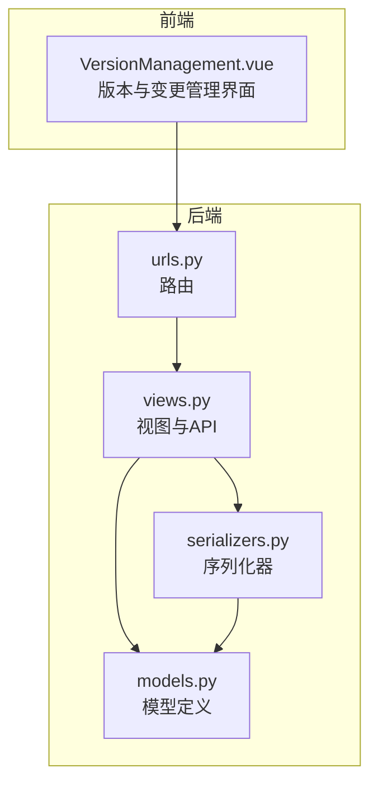
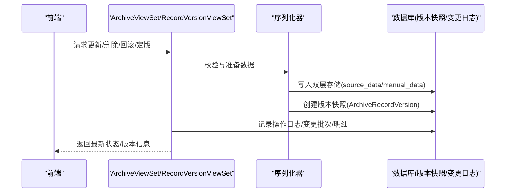
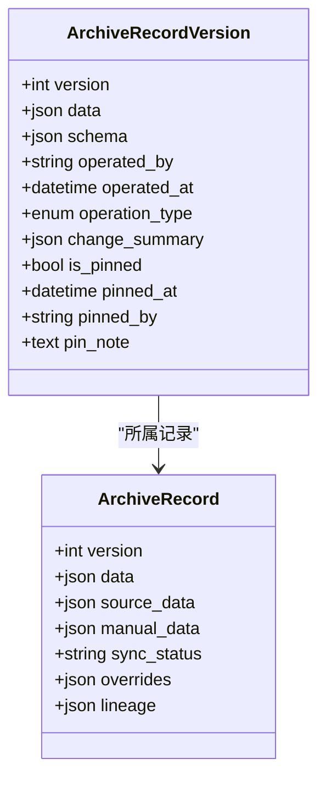
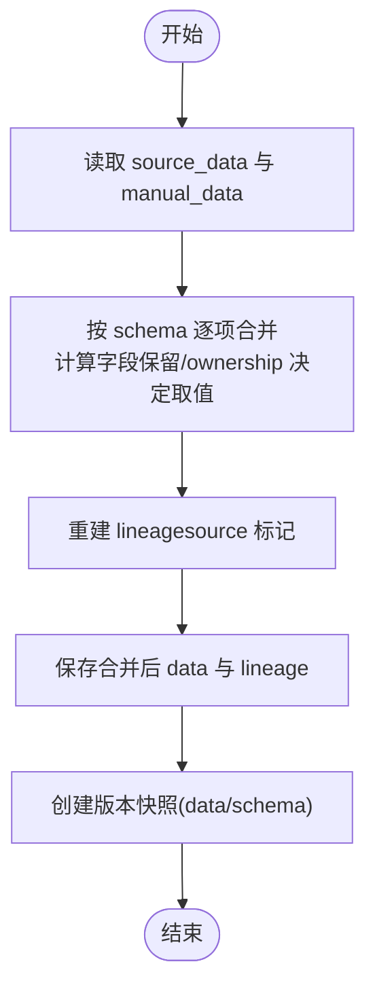
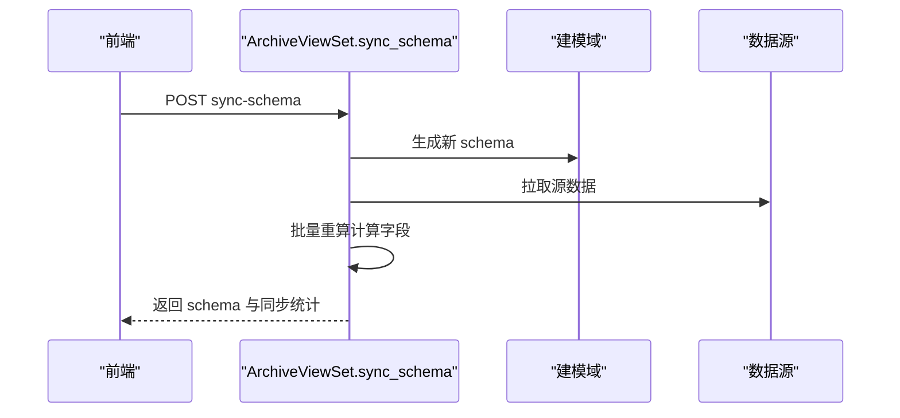
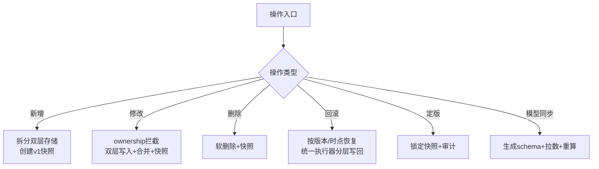
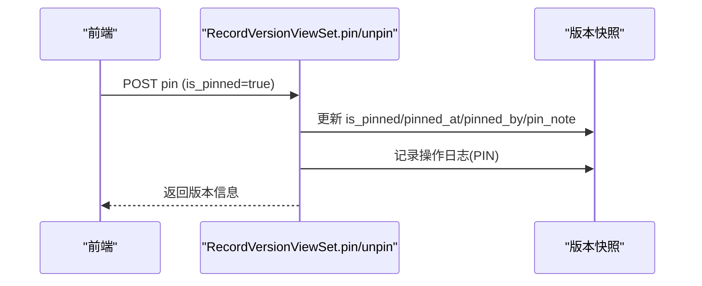
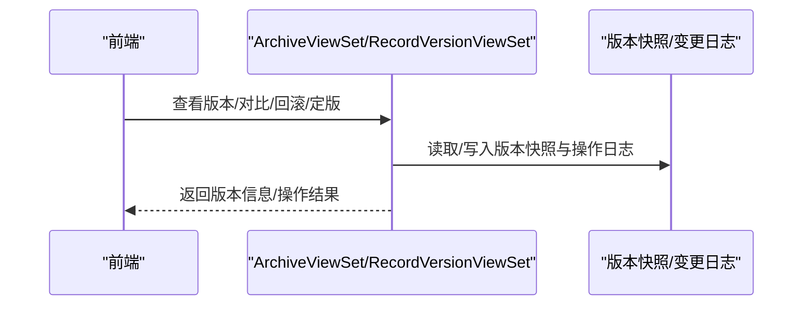
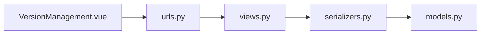

# 版本控制系统

<cite>
**本文引用的文件**
- [backend/apps/archive/models.py](file://backend/apps/archive/models.py)
- [backend/apps/archive/views.py](file://backend/apps/archive/views.py)
- [backend/apps/archive/serializers.py](file://backend/apps/archive/serializers.py)
- [backend/apps/archive/urls.py](file://backend/apps/archive/urls.py)
- [frontend/src/views/archive/VersionManagement.vue](file://frontend/src/views/archive/VersionManagement.vue)
</cite>

## 目录
1. [简介](#简介)
2. [项目结构](#项目结构)
3. [核心组件](#核心组件)
4. [架构总览](#架构总览)
5. [详细组件分析](#详细组件分析)
6. [依赖关系分析](#依赖关系分析)
7. [性能与存储优化](#性能与存储优化)
8. [故障排查指南](#故障排查指南)
9. [结论](#结论)

## 简介
本文件系统性地梳理 MetaData002 的“档案版本控制”能力，围绕 ArchiveRecordVersion 模型展开，解释版本号管理、数据快照存储与 Schema 快照机制；说明新增、修改、删除、回滚、定版、模型同步等操作的实现与业务场景；阐述版本快照的创建时机与存储策略，以及如何保证一致性与可追溯性；详细说明定版（Pin）功能的不可修改约束与审计追踪；给出完整的版本管理操作流程（查看、对比、回滚、定版），并总结性能与存储空间优化策略。

## 项目结构
后端采用 Django + DRF，版本控制相关代码集中在 apps/archive 模块：
- models.py：定义档案、记录、版本快照、变更批次/明细、操作日志、一致性差异等模型
- views.py：提供版本查看、对比、回滚、定版、模型同步、刷新预览等 API
- serializers.py：序列化器负责数据拆分合并、版本快照创建、变更记录生成
- urls.py：路由注册，暴露版本管理与变更日志相关端点
前端 VersionManagement.vue 提供变更日志与版本管理的交互界面，支持按日折叠、逐批撤销、单条回滚、导出 Excel 等。

**图表来源**
- [backend/apps/archive/models.py:1-379](file://backend/apps/archive/models.py#L1-L379)
- [backend/apps/archive/views.py:1600-1846](file://backend/apps/archive/views.py#L1600-L1846)
- [backend/apps/archive/serializers.py:120-424](file://backend/apps/archive/serializers.py#L120-L424)
- [backend/apps/archive/urls.py:1-21](file://backend/apps/archive/urls.py#L1-L21)
- [frontend/src/views/archive/VersionManagement.vue:1-628](file://frontend/src/views/archive/VersionManagement.vue#L1-L628)

**章节来源**
- [backend/apps/archive/models.py:1-379](file://backend/apps/archive/models.py#L1-L379)
- [backend/apps/archive/views.py:1600-1846](file://backend/apps/archive/views.py#L1600-L1846)
- [backend/apps/archive/serializers.py:120-424](file://backend/apps/archive/serializers.py#L120-L424)
- [backend/apps/archive/urls.py:1-21](file://backend/apps/archive/urls.py#L1-L21)
- [frontend/src/views/archive/VersionManagement.vue:1-628](file://frontend/src/views/archive/VersionManagement.vue#L1-L628)

## 核心组件
- ArchiveRecordVersion（版本快照）：每个记录的每次变更都会产生一个版本快照，包含该时点的 data、schema、操作人、时间、操作类型、变更摘要，以及定版标记与审计信息。
- ArchiveRecord（记录主表）：维护当前版本的 data、source_data、manual_data、version、sync_status、overrides、lineage 等，支撑双层存储与合并物化。
- ArchiveChangeBatch / ArchiveChangeDetail（变更批次与明细）：统一记录源侧同步、档案侧编辑、一致性处理三类变更，支持整批撤销与细粒度回滚。
- ArchiveOperationLog（操作日志）：记录所有关键操作（新增、修改、删除、回滚、定版、取消定版、同步、模型同步）。
- Archive（档案配置）：保存 schema 快照与 schema_version，用于模型同步与一致性检查。

**章节来源**
- [backend/apps/archive/models.py:33-110](file://backend/apps/archive/models.py#L33-L110)
- [backend/apps/archive/models.py:206-272](file://backend/apps/archive/models.py#L206-L272)
- [backend/apps/archive/models.py:174-204](file://backend/apps/archive/models.py#L174-L204)
- [backend/apps/archive/models.py:5-28](file://backend/apps/archive/models.py#L5-L28)

## 架构总览
版本控制的核心流程由“数据层（双层存储）+ 快照层（版本快照）+ 审计层（操作日志/变更批次/明细）”构成。视图层提供 API，序列化器负责数据拆分合并与快照创建，模型层持久化。

**图表来源**
- [backend/apps/archive/views.py:1674-1728](file://backend/apps/archive/views.py#L1674-L1728)
- [backend/apps/archive/serializers.py:185-377](file://backend/apps/archive/serializers.py#L185-L377)
- [backend/apps/archive/models.py:75-110](file://backend/apps/archive/models.py#L75-L110)

## 详细组件分析

### ArchiveRecordVersion 模型设计
- 字段与语义
  - record/version/data/schema：关联记录、版本号、数据快照、Schema 快照
  - operated_by/operated_at/operation_type：操作人与时间、操作类型（新增、修改、删除、回滚、定版、模型同步）
  - change_summary：变更摘要（字段级 old/new）
  - is_pinned/pinned_at/pinned_by/pin_note：定版标记与审计信息
- 约束与排序
  - unique_together(record, version)：确保版本号唯一
  - ordering('-version')：按版本号倒序
- 复杂度与存储
  - JSONField(data/schema)：大字段存储，建议按需查询与分页
  - 索引：无额外索引，但通过 record_id 过滤与分页控制 IO

**图表来源**
- [backend/apps/archive/models.py:75-110](file://backend/apps/archive/models.py#L75-L110)
- [backend/apps/archive/models.py:33-73](file://backend/apps/archive/models.py#L33-L73)

**章节来源**
- [backend/apps/archive/models.py:75-110](file://backend/apps/archive/models.py#L75-L110)

### 版本号管理与数据快照存储
- 版本号递增
  - 新增记录：初始 version=1
  - 修改/删除/回滚：version += 1
- 数据快照
  - 每次变更创建 ArchiveRecordVersion，data 为合并后的物化结果，schema 为该时点档案结构
- 双层存储
  - source_data：源系统维护字段底层值，同步时整层替换
  - manual_data：档案侧人工覆盖层，合并时覆盖 source_data
  - 合并逻辑：计算字段保留、ownership='source'取 source_data、ownership='archive'优先 manual_data

**图表来源**
- [backend/apps/archive/views.py:161-223](file://backend/apps/archive/views.py#L161-L223)
- [backend/apps/archive/serializers.py:185-377](file://backend/apps/archive/serializers.py#L185-L377)

**章节来源**
- [backend/apps/archive/views.py:161-223](file://backend/apps/archive/views.py#L161-L223)
- [backend/apps/archive/serializers.py:185-377](file://backend/apps/archive/serializers.py#L185-L377)

### Schema 快照机制与模型同步
- Schema 快照
  - Archive.schema 保存从域生成的字段结构（含 code/name/type/group_path/ownership/source 等）
  - schema_version 随模型同步递增
- 模型同步流程
  - 生成新 schema → 更新 schema_version → 拉取源数据 → 重算计算字段 → 记录操作日志
  - 预检接口支持 dry-run 展示 schema 差异与数据变化统计

**图表来源**
- [backend/apps/archive/views.py:275-329](file://backend/apps/archive/views.py#L275-L329)
- [backend/apps/archive/views.py:47-158](file://backend/apps/archive/views.py#L47-L158)

**章节来源**
- [backend/apps/archive/views.py:275-329](file://backend/apps/archive/views.py#L275-L329)
- [backend/apps/archive/views.py:47-158](file://backend/apps/archive/views.py#L47-L158)

### 操作类型与业务场景
- 新增（create）
  - 新建记录，拆分 source_data/manual_data，创建 v1 快照，记录操作日志
- 修改（update）
  - 仅允许 archive 维护字段编辑，source 维护字段只读；双层写入 + 合并物化 + 版本快照 + 变更批次/明细
- 删除（delete）
  - 软删除（status=deleted），保留数据快照，创建 delete 版本快照
- 回滚（rollback）
  - 按目标版本或时间点恢复，统一执行器按 ownership 分层写回 source_data/manual_data，避免下次合并失效
- 定版（pin）
  - 对当前版本快照打不可修改标记，记录审计信息
- 模型同步（schema_sync）
  - 更新 schema 与 schema_version，拉取源数据，重算计算字段

**图表来源**
- [backend/apps/archive/serializers.py:121-183](file://backend/apps/archive/serializers.py#L121-L183)
- [backend/apps/archive/serializers.py:185-377](file://backend/apps/archive/serializers.py#L185-L377)
- [backend/apps/archive/views.py:1605-1635](file://backend/apps/archive/views.py#L1605-L1635)
- [backend/apps/archive/views.py:1674-1728](file://backend/apps/archive/views.py#L1674-L1728)
- [backend/apps/archive/views.py:1730-1757](file://backend/apps/archive/views.py#L1730-L1757)
- [backend/apps/archive/views.py:275-329](file://backend/apps/archive/views.py#L275-L329)

**章节来源**
- [backend/apps/archive/serializers.py:121-183](file://backend/apps/archive/serializers.py#L121-L183)
- [backend/apps/archive/serializers.py:185-377](file://backend/apps/archive/serializers.py#L185-L377)
- [backend/apps/archive/views.py:1605-1635](file://backend/apps/archive/views.py#L1605-L1635)
- [backend/apps/archive/views.py:1674-1728](file://backend/apps/archive/views.py#L1674-L1728)
- [backend/apps/archive/views.py:1730-1757](file://backend/apps/archive/views.py#L1730-L1757)
- [backend/apps/archive/views.py:275-329](file://backend/apps/archive/views.py#L275-L329)

### 版本快照的创建时机与存储策略
- 创建时机
  - 新增记录：创建 v1 快照
  - 修改记录：每次保存创建 update 快照
  - 删除记录：创建 delete 快照
  - 回滚：创建 rollback 快照
  - 模型同步：记录 schema_sync 操作日志（不直接创建版本快照，但影响后续数据）
- 存储策略
  - data 与 schema 使用 JSONField，适合灵活结构与历史回溯
  - 通过分页与只读列表减少大字段传输
  - 变更批次/明细独立存储，便于审计与整批撤销

**章节来源**
- [backend/apps/archive/serializers.py:121-183](file://backend/apps/archive/serializers.py#L121-L183)
- [backend/apps/archive/serializers.py:185-377](file://backend/apps/archive/serializers.py#L185-L377)
- [backend/apps/archive/views.py:1605-1635](file://backend/apps/archive/views.py#L1605-L1635)
- [backend/apps/archive/views.py:1674-1728](file://backend/apps/archive/views.py#L1674-L1728)

### 定版（Pin）功能实现与审计追踪
- 不可修改约束
  - 已定版版本再次定版将返回错误
  - 定版后仍可进行其他操作（如回滚），但定版快照本身不可再被修改
- 审计追踪
  - pinned_at/pinned_by/pin_note 记录定版时间与人员及说明
  - 操作日志记录 PIN/UNPIN 事件

**图表来源**
- [backend/apps/archive/views.py:1730-1757](file://backend/apps/archive/views.py#L1730-L1757)
- [backend/apps/archive/views.py:1805-1845](file://backend/apps/archive/views.py#L1805-L1845)

**章节来源**
- [backend/apps/archive/views.py:1730-1757](file://backend/apps/archive/views.py#L1730-L1757)
- [backend/apps/archive/views.py:1805-1845](file://backend/apps/archive/views.py#L1805-L1845)

### 版本管理完整操作流程
- 版本查看
  - GET /records/{id}/versions/ 分页返回版本快照
- 版本对比
  - GET /records/{id}/versions/compare/?v1=&v2= 返回字段级 diff
- 回滚
  - POST /records/{id}/rollback/ 指定 target_version
  - POST /records/{id}/rollback-to-change/ 按时间点恢复
  - 整批撤销：POST /change-batches/{id}/rollback/
- 定版
  - POST /record-versions/{id}/pin/ 或 /records/{id}/pin/
  - 取消定版：POST /record-versions/{id}/unpin/

**图表来源**
- [backend/apps/archive/views.py:1637-1672](file://backend/apps/archive/views.py#L1637-L1672)
- [backend/apps/archive/views.py:1674-1728](file://backend/apps/archive/views.py#L1674-L1728)
- [backend/apps/archive/views.py:1730-1757](file://backend/apps/archive/views.py#L1730-L1757)
- [backend/apps/archive/views.py:1805-1845](file://backend/apps/archive/views.py#L1805-L1845)

**章节来源**
- [backend/apps/archive/views.py:1637-1672](file://backend/apps/archive/views.py#L1637-L1672)
- [backend/apps/archive/views.py:1674-1728](file://backend/apps/archive/views.py#L1674-L1728)
- [backend/apps/archive/views.py:1730-1757](file://backend/apps/archive/views.py#L1730-L1757)
- [backend/apps/archive/views.py:1805-1845](file://backend/apps/archive/views.py#L1805-L1845)

## 依赖关系分析
- 视图依赖序列化器进行数据校验与转换
- 序列化器依赖模型进行持久化与快照创建
- 路由注册各 ViewSet，暴露 RESTful 端点
- 前端通过 API 调用完成版本管理与变更日志操作

**图表来源**
- [backend/apps/archive/urls.py:1-21](file://backend/apps/archive/urls.py#L1-L21)
- [backend/apps/archive/views.py:1-23](file://backend/apps/archive/views.py#L1-L23)
- [backend/apps/archive/serializers.py:1-7](file://backend/apps/archive/serializers.py#L1-L7)
- [backend/apps/archive/models.py:1-3](file://backend/apps/archive/models.py#L1-L3)
- [frontend/src/views/archive/VersionManagement.vue:1-20](file://frontend/src/views/archive/VersionManagement.vue#L1-L20)

**章节来源**
- [backend/apps/archive/urls.py:1-21](file://backend/apps/archive/urls.py#L1-L21)
- [backend/apps/archive/views.py:1-23](file://backend/apps/archive/views.py#L1-L23)
- [backend/apps/archive/serializers.py:1-7](file://backend/apps/archive/serializers.py#L1-L7)
- [backend/apps/archive/models.py:1-3](file://backend/apps/archive/models.py#L1-L3)
- [frontend/src/views/archive/VersionManagement.vue:1-20](file://frontend/src/views/archive/VersionManagement.vue#L1-L20)

## 性能与存储优化
- 分页与只读列表
  - 版本列表与变更明细均支持分页，避免一次性加载大对象
- 选择性字段
  - GlobalVersionSerializer 不回传 data/schema 大字段，降低带宽
- 双层存储
  - source_data/manual_data 分离，减少不必要的覆盖与合并开销
- 批次与明细
  - 变更批次聚合统计，减少重复写入；明细按批次组织便于审计与整批撤销
- 计算字段重算
  - 模型同步后批量重算，避免频繁实时计算带来的性能抖动

[本节为通用指导，不直接分析具体文件]

## 故障排查指南
- 常见错误
  - 定版失败：版本已定版或参数缺失
  - 回滚失败：目标版本不存在或记录已删除
  - 模型同步失败：数据源连接异常或计算字段重算失败
- 排查步骤
  - 查看操作日志与变更批次/明细，定位问题时点
  - 检查一致性差异记录，确认数据漂移与规则失效配置
  - 使用预检接口验证 schema 与数据变化，确认同步范围

**章节来源**
- [backend/apps/archive/views.py:1730-1757](file://backend/apps/archive/views.py#L1730-L1757)
- [backend/apps/archive/views.py:1674-1728](file://backend/apps/archive/views.py#L1674-L1728)
- [backend/apps/archive/views.py:344-394](file://backend/apps/archive/views.py#L344-L394)

## 结论
本版本控制系统以 ArchiveRecordVersion 为核心，结合双层存储与变更批次/明细，实现了高可追溯、可回滚、可定版的档案数据管理能力。通过 Schema 快照与模型同步，保障数据结构演进的可控性；通过统一的回滚执行器与操作日志，确保数据一致性与审计完整性。前端提供直观的变更日志与版本管理界面，支持整批撤销与细粒度回滚，满足复杂业务场景下的数据治理需求。