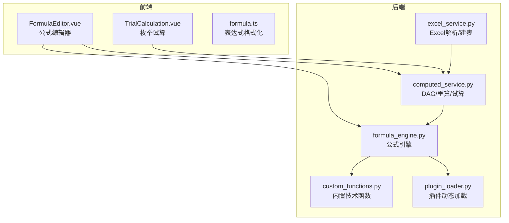
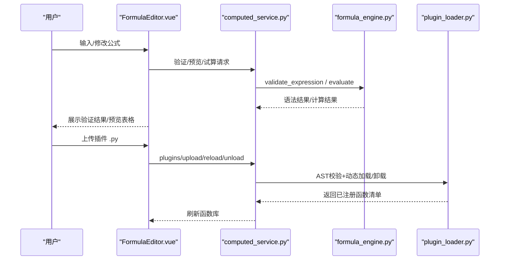
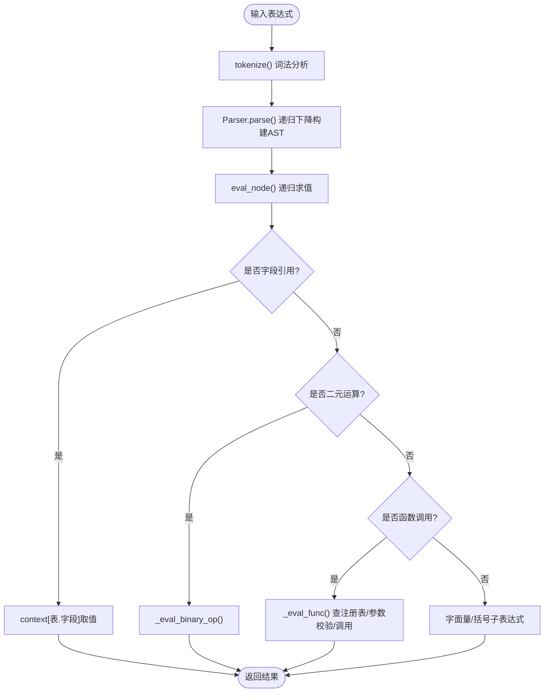
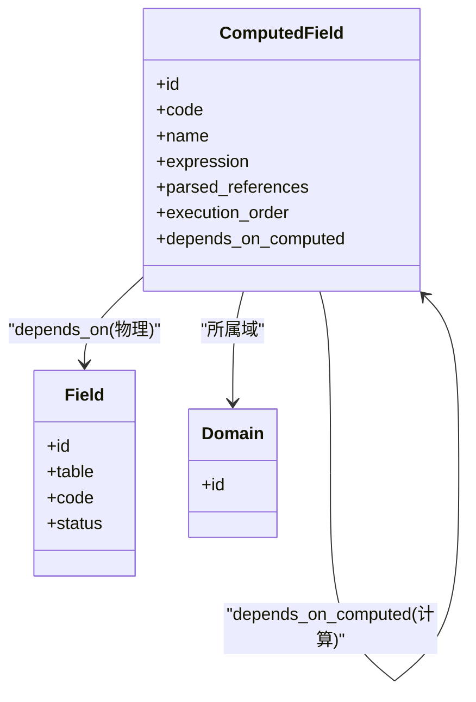
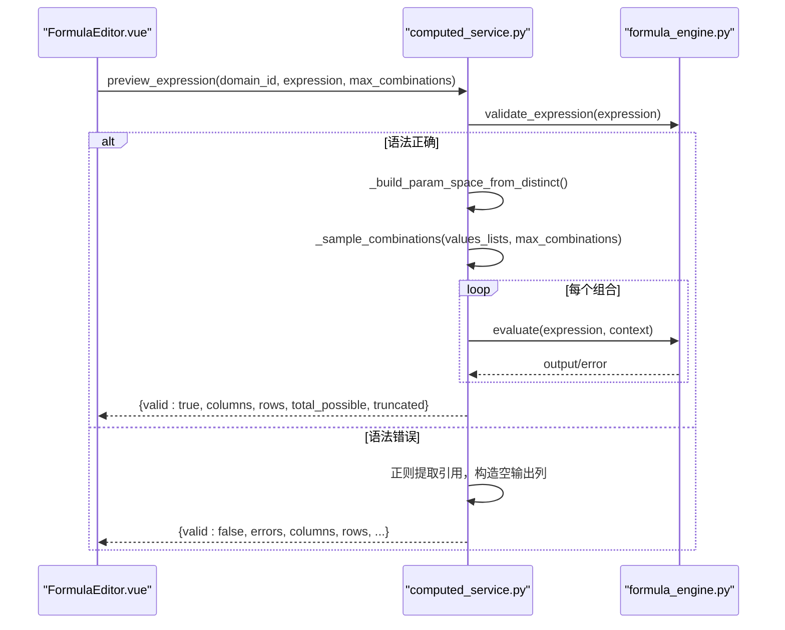
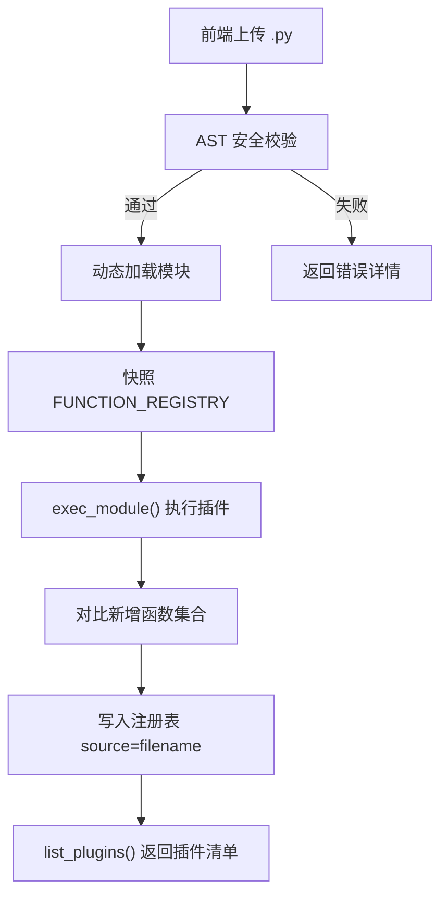
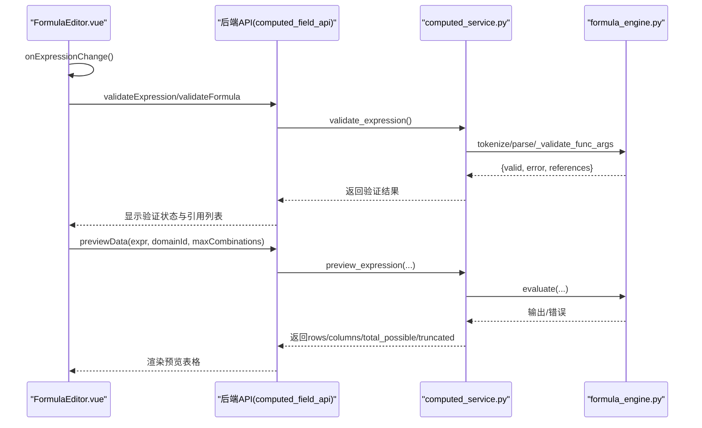
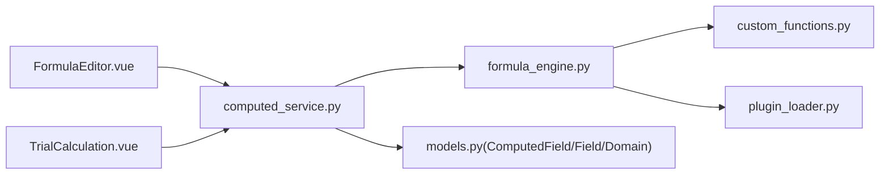

# 计算引擎

<cite>
**本文引用的文件**   
- [formula_engine.py](file://backend/apps/modeling/formula_engine.py)
- [custom_functions.py](file://backend/apps/modeling/custom_functions.py)
- [computed_service.py](file://backend/apps/modeling/computed_service.py)
- [plugin_loader.py](file://backend/apps/modeling/plugin_loader.py)
- [excel_service.py](file://backend/apps/modeling/excel_service.py)
- [FormulaEditor.vue](file://frontend/src/views/modeling/components/FormulasEditor.vue)
- [TrialCalculation.vue](file://frontend/src/views/modeling/components/TrialCalculation.vue)
- [formula.ts](file://frontend/src/utils/formula.ts)
</cite>

## 目录
1. [简介](#简介)
2. [项目结构](#项目结构)
3. [核心组件](#核心组件)
4. [架构总览](#架构总览)
5. [详细组件分析](#详细组件分析)
6. [依赖关系分析](#依赖关系分析)
7. [性能与内存优化](#性能与内存优化)
8. [故障排查指南](#故障排查指南)
9. [结论](#结论)
10. [附录：公式语法规范](#附录公式语法规范)

## 简介
本文件为 MetaData002 的“计算引擎”技术文档，聚焦 Excel 风格公式语法的解析、求值与批量执行。内容涵盖：
- 公式语法与函数库（内置 + 自定义）
- DAG 依赖图构建、循环检测与拓扑排序
- 公式解析器实现（词法/语法/语义/求值）
- 批量重算与试算机制（任务调度、并发控制、错误处理）
- 自定义函数扩展机制（Python 插件注册、参数校验、返回值处理）
- 前端公式编辑器（语法高亮、实时验证、试算预览）
- 性能优化策略与内存管理方案

## 项目结构
后端以 Django App modeling 为核心，提供公式引擎、DAG 构建、批量重算、插件加载等能力；前端通过 Vue 组件提供公式编辑、函数库浏览、数据预览与试算体验。

图表来源
- [formula_engine.py:1-867](file://backend/apps/modeling/formula_engine.py#L1-L867)
- [custom_functions.py:1-108](file://backend/apps/modeling/custom_functions.py#L1-L108)
- [computed_service.py:1-630](file://backend/apps/modeling/computed_service.py#L1-L630)
- [plugin_loader.py:1-288](file://backend/apps/modeling/plugin_loader.py#L1-L288)
- [excel_service.py:1-156](file://backend/apps/modeling/excel_service.py#L1-L156)
- [FormulaEditor.vue:1-800](file://frontend/src/views/modeling/components/FormulasEditor.vue#L1-L800)
- [TrialCalculation.vue:1-300](file://frontend/src/views/modeling/components/TrialCalculation.vue#L1-L300)
- [formula.ts:1-95](file://frontend/src/utils/formula.ts#L1-L95)

章节来源
- [formula_engine.py:1-867](file://backend/apps/modeling/formula_engine.py#L1-L867)
- [computed_service.py:1-630](file://backend/apps/modeling/computed_service.py#L1-L630)
- [plugin_loader.py:1-288](file://backend/apps/modeling/plugin_loader.py#L1-L288)
- [custom_functions.py:1-108](file://backend/apps/modeling/custom_functions.py#L1-L108)
- [excel_service.py:1-156](file://backend/apps/modeling/excel_service.py#L1-L156)
- [FormulaEditor.vue:1-800](file://frontend/src/views/modeling/components/FormulasEditor.vue#L1-L800)
- [TrialCalculation.vue:1-300](file://frontend/src/views/modeling/components/TrialCalculation.vue#L1-L300)
- [formula.ts:1-95](file://frontend/src/utils/formula.ts#L1-L95)

## 核心组件
- 公式引擎（词法/语法/求值）：tokenize → Parser(AST) → eval_node
- 函数注册表：register_function 装饰器统一注册，支持分类与描述
- 自定义函数插件：AST 安全校验 + 动态加载/卸载/重载
- DAG 与重算：解析引用 → 构建邻接表 → 环检测 → 拓扑排序 → 批量/增量重算
- 试算与预览：笛卡尔积采样 + 逐行求值 + 错误收集
- 前端编辑器：函数库/字段引用侧栏、实时验证、数据预览、AI 生成辅助

章节来源
- [formula_engine.py:1-867](file://backend/apps/modeling/formula_engine.py#L1-L867)
- [custom_functions.py:1-108](file://backend/apps/modeling/custom_functions.py#L1-L108)
- [computed_service.py:1-630](file://backend/apps/modeling/computed_service.py#L1-L630)
- [plugin_loader.py:1-288](file://backend/apps/modeling/plugin_loader.py#L1-L288)
- [FormulaEditor.vue:1-800](file://frontend/src/views/modeling/components/FormulasEditor.vue#L1-L800)
- [TrialCalculation.vue:1-300](file://frontend/src/views/modeling/components/TrialCalculation.vue#L1-L300)

## 架构总览
公式从前端输入，经后端解析为 AST 并求值；计算字段之间通过 DAG 组织执行顺序；批量重算按拓扑序对档案记录逐条更新；插件系统允许运行时扩展函数。

图表来源
- [FormulaEditor.vue:1-800](file://frontend/src/views/modeling/components/FormulasEditor.vue#L1-L800)
- [computed_service.py:1-630](file://backend/apps/modeling/computed_service.py#L1-L630)
- [formula_engine.py:1-867](file://backend/apps/modeling/formula_engine.py#L1-L867)
- [plugin_loader.py:1-288](file://backend/apps/modeling/plugin_loader.py#L1-L288)

## 详细组件分析

### 公式引擎（词法/语法/求值）
- 词法分析 tokenize：识别数字、字符串、布尔、字段引用 {表名.字段名}、函数名、运算符、括号与逗号，输出 Token 流
- 语法分析 Parser（递归下降）：按优先级构建 AST（比较→加减拼接→乘除→一元→原子），支持函数调用与括号分组
- 求值器 eval_node：遍历 AST 节点，解析字段引用、执行二元运算、调用函数；IFERROR 惰性求值
- 函数注册 register_function：统一元信息（最小/最大参数、描述、分类），供前端函数库与 AI 使用
- 公开 API：evaluate(expression, context)、validate_expression(expression)

图表来源
- [formula_engine.py:99-197](file://backend/apps/modeling/formula_engine.py#L99-L197)
- [formula_engine.py:253-366](file://backend/apps/modeling/formula_engine.py#L253-L366)
- [formula_engine.py:669-768](file://backend/apps/modeling/formula_engine.py#L669-L768)
- [formula_engine.py:775-818](file://backend/apps/modeling/formula_engine.py#L775-L818)

章节来源
- [formula_engine.py:1-867](file://backend/apps/modeling/formula_engine.py#L1-L867)

### DAG 依赖图与拓扑排序
- 依赖解析 parse_and_save_dependencies：提取表达式中的字段引用，区分物理字段与计算字段，更新 M2M 关系
- 环检测 detect_cycle：基于 DFS 三色标记，返回环路径或 None
- 拓扑排序 _topological_sort：Kahn 算法，按入度为 0 的节点推进，得到 execution_order
- 批量重算 batch_recalculate：按 execution_order 对每条档案记录依次求值，写入 data 并更新上下文
- 增量重算 recalculate_affected：根据变更字段反向传播受影响计算字段，按序重算

图表来源
- [computed_service.py:21-84](file://backend/apps/modeling/computed_service.py#L21-L84)
- [computed_service.py:110-161](file://backend/apps/modeling/computed_service.py#L110-L161)
- [computed_service.py:164-208](file://backend/apps/modeling/computed_service.py#L164-L208)
- [computed_service.py:215-278](file://backend/apps/modeling/computed_service.py#L215-L278)
- [computed_service.py:280-366](file://backend/apps/modeling/computed_service.py#L280-L366)

章节来源
- [computed_service.py:1-630](file://backend/apps/modeling/computed_service.py#L1-L630)

### 批量计算与试算
- 批量重算：按拓扑序对 ArchiveRecord 逐条计算，错误聚合返回
- 试算 trial_calculate：自动枚举或手动指定参数空间，笛卡尔积采样（上限限制），逐行求值并收集错误
- 免实例预览 preview_expression：不依赖具体记录，仅用字段去重值组合进行预览

图表来源
- [computed_service.py:508-589](file://backend/apps/modeling/computed_service.py#L508-L589)
- [formula_engine.py:775-818](file://backend/apps/modeling/formula_engine.py#L775-L818)

章节来源
- [computed_service.py:373-439](file://backend/apps/modeling/computed_service.py#L373-L439)
- [computed_service.py:508-589](file://backend/apps/modeling/computed_service.py#L508-L589)

### 自定义函数扩展机制（插件）
- 内置技术函数：custom_functions.py 使用 @register_function 注册，类别固定为“技术函数”
- 插件加载器 plugin_loader.py：
  - AST 安全校验：白名单导入、禁止危险内建与顶层控制流
  - 动态加载：importlib 加载模块，对比 FUNCTION_REGISTRY 快照，记录新增函数
  - 生命周期：upload/reload/unload/list/template
- 前端 FormulaEditor.vue 提供插件上传、重载、卸载与模板下载

图表来源
- [custom_functions.py:1-108](file://backend/apps/modeling/custom_functions.py#L1-L108)
- [plugin_loader.py:73-112](file://backend/apps/modeling/plugin_loader.py#L73-L112)
- [plugin_loader.py:133-190](file://backend/apps/modeling/plugin_loader.py#L133-L190)
- [plugin_loader.py:222-240](file://backend/apps/modeling/plugin_loader.py#L222-L240)
- [FormulaEditor.vue:597-683](file://frontend/src/views/modeling/components/FormulasEditor.vue#L597-L683)

章节来源
- [custom_functions.py:1-108](file://backend/apps/modeling/custom_functions.py#L1-L108)
- [plugin_loader.py:1-288](file://backend/apps/modeling/plugin_loader.py#L1-L288)
- [FormulaEditor.vue:597-683](file://frontend/src/views/modeling/components/FormulasEditor.vue#L597-L683)

### 公式编辑器前端实现
- 实时验证：onExpressionChange 防抖触发 validateExpression/validateFormula
- 数据预览：previewData 拉取去重值组合与输出结果，支持“全部/前50条”切换
- 函数库与字段引用：侧栏两级级联，支持搜索过滤与点击插入
- 表达式格式化：formatExpressionText 统一代码风格（大写函数名、补全右括号、长调用换行缩进）
- 技术函数插件：上传/重载/卸载/模板下载，同步刷新函数库

图表来源
- [FormulaEditor.vue:685-754](file://frontend/src/views/modeling/components/FormulasEditor.vue#L685-L754)
- [formula.ts:1-95](file://frontend/src/utils/formula.ts#L1-L95)
- [computed_service.py:508-589](file://backend/apps/modeling/computed_service.py#L508-L589)
- [formula_engine.py:775-818](file://backend/apps/modeling/formula_engine.py#L775-L818)

章节来源
- [FormulaEditor.vue:1-800](file://frontend/src/views/modeling/components/FormulasEditor.vue#L1-L800)
- [formula.ts:1-95](file://frontend/src/utils/formula.ts#L1-L95)
- [computed_service.py:508-589](file://backend/apps/modeling/computed_service.py#L508-L589)

### Excel 解析与本地建表（辅助）
- excel_service.py 负责解析 Excel 列名与样本数据，推断字段类型，创建本地表与 Table/Field 记录，便于后续公式引用与试算

章节来源
- [excel_service.py:1-156](file://backend/apps/modeling/excel_service.py#L1-L156)

## 依赖关系分析
- 公式引擎依赖函数注册表与自定义函数插件
- 计算服务依赖公式引擎与模型（ComputedField/Field/Domain）
- 插件加载器依赖公式引擎的注册表，提供运行时扩展
- 前端组件依赖后端 API，驱动验证、预览与插件管理

图表来源
- [FormulaEditor.vue:1-800](file://frontend/src/views/modeling/components/FormulasEditor.vue#L1-L800)
- [TrialCalculation.vue:1-300](file://frontend/src/views/modeling/components/TrialCalculation.vue#L1-L300)
- [computed_service.py:1-630](file://backend/apps/modeling/computed_service.py#L1-L630)
- [formula_engine.py:1-867](file://backend/apps/modeling/formula_engine.py#L1-L867)
- [custom_functions.py:1-108](file://backend/apps/modeling/custom_functions.py#L1-L108)
- [plugin_loader.py:1-288](file://backend/apps/modeling/plugin_loader.py#L1-L288)

章节来源
- [computed_service.py:1-630](file://backend/apps/modeling/computed_service.py#L1-L630)
- [formula_engine.py:1-867](file://backend/apps/modeling/formula_engine.py#L1-L867)
- [plugin_loader.py:1-288](file://backend/apps/modeling/plugin_loader.py#L1-L288)
- [custom_functions.py:1-108](file://backend/apps/modeling/custom_functions.py#L1-L108)

## 性能与内存优化
- 词法/语法分析：线性扫描与递归下降，避免复杂正则回溯
- AST 求值：按需递归，减少中间对象创建；IFERROR 惰性求值降低异常分支开销
- 批量重算：按 execution_order 顺序执行，避免重复计算；错误聚合限制返回数量
- 试算采样：当组合数超过阈值时采用轮转+随机采样，保证每列多样性且可复现
- 缓存与去重：distinct_values 缓存按需填充，避免频繁查询；预览行数限制防止大表拖慢
- 插件加载：AST 静态校验前置，避免运行时风险；同名覆盖卸载旧注册，避免内存泄漏

[本节为通用指导，无需特定文件来源]

## 故障排查指南
- 语法错误：查看 validate_expression 返回的 error 与位置提示；检查括号闭合、字符串引号、字段引用格式
- 字段引用未找到：确认 context 中是否存在“表名.字段名”，或是否为计算字段引用（$computed.code）
- 运行时错误：除零、类型转换失败、函数参数数量不符；IFERROR 可捕获并返回默认值
- 循环依赖：detect_cycle 返回环路径，需调整计算字段依赖关系
- 插件加载失败：检查 AST 校验错误（禁止导入/危险内建/顶层控制流），确保使用 @register_function 注册函数

章节来源
- [formula_engine.py:775-818](file://backend/apps/modeling/formula_engine.py#L775-L818)
- [computed_service.py:110-161](file://backend/apps/modeling/computed_service.py#L110-L161)
- [plugin_loader.py:73-112](file://backend/apps/modeling/plugin_loader.py#L73-L112)

## 结论
该计算引擎以 Excel 风格公式为核心，结合 DAG 依赖管理与插件化函数扩展，提供了从编辑、验证、预览到批量重算的完整闭环。通过严格的 AST 安全校验与采样策略，在保证安全与性能的同时，兼顾了易用性与可扩展性。

[本节为总结，无需特定文件来源]

## 附录：公式语法规范
- 字段引用：{表名.字段名}
- 函数调用：FUNC_NAME(arg1, arg2, ...)
- 运算符：+, -, *, /, >, <, >=, <=, =, <>, &（文本拼接）
- 字面量：数字、字符串（单/双引号）、布尔（TRUE/FALSE）
- 函数分类：逻辑函数、字符串函数、数字函数、判空函数、日期函数、其他、技术函数
- 特殊函数：IFERROR 惰性求值第一个参数；IFS 参数必须成对

章节来源
- [formula_engine.py:1-867](file://backend/apps/modeling/formula_engine.py#L1-L867)
- [custom_functions.py:1-108](file://backend/apps/modeling/custom_functions.py#L1-L108)