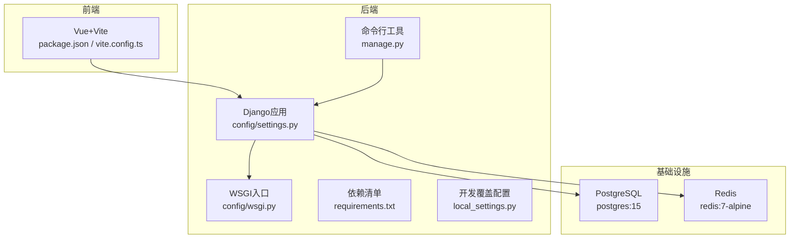
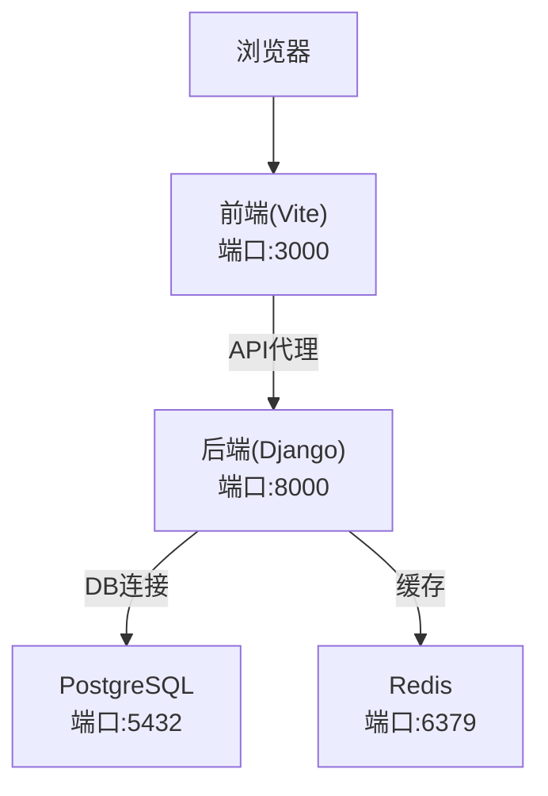
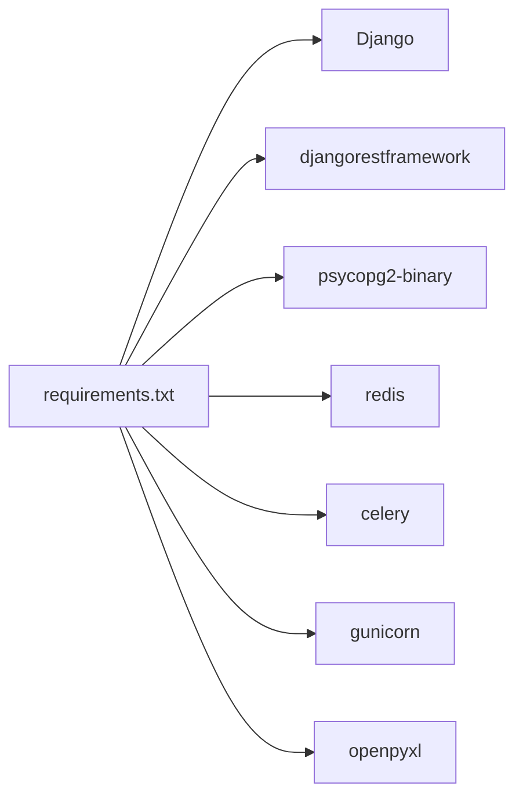

# Docker部署

<cite>
**本文引用的文件**   
- [backend/Dockerfile](file://backend/Dockerfile)
- [backend/docker-compose.yml](file://backend/docker-compose.yml)
- [backend/config/settings.py](file://backend/config/settings.py)
- [backend/requirements.txt](file://backend/requirements.txt)
- [backend/config/wsgi.py](file://backend/config/wsgi.py)
- [backend/manage.py](file://backend/manage.py)
- [backend/local_settings.py](file://backend/local_settings.py)
- [frontend/package.json](file://frontend/package.json)
- [frontend/vite.config.ts](file://frontend/vite.config.ts)
</cite>

## 目录
1. [简介](#简介)
2. [项目结构](#项目结构)
3. [核心组件](#核心组件)
4. [架构总览](#架构总览)
5. [详细组件分析](#详细组件分析)
6. [依赖关系分析](#依赖关系分析)
7. [性能与资源限制](#性能与资源限制)
8. [监控与日志](#监控与日志)
9. [故障排查指南](#故障排查指南)
10. [结论](#结论)

## 简介
本文件为 MetaData002 系统的完整 Docker 容器化部署文档，覆盖镜像构建、多阶段优化、缓存策略、安全扫描、docker-compose 编排、服务间通信（PostgreSQL、Redis）、健康检查、资源限制、监控与日志收集、以及常见问题的排障与调优建议。读者可据此在本地或生产环境快速搭建并稳定运行系统。

## 项目结构
后端基于 Django + DRF，使用 PostgreSQL 作为数据库、Redis 作为缓存；前端为 Vue 3 + Vite。当前仓库已包含后端 Dockerfile 与 docker-compose 基础编排，用于开发环境快速启动。

图表来源
- [backend/config/settings.py](file://backend/config/settings.py)
- [backend/config/wsgi.py](file://backend/config/wsgi.py)
- [backend/manage.py](file://backend/manage.py)
- [backend/requirements.txt](file://backend/requirements.txt)
- [backend/local_settings.py](file://backend/local_settings.py)
- [frontend/package.json](file://frontend/package.json)
- [frontend/vite.config.ts](file://frontend/vite.config.ts)

章节来源
- [backend/Dockerfile](file://backend/Dockerfile)
- [backend/docker-compose.yml](file://backend/docker-compose.yml)
- [backend/config/settings.py](file://backend/config/settings.py)
- [backend/requirements.txt](file://backend/requirements.txt)
- [backend/config/wsgi.py](file://backend/config/wsgi.py)
- [backend/manage.py](file://backend/manage.py)
- [backend/local_settings.py](file://backend/local_settings.py)
- [frontend/package.json](file://frontend/package.json)
- [frontend/vite.config.ts](file://frontend/vite.config.ts)

## 核心组件
- 后端镜像构建：基于 python:3.12-slim，安装系统依赖与 Python 依赖，复制源码。
- 服务编排：PostgreSQL、Redis、Django 后端三服务，含健康检查与数据卷持久化。
- 配置管理：通过环境变量注入数据库、缓存、调试开关等关键参数。
- WSGI 入口：标准 Django WSGI 应用，便于后续替换为 gunicorn/uwsgi。
- 前端开发：Vite 提供热重载与 API 代理到后端 8000 端口。

章节来源
- [backend/Dockerfile](file://backend/Dockerfile)
- [backend/docker-compose.yml](file://backend/docker-compose.yml)
- [backend/config/settings.py](file://backend/config/settings.py)
- [backend/config/wsgi.py](file://backend/config/wsgi.py)
- [frontend/vite.config.ts](file://frontend/vite.config.ts)

## 架构总览
下图展示容器化后的服务交互：前端通过浏览器访问，开发时由 Vite 代理到后端；后端通过环境变量连接 PostgreSQL 与 Redis，并使用 django_redis 作为缓存后端。

图表来源
- [backend/docker-compose.yml](file://backend/docker-compose.yml)
- [backend/config/settings.py](file://backend/config/settings.py)
- [frontend/vite.config.ts](file://frontend/vite.config.ts)

## 详细组件分析

### 镜像构建与优化（Dockerfile）
- 基础镜像：python:3.12-slim，减小体积。
- 环境变量：关闭字节码写入、启用非缓冲输出，利于日志采集。
- 系统依赖：安装 gcc、libpq-dev 以支持 psycopg2-binary 编译。
- 依赖安装：先拷贝 requirements.txt 再 pip install，利用层缓存加速重复构建。
- 源码拷贝：最后拷贝应用代码，避免破坏依赖层缓存。

优化建议（多阶段构建）
- 第一阶段：仅安装系统依赖与 Python 依赖，生成只读镜像层。
- 第二阶段：拷贝最小化源码与静态文件，进一步缩小最终镜像。
- 安全扫描：集成 Trivy 或 Snyk 扫描镜像漏洞，阻断高危漏洞发布。

章节来源
- [backend/Dockerfile](file://backend/Dockerfile)
- [backend/requirements.txt](file://backend/requirements.txt)

### 服务编排与健康检查（docker-compose）
- 数据库服务：postgres:15，设置数据库名、用户、密码，挂载数据卷，健康检查使用 pg_isready。
- 缓存服务：redis:7-alpine，暴露端口，健康检查使用 redis-cli ping。
- 后端服务：
  - 构建上下文为 backend 目录。
  - 命令执行 migrate 后启动 runserver 监听 0.0.0.0:8000。
  - 挂载源码目录用于开发热更新。
  - 注入数据库与 Redis 相关环境变量。
  - depends_on 依赖 db 与 redis 的健康状态。

生产建议
- 将 runserver 替换为 gunicorn，提升并发与稳定性。
- 增加资源限制（CPU/内存）与重启策略。
- 使用 secrets 管理敏感信息，避免明文写在 compose 中。

章节来源
- [backend/docker-compose.yml](file://backend/docker-compose.yml)

### 配置与环境变量（settings.py）
- 数据库：ENGINE=postgresql，NAME/USER/PASSWORD/HOST/PORT 均从环境变量读取。
- 缓存：django_redis.cache.RedisCache，LOCATION 由 REDIS_HOST/REDIS_PORT 拼接。
- 调试与安全：DEBUG、SECRET_KEY、ALLOWED_HOSTS 可通过环境变量控制。
- 其他：分页、过滤、OpenAPI 文档、AI 接口等配置项。

章节来源
- [backend/config/settings.py](file://backend/config/settings.py)

### WSGI 与命令行入口
- WSGI：标准 Django WSGI 应用，设置 DJANGO_SETTINGS_MODULE 为 config.settings。
- manage.py：统一命令行入口，执行迁移、runserver 等任务。

章节来源
- [backend/config/wsgi.py](file://backend/config/wsgi.py)
- [backend/manage.py](file://backend/manage.py)

### 前端开发与代理
- package.json：定义 dev/build/preview 脚本，依赖 Vue、Ant Design Vue、Axios 等。
- vite.config.ts：开发服务器端口 3000，并将 /api 请求代理到 http://localhost:8000。

章节来源
- [frontend/package.json](file://frontend/package.json)
- [frontend/vite.config.ts](file://frontend/vite.config.ts)

### 开发覆盖配置（local_settings.py）
- 覆盖数据库为 SQLite3，缓存为 LocMemCache，便于本地快速开发。
- 启用 CORS 中间件，允许跨域访问。

章节来源
- [backend/local_settings.py](file://backend/local_settings.py)

## 依赖关系分析
- 后端依赖：Django、DRF、psycopg2-binary、redis、celery、gunicorn、openpyxl 等。
- 运行时依赖：PostgreSQL 与 Redis 服务。
- 前端依赖：Vue 3、Vite、Ant Design Vue、Axios 等。

图表来源
- [backend/requirements.txt](file://backend/requirements.txt)

章节来源
- [backend/requirements.txt](file://backend/requirements.txt)

## 性能与资源限制
- 进程模型：生产环境建议使用 gunicorn 替代 runserver，结合多 worker 提升吞吐。
- 数据库连接池：根据负载调整连接数与超时，避免连接耗尽。
- 缓存策略：合理使用 Redis 缓存热点数据，注意键过期与一致性。
- 资源限制：在 docker-compose 中为各服务设置 CPU/内存上限，防止单点资源争用。
- 静态资源：生产环境应收集静态文件并通过 Nginx/Apache 或 CDN 分发。

[本节为通用指导，不直接分析具体文件]

## 监控与日志
- 指标暴露：可在后端引入 Prometheus 客户端，暴露 /metrics 端点供抓取。
- 结构化日志：统一 JSON 格式输出，便于集中采集与分析。
- 日志收集：推荐接入 ELK/EFK 或 Loki，按服务与级别分类存储。
- 健康检查：已在 compose 中为 db 与 redis 配置健康检查，后端可扩展自定义健康端点。

[本节为通用指导，不直接分析具体文件]

## 故障排查指南
常见问题与处理步骤：
- 数据库连接失败
  - 检查 DB_HOST/DB_PORT/DB_NAME/DB_USER/DB_PASSWORD 环境变量是否正确。
  - 确认 PostgreSQL 服务健康且端口可达。
  - 查看后端日志中的连接错误堆栈。
- Redis 连接失败
  - 检查 REDIS_HOST/REDIS_PORT 是否指向正确的容器名与端口。
  - 使用 redis-cli 测试连通性。
- 权限与密钥
  - SECRET_KEY 必须设置且保密，避免默认值泄露。
  - ALLOWED_HOSTS 需包含实际域名或 IP。
- 迁移失败
  - 确保数据库版本与迁移文件一致，必要时回滚或重建数据库。
- 前端无法访问后端
  - 开发环境确认 Vite 代理目标为 http://localhost:8000。
  - 生产环境检查反向代理与跨域配置。

章节来源
- [backend/config/settings.py](file://backend/config/settings.py)
- [backend/docker-compose.yml](file://backend/docker-compose.yml)
- [frontend/vite.config.ts](file://frontend/vite.config.ts)

## 结论
通过上述镜像构建优化、compose 编排、环境变量管理与健康检查，MetaData002 可在本地与生产环境中稳定运行。生产部署建议引入 gunicorn、Nginx、Prometheus、ELK/Loki 等组件，完善性能、监控与可观测性。遵循安全最佳实践，定期扫描镜像漏洞，保障系统安全与可靠性。