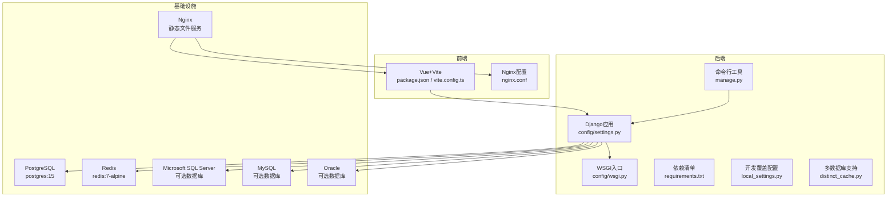
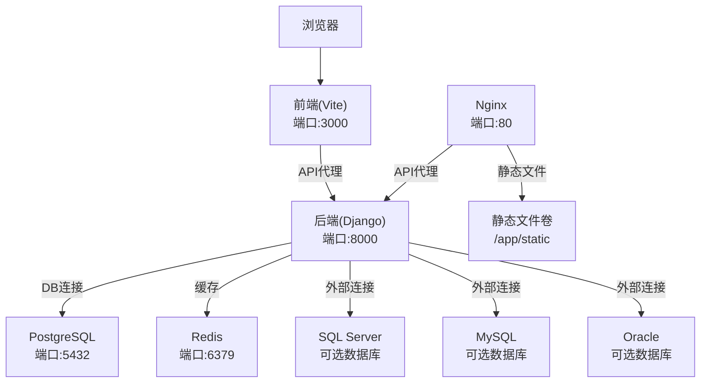
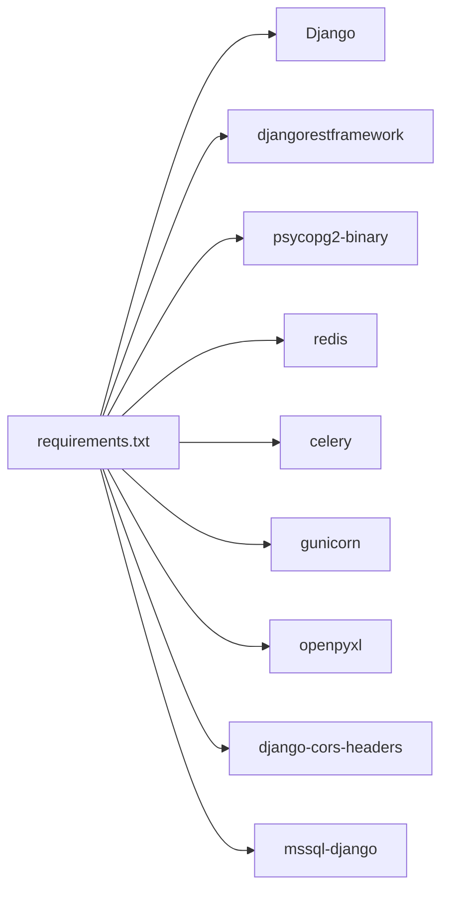

# Docker部署

<cite>
**本文引用的文件**   
- [backend/Dockerfile](file://backend/Dockerfile)
- [backend/docker-compose.yml](file://backend/docker-compose.yml)
- [deploy/docker-compose.yml](file://deploy/docker-compose.yml)
- [backend/config/settings.py](file://backend/config/settings.py)
- [backend/requirements.txt](file://backend/requirements.txt)
- [backend/config/wsgi.py](file://backend/config/wsgi.py)
- [backend/manage.py](file://backend/manage.py)
- [backend/local_settings.py](file://backend/local_settings.py)
- [backend/apps/modeling/distinct_cache.py](file://backend/apps/modeling/distinct_cache.py)
- [backend/scripts/diag_sqlserver_activity.py](file://backend/scripts/diag_sqlserver_activity.py)
- [frontend/package.json](file://frontend/package.json)
- [frontend/vite.config.ts](file://frontend/vite.config.ts)
- [frontend/nginx.conf](file://frontend/nginx.conf)
</cite>

## 更新摘要
**所做更改**
- 增强了Docker镜像构建配置，新增完整的Microsoft SQL Server数据库支持
- 添加了Microsoft ODBC Driver 18的安装链，包括GPG密钥验证、EULA接受和UnixODBC开发库安装
- 更新了依赖管理，新增mssql-django包以支持SQL Server连接
- 完善了多数据库支持的架构说明，包括PostgreSQL、MySQL、Oracle和SQL Server
- 增加了SQL Server相关的故障排查指南和性能调优建议
- 优化了容器化部署的最佳实践，支持多种数据库后端

## 目录
1. [简介](#简介)
2. [项目结构](#项目结构)
3. [核心组件](#核心组件)
4. [架构总览](#架构总览)
5. [详细组件分析](#详细组件分析)
6. [依赖关系分析](#依赖关系分析)
7. [性能与资源限制](#性能与资源限制)
8. [监控与日志](#监控与日志)
9. [故障排查指南](#故障排查指南)
10. [结论](#结论)

## 简介
本文件为 MetaData002 系统的完整 Docker 容器化部署文档，覆盖镜像构建、多阶段优化、缓存策略、安全扫描、docker-compose 编排、服务间通信（PostgreSQL、Redis、SQL Server）、健康检查、资源限制、监控与日志收集、以及常见问题的排障与调优建议。系统现已支持多种数据库后端，包括PostgreSQL、MySQL、Oracle和Microsoft SQL Server，读者可据此在本地或生产环境快速搭建并稳定运行系统。

## 项目结构
后端基于 Django + DRF，支持多种数据库后端：PostgreSQL作为默认数据库、Redis作为缓存；前端为 Vue 3 + Vite。当前仓库已包含后端 Dockerfile 与 docker-compose 基础编排，用于开发环境快速启动。

图表来源
- [backend/config/settings.py](file://backend/config/settings.py)
- [backend/config/wsgi.py](file://backend/config/wsgi.py)
- [backend/manage.py](file://backend/manage.py)
- [backend/requirements.txt](file://backend/requirements.txt)
- [backend/local_settings.py](file://backend/local_settings.py)
- [backend/apps/modeling/distinct_cache.py](file://backend/apps/modeling/distinct_cache.py)
- [frontend/package.json](file://frontend/package.json)
- [frontend/vite.config.ts](file://frontend/vite.config.ts)
- [frontend/nginx.conf](file://frontend/nginx.conf)

章节来源
- [backend/Dockerfile](file://backend/Dockerfile)
- [backend/docker-compose.yml](file://backend/docker-compose.yml)
- [deploy/docker-compose.yml](file://deploy/docker-compose.yml)
- [backend/config/settings.py](file://backend/config/settings.py)
- [backend/requirements.txt](file://backend/requirements.txt)
- [backend/config/wsgi.py](file://backend/config/wsgi.py)
- [backend/manage.py](file://backend/manage.py)
- [backend/local_settings.py](file://backend/local_settings.py)
- [backend/apps/modeling/distinct_cache.py](file://backend/apps/modeling/distinct_cache.py)
- [frontend/package.json](file://frontend/package.json)
- [frontend/vite.config.ts](file://frontend/vite.config.ts)
- [frontend/nginx.conf](file://frontend/nginx.conf)

## 核心组件
- 后端镜像构建：基于 python:3.12-slim，安装系统依赖与 Python 依赖，复制源码。
- **多数据库支持**：通过 mssql-django 包和 Microsoft ODBC Driver 18 支持 SQL Server 连接。
- 服务编排：PostgreSQL、Redis、Django 后端三服务，含健康检查与数据卷持久化。
- 配置管理：通过环境变量注入数据库、缓存、调试开关等关键参数。
- WSGI 入口：标准 Django WSGI 应用，便于后续替换为 gunicorn/uwsgi。
- 前端开发：Vite 提供热重载与 API 代理到后端 8000 端口。
- **静态文件处理**：生产环境通过 collectstatic 命令收集静态文件，Nginx 提供服务。

章节来源
- [backend/Dockerfile](file://backend/Dockerfile)
- [backend/docker-compose.yml](file://backend/docker-compose.yml)
- [deploy/docker-compose.yml](file://deploy/docker-compose.yml)
- [backend/config/settings.py](file://backend/config/settings.py)
- [backend/config/wsgi.py](file://backend/config/wsgi.py)
- [backend/apps/modeling/distinct_cache.py](file://backend/apps/modeling/distinct_cache.py)
- [frontend/vite.config.ts](file://frontend/vite.config.ts)

## 架构总览
下图展示容器化后的服务交互：前端通过浏览器访问，开发时由 Vite 代理到后端；后端通过环境变量连接 PostgreSQL 与 Redis，并使用 django_redis 作为缓存后端。生产环境通过 Nginx 提供静态文件和反向代理。**新增** 系统现支持连接外部 SQL Server、MySQL、Oracle 数据库进行数据同步和分析。

图表来源
- [backend/docker-compose.yml](file://backend/docker-compose.yml)
- [deploy/docker-compose.yml](file://deploy/docker-compose.yml)
- [backend/config/settings.py](file://backend/config/settings.py)
- [backend/apps/modeling/distinct_cache.py](file://backend/apps/modeling/distinct_cache.py)
- [frontend/vite.config.ts](file://frontend/vite.config.ts)
- [frontend/nginx.conf](file://frontend/nginx.conf)

## 详细组件分析

### 镜像构建与优化（Dockerfile）
- 基础镜像：python:3.12-slim，减小体积。
- 环境变量：关闭字节码写入、启用非缓冲输出，利于日志采集。
- **系统依赖增强**：安装 gcc、libpq-dev 以支持 psycopg2-binary 编译，同时安装 curl 和 gnupg2 用于拉取微软 ODBC 源。
- **Microsoft SQL Server 支持**：
  - 添加 Microsoft GPG 密钥验证
  - 配置 Microsoft SQL Server 软件源
  - 安装 Microsoft ODBC Driver 18 for SQL Server
  - 安装 unixodbc-dev 开发库
  - 接受 EULA 许可协议
- 依赖安装：先拷贝 requirements.txt 再 pip install，利用层缓存加速重复构建。
- 源码拷贝：最后拷贝应用代码，避免破坏依赖层缓存。

**更新** 生产环境启动命令包含 collectstatic 步骤，确保静态文件正确收集。

优化建议（多阶段构建）
- 第一阶段：仅安装系统依赖与 Python 依赖，生成只读镜像层。
- 第二阶段：拷贝最小化源码与静态文件，进一步缩小最终镜像。
- 安全扫描：集成 Trivy 或 Snyk 扫描镜像漏洞，阻断高危漏洞发布。

章节来源
- [backend/Dockerfile:8-24](file://backend/Dockerfile#L8-L24)
- [backend/requirements.txt](file://backend/requirements.txt)

### 服务编排与健康检查（docker-compose）
- 数据库服务：postgres:15，设置数据库名、用户、密码，挂载数据卷，健康检查使用 pg_isready。
- 缓存服务：redis:7-alpine，暴露端口，健康检查使用 redis-cli ping。
- 后端服务：
  - 构建上下文为 backend 目录。
  - 命令执行 migrate 后启动 runserver 监听 0.0.0.0:8000。
  - 挂载源码目录用于开发热更新。
  - 注入数据库与 Redis 相关环境变量。
  - depends_on 依赖 db 与 redis 的健康状态。

生产环境编排（deploy/docker-compose.yml）
- 包含 Nginx 反向代理服务，提供静态文件托管和 API 代理。
- 使用环境变量文件管理敏感配置。
- 配置数据卷持久化和重启策略。
- **新增** 启动命令包含 collectstatic 步骤，确保静态文件正确收集到 /app/static 目录。

生产建议
- 将 runserver 替换为 gunicorn，提升并发与稳定性。
- 增加资源限制（CPU/内存）与重启策略。
- 使用 secrets 管理敏感信息，避免明文写在 compose 中。
- **重要** 确保 STATIC_ROOT 配置正确，以便 collectstatic 命令正常工作。
- **新增** 如需连接外部 SQL Server，需在网络层面允许后端容器访问目标 SQL Server 实例。

章节来源
- [backend/docker-compose.yml](file://backend/docker-compose.yml)
- [deploy/docker-compose.yml](file://deploy/docker-compose.yml)

### 配置与环境变量（settings.py）
- 数据库：ENGINE=postgresql，NAME/USER/PASSWORD/HOST/PORT 均从环境变量读取。
- 缓存：django_redis.cache.RedisCache，LOCATION 由 REDIS_HOST/REDIS_PORT 拼接。
- 调试与安全：DEBUG、SECRET_KEY、ALLOWED_HOSTS 可通过环境变量控制。
- 其他：分页、过滤、OpenAPI 文档、AI 接口等配置项。
- **静态文件配置**：STATIC_URL='static/'，STATIC_ROOT=os.path.join(BASE_DIR, 'static')

**更新** 静态文件路径配置已完善，确保 collectstatic 命令能够正确收集所有静态文件到 /app/static 目录。

章节来源
- [backend/config/settings.py](file://backend/config/settings.py)

### 多数据库支持配置
- **引擎映射**：通过 ENGINE_MAP 定义不同数据库类型对应的 Django 数据库引擎。
- **SQL Server 特殊配置**：
  - 使用 mssql 引擎连接 SQL Server
  - 配置 ODBC Driver 18 for SQL Server
  - 设置 Encrypt=no 参数禁用加密以提高性能
  - 支持 dbo schema 命名约定
- **动态连接创建**：运行时根据数据源类型动态创建数据库连接。

**更新** 新增对 SQL Server 的完整支持，包括连接配置、查询语法适配和错误处理。

章节来源
- [backend/apps/modeling/distinct_cache.py:7-13](file://backend/apps/modeling/distinct_cache.py#L7-L13)
- [backend/apps/modeling/distinct_cache.py:66-72](file://backend/apps/modeling/distinct_cache.py#L66-L72)

### WSGI 与命令行入口
- WSGI：标准 Django WSGI 应用，设置 DJANGO_SETTINGS_MODULE 为 config.settings。
- manage.py：统一命令行入口，执行迁移、runserver 等任务。

章节来源
- [backend/config/wsgi.py](file://backend/config/wsgi.py)
- [backend/manage.py](file://backend/manage.py)

### 前端开发与代理
- package.json：定义 dev/build/preview 脚本，依赖 Vue、Ant Design Vue、Axios 等。
- vite.config.ts：开发服务器端口 3000，并将 /api 请求代理到 http://localhost:8000。

章节来源
- [frontend/package.json](file://frontend/package.json)
- [frontend/vite.config.ts](file://frontend/vite.config.ts)

### 开发覆盖配置（local_settings.py）
- 覆盖数据库为 SQLite3，缓存为 LocMemCache，便于本地快速开发。
- **新增** 启用 CORS 中间件，允许跨域访问，解决前后端分离开发时的跨域问题。
- 配置 corsheaders 中间件和 CORS_ALLOW_ALL_ORIGINS = True，简化开发环境配置。

**更新** 现在依赖 django-cors-headers 包，确保容器启动时不会因缺少依赖而失败。

章节来源
- [backend/local_settings.py](file://backend/local_settings.py)

### Nginx 静态文件服务配置
- 前端静态文件：serve /usr/share/nginx/html 下的构建产物
- API 反向代理：将 /api 请求转发到后端服务
- **静态文件代理**：配置 /static/admin/ 和 /static/rest_framework/ 路径映射到共享卷
- SPA 支持：所有非文件、非 API 的请求返回 index.html
- 缓存策略：静态资源设置7天缓存和不可变头部

**更新** Nginx 配置已完善静态文件服务，通过共享卷获取 Django 收集的静态文件。

章节来源
- [frontend/nginx.conf](file://frontend/nginx.conf)

## 依赖关系分析
- 后端依赖：Django、DRF、psycopg2-binary、redis、celery、gunicorn、openpyxl、**django-cors-headers**、**mssql-django** 等。
- 运行时依赖：PostgreSQL 与 Redis 服务，可选的外部 SQL Server、MySQL、Oracle 数据库。
- 前端依赖：Vue 3、Vite、Ant Design Vue、Axios 等。

**更新** 现已包含 mssql-django 依赖和 django-cors-headers 依赖，解决容器启动时的 CORS 相关错误和 SQL Server 连接问题。

图表来源
- [backend/requirements.txt](file://backend/requirements.txt)

章节来源
- [backend/requirements.txt](file://backend/requirements.txt)

## 性能与资源限制
- 进程模型：生产环境建议使用 gunicorn 替代 runserver，结合多 worker 提升吞吐。
- 数据库连接池：根据负载调整连接数与超时，避免连接耗尽。
- 缓存策略：合理使用 Redis 缓存热点数据，注意键过期与一致性。
- 资源限制：在 docker-compose 中为各服务设置 CPU/内存上限，防止单点资源争用。
- **静态资源优化**：生产环境应收集静态文件并通过 Nginx/Apache 或 CDN 分发，减少应用服务器负载。
- **卷挂载优化**：使用命名卷存储静态文件，支持多容器共享和持久化。
- **SQL Server 连接优化**：
  - 使用 ODBC Driver 18 以获得最佳性能
  - 合理配置连接池大小
  - 考虑在网络延迟较高的环境中启用连接复用

[本节为通用指导，不直接分析具体文件]

## 监控与日志
- 指标暴露：可在后端引入 Prometheus 客户端，暴露 /metrics 端点供抓取。
- 结构化日志：统一 JSON 格式输出，便于集中采集与分析。
- 日志收集：推荐接入 ELK/EFK 或 Loki，按服务与级别分类存储。
- 健康检查：已在 compose 中为 db 与 redis 配置健康检查，后端可扩展自定义健康端点。
- **SQL Server 监控**：提供诊断脚本 diag_sqlserver_activity.py 用于监控 SQL Server 活动请求和性能。

[本节为通用指导，不直接分析具体文件]

## 故障排查指南
常见问题与处理步骤：
- **静态文件相关问题**
  - **新增** 确认 STATIC_ROOT 配置正确指向 /app/static 目录。
  - 检查生产环境启动命令是否包含 `python manage.py collectstatic --noinput` 步骤。
  - 验证 Nginx 配置中的静态文件路径映射是否正确。
  - 确认静态文件卷挂载权限和路径一致。
  - 检查 collectstatic 命令执行日志，查看是否有文件收集错误。
- **CORS 相关错误**
  - **新增** 确认 django-cors-headers 已正确添加到 requirements.txt 并随容器构建安装。
  - 检查 local_settings.py 中的 CORS_ALLOW_ALL_ORIGINS 配置是否正确。
  - 开发环境确认浏览器控制台无跨域错误提示。
- **SQL Server 连接问题**
  - **新增** 确认 Microsoft ODBC Driver 18 已正确安装在容器中。
  - 检查网络连接是否允许后端容器访问目标 SQL Server 实例。
  - 验证 SQL Server 防火墙规则和安全配置。
  - 使用提供的诊断脚本 diag_sqlserver_activity.py 测试连接和查询性能。
  - 确认 ODBC Driver 名称 'ODBC Driver 18 for SQL Server' 与实际安装版本匹配。
- 数据库连接失败
  - 检查 DB_HOST/DB_PORT/DB_NAME/DB_USER/DB_PASSWORD 环境变量是否正确。
  - 确认 PostgreSQL 服务健康且端口可达。
  - 查看后端日志中的连接错误堆栈。
- Redis 连接失败
  - 检查 REDIS_HOST/REDIS_PORT 是否指向正确的容器名与端口。
  - 使用 redis-cli 测试连通性。
- 权限与密钥
  - SECRET_KEY 必须设置且保密，避免默认值泄露。
  - ALLOWED_HOSTS 需包含实际域名或 IP。
- 迁移失败
  - 确保数据库版本与迁移文件一致，必要时回滚或重建数据库。
- 前端无法访问后端
  - 开发环境确认 Vite 代理目标为 http://localhost:8000。
  - 生产环境检查反向代理与跨域配置。

**更新** 重点增加了 SQL Server 相关的故障排查步骤，包括 ODBC Driver 安装验证、网络连接检查、连接配置验证和性能诊断等关键环节。

章节来源
- [backend/config/settings.py](file://backend/config/settings.py)
- [backend/docker-compose.yml](file://backend/docker-compose.yml)
- [deploy/docker-compose.yml](file://deploy/docker-compose.yml)
- [backend/local_settings.py](file://backend/local_settings.py)
- [backend/requirements.txt](file://backend/requirements.txt)
- [backend/scripts/diag_sqlserver_activity.py](file://backend/scripts/diag_sqlserver_activity.py)
- [frontend/nginx.conf](file://frontend/nginx.conf)
- [frontend/vite.config.ts](file://frontend/vite.config.ts)

## 结论
通过上述镜像构建优化、compose 编排、环境变量管理与健康检查，MetaData002 可在本地与生产环境中稳定运行。**特别需要注意的是**，现已正确添加 mssql-django 依赖和 Microsoft ODBC Driver 18，确保容器能够连接 SQL Server 数据库。**更重要的是**，生产环境部署流程已完善静态文件处理机制，通过 collectstatic 命令和 Nginx 静态文件服务，确保前端资源和 Django 后台静态文件能够正确加载和提供服务。

系统现已支持多种数据库后端，包括 PostgreSQL、MySQL、Oracle 和 Microsoft SQL Server，为不同的业务场景提供了灵活的数据库选择。**新增的 SQL Server 支持使得企业用户可以无缝集成现有的 Microsoft 技术栈，同时保持与其他数据库系统的兼容性。**

生产部署建议引入 gunicorn、Nginx、Prometheus、ELK/Loki 等组件，完善性能、监控与可观测性。遵循安全最佳实践，定期扫描镜像漏洞，保障系统安全与可靠性。**多数据库支持和完善的故障排查机制使得系统在各种部署环境下都能保持稳定可靠的运行。**

**更新** 依赖管理和 SQL Server 支持的改进使得容器启动和部署更加稳定，减少了因缺少依赖包和数据库驱动导致的部署失败问题。新增的诊断工具和监控能力为生产环境的运维提供了有力支持。