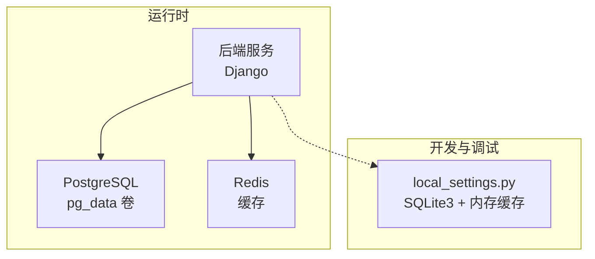
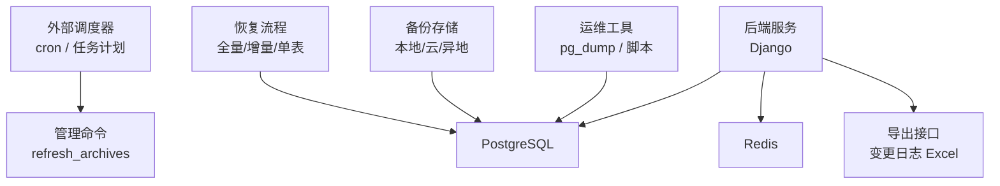
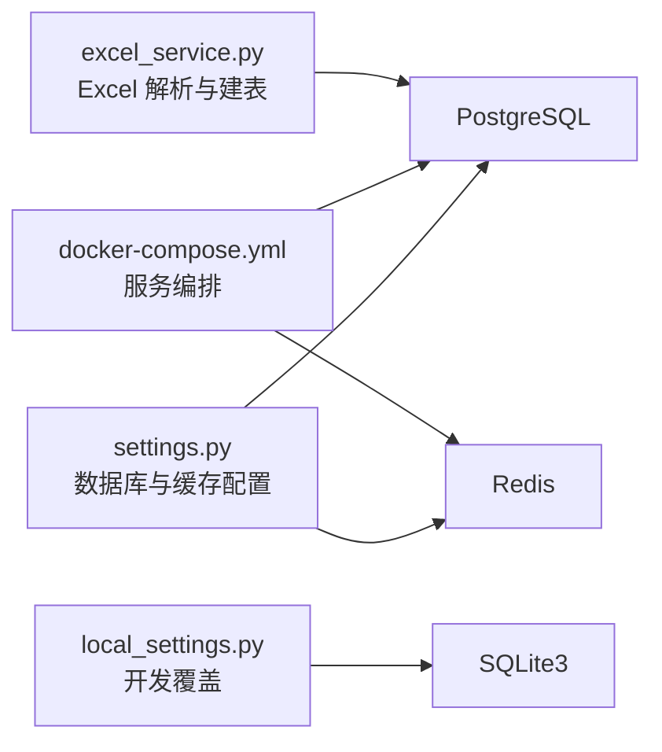

# 备份与恢复

<cite>
**本文引用的文件**   
- [settings.py](file://backend/config/settings.py)
- [local_settings.py](file://backend/local_settings.py)
- [docker-compose.yml](file://backend/docker-compose.yml)
- [Dockerfile](file://backend/Dockerfile)
- [excel_service.py](file://backend/apps/modeling/excel_service.py)
- [views.py（档案）](file://backend/apps/archive/views.py)
- [apps.py（档案）](file://backend/apps/archive/apps.py)
- [refresh_archives.py](file://backend/apps/archive/management/commands/refresh_archives.py)
- [models.py（建模）](file://backend/apps/modeling/models.py)
- [check-all.ps1](file://scripts/check-all.ps1)
</cite>

## 目录
1. [简介](#简介)
2. [项目结构](#项目结构)
3. [核心组件](#核心组件)
4. [架构总览](#架构总览)
5. [详细组件分析](#详细组件分析)
6. [依赖关系分析](#依赖关系分析)
7. [性能考虑](#性能考虑)
8. [故障排查指南](#故障排查指南)
9. [结论](#结论)
10. [附录](#附录)

## 简介
本文件为 MetaData002 系统的“备份与恢复”策略文档，面向运维与研发人员，覆盖数据库、文件系统与配置、存储与容灾、恢复流程、验证与测试、自动化与监控等关键主题。系统后端基于 Django + PostgreSQL，缓存使用 Redis；开发环境默认 SQLite3 与内存缓存；通过 docker-compose 编排服务并持久化数据库卷。

## 项目结构
- 后端：Django 应用，数据库连接与缓存配置集中在 settings.py，本地开发通过 local_settings.py 覆盖为 SQLite3 与内存缓存。
- 数据源与建模：建模模块支持 Excel 导入并在本地库建表，涉及动态 SQL 执行与事务控制。
- 档案模块：提供数据刷新命令与进程内定时任务，用于周期性同步与合并数据。
- 容器编排：docker-compose 定义 PostgreSQL、Redis、后端服务，并通过 volume 持久化数据库数据。

图表来源 
- [settings.py:56-74](file://backend/config/settings.py#L56-L74)
- [local_settings.py:3-15](file://backend/local_settings.py#L3-L15)
- [docker-compose.yml:6-31](file://backend/docker-compose.yml#L6-L31)

章节来源
- [settings.py:56-74](file://backend/config/settings.py#L56-L74)
- [local_settings.py:3-15](file://backend/local_settings.py#L3-L15)
- [docker-compose.yml:6-31](file://backend/docker-compose.yml#L6-L31)

## 核心组件
- 数据库层：PostgreSQL（生产）、SQLite3（开发）。通过环境变量注入连接参数。
- 缓存层：Redis（生产），内存缓存（开发）。
- 文件处理：Excel 解析与本地建表，使用 openpyxl 与 Django 事务。
- 调度与刷新：管理命令 refresh_archives 与进程内定时线程，按分钟周期刷新档案数据。
- 容器化：Dockerfile 构建镜像，docker-compose 编排服务与数据卷。

章节来源
- [settings.py:56-74](file://backend/config/settings.py#L56-L74)
- [excel_service.py:93-156](file://backend/apps/modeling/excel_service.py#L93-L156)
- [apps.py（档案）:15-58](file://backend/apps/archive/apps.py#L15-L58)
- [refresh_archives.py:1-32](file://backend/apps/archive/management/commands/refresh_archives.py#L1-L32)
- [docker-compose.yml:32-54](file://backend/docker-compose.yml#L32-L54)

## 架构总览
下图展示备份与恢复相关的关键组件与数据流向：数据库实例、缓存、应用服务、外部调度器（cron/任务计划）以及归档导出能力。

图表来源 
- [docker-compose.yml:6-21](file://backend/docker-compose.yml#L6-L21)
- [settings.py:56-74](file://backend/config/settings.py#L56-L74)
- [views.py（档案）:1974-2004](file://backend/apps/archive/views.py#L1974-L2004)
- [refresh_archives.py:1-32](file://backend/apps/archive/management/commands/refresh_archives.py#L1-L32)

## 详细组件分析

### 数据库备份策略（PostgreSQL）
- 全量备份
  - 使用 pg_dump 对数据库进行一致性快照，建议在生产低峰期执行。
  - 输出可压缩归档，便于传输与长期保存。
  - 建议结合 WAL 归档实现时间点恢复（PITR）。
- 增量备份
  - 启用 WAL 归档后，可通过连续归档的 WAL 段实现增量恢复。
  - 配合 pg_basebackup 定期基础备份，减少恢复时间。
- 实时备份
  - 利用流式复制（主从）或逻辑复制，将变更持续复制到备库。
  - 适用于高可用与快速切换场景。

实施要点
- 备份目标：本地磁盘、对象存储（如 S3/OSS）、异地机房。
- 加密与权限：备份文件加密，限制访问权限。
- 保留策略：按天/周/月分级保留，自动清理过期备份。
- 监控告警：备份成功/失败通知，失败重试机制。

章节来源
- [docker-compose.yml:6-21](file://backend/docker-compose.yml#L6-L21)
- [settings.py:56-66](file://backend/config/settings.py#L56-L66)

### 文件系统备份方案
- 用户上传文件
  - 当前代码未显式配置 MEDIA_ROOT/MEDIA_URL，上传入口存在但存储路径需明确。
  - 建议统一存储到对象存储或挂载盘，避免容器重启丢失。
- 导出文件
  - 档案变更日志支持导出 Excel（openpyxl），前端通过 Blob 下载。
  - 导出文件应落盘并纳入备份范围，或直传对象存储。
- 配置文件
  - settings.py、local_settings.py、docker-compose.yml、Dockerfile 等需版本化管理。
  - 敏感信息（DB_PASSWORD、AI_API_KEY）通过环境变量注入，不应入库或入仓。

章节来源
- [excel_service.py:93-156](file://backend/apps/modeling/excel_service.py#L93-L156)
- [views.py（档案）:1974-2004](file://backend/apps/archive/views.py#L1974-L2004)
- [settings.py:109-116](file://backend/config/settings.py#L109-L116)

### 备份数据存储与管理
- 本地存储
  - 使用 NAS/磁盘阵列，设置冗余与快照。
- 云存储
  - 使用对象存储（S3/OSS/COS），开启版本控制与生命周期策略。
- 异地容灾
  - 跨地域复制备份集，定期演练恢复。
- 元数据管理
  - 记录备份清单（时间、大小、校验值、包含内容），便于检索与审计。

章节来源
- [docker-compose.yml:56-58](file://backend/docker-compose.yml#L56-L58)

### 数据恢复流程
- 单表恢复
  - 针对误删或局部损坏，使用 pg_restore 或 psql 导入特定表备份。
  - 注意外键约束与索引重建。
- 全库恢复
  - 使用 pg_restore 恢复完整数据库，确保版本一致。
  - 恢复后进行完整性校验与业务回归测试。
- 灾难恢复
  - 从异地备份恢复至新环境，验证服务可用性。
  - 切换流量至恢复后的实例，观察运行指标。

章节来源
- [docker-compose.yml:6-21](file://backend/docker-compose.yml#L6-L21)

### 备份验证与测试流程
- 完整性校验
  - 校验备份文件的哈希值，比对生成与恢复两端。
- 可用性测试
  - 在隔离环境恢复备份，执行关键查询与导出功能。
- 自动化验证
  - 将校验步骤集成到 CI/CD 或定时任务中，失败告警。

章节来源
- [check-all.ps1:42-76](file://scripts/check-all.ps1#L42-L76)

### 自动化备份任务的配置与监控
- 任务调度
  - 使用 cron 或系统任务计划程序调用 pg_dump/pg_basebackup。
  - 结合管理命令 refresh_archives 触发数据刷新，保证备份前数据一致性。
- 监控与告警
  - 监控备份任务状态、耗时、大小与错误日志。
  - 失败重试与邮件/消息通知。

章节来源
- [refresh_archives.py:1-32](file://backend/apps/archive/management/commands/refresh_archives.py#L1-L32)
- [apps.py（档案）:15-58](file://backend/apps/archive/apps.py#L15-L58)

### 导出与变更日志备份
- 导出接口
  - 档案变更日志支持导出 Excel，包含批次汇总与明细。
- 备份策略
  - 将导出的 Excel 文件纳入备份集，或直传到对象存储。
  - 文件名含时间戳与归档标识，便于追溯。

章节来源
- [views.py（档案）:1974-2004](file://backend/apps/archive/views.py#L1974-L2004)

## 依赖关系分析
- 数据库依赖：PostgreSQL（生产）、SQLite3（开发）。
- 缓存依赖：Redis（生产），内存缓存（开发）。
- 外部工具：pg_dump/pg_restore、openpyxl、openpyxl 依赖 Python 环境。
- 容器依赖：Docker 与 docker-compose 编排。

图表来源 
- [settings.py:56-74](file://backend/config/settings.py#L56-L74)
- [local_settings.py:3-15](file://backend/local_settings.py#L3-L15)
- [docker-compose.yml:6-31](file://backend/docker-compose.yml#L6-L31)
- [excel_service.py:93-156](file://backend/apps/modeling/excel_service.py#L93-L156)

章节来源
- [settings.py:56-74](file://backend/config/settings.py#L56-L74)
- [local_settings.py:3-15](file://backend/local_settings.py#L3-L15)
- [docker-compose.yml:6-31](file://backend/docker-compose.yml#L6-L31)
- [excel_service.py:93-156](file://backend/apps/modeling/excel_service.py#L93-L156)

## 性能考虑
- 备份窗口
  - 选择低峰期执行全量备份，避免影响在线业务。
- 并发与锁
  - 使用只读副本或快照减少锁竞争。
- I/O 优化
  - 备份到高速存储或网络带宽充足的环境。
- 缓存影响
  - 备份期间避免频繁写入缓存导致不一致。

[本节为通用指导，不直接分析具体文件]

## 故障排查指南
- 备份失败
  - 检查数据库连接与权限，确认 pg_dump 可用。
  - 查看任务日志与错误码，定位失败原因。
- 恢复失败
  - 校验备份文件完整性，确认版本兼容。
  - 检查外键约束与索引，必要时重建。
- 导出异常
  - 检查 Excel 导出接口参数与权限。
  - 确认 openpyxl 依赖与环境。

章节来源
- [check-all.ps1:42-76](file://scripts/check-all.ps1#L42-L76)
- [views.py（档案）:1974-2004](file://backend/apps/archive/views.py#L1974-L2004)

## 结论
MetaData002 的备份与恢复策略应围绕 PostgreSQL 的核心能力展开，结合 WAL 归档与流复制实现高可用与快速恢复。文件系统与配置需纳入统一备份体系，导出文件与变更记录应作为重要资产进行保护。通过自动化任务与监控告警，确保备份的可靠性与可恢复性。

[本节为总结性内容，不直接分析具体文件]

## 附录
- 环境变量参考
  - 数据库：DB_HOST、DB_PORT、DB_NAME、DB_USER、DB_PASSWORD
  - 缓存：REDIS_HOST、REDIS_PORT
  - AI 服务：AI_API_BASE、AI_API_KEY、AI_MODEL、AI_TIMEOUT
- 常用命令
  - 全量备份：pg_dump -U <user> -h <host> -p <port> -F custom -f backup.dump <dbname>
  - 恢复：pg_restore -U <user> -h <host> -p <port> -d <dbname> backup.dump
  - 刷新档案：python manage.py refresh_archives [--archive-id N]

章节来源
- [settings.py:56-74](file://backend/config/settings.py#L56-L74)
- [settings.py:109-116](file://backend/config/settings.py#L109-L116)
- [refresh_archives.py:1-32](file://backend/apps/archive/management/commands/refresh_archives.py#L1-L32)