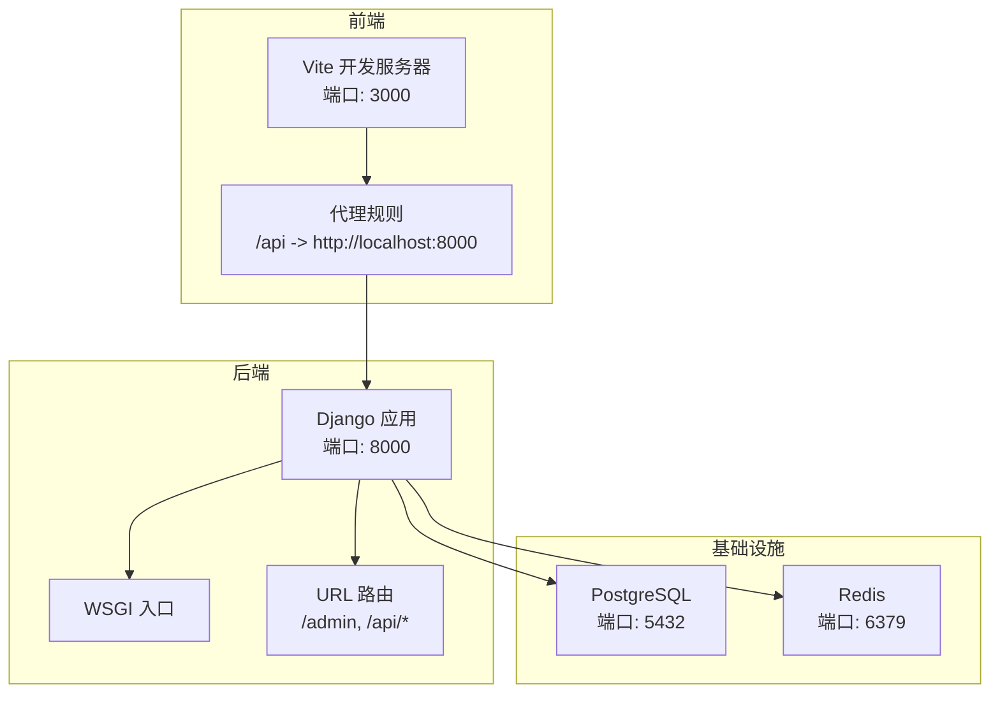
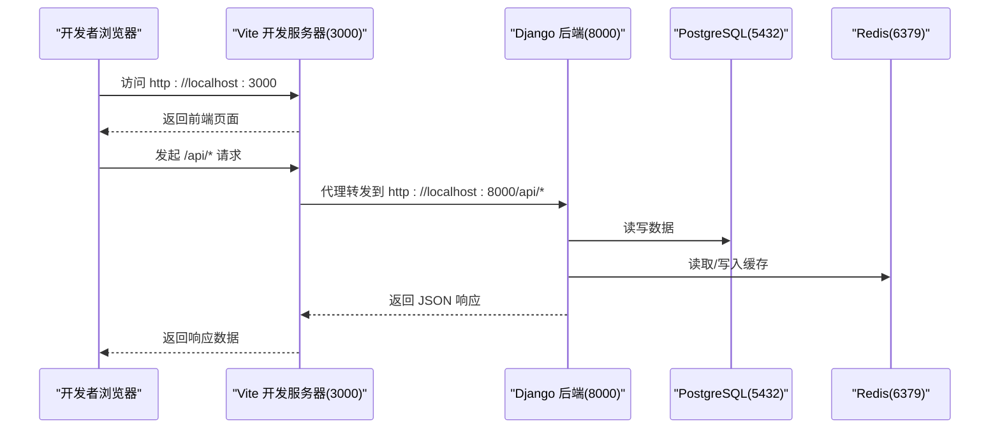
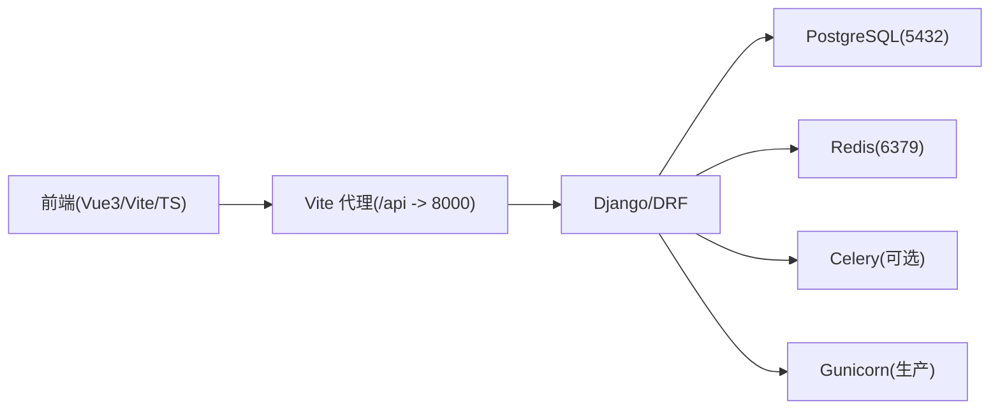

# 环境搭建

<cite>
**本文引用的文件**   
- [backend/requirements.txt](file://backend/requirements.txt)
- [backend/Dockerfile](file://backend/Dockerfile)
- [backend/docker-compose.yml](file://backend/docker-compose.yml)
- [backend/config/settings.py](file://backend/config/settings.py)
- [backend/local_settings.py](file://backend/local_settings.py)
- [backend/manage.py](file://backend/manage.py)
- [backend/config/wsgi.py](file://backend/config/wsgi.py)
- [backend/config/urls.py](file://backend/config/urls.py)
- [frontend/package.json](file://frontend/package.json)
- [frontend/vite.config.ts](file://frontend/vite.config.ts)
- [frontend/tsconfig.json](file://frontend/tsconfig.json)
- [scripts/check-all.ps1](file://scripts/check-all.ps1)
</cite>

## 目录
1. [简介](#简介)
2. [项目结构](#项目结构)
3. [核心组件](#核心组件)
4. [架构总览](#架构总览)
5. [详细组件分析](#详细组件分析)
6. [依赖分析](#依赖分析)
7. [性能考虑](#性能考虑)
8. [故障排查指南](#故障排查指南)
9. [结论](#结论)
10. [附录](#附录)

## 简介
本环境搭建文档面向 MetaData002 系统的本地开发与快速上手，覆盖最低环境要求、前后端初始化步骤、数据库与缓存配置、AI 服务密钥配置、常见问题排查以及开发工具与 IDE 建议。读者可据此在 Windows/macOS/Linux 上完成从安装到运行的一体化流程。

## 项目结构
- 后端（Django + DRF）：位于 backend 目录，使用 PostgreSQL 作为主数据库，Redis 作为缓存，Celery/Gunicorn 用于异步任务与生产部署。
- 前端（Vue3 + Vite + TypeScript）：位于 frontend 目录，通过 Vite 代理将 /api 请求转发至后端 8000 端口。
- 容器化：docker-compose 提供一键启动 Postgres、Redis 与后端服务；Dockerfile 定义 Python 3.12 基础镜像与系统依赖。
- 脚本：scripts/check-all.ps1 提供一键检查后端 Django check/test 与前端 TypeScript/build 的自动化脚本。

**图表来源** 
- [frontend/vite.config.ts:12-20](file://frontend/vite.config.ts#L12-L20)
- [backend/config/urls.py:4-8](file://backend/config/urls.py#L4-L8)
- [backend/config/wsgi.py:1-5](file://backend/config/wsgi.py#L1-L5)
- [backend/docker-compose.yml:6-54](file://backend/docker-compose.yml#L6-L54)

**章节来源**
- [backend/config/settings.py:1-123](file://backend/config/settings.py#L1-L123)
- [backend/local_settings.py:1-26](file://backend/local_settings.py#L1-L26)
- [backend/docker-compose.yml:1-58](file://backend/docker-compose.yml#L1-L58)
- [frontend/vite.config.ts:1-22](file://frontend/vite.config.ts#L1-L22)

## 核心组件
- 后端运行时与环境
  - Python 版本：基于 Dockerfile 指定 python:3.12-slim，建议使用 Python 3.12+。
  - Web 框架：Django >=5.0,<5.1，DRF 与 drf-spectacular 用于 API 与文档。
  - 数据库驱动：psycopg2-binary 连接 PostgreSQL。
  - 缓存：redis>=5.0 与 django-redis。
  - 任务队列：celery>=5.3（可选，用于后台任务）。
  - 生产部署：gunicorn>=21.2。
  - 环境变量加载：python-dotenv>=1.0。
  - Excel 处理：openpyxl>=3.1。
- 前端运行时与环境
  - Node.js：建议使用 Node.js 18+（与 Vite 5.x、TypeScript ~5.4 兼容性好）。
  - 包管理：npm/yarn/pnpm 均可，package.json 定义了 Vue3、Ant Design Vue、Axios、Pinia、Vite、TS 等依赖。
  - 构建工具：Vite 5.4+，vue-tsc 进行类型检查。

**章节来源**
- [backend/requirements.txt:1-11](file://backend/requirements.txt#L1-L11)
- [backend/Dockerfile:1-20](file://backend/Dockerfile#L1-L20)
- [frontend/package.json:1-29](file://frontend/package.json#L1-L29)
- [frontend/tsconfig.json:1-25](file://frontend/tsconfig.json#L1-L25)

## 架构总览
下图展示了本地开发时前后端与基础设施的交互关系，以及关键端口与代理规则。

**图表来源** 
- [frontend/vite.config.ts:12-20](file://frontend/vite.config.ts#L12-L20)
- [backend/config/settings.py:56-74](file://backend/config/settings.py#L56-L74)
- [backend/docker-compose.yml:32-54](file://backend/docker-compose.yml#L32-L54)

## 详细组件分析

### 后端环境初始化（推荐：容器化一键启动）
- 前置条件
  - 已安装 Docker 与 docker-compose。
- 启动步骤
  - 在项目根目录执行 docker-compose up --build。
  - 自动拉起 Postgres、Redis 与后端服务，并执行 migrate。
  - 后端监听 0.0.0.0:8000，可通过 http://localhost:8000/admin 访问管理后台。
- 环境变量（由 docker-compose 注入）
  - DEBUG=1
  - DB_HOST=db, DB_PORT=5432, DB_NAME=metadata, DB_USER=metadata, DB_PASSWORD=metadata123
  - REDIS_HOST=redis, REDIS_PORT=6379
- 关闭与清理
  - docker-compose down（如需删除数据卷请加 -v）。

**章节来源**
- [backend/docker-compose.yml:1-58](file://backend/docker-compose.yml#L1-L58)
- [backend/config/settings.py:56-74](file://backend/config/settings.py#L56-L74)

### 后端本地开发（Python 虚拟环境）
- 创建虚拟环境
  - 在 backend 目录下创建 venv，激活后安装 requirements.txt 依赖。
- 数据库与缓存
  - 方式一（推荐）：使用 local_settings.py 覆盖为 SQLite3 + 内存缓存，无需外部依赖即可运行。
  - 方式二：配置 PostgreSQL 与 Redis，设置环境变量 DB_* 与 REDIS_*。
- 运行服务
  - 使用 manage.py runserver 启动后端服务（默认 127.0.0.1:8000）。
- 常用命令
  - 迁移：python manage.py migrate
  - 测试：python manage.py test apps.modeling apps.archive
  - 检查：python manage.py check

**章节来源**
- [backend/requirements.txt:1-11](file://backend/requirements.txt#L1-L11)
- [backend/local_settings.py:1-26](file://backend/local_settings.py#L1-L26)
- [backend/manage.py:1-22](file://backend/manage.py#L1-L22)
- [backend/config/settings.py:56-74](file://backend/config/settings.py#L56-L74)

### 前端环境初始化
- 前置条件
  - Node.js 18+，推荐使用 nvm 管理多版本。
- 安装依赖
  - 进入 frontend 目录，执行 npm install（或 yarn/pnpm 对应命令）。
- 启动开发服务器
  - 执行 npm run dev，默认监听 3000 端口。
  - 通过 vite.config.ts 的 proxy 将 /api 请求转发到 http://localhost:8000。
- 构建与预览
  - npm run build：生产构建。
  - npm run preview：本地预览构建产物。

**章节来源**
- [frontend/package.json:1-29](file://frontend/package.json#L1-L29)
- [frontend/vite.config.ts:1-22](file://frontend/vite.config.ts#L1-L22)

### 数据库初始化（PostgreSQL）
- 若使用 docker-compose，数据库已在 db 服务中创建，用户/密码/库名见 compose 配置。
- 若本地安装 PostgreSQL
  - 确保服务运行且允许本地连接。
  - 设置环境变量 DB_HOST、DB_PORT、DB_NAME、DB_USER、DB_PASSWORD。
  - 执行迁移：python manage.py migrate。

**章节来源**
- [backend/docker-compose.yml:6-21](file://backend/docker-compose.yml#L6-L21)
- [backend/config/settings.py:56-66](file://backend/config/settings.py#L56-L66)

### 缓存（Redis）
- 若使用 docker-compose，Redis 服务已启动于 6379 端口。
- 若本地安装 Redis
  - 确保服务运行。
  - 设置环境变量 REDIS_HOST、REDIS_PORT。
- 本地开发也可用 local_settings.py 切换为内存缓存，跳过 Redis。

**章节来源**
- [backend/docker-compose.yml:22-30](file://backend/docker-compose.yml#L22-L30)
- [backend/config/settings.py:68-74](file://backend/config/settings.py#L68-L74)
- [backend/local_settings.py:11-15](file://backend/local_settings.py#L11-L15)

### AI 服务密钥配置（OpenAI 兼容接口）
- 环境变量
  - AI_API_BASE：API 基础地址（默认 https://api.openai.com/v1）。
  - AI_API_KEY：API 密钥（留空则回退到启发式模拟）。
  - AI_MODEL：模型名称（默认 gpt-4o-mini）。
  - AI_TIMEOUT：超时秒数（默认 30）。
- 使用方式
  - 在 .env 文件中设置上述变量，或通过 shell 导出。
  - 未配置密钥时，系统将回退到模拟模式，便于无密钥开发。

**章节来源**
- [backend/config/settings.py:109-113](file://backend/config/settings.py#L109-L113)

### 跨域与调试（CORS）
- 本地开发启用 CORS
  - local_settings.py 引入 corsheaders 中间件并允许所有来源，便于前端 3000 与后端 8000 联调。
- 生产环境
  - 应限制 ALLOWED_HOSTS 与 CORS 策略，避免安全风险。

**章节来源**
- [backend/local_settings.py:17-26](file://backend/local_settings.py#L17-L26)
- [backend/config/settings.py:6-8](file://backend/config/settings.py#L6-L8)

### 统一检查脚本（Windows）
- 使用 scripts/check-all.ps1 一键执行后端 Django check/test 与前端 TypeScript/build 检查。
- 该脚本会检测 backend\venv 是否存在，并分别执行相应命令，汇总结果。

**章节来源**
- [scripts/check-all.ps1:1-90](file://scripts/check-all.ps1#L1-L90)

## 依赖分析
- 后端依赖
  - Django、DRF、drf-spectacular、django-filter 提供 API 与过滤能力。
  - psycopg2-binary 连接 PostgreSQL。
  - redis、celery、gunicorn 支撑缓存、任务与生产部署。
  - python-dotenv 支持 .env 环境变量。
- 前端依赖
  - Vue3、Ant Design Vue、Axios、Pinia、Vite、TypeScript。
- 运行时依赖
  - PostgreSQL（5432）、Redis（6379）。
  - Node.js（18+）、Python（3.12+）。

**图表来源** 
- [frontend/package.json:11-27](file://frontend/package.json#L11-L27)
- [backend/requirements.txt:1-11](file://backend/requirements.txt#L1-L11)
- [backend/docker-compose.yml:32-54](file://backend/docker-compose.yml#L32-L54)

**章节来源**
- [backend/requirements.txt:1-11](file://backend/requirements.txt#L1-L11)
- [frontend/package.json:1-29](file://frontend/package.json#L1-L29)

## 性能考虑
- 数据库连接池与查询优化：在生产环境建议开启连接池与慢查询日志。
- 缓存命中：合理使用 Redis 缓存热点数据，减少数据库压力。
- 静态资源：生产构建后使用 CDN 或反向代理缓存静态资源。
- 并发与限流：结合 Nginx/Gunicorn 参数与 DRF 限流策略提升稳定性。

[本节为通用指导，不直接分析具体文件]

## 故障排查指南
- 端口冲突
  - 现象：Vite 无法启动或 Django 无法绑定 8000。
  - 解决：修改 vite.config.ts 的 server.port 或 Django 的 runserver 端口；检查占用进程。
- 数据库连接失败
  - 现象：migrate/runserver 报连接错误。
  - 解决：确认 PostgreSQL 服务运行；检查 DB_HOST/DB_PORT/DB_NAME/DB_USER/DB_PASSWORD；本地可用 local_settings.py 切换到 SQLite3 验证。
- Redis 连接失败
  - 现象：缓存相关报错。
  - 解决：确认 Redis 服务运行；检查 REDIS_HOST/REDIS_PORT；本地可用 local_settings.py 切换为内存缓存。
- 权限问题（Windows）
  - 现象：pip 安装或脚本执行失败。
  - 解决：以管理员权限运行终端；确保 PATH 包含 Python/Node 路径；必要时使用 venv 隔离环境。
- 依赖版本冲突
  - 现象：安装时报错或运行时报错。
  - 解决：锁定依赖版本（requirements.txt/package.json），清理缓存后重装；必要时升级/降级 Python/Node 版本。
- CORS 跨域问题
  - 现象：前端请求被拒绝。
  - 解决：开发环境启用 local_settings.py 的 CORS；生产环境正确配置 ALLOWED_HOSTS 与 CORS 白名单。
- 环境变量未生效
  - 现象：AI 密钥或数据库配置无效。
  - 解决：确认 .env 或 shell 导出正确；重启服务使环境变量生效。

**章节来源**
- [frontend/vite.config.ts:12-20](file://frontend/vite.config.ts#L12-L20)
- [backend/config/settings.py:56-74](file://backend/config/settings.py#L56-L74)
- [backend/local_settings.py:1-26](file://backend/local_settings.py#L1-L26)

## 结论
通过容器化或本地虚拟环境两种方式，均可快速搭建 MetaData002 的开发环境。推荐优先使用 docker-compose 一键启动数据库与缓存，再配合前端 Vite 代理进行联调。合理配置环境变量与依赖版本，可有效避免常见环境问题。

[本节为总结性内容，不直接分析具体文件]

## 附录

### 最小环境清单
- Python 3.12+
- Node.js 18+
- PostgreSQL（本地或容器）
- Redis（本地或容器）
- Docker & docker-compose（可选，推荐）

### 环境变量参考
- 数据库
  - DB_HOST、DB_PORT、DB_NAME、DB_USER、DB_PASSWORD
- 缓存
  - REDIS_HOST、REDIS_PORT
- AI 服务
  - AI_API_BASE、AI_API_KEY、AI_MODEL、AI_TIMEOUT
- 调试
  - DEBUG、ALLOWED_HOSTS

**章节来源**
- [backend/config/settings.py:6-8](file://backend/config/settings.py#L6-L8)
- [backend/config/settings.py:56-74](file://backend/config/settings.py#L56-L74)
- [backend/config/settings.py:109-113](file://backend/config/settings.py#L109-L113)

### 常用命令速查
- 后端（容器）
  - docker-compose up --build
  - docker-compose down [-v]
- 后端（本地）
  - python manage.py migrate
  - python manage.py runserver
  - python manage.py check
  - python manage.py test apps.modeling apps.archive
- 前端
  - npm run dev
  - npm run build
  - npm run preview

**章节来源**
- [backend/docker-compose.yml:32-54](file://backend/docker-compose.yml#L32-L54)
- [backend/manage.py:1-22](file://backend/manage.py#L1-L22)
- [frontend/package.json:6-10](file://frontend/package.json#L6-L10)

### 开发工具与 IDE 建议
- VS Code
  - 插件：Python、Django、Docker、ESLint、Prettier、Vue Language Features (Volar)、TypeScript Vue Plugin。
  - 配置：启用 Prettier 格式化；设置 ESLint 校验；VS Code 内置 Docker 扩展便于管理容器。
- PyCharm
  - 配置 Django 项目与解释器；设置 Run/Debug 配置指向 manage.py runserver。
- Node.js
  - 使用 nvm 管理版本；在 VS Code 中安装 Vue 与 TS 相关插件。

[本节为通用指导，不直接分析具体文件]