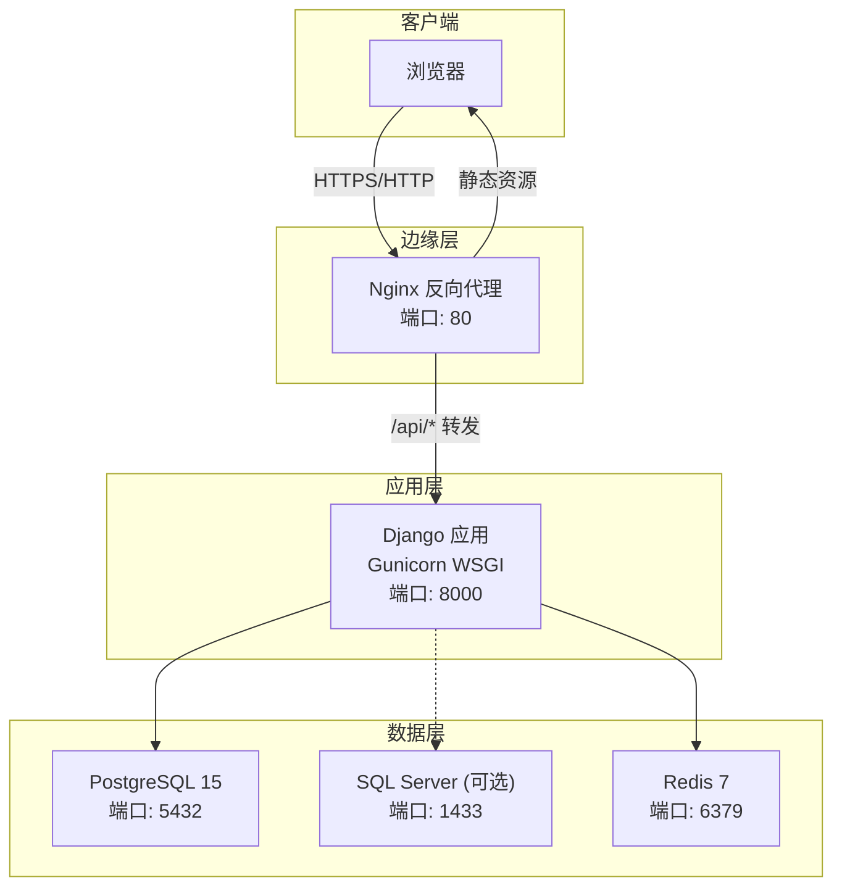
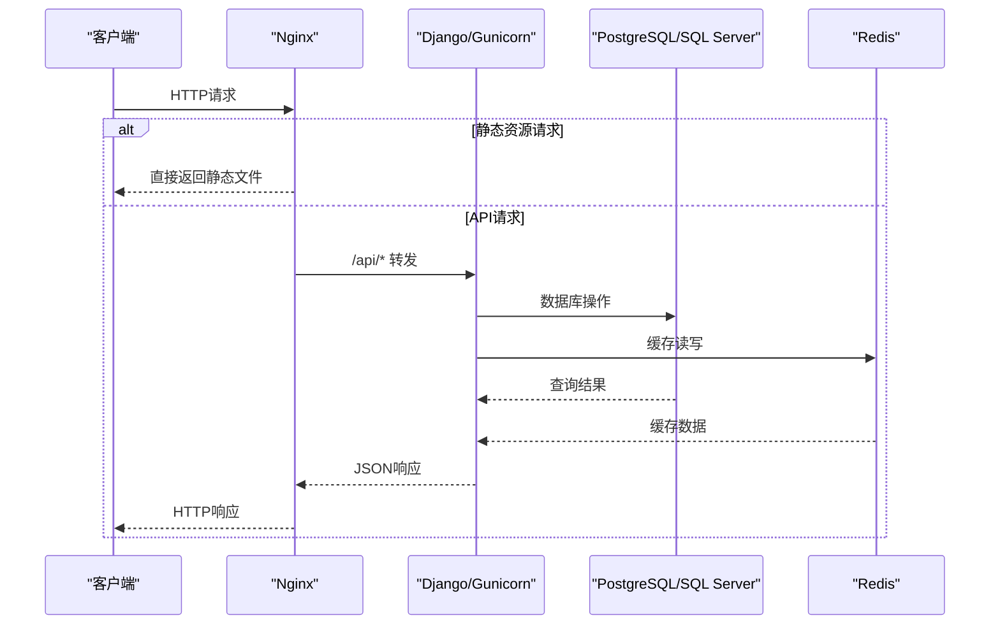
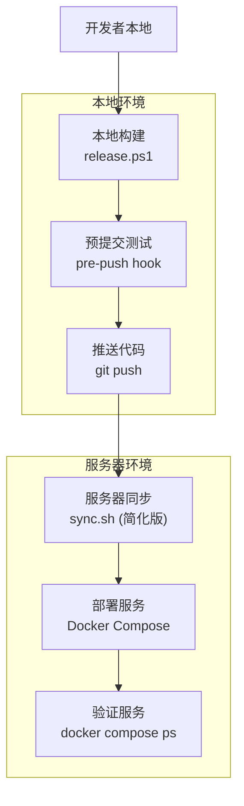
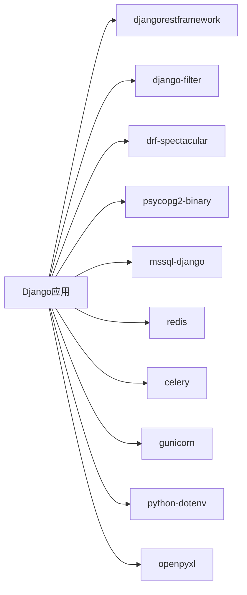
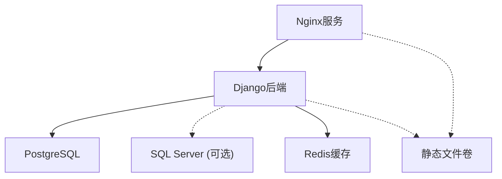

# 生产环境部署

<cite>
**本文引用的文件**   
- [deploy/docker-compose.yml](file://deploy/docker-compose.yml)
- [frontend/nginx.conf](file://frontend/nginx.conf)
- [backend/Dockerfile](file://backend/Dockerfile)
- [backend/config/settings.py](file://backend/config/settings.py)
- [backend/config/wsgi.py](file://backend/config/wsgi.py)
- [backend/docker-compose.yml](file://backend/docker-compose.yml)
- [backend/requirements.txt](file://backend/requirements.txt)
- [backend/apps/modeling/distinct_cache.py](file://backend/apps/modeling/distinct_cache.py)
- [backend/scripts/diag_sqlserver_activity.py](file://backend/scripts/diag_sqlserver_activity.py)
- [frontend/package.json](file://frontend/package.json)
- [frontend/vite.config.ts](file://frontend/vite.config.ts)
- [scripts/release.ps1](file://scripts/release.ps1)
- [deploy/sync.sh](file://deploy/sync.sh)
- [scripts/check-all.ps1](file://scripts/check-all.ps1)
- [scripts/dev.ps1](file://scripts/dev.ps1)
</cite>

## 更新摘要
**变更内容**   
- 新增完整的Docker Compose生产环境部署配置
- 集成Nginx反向代理和静态资源托管
- 添加Gunicorn WSGI服务器生产配置
- 实现服务健康检查和依赖管理
- 提供PostgreSQL、Redis和Microsoft SQL Server的容器化部署支持
- 增强前端构建和CDN缓存策略
- **新增STATIC_ROOT配置支持**：确保collectstatic命令在生产环境中正确收集静态文件
- **新增自动化部署脚本**：通过release.ps1和sync.sh实现一键发布流程，与现有Docker部署文档形成互补
- **简化服务器同步流程**：sync.sh脚本已简化，移除了自动依赖安装检查、docker compose命令检测和详细进度输出，采用更简洁的部署方式
- **新增Microsoft SQL Server支持**：完整支持SQL Server作为主数据库或外部数据源，包含ODBC驱动安装和连接配置

## 目录
1. [简介](#简介)
2. [项目结构](#项目结构)
3. [核心组件](#核心组件)
4. [架构总览](#架构总览)
5. [详细组件分析](#详细组件分析)
6. [自动化部署流程](#自动化部署流程)
7. [依赖关系分析](#依赖关系分析)
8. [性能考虑](#性能考虑)
9. [故障排查指南](#故障排查指南)
10. [结论](#结论)
11. [附录](#附录)

## 简介
本指南面向生产环境的 MetaData002 系统，提供完整的Docker Compose生产部署方案。系统采用微服务架构，包含Nginx反向代理、Gunicorn WSGI服务器、PostgreSQL数据库、Redis缓存和Vue3前端应用。**新增对Microsoft SQL Server的全面支持**，允许系统在需要SQL Server连接性的生产环境中部署，支持将SQL Server作为主数据库或外部数据源使用。通过容器化编排实现一键部署、健康检查和服务治理。**新增简化的自动化部署脚本支持**，提供从本地开发到生产环境的快速发布流程，服务器端同步过程更加简洁高效。

## 项目结构
- **后端服务**：Django + DRF，默认使用PostgreSQL作为主库，支持SQL Server作为替代选择，Redis作为缓存，Gunicorn作为WSGI服务器
- **前端应用**：Vue3 + Vite构建，通过Nginx提供静态资源服务和API反向代理
- **数据层**：PostgreSQL 15数据库（默认）、可选的Microsoft SQL Server、Redis 7缓存服务
- **容器编排**：Docker Compose统一管理所有服务生命周期，内置SQL Server ODBC驱动支持
- **自动化脚本**：PowerShell和Bash脚本支持本地构建、测试和服务器同步



**图表来源** 
- [deploy/docker-compose.yml:6-87](file://deploy/docker-compose.yml#L6-L87)
- [frontend/nginx.conf:4-51](file://frontend/nginx.conf#L4-L51)

## 核心组件
- **Nginx反向代理**：处理静态资源、API路由转发、SSL终止、负载均衡
- **Django应用**：REST API、业务逻辑、模型管理，通过Gunicorn提供服务，支持多数据库类型
- **PostgreSQL数据库**：默认主数据存储，支持事务和复杂查询
- **Microsoft SQL Server**：可选主数据库或外部数据源，通过ODBC Driver 18连接
- **Redis缓存**：会话存储、缓存、分布式锁等高性能缓存服务
- **容器编排**：Docker Compose管理服务依赖、网络和数据卷，内置SQL Server驱动支持
- **简化自动化部署**：PowerShell和Bash脚本实现一键发布和服务器同步，服务器端同步流程更加简洁

**章节来源**
- [deploy/docker-compose.yml:6-87](file://deploy/docker-compose.yml#L6-L87)
- [backend/config/settings.py:58-76](file://backend/config/settings.py#L58-L76)
- [backend/requirements.txt:12-13](file://backend/requirements.txt#L12-L13)
- [backend/Dockerfile:17-24](file://backend/Dockerfile#L17-L24)
- [frontend/nginx.conf:4-51](file://frontend/nginx.conf#L4-L51)
- [scripts/release.ps1:1-69](file://scripts/release.ps1#L1-69)
- [deploy/sync.sh:1-10](file://deploy/sync.sh#L1-10)

## 架构总览
生产环境采用分层架构设计，支持多种数据库类型：



**图表来源** 
- [deploy/docker-compose.yml:37-67](file://deploy/docker-compose.yml#L37-L67)
- [frontend/nginx.conf:17-29](file://frontend/nginx.conf#L17-L29)

## 详细组件分析

### 服务器规格与网络建议
- **CPU**：建议4-8 vCPU起步，根据并发量调整（Gunicorn workers = 2×CPU + 1）
- **内存**：至少8-16GB，确保Django进程、数据库、Redis和操作系统有足够空间
- **磁盘**：SSD优先，预留充足空间给数据库和数据卷，开启监控告警
- **网络**：高带宽低延迟内网，同可用区部署以降低延迟
- **端口规划**：80(HTTP)、5432(PostgreSQL)、1433(SQL Server)、6379(Redis)、8000(Django)

### Docker Compose生产部署配置

#### 服务编排架构
系统包含四个核心服务：

1. **PostgreSQL数据库服务**
   - 版本：PostgreSQL 15
   - 数据持久化：postgres_data卷
   - 健康检查：pg_isready命令
   - 环境变量：DB_NAME, DB_USER, DB_PASSWORD

2. **Redis缓存服务**
   - 版本：Redis 7 Alpine
   - 轻量级镜像，适合生产环境
   - 健康检查：redis-cli ping
   - 内存优化：默认配置适合中等负载

3. **Django后端服务**
   - 启动流程：migrate → loaddata → init_admin → collectstatic → gunicorn
   - Gunicorn配置：4个workers，120秒超时
   - 静态文件共享：通过volume挂载到Nginx
   - **SQL Server支持**：内置ODBC Driver 18，支持SQL Server作为主库或外部数据源

4. **Nginx前端服务**
   - 静态资源：/usr/share/nginx/html
   - API反向代理：/api → backend:8000
   - 压缩和缓存：Gzip启用，静态资源7天缓存

**章节来源**
- [deploy/docker-compose.yml:7-83](file://deploy/docker-compose.yml#L7-L83)

### Nginx反向代理配置详解

#### 静态资源托管
- **根目录**：/usr/share/nginx/html（前端构建产物）
- **压缩配置**：启用Gzip，支持text/css、application/json、application/javascript等类型
- **缓存策略**：静态资源（js/css/img等）设置7天缓存和immutable标志
- **SPA支持**：try_files指令处理Vue Router历史模式

#### API路由转发
- **路径匹配**：/api前缀的请求转发到后端服务
- **代理头设置**：Host、X-Real-IP、X-Forwarded-For、X-Forwarded-Proto
- **超时配置**：读取超时120秒，连接超时10秒
- **长连接支持**：proxy_buffering off用于后端主动刷新接口

#### Django静态文件处理
- **Admin静态文件**：/static/admin/ → /usr/share/nginx/static/admin/
- **DRF静态文件**：/static/rest_framework/ → /usr/share/nginx/static/rest_framework/
- **共享卷**：通过static_volume实现Django和Nginx间的静态文件共享

**章节来源**
- [frontend/nginx.conf:4-51](file://frontend/nginx.conf#L4-L51)

### Gunicorn WSGI服务器生产配置

#### 进程和线程配置
- **Worker数量**：4个worker进程（适用于4核CPU）
- **超时设置**：120秒请求超时，防止长时间阻塞
- **绑定地址**：0.0.0.0:8000，允许外部访问
- **日志输出**：标准输出，便于容器日志收集

#### 启动流程自动化
Docker Compose中的command字段实现了完整的启动链：
1. `python manage.py migrate --noinput` - 数据库迁移
2. `python manage.py loaddata /app/data_dump.json` - 初始数据加载
3. `python manage.py init_admin` - 创建管理员账户
4. `python manage.py collectstatic --noinput` - 收集静态文件
5. `gunicorn config.wsgi:application` - 启动WSGI服务器

**章节来源**
- [deploy/docker-compose.yml:41-46](file://deploy/docker-compose.yml#L41-L46)
- [backend/Dockerfile:22-24](file://backend/Dockerfile#L22-L24)

### Django应用生产配置

#### 安全配置
- **SECRET_KEY**：从环境变量DJANGO_SECRET_KEY获取，禁止使用默认值
- **DEBUG模式**：生产环境必须设置为False
- **ALLOWED_HOSTS**：严格限制允许的主机名列表
- **中间件**：启用SecurityMiddleware、CSRF保护、X-Frame-Options

#### 数据库配置
- **默认引擎**：postgresql（PostgreSQL专用后端）
- **连接参数**：从环境变量动态配置（DB_NAME, DB_USER, DB_PASSWORD, DB_HOST, DB_PORT）
- **原子请求**：ATOMIC_REQUESTS=False，提高性能
- **连接池**：建议使用PgBouncer或Django连接池优化
- **SQL Server支持**：通过mssql-django引擎支持SQL Server作为主数据库

#### 缓存配置
- **后端**：django_redis.cache.RedisCache
- **连接**：redis://{REDIS_HOST}:{REDIS_PORT}/1
- **客户端**：django_redis.client.DefaultClient
- **数据库索引**：使用Redis数据库索引1，避免与其他应用冲突

#### **静态文件配置（新增）**
- **STATIC_URL**：'static/' - 静态文件的URL前缀
- **STATIC_ROOT**：os.path.join(BASE_DIR, 'static') - 生产环境静态文件收集目录
- **collectstatic支持**：通过配置STATIC_ROOT，确保`python manage.py collectstatic`命令能够正确工作
- **生产环境最佳实践**：在Docker容器中执行collectstatic，将收集的静态文件挂载到Nginx容器

**章节来源**
- [backend/config/settings.py:6-8](file://backend/config/settings.py#L6-L8)
- [backend/config/settings.py:58-76](file://backend/config/settings.py#L58-L76)
- [backend/config/settings.py:90-92](file://backend/config/settings.py#L90-L92)

### Microsoft SQL Server支持配置

#### 数据库引擎映射
系统通过ENGINE_MAP支持多种数据库类型：
- PostgreSQL：`django.db.backends.postgresql`
- MySQL：`django.db.backends.mysql`
- **SQL Server：`mssql`**
- Oracle：`django.db.backends.oracle`

#### SQL Server连接配置
对于SQL Server数据源，系统自动配置以下选项：
- **驱动程序**：`ODBC Driver 18 for SQL Server`
- **加密设置**：`Encrypt=no`（可根据安全需求调整）
- **连接参数**：主机、端口、数据库名、用户名、密码

#### 容器化SQL Server支持
Docker镜像已预装必要的SQL Server驱动：
- **Microsoft ODBC Driver 18**：用于SQL Server连接
- **unixodbc-dev**：ODBC开发库
- **系统依赖**：gcc、libpq-dev、curl、gnupg2

#### SQL Server诊断工具
系统提供专门的诊断脚本用于监控SQL Server活动：
- **活动请求监控**：查询sys.dm_exec_requests视图
- **阻塞检测**：识别阻塞链和等待类型
- **性能分析**：分析SQL执行计划和等待时间

**章节来源**
- [backend/apps/modeling/distinct_cache.py:7-13](file://backend/apps/modeling/distinct_cache.py#L7-L13)
- [backend/apps/modeling/views.py:66-70](file://backend/apps/modeling/views.py#L66-L70)
- [backend/Dockerfile:17-24](file://backend/Dockerfile#L17-L24)
- [backend/scripts/diag_sqlserver_activity.py:1-75](file://backend/scripts/diag_sqlserver_activity.py#L1-L75)

### 前端构建与CDN策略

#### Vite构建配置
- **开发服务器**：监听所有网卡，端口3000
- **API代理**：/api → http://localhost:8000（开发环境）
- **构建脚本**：vue-tsc -b && vite build（TypeScript编译+Vite构建）
- **别名配置**：@ → ./src（路径别名）

#### 生产部署流程
1. **构建阶段**：执行npm run build生成dist目录
2. **静态文件**：将dist目录挂载到Nginx的/usr/share/nginx/html
3. **缓存策略**：文件名哈希，启用长期缓存
4. **CDN集成**：可将静态资源上传至CDN，修改base URL

**章节来源**
- [frontend/vite.config.ts:12-21](file://frontend/vite.config.ts#L12-L21)
- [frontend/package.json:6-9](file://frontend/package.json#L6-9)

### 健康检查和依赖管理

#### 服务健康检查
- **PostgreSQL**：使用pg_isready命令检查数据库可用性
- **Redis**：使用redis-cli ping检查缓存服务状态
- **检查间隔**：5秒间隔，5秒超时，最多重试5次
- **重启策略**：unless-stopped，自动重启失败服务

#### 服务依赖顺序
- **backend服务**：依赖db和redis服务的healthcheck通过
- **nginx服务**：依赖backend服务启动完成
- **数据卷**：postgres_data和static_volume持久化数据

**章节来源**
- [deploy/docker-compose.yml:18-23](file://deploy/docker-compose.yml#L18-23)
- [deploy/docker-compose.yml:30-35](file://deploy/docker-compose.yml#L30-35)
- [deploy/docker-compose.yml:62-67](file://deploy/docker-compose.yml#L62-67)

## 自动化部署流程

### 本地开发环境管理

#### 开发服务控制
使用dev.ps1脚本管理前后端开发服务：

```powershell
# 启动开发服务
.\scripts\dev.ps1 start

# 停止开发服务
.\scripts\dev.ps1 stop

# 查看服务状态
.\scripts\dev.ps1 status
```

**功能特性**：
- 后台启动前后端服务，不随终端退出
- 日志写入output/logs/目录
- 幂等操作，端口已监听则跳过启动
- PID文件管理，支持优雅停止

**章节来源**
- [scripts/dev.ps1:1-128](file://scripts/dev.ps1#L1-128)

#### 全量检查脚本
使用check-all.ps1进行代码质量检查：

```powershell
# 运行所有检查
.\scripts\check-all.ps1
```

**检查项目**：
- 后端：Django check和单元测试
- 前端：TypeScript检查和构建检查
- 统一报告：显示通过、失败和跳过的项目数

**章节来源**
- [scripts/check-all.ps1:1-90](file://scripts/check-all.ps1#L1-90)

### 生产环境一键发布流程

#### 本地构建和推送
使用release.ps1脚本进行本地构建和代码推送：

```powershell
# 基本发布流程
.\scripts\release.ps1

# 带提交信息的发布
.\scripts\release.ps1 -m "v1.0.0 发布"
```

**工作流程**：
1. **变更检测**：检查git是否有未提交的变更
2. **前端构建**：执行vue-tsc和vite build，失败则中止
3. **代码提交**：自动add、commit（可交互输入提交信息）
4. **远程推送**：推送到origin master分支
5. **后续步骤**：提示在服务器上执行同步脚本

**错误处理**：
- 构建失败时中止，不会提交代码
- Push失败时保留commit但不推送
- pre-push hook自动运行测试

**章节来源**
- [scripts/release.ps1:1-69](file://scripts/release.ps1#L1-69)

#### 服务器同步和部署（简化版）
在服务器上执行简化的sync.sh脚本完成部署：

```bash
# 执行服务器同步
bash /opt/metadata/deploy/sync.sh
```

**简化的部署流程**：
1. **代码拉取**：git pull origin master获取最新代码
2. **前端构建**：cd frontend && npm run build（假设依赖已安装）
3. **后端重建**：cd ../deploy && docker compose up -d --build backend
4. **Nginx重载**：docker compose exec nginx nginx -s reload

**简化特点**：
- **移除自动依赖检查**：假设Node.js和npm已正确安装
- **移除docker compose命令检测**：直接使用docker compose命令
- **移除详细进度输出**：采用简洁的命令执行方式
- **假设环境就绪**：期望服务器已具备完整的环境依赖

**安全保障**：
- set -e确保任一步骤失败立即中止
- 不会留下半同步状态

**章节来源**
- [deploy/sync.sh:1-10](file://deploy/sync.sh#L1-10)

### 完整发布工作流



**图表来源** 
- [scripts/release.ps1:20-68](file://scripts/release.ps1#L20-68)
- [deploy/sync.sh:5-10](file://deploy/sync.sh#L5-10)

## 依赖关系分析

### 后端依赖关系


**图表来源** 
- [backend/requirements.txt:1-13](file://backend/requirements.txt#L1-L13)

### 容器依赖关系


**图表来源** 
- [deploy/docker-compose.yml:62-83](file://deploy/docker-compose.yml#L62-L83)

**章节来源**
- [backend/requirements.txt:1-13](file://backend/requirements.txt#L1-L13)
- [deploy/docker-compose.yml:62-83](file://deploy/docker-compose.yml#L62-L83)

## 性能考虑

### 数据库性能优化
- **连接池**：使用PgBouncer或Django连接池减少连接开销
- **索引优化**：对高频查询字段建立合适索引
- **查询优化**：使用select_related和prefetch_related优化N+1查询
- **备份策略**：全量+增量备份，定期演练恢复
- **SQL Server优化**：针对SQL Server的特定优化，包括查询计划缓存和统计信息更新

### 缓存策略优化
- **热点数据**：用户会话、配置信息、字典数据缓存
- **缓存失效**：合理设置TTL，避免脏数据
- **内存管理**：配置maxmemory和淘汰策略
- **监控指标**：命中率、内存使用、延迟监控

### 应用性能优化
- **Gunicorn调优**：根据CPU核心数调整worker数量
- **静态资源**：启用Gzip压缩，设置长期缓存
- **异步任务**：使用Celery处理耗时操作
- **监控告警**：APM、错误率、延迟监控

### 网络性能优化
- **连接复用**：HTTP Keep-Alive，数据库连接池
- **负载均衡**：多实例部署，Nginx轮询
- **CDN加速**：静态资源全球分发
- **压缩传输**：Gzip/Brotli压缩

## 故障排查指南

### 常见问题诊断

#### 数据库连接问题
- **症状**：数据库连接超时或拒绝连接
- **排查步骤**：
  1. 检查PostgreSQL服务状态：`docker compose logs db`
  2. 验证网络连接：`docker exec backend python -c "import psycopg2; print('OK')"`
  3. 检查环境变量：DB_HOST, DB_PORT, DB_NAME, DB_USER, DB_PASSWORD
  4. 查看数据库日志：`docker compose logs db`

#### Redis缓存问题
- **症状**：缓存读写失败或连接超时
- **排查步骤**：
  1. 检查Redis服务：`docker compose logs redis`
  2. 测试连接：`docker exec redis redis-cli ping`
  3. 验证环境变量：REDIS_HOST, REDIS_PORT
  4. 检查内存使用：`docker exec redis redis-cli info memory`

#### **SQL Server连接问题（新增）**
- **症状**：SQL Server连接失败或ODBC驱动错误
- **排查步骤**：
  1. 检查ODBC驱动安装：`docker exec backend odbcinst -j`
  2. 验证SQL Server连接：`docker exec backend python -c "import pyodbc; print('OK')"`
  3. 检查连接字符串：确认主机、端口、数据库名、用户名、密码正确
  4. 查看SQL Server活动：`docker exec backend python scripts/diag_sqlserver_activity.py`
  5. 检查防火墙规则：确保端口1433开放

#### **静态资源404错误（新增）**
- **症状**：CSS、JS文件或Django admin静态资源无法加载
- **排查步骤**：
  1. 确认STATIC_ROOT配置正确：检查backend/config/settings.py中的STATIC_ROOT设置
  2. 验证collectstatic执行：`docker compose exec backend python manage.py collectstatic --noinput`
  3. 检查静态文件挂载：确认static_volume卷正确挂载到Nginx容器
  4. 验证Nginx配置：检查/static/admin/和/static/rest_framework/的路径映射
  5. 查看文件权限：确保Django容器有写入权限，Nginx容器有读取权限

#### **简化部署脚本问题（新增）**
- **症状**：sync.sh执行失败
- **排查步骤**：
  1. **环境依赖检查**：确保Node.js、npm、Docker环境已正确安装
  2. **Git状态检查**：确保没有未提交的本地变更
  3. **手动执行步骤**：逐步执行sync.sh中的命令定位问题
  4. **权限检查**：确保对/opt/metadata目录有读写权限
  5. **网络检查**：确保能访问GitHub仓库

#### API请求失败
- **症状**：/api请求返回502或超时
- **排查步骤**：
  1. 检查后端服务：`docker compose logs backend`
  2. 验证Gunicorn状态：`docker compose exec backend ps aux | grep gunicorn`
  3. 测试API连通性：`curl http://localhost:8000/api/`
  4. 检查Django应用日志

### 监控和日志收集

#### 容器日志
```bash
# 查看所有服务日志
docker compose logs -f

# 查看特定服务日志
docker compose logs -f backend
docker compose logs -f nginx
docker compose logs -f db
docker compose logs -f redis
```

#### 服务状态检查
```bash
# 检查服务健康状态
docker compose ps

# 检查服务资源使用
docker stats

# 进入容器调试
docker compose exec backend bash
docker compose exec nginx bash
```

**章节来源**
- [deploy/docker-compose.yml:18-23](file://deploy/docker-compose.yml#L18-23)
- [deploy/docker-compose.yml:30-35](file://deploy/docker-compose.yml#L30-L35)

## 结论
MetaData002系统的生产环境部署采用了现代化的容器化架构，通过Docker Compose实现了服务的统一管理和自动化运维。**新增的Microsoft SQL Server支持**进一步增强了系统的灵活性和适用性，使其能够在需要SQL Server连接性的企业环境中部署。简化的自动化部署脚本进一步提升了部署效率，提供了从本地开发到生产环境的快速发布能力。系统具备以下优势：

- **高可用性**：服务健康检查和自动重启机制
- **易于扩展**：水平扩展简单，支持负载均衡
- **可观测性**：完善的日志收集和监控指标
- **安全性**：环境变量配置、最小权限原则
- **维护性**：容器化部署，版本化管理
- **静态文件管理**：通过STATIC_ROOT配置和collectstatic命令，确保生产环境静态资源的正确收集和分发
- **简化部署流程**：通过release.ps1和简化的sync.sh脚本实现快速发布，降低部署复杂度
- **多数据库支持**：同时支持PostgreSQL和SQL Server，满足不同企业的技术栈需求

通过合理的资源配置和监控策略，该系统能够稳定支撑生产环境的业务需求。简化的服务器同步流程更适合成熟的生产环境，减少了不必要的检查和输出，提高了部署效率。

## 附录

### 环境变量清单

#### 必需的环境变量
```bash
# Django配置
DJANGO_SECRET_KEY=your-secret-key-here
DEBUG=0
ALLOWED_HOSTS=example.com,www.example.com

# 数据库配置（PostgreSQL默认）
DB_NAME=metadata
DB_USER=metadata
DB_PASSWORD=secure-password
DB_HOST=db
DB_PORT=5432

# 或使用SQL Server
# DB_ENGINE=mssql
# DB_NAME=metadata
# DB_USER=sa
# DB_PASSWORD=secure-password
# DB_HOST=sqlserver-host
# DB_PORT=1433

# Redis配置
REDIS_HOST=redis
REDIS_PORT=6379
```

#### 可选的环境变量
```bash
# AI服务配置
AI_API_BASE=https://api.openai.com/v1
AI_API_KEY=your-api-key
AI_MODEL=gpt-4o-mini
AI_TIMEOUT=30

# 档案配置
ARCHIVE_AUTO_REFRESH_MINUTES=60
```

**章节来源**
- [backend/config/settings.py:6-8](file://backend/config/settings.py#L6-L8)
- [backend/config/settings.py:58-76](file://backend/config/settings.py#L58-L76)
- [backend/config/settings.py:119-126](file://backend/config/settings.py#L119-L126)

### 部署命令参考

#### 基础部署
```bash
# 启动所有服务
cd deploy
docker compose up -d

# 查看服务状态
docker compose ps

# 查看实时日志
docker compose logs -f

# 停止所有服务
docker compose down

# 清理数据卷（谨慎使用）
docker compose down -v
```

#### 维护和运维
```bash
# 进入后端容器
docker compose exec backend bash

# 执行数据库迁移
docker compose exec backend python manage.py migrate

# 收集静态文件（重要：确保STATIC_ROOT配置正确）
docker compose exec backend python manage.py collectstatic --noinput

# 重启特定服务
docker compose restart backend
docker compose restart nginx

# SQL Server诊断（如果需要）
docker compose exec backend python scripts/diag_sqlserver_activity.py
```

#### 自动化部署命令
```powershell
# 本地构建和推送
.\scripts\release.ps1 -m "v1.0.0 发布"

# 全量检查
.\scripts\check-all.ps1

# 开发服务管理
.\scripts\dev.ps1 start
.\scripts\dev.ps1 status
.\scripts\dev.ps1 stop
```

```bash
# 服务器同步部署（简化版）
bash /opt/metadata/deploy/sync.sh

# 验证部署状态
docker compose ps
```

### 关键配置文件路径

#### 后端配置
- **Django设置**：backend/config/settings.py
- **WSGI入口**：backend/config/wsgi.py
- **Docker镜像**：backend/Dockerfile
- **依赖清单**：backend/requirements.txt
- **数据库引擎映射**：backend/apps/modeling/distinct_cache.py

#### 前端配置
- **构建脚本**：frontend/package.json
- **开发代理**：frontend/vite.config.ts
- **Nginx配置**：frontend/nginx.conf

#### 部署配置
- **生产编排**：deploy/docker-compose.yml
- **开发编排**：backend/docker-compose.yml

#### 自动化脚本
- **本地发布**：scripts/release.ps1
- **服务器同步**：deploy/sync.sh（简化版）
- **全量检查**：scripts/check-all.ps1
- **开发管理**：scripts/dev.ps1
- **SQL Server诊断**：backend/scripts/diag_sqlserver_activity.py

**章节来源**
- [backend/config/settings.py](file://backend/config/settings.py)
- [backend/config/wsgi.py](file://backend/config/wsgi.py)
- [backend/Dockerfile](file://backend/Dockerfile)
- [backend/requirements.txt](file://backend/requirements.txt)
- [backend/apps/modeling/distinct_cache.py](file://backend/apps/modeling/distinct_cache.py)
- [backend/scripts/diag_sqlserver_activity.py](file://backend/scripts/diag_sqlserver_activity.py)
- [frontend/package.json](file://frontend/package.json)
- [frontend/vite.config.ts](file://frontend/vite.config.ts)
- [frontend/nginx.conf](file://frontend/nginx.conf)
- [deploy/docker-compose.yml](file://deploy/docker-compose.yml)
- [backend/docker-compose.yml](file://backend/docker-compose.yml)
- [scripts/release.ps1](file://scripts/release.ps1)
- [deploy/sync.sh](file://deploy/sync.sh)
- [scripts/check-all.ps1](file://scripts/check-all.ps1)
- [scripts/dev.ps1](file://scripts/dev.ps1)