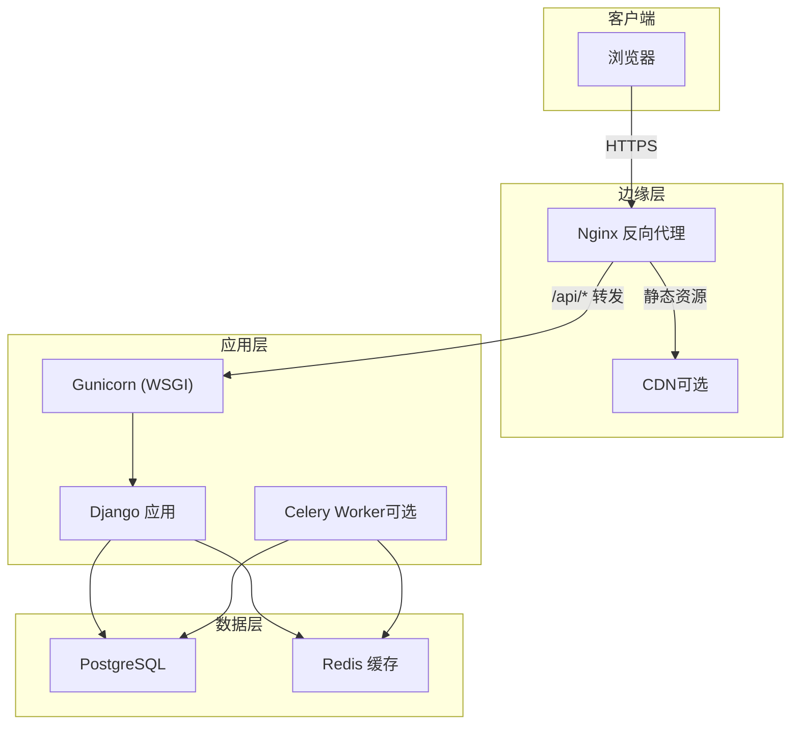
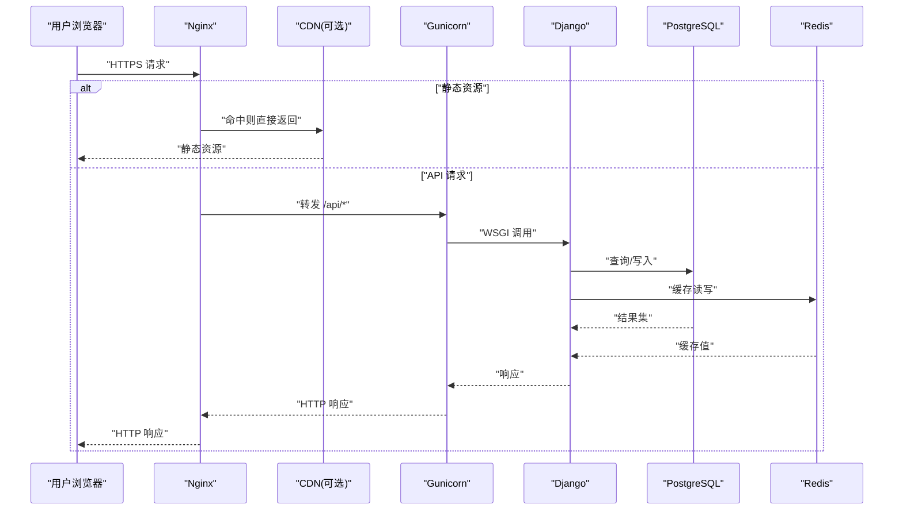
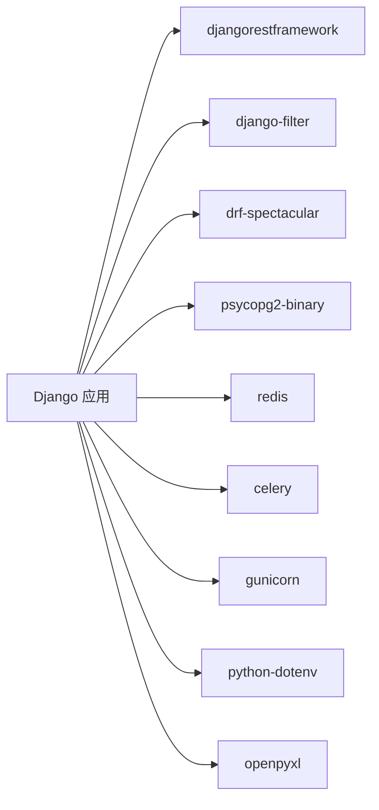

# 生产环境部署

<cite>
**本文引用的文件**   
- [backend/config/settings.py](file://backend/config/settings.py)
- [backend/config/wsgi.py](file://backend/config/wsgi.py)
- [backend/docker-compose.yml](file://backend/docker-compose.yml)
- [backend/Dockerfile](file://backend/Dockerfile)
- [backend/requirements.txt](file://backend/requirements.txt)
- [frontend/package.json](file://frontend/package.json)
- [frontend/vite.config.ts](file://frontend/vite.config.ts)
</cite>

## 目录
1. [简介](#简介)
2. [项目结构](#项目结构)
3. [核心组件](#核心组件)
4. [架构总览](#架构总览)
5. [详细组件分析](#详细组件分析)
6. [依赖关系分析](#依赖关系分析)
7. [性能考虑](#性能考虑)
8. [故障排查指南](#故障排查指南)
9. [结论](#结论)
10. [附录](#附录)

## 简介
本指南面向生产环境的 MetaData002 系统，覆盖服务器规格、Nginx 反向代理与静态资源托管、WSGI（Gunicorn/uWSGI）进程与超时配置、PostgreSQL 数据库连接池与索引优化、Redis 缓存、前端构建与 CDN 策略、以及安全加固（防火墙、访问控制、敏感信息加密等）。文档基于仓库中的后端 Django 应用、Docker 编排、前端 Vite 构建与 WSGI 入口进行说明。

## 项目结构
- 后端：Django + DRF，使用 PostgreSQL 作为主库，Redis 作为缓存，Gunicorn 作为 WSGI 服务器，Celery 用于异步任务（已引入依赖）。
- 前端：Vue3 + Vite，开发时通过本地代理转发 /api 到后端；生产环境建议将构建产物交由 Nginx 或 CDN 托管。
- 容器化：提供 Dockerfile 与 docker-compose.yml，便于快速搭建开发/测试环境。

**图表来源** 
- [backend/config/settings.py](file://backend/config/settings.py)
- [backend/config/wsgi.py](file://backend/config/wsgi.py)
- [backend/docker-compose.yml](file://backend/docker-compose.yml)
- [backend/Dockerfile](file://backend/Dockerfile)
- [frontend/vite.config.ts](file://frontend/vite.config.ts)

**章节来源**
- [backend/config/settings.py](file://backend/config/settings.py)
- [backend/config/wsgi.py](file://backend/config/wsgi.py)
- [backend/docker-compose.yml](file://backend/docker-compose.yml)
- [backend/Dockerfile](file://backend/Dockerfile)
- [frontend/vite.config.ts](file://frontend/vite.config.ts)

## 核心组件
- Django 应用：REST API、模型与业务逻辑，依赖 PostgreSQL 与 Redis。
- WSGI 服务：Gunicorn（requirements 中声明），由 wsgi.py 暴露 application。
- 缓存：Redis（settings 中默认使用 django-redis）。
- 数据库：PostgreSQL（settings 中默认引擎为 postgresql）。
- 前端：Vite 构建产物（静态资源），开发期通过 proxy 转发 /api。

**章节来源**
- [backend/requirements.txt](file://backend/requirements.txt)
- [backend/config/settings.py](file://backend/config/settings.py)
- [backend/config/wsgi.py](file://backend/config/wsgi.py)
- [frontend/vite.config.ts](file://frontend/vite.config.ts)

## 架构总览
生产环境推荐拓扑：
- 客户端经 HTTPS 访问 Nginx。
- Nginx 负责：
  - 静态资源（前端构建产物）直接返回或回源至 CDN。
  - /api 路径转发至 Gunicorn。
  - SSL 终止、限流、日志、压缩等。
- Gunicorn 启动多个 worker，处理 Django 请求。
- Django 通过连接池访问 PostgreSQL，并通过 Redis 做缓存/会话/分布式锁等。
- 可选：Celery Worker 执行异步任务（如档案刷新、批量计算等）。

**图表来源** 
- [backend/config/settings.py](file://backend/config/settings.py)
- [backend/config/wsgi.py](file://backend/config/wsgi.py)
- [backend/docker-compose.yml](file://backend/docker-compose.yml)

## 详细组件分析

### 服务器规格与网络建议
- CPU：根据并发与 I/O 特征选择多核实例（建议 4–8 vCPU 起步，按压测调整）。
- 内存：至少 8–16 GB，确保 Django 进程、PostgreSQL、Redis 与操作系统缓存有足够空间。
- 磁盘：SSD 优先，预留充足空间给数据库与日志；开启自动扩容或监控告警。
- 网络：高带宽低延迟内网，数据库与缓存与后端同可用区以降低延迟。
- 进程隔离：建议使用容器或独立主机隔离不同组件（Nginx、应用、数据库、缓存）。

[本节为通用指导，不直接分析具体文件]

### Nginx 反向代理与静态资源托管
- 静态资源：将前端构建产物（dist）放置于 Nginx 可访问目录，启用 gzip/brotli、长期缓存与 ETag。
- API 路由：/api 前缀转发至 Gunicorn 监听地址（如 127.0.0.1:8000）。
- SSL：在 Nginx 层终止 TLS，配置证书与强密码套件，启用 HSTS。
- 负载均衡：多实例 Gunicorn 可通过 upstream 实现轮询或加权。
- 安全头：设置 X-Frame-Options、X-Content-Type-Options、Referrer-Policy 等。

[本节为通用指导，不直接分析具体文件]

### WSGI 服务器（Gunicorn/uWSGI）生产配置要点
- 进程与线程：worker 数通常设为 2×CPU + 1；根据 I/O 类型调整线程数。
- 超时：合理设置超时（如请求超时、工作进程超时），避免长事务阻塞。
- 日志：输出结构化日志，集中收集。
- 健康检查：配合 Nginx 或进程管理器进行健康检查与重启。
- 环境变量：通过环境变量注入敏感配置（密钥、数据库连接等）。

**章节来源**
- [backend/requirements.txt](file://backend/requirements.txt)
- [backend/config/wsgi.py](file://backend/config/wsgi.py)

### Django 应用与中间件
- DEBUG：生产必须关闭。
- ALLOWED_HOSTS：严格限制允许的主机名。
- 安全中间件：启用 SecurityMiddleware、CSRF、X-Frame-Options 等。
- 国际化与时区：统一设置为 zh-hans、Asia/Shanghai。
- 静态文件：生产建议由 Nginx/CDN 托管，Django 仅生成路径。

**章节来源**
- [backend/config/settings.py](file://backend/config/settings.py)

### 数据库（PostgreSQL）生产配置
- 连接池：使用连接池（如 PgBouncer）减少连接开销；或在 Django 侧合理设置连接参数。
- 索引优化：对高频查询字段建立合适索引，定期分析统计信息。
- 备份策略：全量+增量备份，保留多份副本，定期演练恢复。
- 权限最小化：应用账户仅授予必要权限。
- 监控：慢查询、锁等待、连接数、IO 指标监控。

**章节来源**
- [backend/config/settings.py](file://backend/config/settings.py)

### 缓存（Redis）生产配置
- 持久化：开启 AOF/RDB 策略，结合快照与追加日志。
- 内存与淘汰：设置最大内存与淘汰策略（如 allkeys-lru）。
- 安全：绑定内网 IP、设置密码、禁用危险命令。
- 监控：命中率、内存使用、延迟。

**章节来源**
- [backend/config/settings.py](file://backend/config/settings.py)

### 前端构建与 CDN 策略
- 构建：使用 Vite 构建生产包，输出静态资源。
- 代理：开发期通过 vite.config.ts 的 proxy 将 /api 转发到后端。
- CDN：将静态资源上传至 CDN，启用缓存版本化与预取。
- 缓存策略：文件名哈希、长期缓存、按需更新。

**章节来源**
- [frontend/vite.config.ts](file://frontend/vite.config.ts)
- [frontend/package.json](file://frontend/package.json)

### 容器化与编排（参考）
- Dockerfile：基础镜像、系统依赖、Python 依赖安装。
- docker-compose：PostgreSQL、Redis、后端服务编排与健康检查。
- 生产建议：分离数据库与缓存为独立服务，使用外部存储与网络。

**章节来源**
- [backend/Dockerfile](file://backend/Dockerfile)
- [backend/docker-compose.yml](file://backend/docker-compose.yml)

## 依赖关系分析
- 后端依赖：Django、DRF、django-filter、drf-spectacular、psycopg2-binary、redis、celery、gunicorn、python-dotenv、openpyxl。
- 运行时：PostgreSQL、Redis、Gunicorn。
- 前端依赖：Vue3、Ant Design Vue、Axios、Pinia、Vite 等。

**图表来源** 
- [backend/requirements.txt](file://backend/requirements.txt)

**章节来源**
- [backend/requirements.txt](file://backend/requirements.txt)

## 性能考虑
- 数据库：连接池、索引、查询优化、读写分离（必要时）、分区表。
- 缓存：热点数据缓存、分页与懒加载、避免大对象缓存。
- 应用：异步任务（Celery）分担耗时操作，合理设置超时与重试。
- 静态资源：CDN、压缩、合并与分包、HTTP/2。
- 监控：APM、日志聚合、错误率与延迟告警。

[本节为通用指导，不直接分析具体文件]

## 故障排查指南
- 常见问题：
  - 数据库连接失败：检查主机、端口、用户名、密码与网络连通性。
  - Redis 不可用：检查地址、端口、密码与内存上限。
  - 静态资源 404：确认构建产物路径与 Nginx 配置一致。
  - 跨域问题：生产应通过同源或正确 CORS 策略解决。
- 定位方法：
  - 查看应用日志与错误堆栈。
  - 检查 Nginx 访问/错误日志。
  - 数据库慢查询与锁等待。
  - Redis 命中率与内存使用。

**章节来源**
- [backend/config/settings.py](file://backend/config/settings.py)
- [backend/docker-compose.yml](file://backend/docker-compose.yml)

## 结论
生产环境应以“稳定、安全、可观测”为核心目标。通过 Nginx 统一入口与静态资源托管、Gunicorn 多进程 WSGI、PostgreSQL 连接池与索引优化、Redis 缓存与持久化、以及完善的监控与备份策略，确保 MetaData002 在高负载下稳定运行。

[本节为总结性内容，不直接分析具体文件]

## 附录

### 环境变量清单（示例）
- DJANGO_SECRET_KEY：Django 密钥（必填）。
- DEBUG：生产设为 0。
- ALLOWED_HOSTS：允许的主机列表。
- DB_NAME/DB_USER/DB_PASSWORD/DB_HOST/DB_PORT：数据库连接。
- REDIS_HOST/REDIS_PORT：缓存连接。
- AI_API_BASE/AI_API_KEY/AI_MODEL/AI_TIMEOUT：AI 接口配置（可选）。
- ARCHIVE_AUTO_REFRESH_MINUTES：档案自动刷新间隔（分钟）。

**章节来源**
- [backend/config/settings.py](file://backend/config/settings.py)

### 关键配置文件路径
- Django 配置：backend/config/settings.py
- WSGI 入口：backend/config/wsgi.py
- 依赖清单：backend/requirements.txt
- 前端构建脚本：frontend/package.json
- 前端代理配置：frontend/vite.config.ts
- 容器镜像：backend/Dockerfile
- 容器编排：backend/docker-compose.yml

**章节来源**
- [backend/config/settings.py](file://backend/config/settings.py)
- [backend/config/wsgi.py](file://backend/config/wsgi.py)
- [backend/requirements.txt](file://backend/requirements.txt)
- [frontend/package.json](file://frontend/package.json)
- [frontend/vite.config.ts](file://frontend/vite.config.ts)
- [backend/Dockerfile](file://backend/Dockerfile)
- [backend/docker-compose.yml](file://backend/docker-compose.yml)