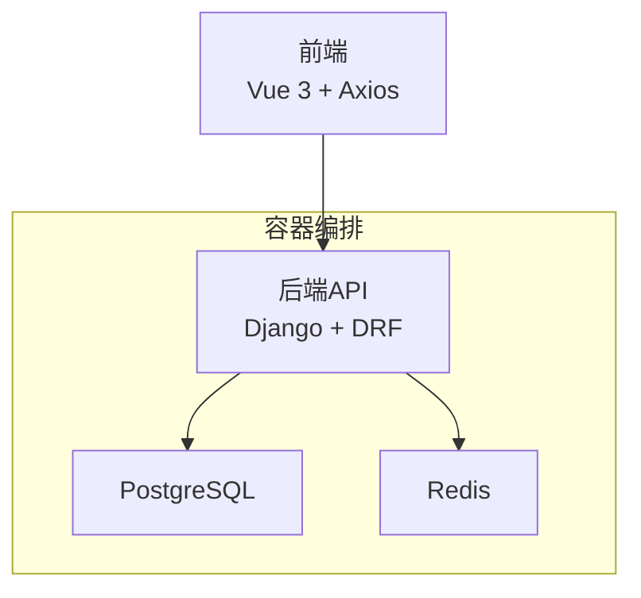
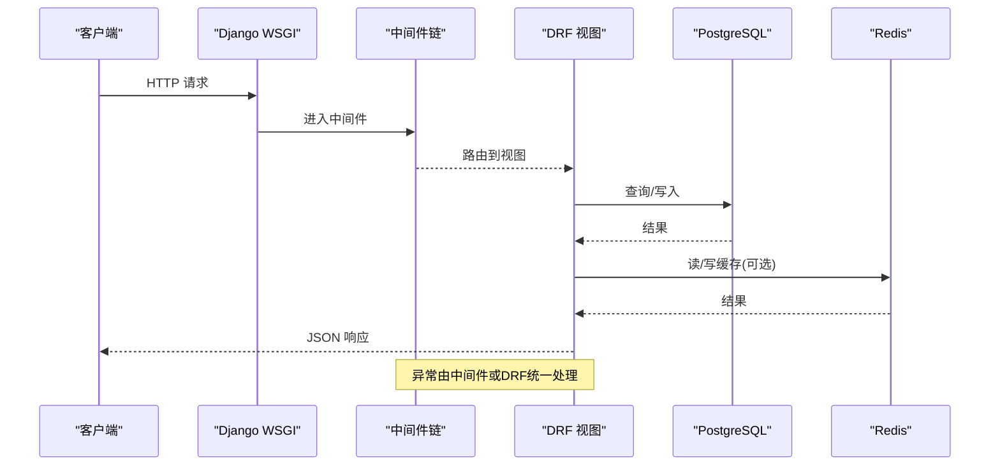
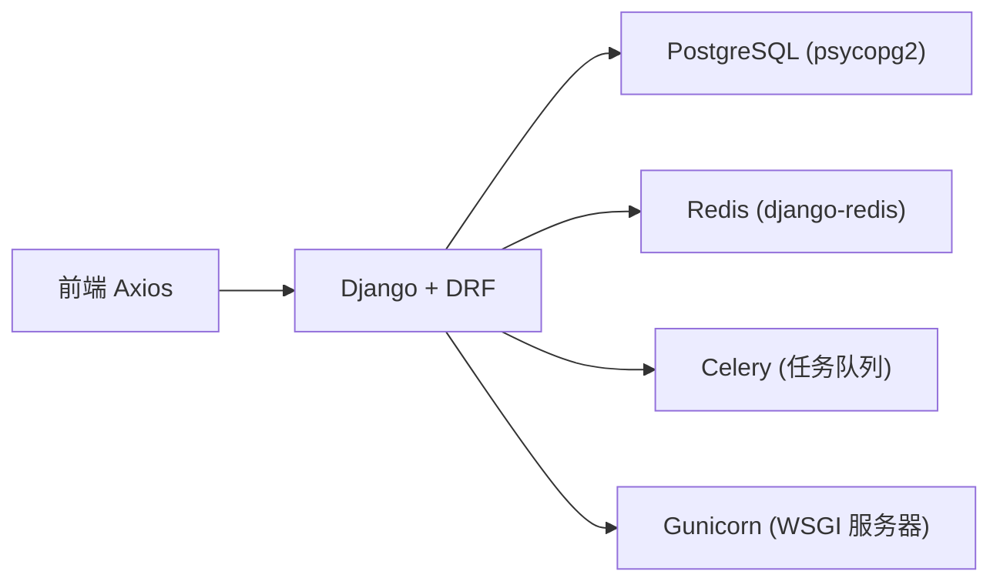

# 监控与日志

<cite>
**本文引用的文件**   
- [backend/config/settings.py](file://backend/config/settings.py)
- [backend/config/urls.py](file://backend/config/urls.py)
- [backend/docker-compose.yml](file://backend/docker-compose.yml)
- [backend/Dockerfile](file://backend/Dockerfile)
- [backend/requirements.txt](file://backend/requirements.txt)
- [backend/apps/modeling/views.py](file://backend/apps/modeling/views.py)
- [backend/apps/archive/views.py](file://backend/apps/archive/views.py)
- [frontend/src/api/index.ts](file://frontend/src/api/index.ts)
- [frontend/src/views/modeling/DomainList.vue](file://frontend/src/views/modeling/DomainList.vue)
- [error_output.html](file://error_output.html)
</cite>

## 目录
1. [简介](#简介)
2. [项目结构](#项目结构)
3. [核心组件](#核心组件)
4. [架构总览](#架构总览)
5. [详细组件分析](#详细组件分析)
6. [依赖关系分析](#依赖关系分析)
7. [性能考虑](#性能考虑)
8. [故障排查指南](#故障排查指南)
9. [结论](#结论)
10. [附录](#附录)

## 简介
本文件为 MetaData002 系统的“监控与日志”专项文档，覆盖应用监控方案、关键指标采集与告警规则、结构化日志规范与轮转策略、分布式追踪配置、健康检查端点与服务状态监控、Grafana 仪表板设计建议，以及 ELK Stack/云原生日志服务的使用指引。内容基于仓库现有代码与配置进行梳理，并给出可落地的实施建议。

## 项目结构
后端采用 Django + DRF，使用 PostgreSQL 作为主数据库、Redis 作为缓存；前端使用 Vue 3 + TypeScript，通过 Axios 访问 /api 前缀的 REST 接口。部署层面提供 Dockerfile 与 docker-compose，包含 db、redis、backend 三个服务，且具备基础的健康检查。

图表来源 
- [backend/config/urls.py:1-9](file://backend/config/urls.py#L1-L9)
- [backend/docker-compose.yml:1-57](file://backend/docker-compose.yml#L1-L57)

章节来源
- [backend/config/settings.py:1-123](file://backend/config/settings.py#L1-L123)
- [backend/config/urls.py:1-9](file://backend/config/urls.py#L1-L9)
- [backend/docker-compose.yml:1-57](file://backend/docker-compose.yml#L1-L57)

## 核心组件
- 应用运行时：Django 应用（WSGI）、DRF 视图集、中间件链
- 数据层：PostgreSQL（默认库）、动态数据源连接测试
- 缓存层：Redis（django-redis）
- 前端请求：Axios 实例与响应拦截器
- 部署与运行：Dockerfile、docker-compose（含健康检查）

章节来源
- [backend/config/settings.py:26-34](file://backend/config/settings.py#L26-L34)
- [backend/config/settings.py:56-74](file://backend/config/settings.py#L56-L74)
- [backend/apps/modeling/views.py:74-146](file://backend/apps/modeling/views.py#L74-L146)
- [frontend/src/api/index.ts:1-21](file://frontend/src/api/index.ts#L1-L21)
- [backend/docker-compose.yml:16-30](file://backend/docker-compose.yml#L16-L30)

## 架构总览
下图展示一次典型 API 请求在系统中的流转路径，包括中间件、视图、数据库与缓存交互，以及错误处理与返回。

图表来源 
- [backend/config/settings.py:26-34](file://backend/config/settings.py#L26-L34)
- [backend/config/urls.py:1-9](file://backend/config/urls.py#L1-L9)
- [backend/apps/modeling/views.py:74-146](file://backend/apps/modeling/views.py#L74-L146)

## 详细组件分析

### 应用监控方案与关键指标
- 请求量与响应时间
  - 建议在中间件层统计每个请求的开始/结束时间，计算耗时并输出结构化日志；同时暴露一个轻量级指标收集端点（如 /metrics），聚合 QPS、P50/P95/P99 延迟、错误率等。
  - 当前未内置指标导出，可在中间件或 DRF 自定义包装器中实现。
- 错误率
  - 前端 Axios 响应拦截器已对错误进行统一封装，便于前端上报；后端建议统一异常处理器记录 4xx/5xx 并分类统计。
- 数据库性能
  - 通过慢查询日志、连接池参数、CONN_MAX_AGE、CONN_HEALTH_CHECKS 等优化；可使用 EXPLAIN ANALYZE 定位热点 SQL。
- 缓存命中率
  - Redis 命中/未命中计数、键空间大小、内存使用率等指标需纳入监控。
- 进程与系统资源
  - CPU、内存、GC、线程/进程数、磁盘 I/O、网络 IO 等。

章节来源
- [frontend/src/api/index.ts:9-19](file://frontend/src/api/index.ts#L9-L19)
- [backend/config/settings.py:56-74](file://backend/config/settings.py#L56-L74)

### 告警规则配置建议
- 可用性类
  - 服务不可用（HTTP 5xx 比例 > 阈值，持续 N 分钟）
  - 健康检查失败（db/redis/backend 健康检查连续失败）
- 性能类
  - P95 响应时间超过阈值（如 > 2s）
  - 数据库慢查询数量突增
  - Redis 内存使用率 > 80%
- 业务类
  - 档案刷新失败次数突增
  - 域配置完整性检查失败项增多（P0 失败）

[本节为通用建议，不直接分析具体文件]

### 日志收集与分析方案
- 结构化日志格式
  - 建议统一 JSON 格式，包含字段：timestamp、level、service、trace_id、method、path、status_code、duration_ms、message、extra（上下文）。
  - 在中间件或 DRF 包装器中注入 trace_id，贯穿请求链路。
- 日志级别管理
  - DEBUG/INFO/WARN/ERROR 分级；生产环境默认 INFO，按需开启 DEBUG。
- 日志轮转策略
  - 按文件大小与时间轮转（如 50MB/天，保留 14 天），避免单文件过大。
- 采集与存储
  - 本地文件输出后由 Filebeat/Fluent Bit 采集至 Elasticsearch/云日志服务；或使用云原生日志服务直接采集 stdout/stderr。
- 可视化与检索
  - Kibana/云日志控制台建立索引模式，常用查询：按 service、trace_id、level、path、status_code 过滤。

[本节为通用建议，不直接分析具体文件]

### 分布式追踪配置
- 链路标识
  - 为每个请求生成唯一 trace_id，并在日志中输出；跨服务传递（如通过 HTTP Header）。
- 采样策略
  - 全量或按比例采样（如 10%），降低开销。
- 工具选型
  - OpenTelemetry SDK + Jaeger/Zipkin；或在云原生环境中使用平台提供的 APM。

[本节为通用建议，不直接分析具体文件]

### 健康检查端点与服务状态监控
- 服务健康检查
  - docker-compose 已为 db、redis 定义 healthcheck；backend 可通过 /health 或 /ready 暴露自身状态（数据库连通性、缓存连通性等）。
- 依赖健康检查
  - 后端启动时校验 DB/Redis 连通性，失败则快速失败或降级。
- 就绪探针
  - 在容器编排层增加 readiness/liveness 探针，确保流量仅路由到可用实例。

章节来源
- [backend/docker-compose.yml:16-30](file://backend/docker-compose.yml#L16-L30)

### 监控仪表板（Grafana）设计建议
- 面板建议
  - 请求总量与 QPS（按 path 维度）
  - 响应时间分位数（P50/P95/P99）
  - 错误率（按 status_code 分组）
  - 数据库连接数、慢查询数、事务时长
  - Redis 命中率、内存、键数量
  - 进程 CPU/内存、GC 停顿
- 数据来源
  - Prometheus（应用指标）+ Node Exporter（主机）+ Postgres Exporter + Redis Exporter
- 告警联动
  - Grafana Alertmanager 对接通知渠道（邮件、企业微信、钉钉等）

[本节为通用建议，不直接分析具体文件]

### 日志查询与分析工具（ELK/云原生）
- 采集
  - Filebeat/Fluent Bit 采集容器 stdout/stderr 或本地日志文件
- 存储
  - Elasticsearch 集群，合理设置索引生命周期（ILM）
- 分析
  - Kibana 构建仪表盘、告警、报表
- 云原生替代
  - 阿里云 SLS、腾讯云 CLS、AWS CloudWatch Logs 等

[本节为通用建议，不直接分析具体文件]

## 依赖关系分析
后端依赖 Django、DRF、psycopg2-binary、redis、celery、gunicorn 等；前端依赖 axios 发起 API 请求。

图表来源 
- [backend/requirements.txt:1-11](file://backend/requirements.txt#L1-L11)
- [backend/config/settings.py:56-74](file://backend/config/settings.py#L56-L74)

章节来源
- [backend/requirements.txt:1-11](file://backend/requirements.txt#L1-L11)
- [backend/config/settings.py:56-74](file://backend/config/settings.py#L56-L74)

## 性能考虑
- 数据库
  - 合理使用索引、分页、批量操作；避免 N+1 查询；必要时引入物化视图或缓存。
- 缓存
  - 热点数据入缓存，设置合理过期时间；注意缓存穿透/雪崩防护。
- 异步任务
  - 将耗时操作（如档案刷新、计算字段重算）放入 Celery 异步执行，提升吞吐。
- 连接池与超时
  - 调整 ConnMaxAge、超时参数，避免连接泄漏与长事务。
- 前端
  - 合理设置 Axios 超时与重试策略；避免频繁短轮询。

[本节为通用建议，不直接分析具体文件]

## 故障排查指南
- 常见错误定位
  - 查看 error_output.html 中的堆栈信息，结合 trace_id 定位请求。
  - 关注数据库连接失败、权限不足、SQL 语法错误等。
- 日志排查步骤
  - 根据 trace_id 拉取完整链路日志；检查中间件、视图、数据库、缓存各阶段日志。
  - 区分 WARN/ERROR 日志，优先处理 ERROR。
- 健康检查
  - 确认 db/redis 健康检查是否通过；若失败，检查端口、认证、网络连通性。
- 性能瓶颈
  - 使用 EXPLAIN ANALYZE 分析慢查询；观察 Redis 大键与热点键。

章节来源
- [error_output.html:198-541](file://error_output.html#L198-L541)
- [backend/docker-compose.yml:16-30](file://backend/docker-compose.yml#L16-L30)

## 结论
MetaData002 当前具备基础的运行时与依赖健康检查能力，但尚未内置统一的监控与日志体系。建议尽快落地结构化日志、指标采集、分布式追踪与健康检查端点，并结合 Prometheus/Grafana 与 ELK/云日志服务构建完整的可观测性体系，以提升稳定性与排障效率。

[本节为总结性内容，不直接分析具体文件]

## 附录
- 环境变量与配置要点
  - DJANGO_SECRET_KEY、DEBUG、ALLOWED_HOSTS
  - DB_*、REDIS_*
  - AI_API_BASE、AI_API_KEY、AI_MODEL、AI_TIMEOUT
- 部署相关
  - Dockerfile 构建镜像，docker-compose 编排服务
- 前端错误处理
  - Axios 响应拦截器统一封装错误，便于前端上报与展示

章节来源
- [backend/config/settings.py:1-123](file://backend/config/settings.py#L1-L123)
- [backend/Dockerfile:1-20](file://backend/Dockerfile#L1-L20)
- [backend/docker-compose.yml:32-54](file://backend/docker-compose.yml#L32-L54)
- [frontend/src/api/index.ts:1-21](file://frontend/src/api/index.ts#L1-L21)