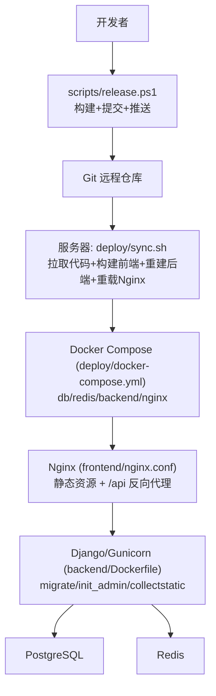
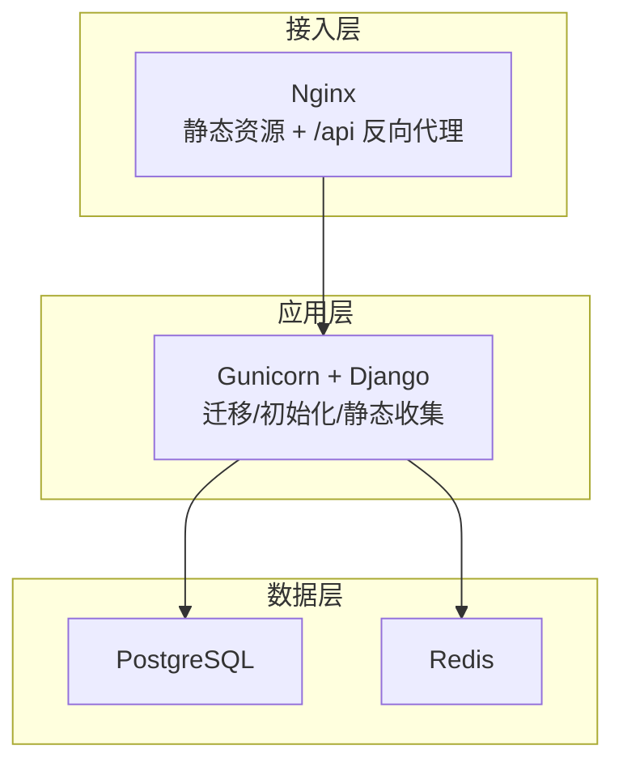
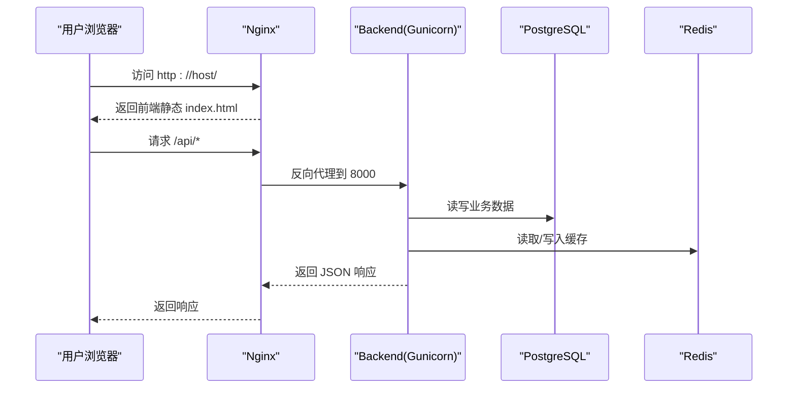
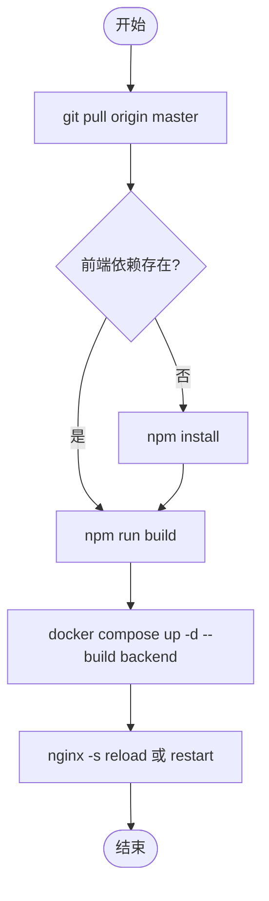
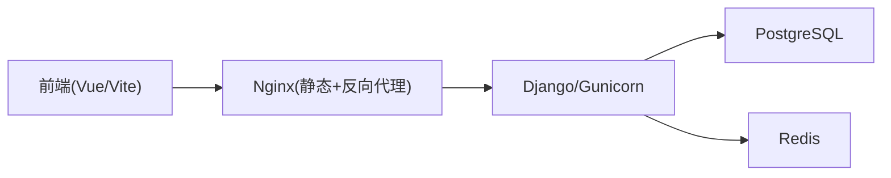

# 部署自动化

<cite>
**本文引用的文件**
- [deploy/docker-compose.yml](file://deploy/docker-compose.yml)
- [deploy/sync.sh](file://deploy/sync.sh)
- [backend/Dockerfile](file://backend/Dockerfile)
- [backend/docker-compose.yml](file://backend/docker-compose.yml)
- [frontend/nginx.conf](file://frontend/nginx.conf)
- [scripts/dev.ps1](file://scripts/dev.ps1)
- [scripts/release.ps1](file://scripts/release.ps1)
- [scripts/check-all.ps1](file://scripts/check-all.ps1)
- [backend/config/settings.py](file://backend/config/settings.py)
- [backend/requirements.txt](file://backend/requirements.txt)
- [frontend/package.json](file://frontend/package.json)
</cite>

## 目录
1. [简介](#简介)
2. [项目结构](#项目结构)
3. [核心组件](#核心组件)
4. [架构总览](#架构总览)
5. [详细组件分析](#详细组件分析)
6. [依赖关系分析](#依赖关系分析)
7. [性能考量](#性能考量)
8. [故障排查指南](#故障排查指南)
9. [结论](#结论)
10. [附录](#附录)

## 简介
本仓库提供主数据管理系统的端到端部署自动化方案，覆盖开发、构建、发布与生产部署全流程。通过 Docker Compose 编排数据库、缓存、后端与前端，配合 Nginx 反向代理与静态资源服务；提供一键同步脚本实现服务器端增量更新与滚动重启；同时提供本地开发启动、质量检查与发布流水线脚本，确保从代码到上线的一致性与可追溯性。

## 项目结构
- 部署编排：生产环境使用 deploy/docker-compose.yml 统一拉起 PostgreSQL、Redis、Django 后端与 Nginx 前端。
- 容器镜像：backend/Dockerfile 定义 Python 运行环境与依赖安装；生产命令由 compose 覆盖为迁移+初始化+收集静态+Gunicorn 启动。
- 前端服务：Nginx 配置 frontend/nginx.conf 负责静态资源、API 反向代理与 SPA 路由回退。
- 本地开发：scripts/dev.ps1 在 Windows 下启动前后端并管理进程与日志。
- 发布流程：scripts/release.ps1 执行前端构建、提交与推送；服务器侧通过 deploy/sync.sh 拉取最新代码、构建前端、重建后端并重载 Nginx。
- 质量门禁：scripts/check-all.ps1 统一执行后端 Django check/test 与前端 TypeScript/build 检查。

**图表来源**
- [deploy/docker-compose.yml:6-87](file://deploy/docker-compose.yml#L6-L87)
- [deploy/sync.sh:10-51](file://deploy/sync.sh#L10-L51)
- [backend/Dockerfile:1-24](file://backend/Dockerfile#L1-L24)
- [frontend/nginx.conf:1-51](file://frontend/nginx.conf#L1-L51)

**章节来源**
- [deploy/docker-compose.yml:1-87](file://deploy/docker-compose.yml#L1-L87)
- [deploy/sync.sh:1-51](file://deploy/sync.sh#L1-L51)
- [backend/Dockerfile:1-24](file://backend/Dockerfile#L1-L24)
- [frontend/nginx.conf:1-51](file://frontend/nginx.conf#L1-L51)

## 核心组件
- 数据库与缓存：PostgreSQL 持久化业务数据；Redis 作为缓存与会话存储。
- 后端服务：Django + DRF + Gunicorn，自动执行数据库迁移、管理员初始化、静态文件收集后对外提供服务。
- 前端服务：Vue 应用经 Vite 构建为静态资源，由 Nginx 托管并通过 /api 反向代理至后端。
- 部署编排：Docker Compose 管理服务生命周期与健康检查，保证启动顺序与依赖就绪。
- 自动化脚本：
  - 开发：scripts/dev.ps1 一键启停前后端，记录日志与进程 PID。
  - 发布：scripts/release.ps1 构建前端、提交并推送；服务器端通过 deploy/sync.sh 完成增量更新与滚动重启。
  - 质量：scripts/check-all.ps1 统一执行后端检查测试与前端类型/构建校验。

**章节来源**
- [backend/config/settings.py:58-76](file://backend/config/settings.py#L58-L76)
- [backend/config/settings.py:94-112](file://backend/config/settings.py#L94-L112)
- [backend/requirements.txt:1-12](file://backend/requirements.txt#L1-L12)
- [frontend/package.json:6-10](file://frontend/package.json#L6-L10)
- [scripts/dev.ps1:48-95](file://scripts/dev.ps1#L48-L95)
- [scripts/release.ps1:29-69](file://scripts/release.ps1#L29-L69)
- [scripts/check-all.ps1:42-76](file://scripts/check-all.ps1#L42-L76)

## 架构总览
生产环境采用四层架构：
- 接入层：Nginx 提供静态资源与 API 反向代理，启用 gzip、长连接超时与缓存策略。
- 应用层：Django/Gunicorn 处理业务逻辑，按环境变量配置数据库与缓存。
- 数据层：PostgreSQL 存储结构化数据；Redis 提供缓存能力。
- 编排层：Docker Compose 管理服务健康检查、启动顺序与卷挂载。

**图表来源**
- [frontend/nginx.conf:17-29](file://frontend/nginx.conf#L17-L29)
- [deploy/docker-compose.yml:37-67](file://deploy/docker-compose.yml#L37-L67)
- [backend/config/settings.py:58-76](file://backend/config/settings.py#L58-L76)

## 详细组件分析

### 生产部署编排（Docker Compose）
- 服务依赖与健康检查：db 与 redis 先就绪，再启动 backend；nginx 依赖 backend。
- 后端启动链：迁移 -> 加载初始数据 -> 初始化管理员 -> 收集静态 -> Gunicorn 监听 8000。
- 卷共享：postgres_data 持久化数据库；static_volume 共享 Django 静态文件给 Nginx。
- 端口映射：db 5432、redis 6379、backend 8000、nginx 80。

**图表来源**
- [deploy/docker-compose.yml:6-87](file://deploy/docker-compose.yml#L6-L87)
- [frontend/nginx.conf:17-29](file://frontend/nginx.conf#L17-L29)
- [backend/config/settings.py:58-76](file://backend/config/settings.py#L58-L76)

**章节来源**
- [deploy/docker-compose.yml:6-87](file://deploy/docker-compose.yml#L6-L87)

### 服务器一键同步（sync.sh）
- 步骤：git pull -> npm build -> docker compose up --build backend -> nginx reload。
- 失败即中止（set -e），避免半同步状态。
- 兼容 docker compose 与 docker-compose 命令。

**图表来源**
- [deploy/sync.sh:10-51](file://deploy/sync.sh#L10-L51)

**章节来源**
- [deploy/sync.sh:1-51](file://deploy/sync.sh#L1-L51)

### 后端镜像与启动（Dockerfile）
- 基础镜像：python:3.12-slim，安装 gcc 与 libpq-dev。
- 依赖安装：pip install -r requirements.txt。
- 默认 CMD：gunicorn 监听 8000；生产通过 compose command 覆盖为完整启动链。

**章节来源**
- [backend/Dockerfile:1-24](file://backend/Dockerfile#L1-L24)
- [backend/requirements.txt:1-12](file://backend/requirements.txt#L1-L12)

### 前端 Nginx 配置
- 静态资源根目录：/usr/share/nginx/html。
- API 反向代理：/api -> backend:8000，设置超时与缓冲关闭以支持长连接。
- Admin/DRF 静态资源：/static/admin/ 与 /static/rest_framework/ 指向共享卷。
- SPA 路由回退：未知路径返回 index.html。
- 静态资源缓存：js/css/img 等设置 7 天不可变缓存。

**章节来源**
- [frontend/nginx.conf:1-51](file://frontend/nginx.conf#L1-L51)

### 本地开发脚本（dev.ps1）
- 功能：start/stop/status 管理前后端进程，输出日志到 output/logs。
- 幂等：检测端口占用跳过重复启动；停止时清理 PID 与端口占用进程。
- 后端：调用 backend/manage.py runserver 8000；前端：npm run dev 3000。

**章节来源**
- [scripts/dev.ps1:1-128](file://scripts/dev.ps1#L1-L128)

### 发布脚本（release.ps1）
- 前置检查：无变更直接退出。
- 构建前端：vue-tsc + vite build，失败中止且不提交。
- 提交与推送：git add/commit/push origin master；成功后提示服务器执行 sync.sh。

**章节来源**
- [scripts/release.ps1:1-69](file://scripts/release.ps1#L1-L69)

### 质量检查（check-all.ps1）
- 后端：Django check 与指定 app 的 tests。
- 前端：TypeScript 检查与 production 构建验证。
- 汇总：统计通过/失败/跳过数量，非零退出码表示有失败。

**章节来源**
- [scripts/check-all.ps1:1-90](file://scripts/check-all.ps1#L1-L90)

## 依赖关系分析
- 运行时依赖：
  - 后端：Django、DRF、django-filter、drf-spectacular、psycopg2-binary、redis、celery、gunicorn、python-dotenv、openpyxl。
  - 前端：Vue、Ant Design Vue、Axios、Pinia、Vite、TypeScript。
- 服务依赖：
  - backend 依赖 db 与 redis 健康就绪。
  - nginx 依赖 backend 可用。
- 配置依赖：
  - 数据库与缓存通过环境变量注入；SECRET_KEY、ALLOWED_HOSTS、AI 相关配置均从环境变量读取。

**图表来源**
- [backend/requirements.txt:1-12](file://backend/requirements.txt#L1-L12)
- [frontend/package.json:11-27](file://frontend/package.json#L11-L27)
- [deploy/docker-compose.yml:6-87](file://deploy/docker-compose.yml#L6-L87)
- [backend/config/settings.py:58-76](file://backend/config/settings.py#L58-L76)

**章节来源**
- [backend/requirements.txt:1-12](file://backend/requirements.txt#L1-L12)
- [frontend/package.json:1-29](file://frontend/package.json#L1-L29)
- [backend/config/settings.py:1-134](file://backend/config/settings.py#L1-L134)

## 性能考量
- Nginx 开启 gzip 压缩，减少传输体积；对静态资源设置长期缓存提升加载速度。
- 反向代理设置合理的 read/connect timeout，并关闭缓冲以支持后端主动刷新等长连接场景。
- Gunicorn workers 数与超时时间在生产 compose 中已配置，可根据 CPU 核数与请求耗时调优。
- Redis 用于缓存热点数据，降低数据库压力；注意缓存键设计与失效策略。
- 数据库健康检查与依赖启动顺序保障服务可用性，避免冷启动抖动。

[本节为通用性能建议，不直接分析具体文件]

## 故障排查指南
- 服务未启动或端口占用：
  - 使用 scripts/dev.ps1 status 查看本地开发状态；stop 清理残留进程与端口。
  - 生产环境使用 docker compose ps/logs 检查各服务状态。
- 数据库/缓存不可用：
  - 确认 db/redis 健康检查通过；检查环境变量 DB_HOST/DB_PORT/REDIS_HOST/REDIS_PORT。
  - 若迁移失败，检查数据库权限与版本兼容性。
- 前端无法访问或 404：
  - 确认 dist 已构建并挂载到 /usr/share/nginx/html；检查 nginx 配置中的 root 与 try_files。
  - 静态资源路径 /static/admin/ 与 /static/rest_framework/ 需正确映射到 static_volume。
- API 请求失败：
  - 检查 Nginx 反向代理 /api 是否转发到 backend:8000；查看后端日志定位错误。
  - 认证问题：确认 Token/Session 配置与环境变量 SECRET_KEY 正确。
- 发布后未生效：
  - 确认服务器执行了 bash /opt/metadata/deploy/sync.sh；必要时手动 docker compose exec nginx nginx -s reload。

**章节来源**
- [scripts/dev.ps1:97-128](file://scripts/dev.ps1#L97-L128)
- [deploy/docker-compose.yml:18-35](file://deploy/docker-compose.yml#L18-L35)
- [frontend/nginx.conf:8-51](file://frontend/nginx.conf#L8-L51)
- [backend/config/settings.py:6-8](file://backend/config/settings.py#L6-L8)

## 结论
本项目通过标准化的容器编排与脚本化工具链，实现了从本地开发到生产部署的全链路自动化。关键优势包括：
- 一致的运行环境：Docker 镜像与 Compose 编排消除环境差异。
- 安全的发布流程：前端构建先行、提交前质量门禁、服务器端原子化同步。
- 可观测与可维护：健康检查、日志集中、Nginx 缓存与超时策略完善。
建议在持续集成中引入 check-all 与 release 流程，结合 Git hooks 强化质量与合规。

[本节为总结性内容，不直接分析具体文件]

## 附录
- 常用命令
  - 本地开发：scripts/dev.ps1 start/stop/status
  - 质量检查：scripts/check-all.ps1
  - 本地发布：scripts/release.ps1 [-m "message"]
  - 生产部署：docker compose up -d / down / logs -f
  - 服务器同步：bash /opt/metadata/deploy/sync.sh

[本节为操作指引，不直接分析具体文件]