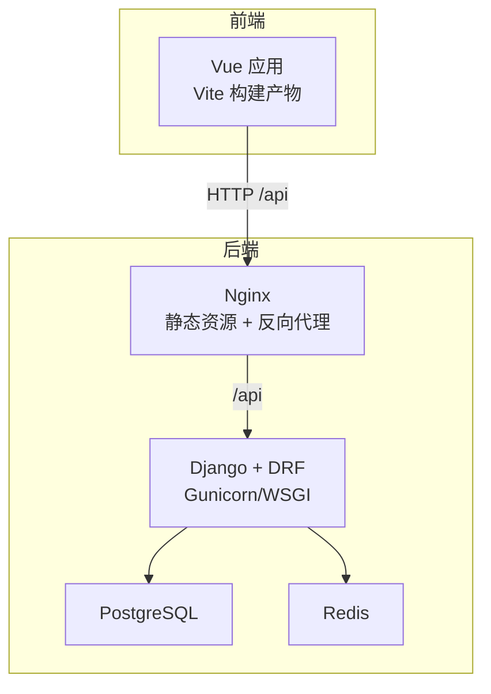
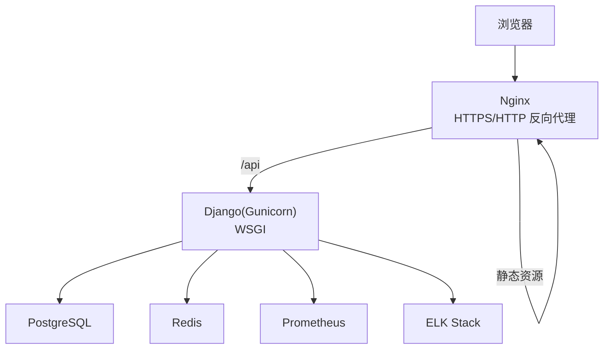
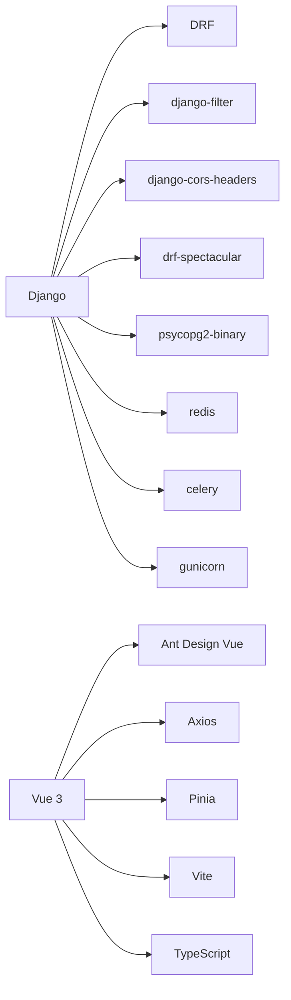

# 部署配置

<cite>
**本文引用的文件**
- [deploy/docker-compose.yml](file://deploy/docker-compose.yml)
- [backend/docker-compose.yml](file://backend/docker-compose.yml)
- [backend/Dockerfile](file://backend/Dockerfile)
- [backend/config/settings.py](file://backend/config/settings.py)
- [backend/requirements.txt](file://backend/requirements.txt)
- [frontend/nginx.conf](file://frontend/nginx.conf)
</cite>

## 更新摘要
**变更内容**
- 新增生产环境 Docker Compose 部署指南（deploy/docker-compose.yml），包含 PostgreSQL、Redis、Django 后端与 Nginx 的完整编排
- 补充 Alibaba Cloud Linux 3 环境下的服务器准备、防火墙设置与环境变量配置说明
- 完善 Nginx 反向代理配置，包括静态资源托管、API 路由与 SPA 回退策略
- 增强环境变量与敏感信息管理，明确 .env 文件使用与密钥注入方式
- 增加监控、日志、备份恢复、性能调优与安全加固的生产实践建议

## 目录
1. [简介](#简介)
2. [项目结构](#项目结构)
3. [核心组件](#核心组件)
4. [架构总览](#架构总览)
5. [详细组件分析](#详细组件分析)
6. [依赖关系分析](#依赖关系分析)
7. [性能考虑](#性能考虑)
8. [故障排查指南](#故障排查指南)
9. [结论](#结论)
10. [附录](#附录)

## 简介
本文件为 MetaData002 系统的生产环境部署与运维配置文档，覆盖服务器规格、操作系统与依赖版本、Docker 容器化与编排、环境变量与敏感信息管理、Nginx 反向代理（静态资源托管、API 路由、SSL）、监控与日志收集（Prometheus + ELK）、备份恢复与灾难恢复、性能调优与安全加固等。内容严格基于仓库中的后端 Django 应用、前端 Vue/Vite 工程以及 Docker 相关配置文件进行说明。

## 项目结构
系统由前后端组成：
- 后端：Django + DRF，PostgreSQL 作为持久化存储，Redis 作为缓存，可选 AI 服务（OpenAI 兼容接口）。
- 前端：Vue 3 + Vite，开发时通过 Vite 代理访问后端 API；生产构建后由 Nginx 托管静态资源。
- 容器化：Dockerfile 定义 Python 运行环境与依赖安装；docker-compose 提供本地开发/测试的数据库、缓存与应用编排；deploy/docker-compose.yml 提供生产环境一键启动。

图表来源
- [deploy/docker-compose.yml:6-83](file://deploy/docker-compose.yml#L6-L83)
- [backend/Dockerfile:1-24](file://backend/Dockerfile#L1-L24)
- [frontend/nginx.conf:1-51](file://frontend/nginx.conf#L1-L51)

章节来源
- [deploy/docker-compose.yml:1-87](file://deploy/docker-compose.yml#L1-L87)
- [backend/docker-compose.yml:1-60](file://backend/docker-compose.yml#L1-L60)
- [backend/Dockerfile:1-24](file://backend/Dockerfile#L1-L24)
- [backend/config/settings.py:1-134](file://backend/config/settings.py#L1-L134)
- [frontend/nginx.conf:1-51](file://frontend/nginx.conf#L1-L51)

## 核心组件
- 后端运行时与依赖
  - Python 3.12 基础镜像，安装 gcc、libpq-dev 以编译 psycopg2-binary。
  - 使用 requirements.txt 管理 Django、DRF、django-cors-headers、psycopg2-binary、redis、celery、gunicorn、openpyxl 等依赖。
  - WSGI 入口由 config/wsgi.py 暴露，manage.py 用于命令行操作。
- 配置与数据层
  - settings.py 集中管理数据库、缓存、中间件、REST 框架、Spectacular 文档、AI 服务参数等。
- 前端构建与开发
  - 生产构建产物由 Nginx 托管，支持 Gzip 压缩、静态资源缓存与 SPA 路由回退。

章节来源
- [backend/Dockerfile:1-24](file://backend/Dockerfile#L1-L24)
- [backend/requirements.txt:1-12](file://backend/requirements.txt#L1-L12)
- [backend/config/settings.py:1-134](file://backend/config/settings.py#L1-L134)
- [frontend/nginx.conf:1-51](file://frontend/nginx.conf#L1-L51)

## 架构总览
生产环境推荐架构：
- 客户端浏览器访问 Nginx（HTTPS），Nginx 将静态资源直接返回，并将 /api 请求反向代理至后端 Gunicorn。
- 后端通过 WSGI 启动，连接 PostgreSQL 和 Redis。
- 可选：Celery Worker 处理异步任务（当前依赖已引入，可按需启用）。
- 监控：Prometheus 抓取后端指标（如 DRF/Gunicorn 指标），ELK（Elasticsearch + Logstash + Kibana）统一收集应用与系统日志。

[本图为概念性架构图，不直接映射具体源码文件]

## 详细组件分析

### 生产环境 Docker Compose 部署（Alibaba Cloud Linux 3）
- 服务组成
  - db：PostgreSQL 15，健康检查使用 pg_isready，数据持久化到 postgres_data 卷
  - redis：Redis 7 Alpine，健康检查使用 redis-cli ping
  - backend：构建自 ../backend，执行 migrate、loaddata、init_admin、collectstatic 并启动 gunicorn（4 workers，超时 120s）
  - nginx：nginx:alpine，挂载 frontend/dist 与 nginx.conf，共享 static_volume 提供 admin/rest_framework 静态资源
- 端口映射
  - db: 127.0.0.1:5432
  - redis: 127.0.0.1:6379
  - backend: 127.0.0.1:8000
  - nginx: 80
- 启动命令
  - 部署：docker compose up -d
  - 停止：docker compose down
  - 日志：docker compose logs -f
- 环境变量
  - 通过 env_file: .env 注入敏感配置（DB_*、REDIS_*、DJANGO_SECRET_KEY、AI_* 等）
  - 内部服务发现：DB_HOST=db、REDIS_HOST=redis（由 Compose 自动解析）

章节来源
- [deploy/docker-compose.yml:1-87](file://deploy/docker-compose.yml#L1-L87)

### 服务器准备与环境要求（Alibaba Cloud Linux 3）
- 操作系统：Alibaba Cloud Linux 3（基于 CentOS/RHEL 生态）
- 必需软件
  - Docker CE（建议使用官方源或阿里云镜像加速）
  - Node.js v20.x（用于前端构建，生产环境仅需构建产物）
  - Git（代码拉取）
- 防火墙设置
  - 开放端口：80（Nginx）、5432/6379/8000（仅内网或特定 IP 访问）
  - 使用 firewalld 或 iptables 放行入站规则，避免公网暴露数据库与缓存端口
- 磁盘与内存建议
  - PostgreSQL 数据盘：至少 20GB（根据数据量扩展）
  - 内存：后端 2GB+，数据库 2GB+，Nginx 512MB+

[本节为通用环境准备指导，不直接映射具体源码文件]

### 环境变量与敏感信息管理
- 数据库连接
  - DB_HOST、DB_PORT、DB_NAME、DB_USER、DB_PASSWORD
  - 默认值在 settings.py 中设置，生产务必通过环境变量注入
- 缓存
  - REDIS_HOST、REDIS_PORT
- 安全与运行
  - DJANGO_SECRET_KEY（强烈建议生产替换）
  - DEBUG（生产必须关闭）
  - ALLOWED_HOSTS（生产应限制域名或内网 IP）
- AI 服务（OpenAI 兼容）
  - AI_API_BASE、AI_API_KEY、AI_MODEL、AI_TIMEOUT
- 档案刷新
  - ARCHIVE_AUTO_REFRESH_MINUTES（分钟，0 禁用进程内定时刷新）
- 最佳实践
  - 使用 .env 文件管理敏感配置，禁止提交到代码库
  - 在容器编排平台中使用 Secret 注入环境变量
  - 定期轮换密钥与密码

章节来源
- [backend/config/settings.py:6-8](file://backend/config/settings.py#L6-L8)
- [backend/config/settings.py:58-76](file://backend/config/settings.py#L58-L76)
- [backend/config/settings.py:120-127](file://backend/config/settings.py#L120-L127)
- [deploy/docker-compose.yml:54-61](file://deploy/docker-compose.yml#L54-L61)

### Nginx 反向代理与 SSL
- 静态资源：Nginx 直接托管前端构建产物（dist），启用 Gzip 压缩与静态资源缓存
- API 路由：/api 转发至后端 Gunicorn（http://backend:8000）
- Admin 与 DRF 静态文件：通过 alias 指向 shared static_volume
- SPA 回退：所有非文件、非 API 请求返回 index.html
- SSL 建议：使用 Let’s Encrypt 或自有证书，强制 HTTPS 重定向，开启 HSTS
- 生产配置要点
  - server_name 绑定域名
  - location / 指向静态资源根目录
  - location /api/ proxy_pass 到 http://backend:8000
  - 开启 gzip、缓存策略、限流、访问日志、错误日志
  - 配置 HTTPS 监听与证书路径

章节来源
- [frontend/nginx.conf:1-51](file://frontend/nginx.conf#L1-L51)

### 监控与日志收集
- 指标采集（Prometheus）
  - 可暴露后端 HTTP 指标（如 DRF/Gunicorn metrics），Prometheus 定期抓取
- 日志收集（ELK）
  - 应用日志输出到 stdout/stderr 或文件，Logstash/Filebeat 收集并写入 Elasticsearch
  - Kibana 可视化查询与分析
- 健康检查
  - Compose 已对 db、redis 配置健康检查；生产可在 Nginx/网关层增加后端健康探针

章节来源
- [deploy/docker-compose.yml:18-35](file://deploy/docker-compose.yml#L18-L35)

### 备份与恢复策略
- 数据库备份
  - 使用 pg_dump 定期全量/增量备份，保留多份历史快照
  - 备份文件加密存储，异地容灾
- 缓存与状态
  - Redis 数据非关键持久化时可接受丢失；如需持久化，启用 RDB/AOF
- 恢复演练
  - 定期演练恢复流程，验证 RPO/RTO 目标

[本节为通用运维策略，不直接映射具体源码文件]

### 性能调优与安全加固
- 后端
  - 使用 gunicorn 替代 runserver 生产部署，合理 workers 数量（默认 4）
  - 数据库连接池、索引优化、慢查询分析
  - 关闭 DEBUG，限制 ALLOWED_HOSTS，启用安全中间件
- 缓存
  - Redis 分片/集群（按规模），合理过期策略
- 前端
  - 静态资源 CDN、压缩、缓存头
- 安全
  - HTTPS 强制、HSTS、CSP、CSRF、X-Frame-Options
  - 最小权限原则（数据库用户、文件系统权限）
  - 定期依赖漏洞扫描与更新

章节来源
- [backend/config/settings.py:28-36](file://backend/config/settings.py#L28-L36)
- [backend/requirements.txt:1-12](file://backend/requirements.txt#L1-L12)

## 依赖关系分析
- 后端依赖
  - Django、DRF、django-filter、django-cors-headers、drf-spectacular、psycopg2-binary、redis、celery、gunicorn、openpyxl、python-dotenv
- 前端依赖
  - Vue 3、Ant Design Vue、Axios、Pinia、Vite、TypeScript

图表来源
- [backend/requirements.txt:1-12](file://backend/requirements.txt#L1-L12)

章节来源
- [backend/requirements.txt:1-12](file://backend/requirements.txt#L1-L12)

## 性能考虑
- 容器资源限制：为 db、redis、backend 设置 CPU/内存上限，避免争用
- 数据库：连接池、读写分离（按需）、索引与查询优化
- 缓存命中率：合理设置 key 前缀与 TTL
- 前端：懒加载、分包、CDN 加速
- 监控告警：基于 Prometheus 阈值告警，结合 ELK 快速定位问题

[本节为通用性能建议，不直接映射具体源码文件]

## 故障排查指南
- 常见启动问题
  - 数据库连接失败：检查 DB_* 环境变量、网络连通、pg_isready
  - Redis 不可达：检查 REDIS_* 环境变量、防火墙、端口映射
  - SECRET_KEY 未设置：确保 DJANGO_SECRET_KEY 已注入
  - 静态文件缺失：确认 collectstatic 执行成功且 static_volume 正确挂载
- 日志定位
  - 查看后端标准输出/错误日志
  - 使用 docker logs 或编排平台日志中心
- 健康检查
  - 确认 db、redis 健康检查通过
  - 后端健康探针（可自定义）

章节来源
- [deploy/docker-compose.yml:18-35](file://deploy/docker-compose.yml#L18-L35)
- [backend/config/settings.py:6-8](file://backend/config/settings.py#L6-L8)

## 结论
MetaData002 采用成熟的 Django + Vue 技术栈，具备清晰的容器化与编排能力。生产部署应重点落实环境变量与密钥管理、Nginx 反向代理与 SSL、监控与日志体系、备份与恢复演练、性能与安全加固。遵循本文档建议，可实现稳定、可扩展、易维护的生产环境。

## 附录
- 开发环境快速启动
  - 使用 backend/docker-compose.yml 启动 db、redis、backend（开发模式）
  - 前端开发：npm install && npm run dev，Vite 代理 /api 到后端
- 生产部署清单
  - 准备密钥与敏感配置（DJANGO_SECRET_KEY、DB_*、REDIS_*、AI_*）
  - 构建前端静态资源并托管于 Nginx
  - 使用 deploy/docker-compose.yml 一键启动生产环境
  - 接入 Prometheus 与 ELK
  - 制定备份与恢复计划并演练
- Alibaba Cloud Linux 3 注意事项
  - 使用 firewalld 开放必要端口
  - 确保 Docker CE 与 Node.js v20.x 已安装
  - 使用 .env 文件管理敏感配置，禁止提交到代码库

[本节为补充说明，不直接映射具体源码文件]