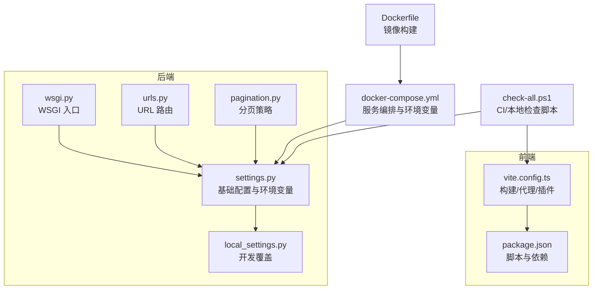
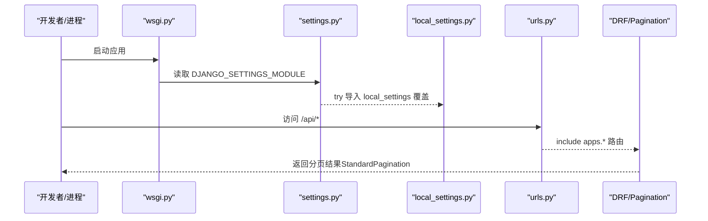
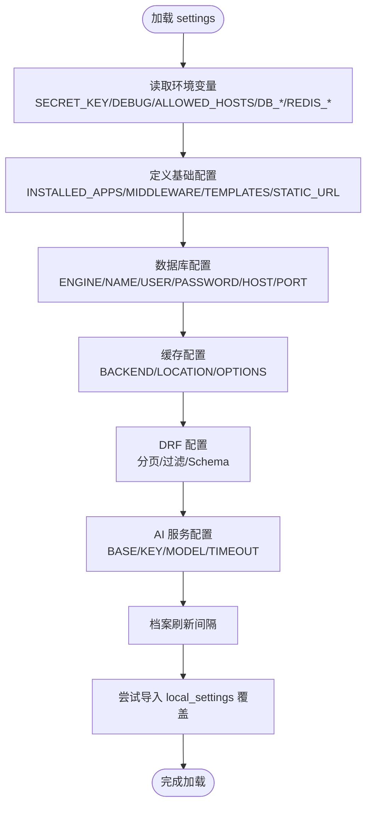
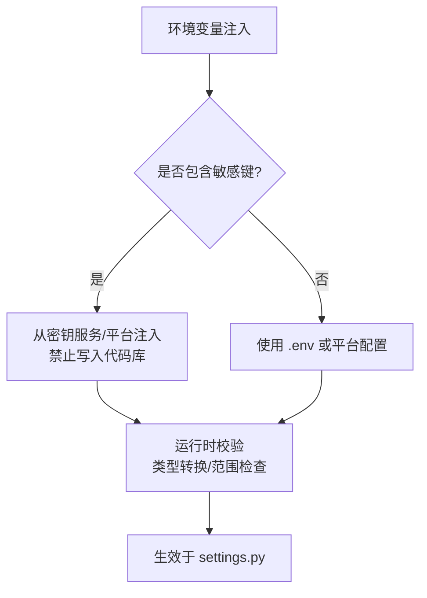
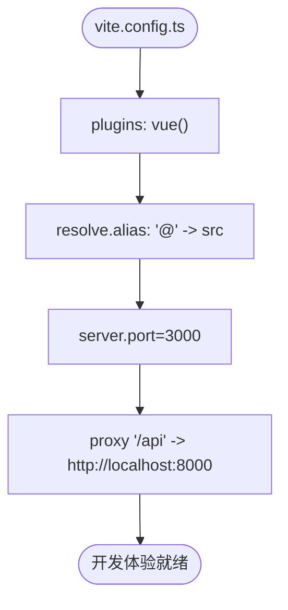
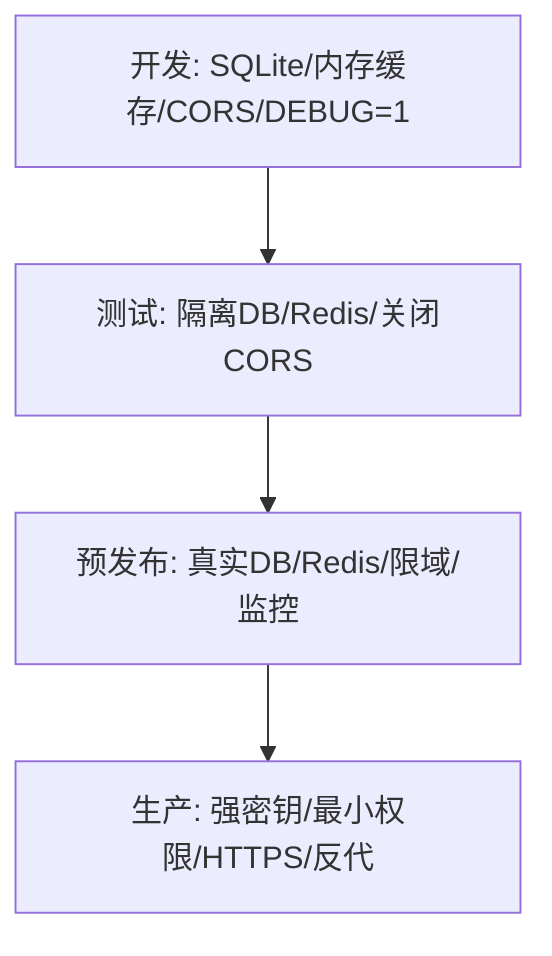
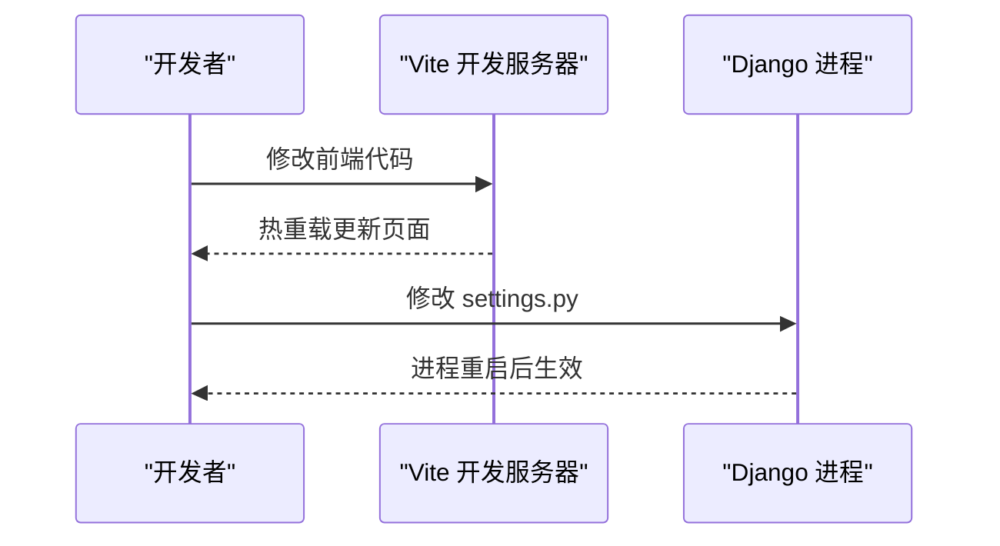
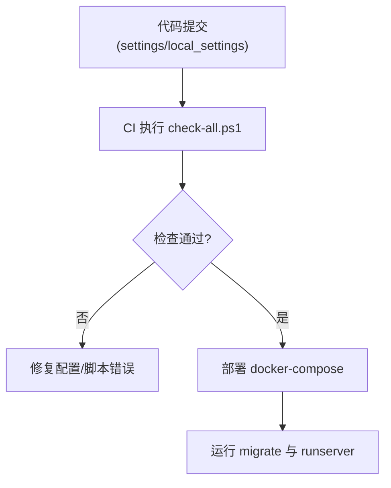
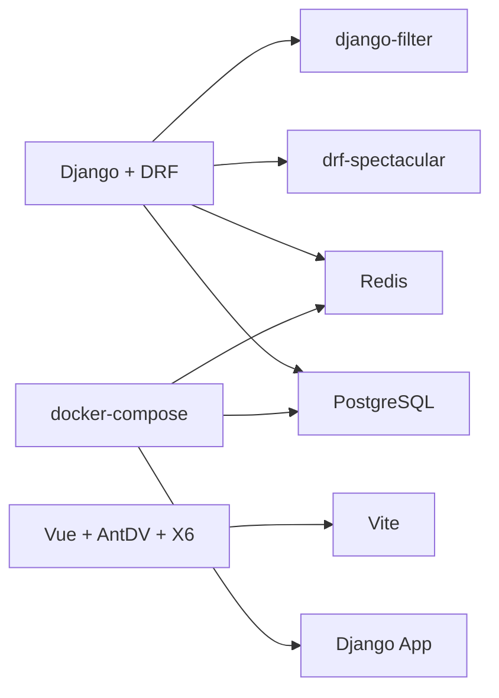

# 配置管理

<cite>
**本文引用的文件**   
- [backend/config/settings.py](file://backend/config/settings.py)
- [backend/local_settings.py](file://backend/local_settings.py)
- [backend/config/urls.py](file://backend/config/urls.py)
- [backend/config/wsgi.py](file://backend/config/wsgi.py)
- [backend/config/pagination.py](file://backend/config/pagination.py)
- [backend/docker-compose.yml](file://backend/docker-compose.yml)
- [backend/Dockerfile](file://backend/Dockerfile)
- [frontend/vite.config.ts](file://frontend/vite.config.ts)
- [frontend/package.json](file://frontend/package.json)
- [scripts/check-all.ps1](file://scripts/check-all.ps1)
</cite>

## 目录
1. [简介](#简介)
2. [项目结构](#项目结构)
3. [核心组件](#核心组件)
4. [架构总览](#架构总览)
5. [详细组件分析](#详细组件分析)
6. [依赖关系分析](#依赖关系分析)
7. [性能考虑](#性能考虑)
8. [故障排查指南](#故障排查指南)
9. [结论](#结论)
10. [附录](#附录)

## 简介
本文件为 MetaData002 系统的完整配置管理文档，覆盖后端 Django 与前端 Vite 的配置体系、环境变量规范、多环境模板、热重载与动态更新机制、以及版本管理与迁移策略。目标是帮助开发者在不同环境下快速、安全地搭建和运维系统。

## 项目结构
本项目采用前后端分离：
- 后端（Django）：通过 settings.py 集中管理应用、数据库、缓存、中间件、DRF、OpenAPI 等；通过 local_settings.py 提供开发环境覆盖；通过 wsgi.py 暴露 WSGI 入口；通过 urls.py 统一路由挂载。
- 前端（Vite + Vue）：通过 vite.config.ts 定义插件、别名、开发服务器与代理；通过 package.json 管理脚本与依赖。

**图表来源** 
- [backend/config/settings.py:1-123](file://backend/config/settings.py#L1-L123)
- [backend/local_settings.py:1-26](file://backend/local_settings.py#L1-L26)
- [backend/config/wsgi.py:1-6](file://backend/config/wsgi.py#L1-L6)
- [backend/config/urls.py:1-9](file://backend/config/urls.py#L1-L9)
- [backend/config/pagination.py:1-14](file://backend/config/pagination.py#L1-L14)
- [frontend/vite.config.ts:1-22](file://frontend/vite.config.ts#L1-L22)
- [frontend/package.json:1-29](file://frontend/package.json#L1-L29)
- [backend/docker-compose.yml:1-58](file://backend/docker-compose.yml#L1-L58)
- [backend/Dockerfile:1-20](file://backend/Dockerfile#L1-L20)
- [scripts/check-all.ps1:44-89](file://scripts/check-all.ps1#L44-L89)

**章节来源**
- [backend/config/settings.py:1-123](file://backend/config/settings.py#L1-L123)
- [backend/local_settings.py:1-26](file://backend/local_settings.py#L1-L26)
- [backend/config/wsgi.py:1-6](file://backend/config/wsgi.py#L1-L6)
- [backend/config/urls.py:1-9](file://backend/config/urls.py#L1-L9)
- [backend/config/pagination.py:1-14](file://backend/config/pagination.py#L1-L14)
- [frontend/vite.config.ts:1-22](file://frontend/vite.config.ts#L1-L22)
- [frontend/package.json:1-29](file://frontend/package.json#L1-L29)
- [backend/docker-compose.yml:1-58](file://backend/docker-compose.yml#L1-L58)
- [backend/Dockerfile:1-20](file://backend/Dockerfile#L1-L20)
- [scripts/check-all.ps1:44-89](file://scripts/check-all.ps1#L44-L89)

## 核心组件
- Django 基础配置（settings.py）
  - 应用、中间件、模板、静态资源、国际化、时区、自动字段类型等
  - 数据库连接（PostgreSQL）、缓存（Redis）
  - DRF 分页、过滤、Schema 生成
  - AI 服务（OpenAI 兼容接口）与档案刷新间隔
  - 末尾自动导入 local_settings.py 实现开发覆盖
- 开发覆盖（local_settings.py）
  - SQLite3 数据库、内存缓存、CORS 中间件与跨域开放
- WSGI 入口（wsgi.py）
  - 设置 DJANGO_SETTINGS_MODULE 并加载应用
- URL 路由（urls.py）
  - admin、modeling、archive 模块 API 挂载
- 分页策略（pagination.py）
  - 标准分页类，支持 page_size 查询参数覆盖与上限保护
- 前端构建（vite.config.ts）
  - Vue 插件、路径别名、开发端口、API 代理
- 容器化（docker-compose.yml、Dockerfile）
  - PostgreSQL、Redis、后端服务编排与环境变量注入

**章节来源**
- [backend/config/settings.py:1-123](file://backend/config/settings.py#L1-L123)
- [backend/local_settings.py:1-26](file://backend/local_settings.py#L1-L26)
- [backend/config/wsgi.py:1-6](file://backend/config/wsgi.py#L1-L6)
- [backend/config/urls.py:1-9](file://backend/config/urls.py#L1-L9)
- [backend/config/pagination.py:1-14](file://backend/config/pagination.py#L1-L14)
- [frontend/vite.config.ts:1-22](file://frontend/vite.config.ts#L1-L22)
- [backend/docker-compose.yml:1-58](file://backend/docker-compose.yml#L1-L58)
- [backend/Dockerfile:1-20](file://backend/Dockerfile#L1-L20)

## 架构总览
下图展示后端配置加载与请求处理的关键流程，包括 WSGI 启动、settings 加载、local_settings 覆盖、路由分发与 DRF 分页。

**图表来源** 
- [backend/config/wsgi.py:1-6](file://backend/config/wsgi.py#L1-L6)
- [backend/config/settings.py:1-123](file://backend/config/settings.py#L1-L123)
- [backend/local_settings.py:1-26](file://backend/local_settings.py#L1-L26)
- [backend/config/urls.py:1-9](file://backend/config/urls.py#L1-L9)
- [backend/config/pagination.py:1-14](file://backend/config/pagination.py#L1-L14)

## 详细组件分析

### Django 配置层次化管理
- 基础配置（settings.py）
  - 使用环境变量注入敏感信息与运行期参数，提供合理默认值
  - 数据库、缓存、DRF、Spectacular、AI 服务、定时刷新等关键开关
- 环境覆盖（local_settings.py）
  - 通过末尾 import 覆盖数据库引擎、缓存后端、中间件与跨域策略
- 入口与路由（wsgi.py、urls.py）
  - 明确设置 DJANGO_SETTINGS_MODULE，统一挂载 admin 与业务 API

**图表来源** 
- [backend/config/settings.py:1-123](file://backend/config/settings.py#L1-L123)
- [backend/local_settings.py:1-26](file://backend/local_settings.py#L1-L26)

**章节来源**
- [backend/config/settings.py:1-123](file://backend/config/settings.py#L1-L123)
- [backend/local_settings.py:1-26](file://backend/local_settings.py#L1-L26)
- [backend/config/wsgi.py:1-6](file://backend/config/wsgi.py#L1-L6)
- [backend/config/urls.py:1-9](file://backend/config/urls.py#L1-L9)

### 环境变量管理规范
- 敏感信息处理
  - SECRET_KEY、数据库密码、AI_API_KEY 等必须通过环境变量注入，禁止硬编码
  - 生产环境建议由密钥管理服务或平台注入（如 Docker/K8s Secret）
- 配置验证
  - DEBUG 布尔转换、端口/超时数值转换、主机列表分割
  - 建议在部署前增加校验脚本（可参考 check-all.ps1 模式）
- 默认值设置
  - 所有 os.environ.get(...) 均提供默认值，确保本地开发可用
- 推荐清单（示例）
  - 后端：DJANGO_SECRET_KEY、DEBUG、ALLOWED_HOSTS、DB_NAME/USER/PASSWORD/HOST/PORT、REDIS_HOST/PORT、AI_API_BASE/AI_API_KEY/AI_MODEL/AI_TIMEOUT、ARCHIVE_AUTO_REFRESH_MINUTES
  - 容器：docker-compose.yml 中已注入必要的环境变量

**图表来源** 
- [backend/config/settings.py:1-123](file://backend/config/settings.py#L1-L123)
- [backend/docker-compose.yml:1-58](file://backend/docker-compose.yml#L1-L58)

**章节来源**
- [backend/config/settings.py:1-123](file://backend/config/settings.py#L1-L123)
- [backend/docker-compose.yml:1-58](file://backend/docker-compose.yml#L1-L58)

### 前端 Vite 配置选项
- 插件与别名
  - 启用 @vitejs/plugin-vue，配置 @ 指向 src 目录
- 开发服务器
  - 端口 3000，开启 /api 代理到后端 8000，解决跨域
- 构建优化
  - 当前未显式配置压缩/分包，可在 build.rollupOptions 中扩展
- 环境变量
  - 当前未使用 VITE_ 前缀变量，如需可按需引入 import.meta.env

**图表来源** 
- [frontend/vite.config.ts:1-22](file://frontend/vite.config.ts#L1-L22)

**章节来源**
- [frontend/vite.config.ts:1-22](file://frontend/vite.config.ts#L1-L22)
- [frontend/package.json:1-29](file://frontend/package.json#L1-L29)

### 不同环境的配置模板与示例
- 开发环境
  - 使用 SQLite3、内存缓存、CORS 全开、DEBUG=1
  - 通过 local_settings.py 覆盖 settings.py
- 测试环境
  - 建议使用独立 Postgres/Redis 实例，关闭 CORS，禁用调试
  - 可通过 docker-compose 新增 service 或复用现有服务
- 预发布环境
  - 使用真实数据库与 Redis，限制 ALLOWED_HOSTS，开启日志与监控
  - 关闭 DEBUG，严格校验环境变量
- 生产环境
  - 使用强密钥、最小权限账号、HTTPS、反向代理（Nginx/Gunicorn）
  - 限制 ALLOWED_HOSTS，关闭调试，启用健康检查与滚动重启

[本图为概念性说明，不直接映射具体文件]

### 配置热重载与动态配置更新机制
- 后端
  - Django 开发模式下文件变更会触发 reload；settings.py 在进程启动时加载一次
  - 运行时动态修改 settings 不会生效，需要重启进程
  - 可通过外部配置中心+进程内缓存（如 Redis）实现“伪动态”更新
- 前端
  - Vite 开发模式支持热重载；构建产物为静态资源，需重新构建后部署
  - 运行时不可更改构建期配置（如代理），应通过环境变量或网关层调整

**图表来源** 
- [frontend/vite.config.ts:1-22](file://frontend/vite.config.ts#L1-L22)
- [backend/config/settings.py:1-123](file://backend/config/settings.py#L1-L123)

**章节来源**
- [frontend/vite.config.ts:1-22](file://frontend/vite.config.ts#L1-L22)
- [backend/config/settings.py:1-123](file://backend/config/settings.py#L1-L123)

### 配置文件版本管理与迁移策略
- 版本管理
  - settings.py 与 local_settings.py 纳入版本控制；敏感信息不入库
  - docker-compose.yml 中的环境变量作为部署配置基线
- 迁移策略
  - 数据库迁移由 Django migrations 管理（apps/modeling、apps/archive）
  - 新增环境变量需同步更新文档与部署脚本
  - 构建脚本（check-all.ps1）用于 CI/本地一致性检查

**图表来源** 
- [scripts/check-all.ps1:44-89](file://scripts/check-all.ps1#L44-L89)
- [backend/docker-compose.yml:1-58](file://backend/docker-compose.yml#L1-L58)

**章节来源**
- [scripts/check-all.ps1:44-89](file://scripts/check-all.ps1#L44-L89)
- [backend/docker-compose.yml:1-58](file://backend/docker-compose.yml#L1-L58)

## 依赖关系分析
- 后端依赖
  - Django、DRF、django-filter、drf-spectacular、redis、postgresql
  - 可选 corsheaders（开发）
- 前端依赖
  - Vue、Ant Design Vue、X6、Axios、Pinia、Vite、TypeScript
- 容器依赖
  - PostgreSQL、Redis、Python 3.12 slim

**图表来源** 
- [backend/config/settings.py:1-123](file://backend/config/settings.py#L1-L123)
- [backend/local_settings.py:1-26](file://backend/local_settings.py#L1-L26)
- [frontend/package.json:1-29](file://frontend/package.json#L1-L29)
- [backend/docker-compose.yml:1-58](file://backend/docker-compose.yml#L1-L58)

**章节来源**
- [backend/config/settings.py:1-123](file://backend/config/settings.py#L1-L123)
- [backend/local_settings.py:1-26](file://backend/local_settings.py#L1-L26)
- [frontend/package.json:1-29](file://frontend/package.json#L1-L29)
- [backend/docker-compose.yml:1-58](file://backend/docker-compose.yml#L1-L58)

## 性能考虑
- 数据库
  - 连接池与超时：根据负载调整 CONN_MAX_AGE、CONN_HEALTH_CHECKS
  - 索引与查询：结合 DRF 过滤与分页减少大结果集传输
- 缓存
  - Redis 作为默认缓存后端，注意 key 命名空间与过期策略
- 构建
  - 前端可启用代码分割、按需加载、Gzip/Brotli 压缩
- 容器
  - 合理设置资源限制与健康检查，避免单点过载

[本节为通用指导，不直接分析具体文件]

## 故障排查指南
- 常见错误
  - SECRET_KEY 缺失或未设置导致启动失败
  - DEBUG 非布尔值导致类型转换异常
  - ALLOWED_HOSTS 未配置导致 400 错误
  - 数据库/Redis 连接失败（主机、端口、密码错误）
  - 前端代理目标不可达（后端未启动或端口不一致）
- 定位方法
  - 查看环境变量是否正确注入（docker-compose、系统环境）
  - 检查 settings.py 的默认值与覆盖逻辑
  - 使用 check-all.ps1 进行前后端一致性检查
- 恢复步骤
  - 修正环境变量后重启服务
  - 清理缓存与临时文件，必要时重建镜像

**章节来源**
- [backend/config/settings.py:1-123](file://backend/config/settings.py#L1-L123)
- [backend/docker-compose.yml:1-58](file://backend/docker-compose.yml#L1-L58)
- [scripts/check-all.ps1:44-89](file://scripts/check-all.ps1#L44-L89)

## 结论
MetaData002 的配置体系以 settings.py 为核心，结合 local_settings.py 实现开发覆盖，通过环境变量注入敏感信息与运行期参数，配合 docker-compose 完成服务编排。前端基于 Vite 提供开发友好与代理能力。遵循本文的环境变量规范、多环境模板与迁移策略，可显著提升配置的可维护性与安全性。

[本节为总结性内容，不直接分析具体文件]

## 附录
- 环境变量清单（建议）
  - 后端：DJANGO_SECRET_KEY、DEBUG、ALLOWED_HOSTS、DB_NAME、DB_USER、DB_PASSWORD、DB_HOST、DB_PORT、REDIS_HOST、REDIS_PORT、AI_API_BASE、AI_API_KEY、AI_MODEL、AI_TIMEOUT、ARCHIVE_AUTO_REFRESH_MINUTES
  - 前端：如需运行时配置，可使用 VITE_ 前缀并通过 import.meta.env 读取
- 部署建议
  - 生产环境使用反向代理与 HTTPS
  - 使用密钥管理服务注入敏感信息
  - 建立 CI/CD 流水线，集成 check-all.ps1 与构建脚本

[本节为补充信息，不直接分析具体文件]