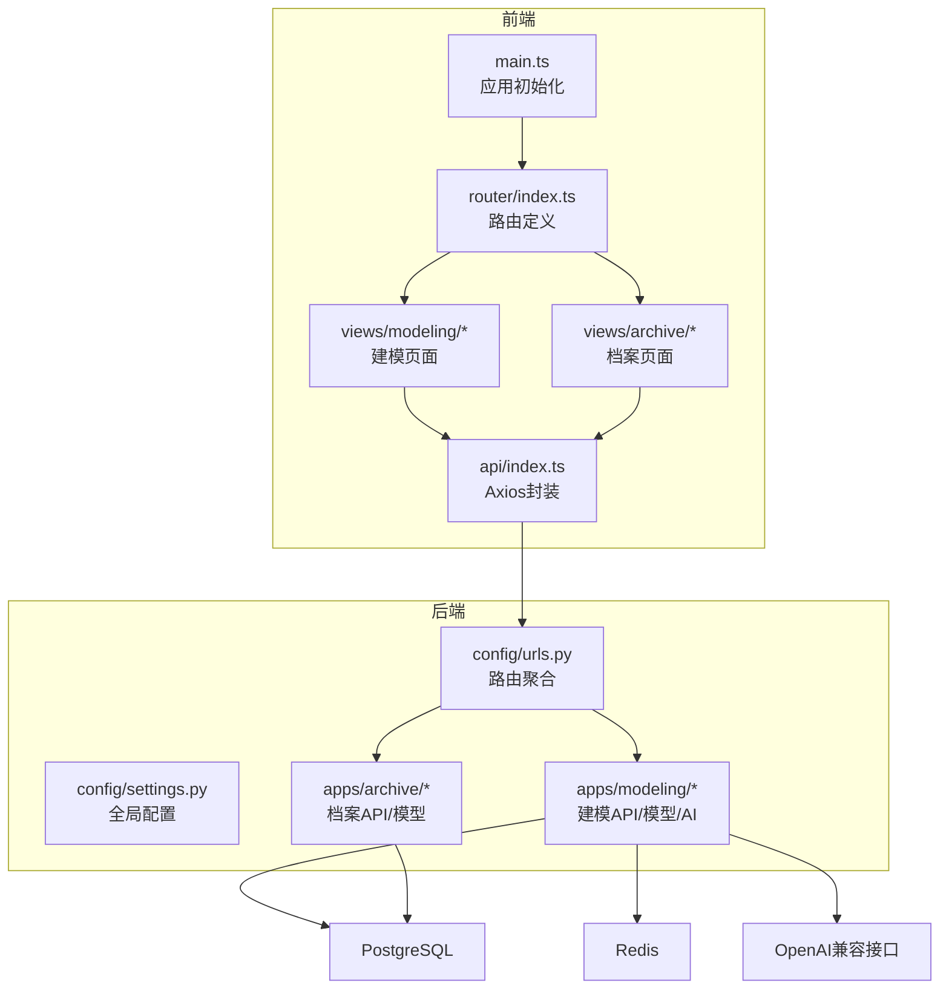
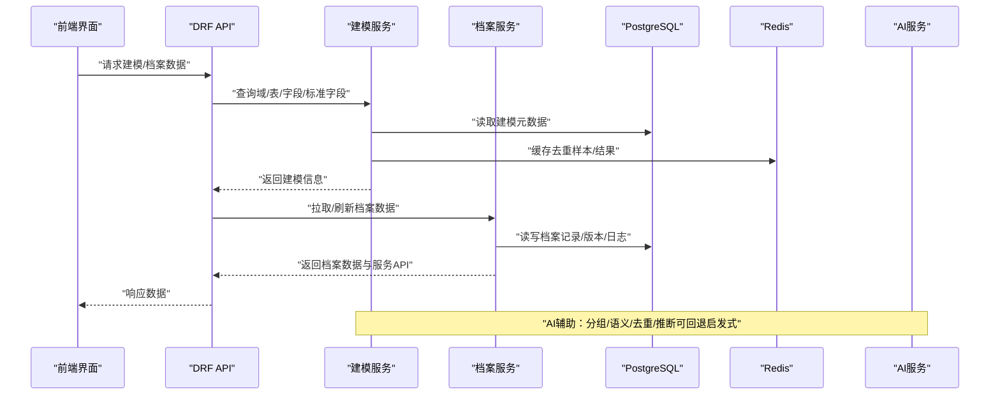
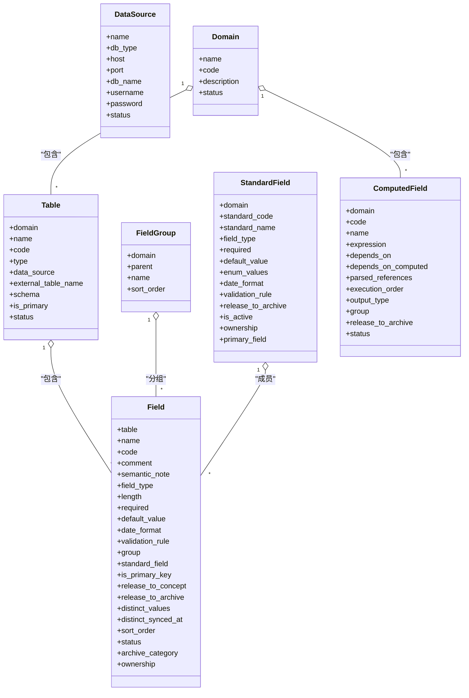
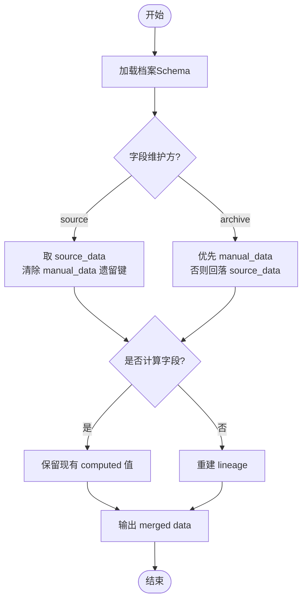
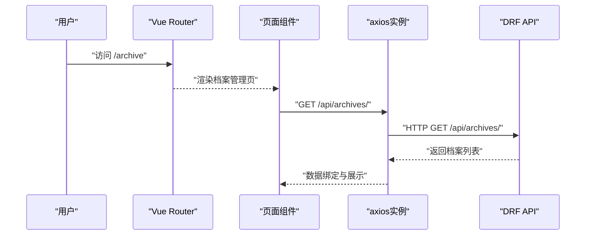
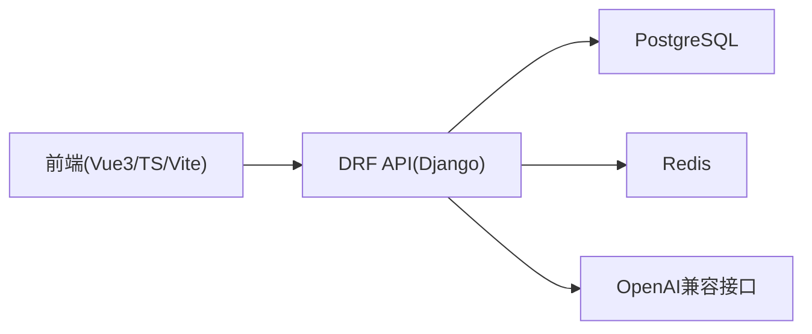

# 项目概述

<cite>
**本文引用的文件**   
- [backend/config/settings.py](file://backend/config/settings.py)
- [backend/config/urls.py](file://backend/config/urls.py)
- [backend/apps/modeling/models.py](file://backend/apps/modeling/models.py)
- [backend/apps/archive/models.py](file://backend/apps/archive/models.py)
- [backend/apps/modeling/views.py](file://backend/apps/modeling/views.py)
- [backend/apps/archive/views.py](file://backend/apps/archive/views.py)
- [backend/apps/modeling/ai_service.py](file://backend/apps/modeling/ai_service.py)
- [frontend/package.json](file://frontend/package.json)
- [frontend/src/main.ts](file://frontend/src/main.ts)
- [frontend/src/router/index.ts](file://frontend/src/router/index.ts)
- [frontend/src/api/index.ts](file://frontend/src/api/index.ts)
- [frontend/src/views/modeling/DomainList.vue](file://frontend/src/views/modeling/DomainList.vue)
- [frontend/src/views/archive/ArchiveList.vue](file://frontend/src/views/archive/ArchiveList.vue)
- [.ai/constitution.md](file://.ai/constitution.md)
</cite>

## 目录
1. [简介](#简介)
2. [项目结构](#项目结构)
3. [核心组件](#核心组件)
4. [架构总览](#架构总览)
5. [详细组件分析](#详细组件分析)
6. [依赖关系分析](#依赖关系分析)
7. [性能考量](#性能考量)
8. [故障排查指南](#故障排查指南)
9. [结论](#结论)
10. [附录](#附录)

## 简介
MetaData002 主数据管理系统面向企业级主数据治理，提供“建模—档案—服务”一体化能力：通过领域与实体建模、标准字段归一化、计算字段推导、AI辅助（分组/语义识别/去重/推断），将多源异构数据汇聚为“黄金记录”，并以档案形式持久化与版本化管理，最终通过数据服务 API 对外输出。系统采用前后端分离架构，后端基于 Django + DRF，前端基于 Vue.js + Ant Design Vue + Vite，数据库使用 PostgreSQL，缓存使用 Redis，并支持 OpenAI 兼容的 AI 服务。

适用场景与目标用户：
- 场景：跨系统主数据整合、数据质量提升、数据服务化输出、变更审计与回滚。
- 用户：数据治理团队、业务数据Owner、系统集成工程师、数据分析与BI团队。

## 项目结构
- 后端 backend
  - config：Django 配置、路由入口、WSGI
  - apps.modeling：建模域（数据源、域、表、字段、标准字段、计算字段、AI服务）
  - apps.archive：档案域（档案、记录、版本、同步日志、操作日志、API、变更批次与明细、一致性检查）
- 前端 frontend
  - src：Vue3 + TypeScript + Pinia + Router + Ant Design Vue
  - 视图：域管理、表管理、字段管理、关系管理、档案管理、一致性检查、版本管理、设置页等
- 其他
  - .ai/constitution.md：架构决策与演进记录
  - Dockerfile/docker-compose.yml：容器化部署

**图表来源** 
- [backend/config/settings.py:1-123](file://backend/config/settings.py#L1-L123)
- [backend/config/urls.py:1-9](file://backend/config/urls.py#L1-L9)
- [frontend/src/main.ts:1-14](file://frontend/src/main.ts#L1-L14)
- [frontend/src/router/index.ts:1-45](file://frontend/src/router/index.ts#L1-L45)
- [frontend/src/api/index.ts:1-22](file://frontend/src/api/index.ts#L1-L22)

**章节来源**
- [backend/config/settings.py:1-123](file://backend/config/settings.py#L1-L123)
- [backend/config/urls.py:1-9](file://backend/config/urls.py#L1-L9)
- [frontend/package.json:1-29](file://frontend/package.json#L1-L29)
- [frontend/src/main.ts:1-14](file://frontend/src/main.ts#L1-L14)
- [frontend/src/router/index.ts:1-45](file://frontend/src/router/index.ts#L1-L45)

## 核心组件
- 建模模块（modeling）
  - 数据源配置：支持 PostgreSQL/MySQL/SQL Server/Oracle，动态连接测试与Schema枚举
  - 域与表：域下实体表，支持本地表与外部数据源表，主表标识与ER图坐标持久化
  - 字段与分组：多层分组树（最多3层），字段属性与校验规则
  - 标准字段：跨表去重后的概念层一等公民，属性变更自动同步到成员物理字段
  - 计算字段：Excel风格公式，依赖解析与DAG执行顺序，物化存储与批量重算
  - AI服务：字段自动分组、语义识别、跨表去重检测、Excel字段推断；未配置密钥时回退启发式
- 档案模块（archive）
  - 档案配置：按域生成Schema快照，版本化管理
  - 档案记录：双层存储（source_data+manual_data），合并策略与血缘追踪
  - 版本与日志：版本快照、操作日志、同步日志、变更批次与明细
  - 数据服务API：暴露档案数据，支持字段过滤、筛选条件、角色/部门授权
  - 一致性检查：组合字段成员一致性、档案侧与源侧差异、孤立记录、Schema漂移

**章节来源**
- [backend/apps/modeling/models.py:1-489](file://backend/apps/modeling/models.py#L1-L489)
- [backend/apps/archive/models.py:1-379](file://backend/apps/archive/models.py#L1-L379)
- [backend/apps/modeling/ai_service.py:1-200](file://backend/apps/modeling/ai_service.py#L1-L200)

## 架构总览
系统采用前后端分离与分层设计：
- 前端：Vue3 + TS + Vite + Ant Design Vue，路由与状态管理清晰，统一Axios拦截器处理错误
- 后端：Django + DRF，RESTful API，分页/过滤/排序/文档自动生成
- 数据层：PostgreSQL为主库，Redis为缓存；AI服务通过OpenAI兼容接口接入，失败回退启发式
- 数据流：源系统→档案（黄金记录）→数据服务API，单向Hub式MDM，永不回写源系统

**图表来源** 
- [backend/config/urls.py:1-9](file://backend/config/urls.py#L1-L9)
- [backend/apps/modeling/views.py:1-200](file://backend/apps/modeling/views.py#L1-L200)
- [backend/apps/archive/views.py:1-200](file://backend/apps/archive/views.py#L1-L200)
- [backend/apps/modeling/ai_service.py:1-200](file://backend/apps/modeling/ai_service.py#L1-L200)

## 详细组件分析

### 建模模块（Modeling）
- 数据源与连接测试
  - 支持多数据库类型，动态创建连接别名，执行简单查询验证连通性
  - 提供 schema 列表接口，支持统计每个 schema 的表数量
- 域与表
  - 域编码唯一，表编码在域内唯一；主表标识用于档案合并基准
  - ER图节点坐标持久化，便于可视化编辑
- 字段与分组
  - 分组树支持多层嵌套，DFS序确定展示顺序
  - 字段属性（类型/长度/必填/默认值/日期格式/校验规则）集中管理
- 标准字段与成员
  - 跨表去重后形成标准字段，属性变更自动同步到所有成员物理字段
  - 主字段机制：组合字段以主字段为更新源头，其余成员仅一致性检查
- 计算字段
  - Excel风格表达式，依赖解析构建DAG，执行顺序保障批处理
  - 输出类型与分组，是否释放到档案控制消费范围
- AI服务
  - 优先调用OpenAI兼容接口，失败回退启发式算法
  - 提示词可配置（分组/语义/去重/推断），内置默认值兜底

**图表来源** 
- [backend/apps/modeling/models.py:1-489](file://backend/apps/modeling/models.py#L1-L489)

**章节来源**
- [backend/apps/modeling/models.py:1-489](file://backend/apps/modeling/models.py#L1-L489)
- [backend/apps/modeling/views.py:1-200](file://backend/apps/modeling/views.py#L1-L200)
- [backend/apps/modeling/ai_service.py:1-200](file://backend/apps/modeling/ai_service.py#L1-L200)

### 档案模块（Archive）
- 档案配置与Schema
  - 按域生成Schema快照，版本递增，支撑前端渲染与API暴露
- 档案记录双层存储
  - source_data：源同步底层，整层替换零比对
  - manual_data：人工覆盖层，仅允许 ownership='archive' 字段有键
  - data：写时合并物化结果，computed 保留现值，source 直通清遗留键，archive 优先 manual
  - lineage：字段级血缘（sync/manual），overrides：修正保护标记
- 版本与日志
  - 版本快照：支持定版/取消定版/回滚
  - 操作日志/同步日志：记录变更来源、状态、详情
  - 变更批次与明细：统一记录源侧同步与档案侧编辑，零变更不建批次
- 数据服务API
  - 暴露档案数据，支持字段子集、筛选条件、角色/部门授权
- 一致性检查
  - 组合字段成员一致性、档案侧与源侧差异、孤立记录、Schema漂移
  - 差异清单落库，支持批量审核与历史轨迹

**图表来源** 
- [backend/apps/archive/views.py:1-200](file://backend/apps/archive/views.py#L1-L200)

**章节来源**
- [backend/apps/archive/models.py:1-379](file://backend/apps/archive/models.py#L1-L379)
- [backend/apps/archive/views.py:1-200](file://backend/apps/archive/views.py#L1-L200)

### 前端交互与路由
- 应用初始化：挂载Pinia、Router、Antd主题
- 路由组织：/modeling（域/表/字段/关系）、/archive（档案/API/变更/版本/一致性）、/settings（数据源/AI/技术函数）
- Axios封装：统一baseURL、超时、错误拦截器保留原始响应以便上层读取结构化错误

**图表来源** 
- [frontend/src/main.ts:1-14](file://frontend/src/main.ts#L1-L14)
- [frontend/src/router/index.ts:1-45](file://frontend/src/router/index.ts#L1-L45)
- [frontend/src/api/index.ts:1-22](file://frontend/src/api/index.ts#L1-L22)

**章节来源**
- [frontend/src/main.ts:1-14](file://frontend/src/main.ts#L1-L14)
- [frontend/src/router/index.ts:1-45](file://frontend/src/router/index.ts#L1-L45)
- [frontend/src/api/index.ts:1-22](file://frontend/src/api/index.ts#L1-L22)
- [frontend/src/views/modeling/DomainList.vue:1-200](file://frontend/src/views/modeling/DomainList.vue#L1-L200)
- [frontend/src/views/archive/ArchiveList.vue:1-200](file://frontend/src/views/archive/ArchiveList.vue#L1-L200)

## 依赖关系分析
- 后端依赖
  - Django框架与DRF：RESTful API、分页/过滤/排序、Schema文档
  - 数据库：PostgreSQL为主库，支持多引擎动态连接（MySQL/SQL Server/Oracle）
  - 缓存：Redis用于缓存去重样本与中间结果
  - AI服务：OpenAI兼容接口，失败回退启发式
- 前端依赖
  - Vue3 + TS + Vite：现代前端工程化
  - Ant Design Vue：企业级UI组件
  - Pinia：状态管理
  - Axios：HTTP客户端与拦截器

**图表来源** 
- [backend/config/settings.py:1-123](file://backend/config/settings.py#L1-L123)
- [frontend/package.json:1-29](file://frontend/package.json#L1-L29)

**章节来源**
- [backend/config/settings.py:1-123](file://backend/config/settings.py#L1-L123)
- [frontend/package.json:1-29](file://frontend/package.json#L1-L29)

## 性能考量
- 列表分页：自定义StandardPagination启用page_size_query_param，最大100000，避免大列表拖慢
- 缓存：Redis缓存去重样本与AI结果，减少重复计算与网络开销
- 双层存储：source_data整层替换零比对，降低同步复杂度与锁竞争
- DAG执行：计算字段按拓扑顺序批处理，避免循环依赖与重复计算
- 预检刷新：dry-run模式先试算再执行，减少无效写入与回滚成本

[本节为通用指导，无需特定文件引用]

## 故障排查指南
- 数据源连接失败
  - 检查db_type与驱动包安装，确认主机/端口/用户名/密码正确
  - 使用“测试连接”端点定位问题
- AI服务不可用
  - 检查AI_API_KEY与AI_API_BASE配置，或数据库AIConfig中enabled=True的配置
  - 未配置时将回退启发式，功能可用但效果受限
- 档案刷新异常
  - 查看同步日志与变更批次明细，确认主表主键与映射关系
  - 预检弹窗显示Schema变化与数据变化样本，定位差异原因
- 前端请求错误
  - Axios拦截器已保留原始响应，检查error.response.data中的detail/message/error字段

**章节来源**
- [backend/apps/modeling/views.py:1-200](file://backend/apps/modeling/views.py#L1-L200)
- [backend/apps/modeling/ai_service.py:1-200](file://backend/apps/modeling/ai_service.py#L1-L200)
- [backend/apps/archive/views.py:1-200](file://backend/apps/archive/views.py#L1-L200)
- [frontend/src/api/index.ts:1-22](file://frontend/src/api/index.ts#L1-L22)

## 结论
MetaData002以“建模—档案—服务”为主线，结合AI辅助与Hub式MDM理念，为企业主数据治理提供完整解决方案。通过标准字段归一化、计算字段推导、双层存储与版本化、一致性检查与变更审计，确保数据质量与可追溯性。前后端分离与现代化技术栈保障了系统的可扩展性与用户体验。建议在生产环境完善AI密钥配置、优化缓存策略与监控告警，持续提升数据治理效率与稳定性。

[本节为总结，无需特定文件引用]

## 附录
- 架构决策与演进记录详见：.ai/constitution.md，涵盖数据源驱动、字段去重、档案刷新预检、一致性检查、回滚体系统一等关键决策

**章节来源**
- [.ai/constitution.md:51-102](file://.ai/constitution.md#L51-L102)