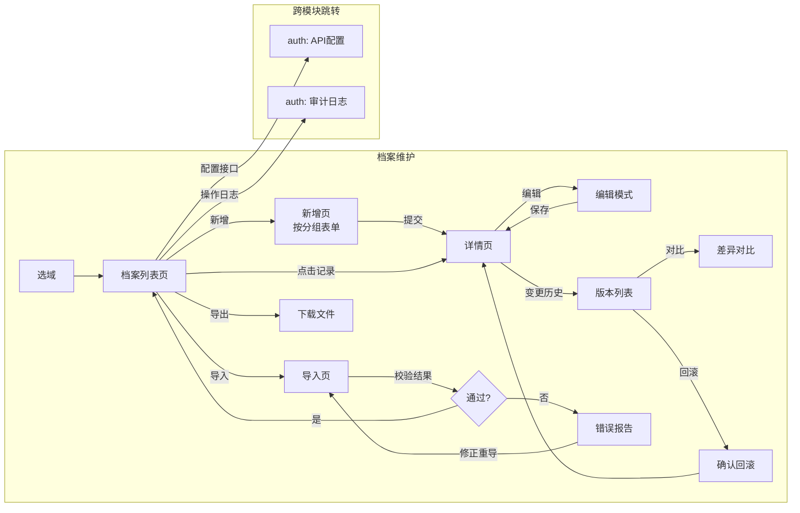

# 设计日记 - 档案维护中心（archive）

> 说明：面向业务人员的档案操作中心，包含增删改查、分类展示、导入导出、版本管理、操作日志。档案的模型定义（字段/分类）由 modeling 模块提供。

---

## 2026-08-05 v19 — API管理完整设计（REQ-005 / F-204+F-205）：API Key 鉴权 + 对外网关 + 读写范围 + API文档 + 限流 + 调用日志【推翻 2026-07-23「API 开放权限只存数据结构，真实鉴权留待 auth 模块」】

### 方向锁定（prjm 循环 checklist，用户全部 ✓）

1. **范围**：完整落地 REQ-005 API 部分（F-204 接口配置 + F-205 密钥管理 + 故事线步骤1）
2. **鉴权**：推翻 2026-07-23 宪法决策——本期做真实鉴权（自建 API Key 机制，不等 auth 模块角色体系；auth 模块启动后联动升级，替换点为单文件 open_api_auth.py）
3. **读写**：读写全设计（查询/新增/修改/删除）；Hub 宪法「永不回写源表」不变——写操作落 manual_data 层/软停用
4. **密钥粒度**：独立密钥 × 多 API 授权（ApiKeyGrant 中间表，每授权关系独立操作范围）
5. **调用日志**：ApiCallLog 落库保留 90 天自动清理 + 近 7 天统计；与「数据变更日志永久存库」决策不冲突（后者指 ArchiveChangeBatch/Detail 数据变更留痕）

### 设计原则

- **方向承载点单点化**（rule §11.2）：鉴权/限流收敛 `open_api_auth.py`、网关读写逻辑收敛 `open_api_gateway.py` 两个单文件；auth 模块启动后仅替换 open_api_auth.py，不散布在 views/serializers
- **Hub 宪法不变**：永不回写源表；外部写操作一律 manual_data 层（ownership=archive 字段）或软停用；source 字段写入 400 拦截
- **外部新增不违反「禁止档案端人工新增」**：该宪法决策约束的是前端档案页人工入口；REQ-005 场景调用方是下游业务系统，允许在 API 开放 create 权限时通过网关新增记录
- **字段释放粒度=每 API 独立（用户第一百一十五轮确认）**：exposed_fields 挂在每个 ArchiveApi 上，同一档案可建多个 API 各自释放不同字段子集（前端新建/编辑抽屉分组勾选，空=全部）；网关读按 exposed_fields 投影、写限 exposed_fields∩ownership=archive；与两层释放体系衔接：物理字段→释放到档案→再按 API 分别释放给不同调用方。不引入读写分离字段清单/密钥级字段再收窄（用户确认现状已够）

### 业务流程（接口开放→调用→审计）

| 节点 | 入口状态 | 出口状态 | 触发条件 | 异常处理 |
|------|---------|---------|---------|---------|
| 接口配置 | 档案已有 schema | API 可开放 | 管理员配操作范围/限流/slug | 档案无 schema 提示先同步 |
| 密钥发放 | API 已配置 | 调用方可接入 | 生成密钥+勾选授权 API×操作 | 明文密钥仅展示一次 |
| 对外调用 | 调用方持密钥 | 数据读写完成 | X-API-Key 请求 /api/open/{slug}/ | 401/403/429 分类拒绝并落调用日志 |
| 写入留痕 | 网关写成功 | 变更日志可查 | create/update/delete 成功 | 事务内同批次落 ChangeBatch(source=api) |
| 日志清理 | 调用日志累积 | 仅留 90 天 | daemon 每日清理 | 清理失败只记日志 |

### 数据模型

| 表 | 说明 | 主键 | 核心字段 | 关联 |
|----|------|------|---------|------|
| ApiKey | API 密钥（F-205） | id | name/key_prefix(展示 mdm_ab12****)/key_hash(SHA-256，明文不落库)/status(active/revoked)/expires_at(空=永久)/revoked_at/last_used_at/total_calls/created_by | — |
| ApiKeyGrant | 密钥×API 授权（独立粒度） | id | api_key(FK CASCADE)/api(FK→ArchiveApi CASCADE)/allowed_operations(JSON 子集 read/create/update/delete)；unique(api_key, api) | ApiKey、ArchiveApi |
| ApiCallLog | 调用日志（90 天） | id | api(FK SET_NULL)/api_key(FK SET_NULL)/key_name(快照防删失联)/method/path/status_code/duration_ms/client_ip/error_summary(≤200)/created_at；索引 (created_at)、(api, created_at) | ArchiveApi、ApiKey |
| ArchiveApi（扩展） | 接口配置 | id | ➕ slug(CharField(100) unique，对外网关路径段，默认取 path 末段)、➕ allowed_operations(JSON，默认 ['read'])、➕ rate_limit_per_min(Integer，0=不限，按密钥维度计数）；path/auth_roles/exposed_fields/filter_conditions/status 保留语义不变 | Archive |
| ChangeSource（扩展） | 变更批次来源 | — | ➕ 'api'（API 写入批次，operator 落密钥名称） | ArchiveChangeBatch |

> 密钥安全：密钥格式 `mdm_`+32位随机 hex；库中仅存 SHA-256 哈希（hmac.compare_digest 恒定时间比对）；明文仅创建成功弹窗展示一次；不落任何日志。

### 对外契约

**对外网关**（统一挂 `/api/open/`，鉴权头 `X-API-Key: mdm_xxx`，豁免管理端 DRF 路由）：

| 端点 | 方法 | 说明 | 拒绝码 |
|------|------|------|--------|
| /api/open/{slug}/ | GET | 列表查询：exposed_fields 投影 + 静态 filter_conditions + 动态参数（?{code}=值 / {code}__contains= 等）+ 分页 page/page_size（默认 20 上限 500）；返回 {count,page,page_size,results} | 401/403/429 |
| /api/open/{slug}/{record_key}/ | GET | 单条查询（主键值定位 record_key） | 同上 + 404 |
| /api/open/{slug}/docs/ | GET | 接口文档：端点/认证/字段说明/请求示例(curl+python)/响应结构 | 同上 |
| /api/open/{slug}/ | POST | 新增记录：仅可写 exposed∩ownership=archive 字段；主键字段必填校验；落 manual_data+merge | 400 字段违规 |
| /api/open/{slug}/{record_key}/ | PATCH | 修改：archive 字段 diff 写 manual_data（==源值删键回落，复用 ArchiveRecordUpdateSerializer 语义）；source 字段 400 | 400/404 |
| /api/open/{slug}/{record_key}/ | DELETE | 软停用（status=deleted，不物理删除，对齐人工停用语义） | 404 |

**管理端契约**（新增）：

| 端点 | 方法 | 返回 |
|------|------|------|
| /api/api-keys/ | GET/POST | 列表（key_hash 永不回传）；POST 创建返回 {…, key: 明文}（仅此一次） |
| /api/api-keys/{id}/rotate/ | POST | 旧密钥吊销+同授权生成新密钥，返回新明文一次 |
| /api/api-keys/{id}/revoke/ | POST | 吊销（已吊销 400） |
| /api/api-keys/{id}/call-logs/ | GET | 该密钥调用日志分页 |
| /api/api-call-stats/ | GET | 近 7 天按 api×日 调用量/成功率/平均耗时 |
| ArchiveApiSerializer | 扩展 | ➕ slug/allowed_operations/rate_limit_per_min/public_url（加法兼容，不破坏已发布签名） |

**鉴权拦截链**（open_api_auth.py 单点，顺序执行）：
取 X-API-Key → 哈希比对（无/无效/已吊销/过期→401）→ API 停用（403）→ 无该 API 授权（403）→ 操作不在 allowed_operations∩grant（403）→ 限流滑动窗口超 rate_limit_per_min（429）→ 放行并异步落 ApiCallLog + 更新 last_used_at/total_calls。BR-013 满足。

**外部写入落变更日志**：事务内建 ChangeBatch(change_source='api', operator=密钥名称) + ChangeDetail（created/updated/deactivated），与人工编辑同构，变更日志页天然可见。

### 前端交互（ApiManagement.vue 改造）

页面升级为双 Tab（页面路径 /archive/api-management 不变）：

**Tab1 接口管理**（现有表格增强）：
- 列加「操作范围」（读/增/改/删 tag）+「限流」（N/分钟 或 不限）；操作列：查看数据 | 文档 | 启/停 | 删除
- 编辑抽屉加：操作范围 checkbox-group（查询/新增/修改/删除，至少一项）+ 限流 a-input-number（0=不限）+ slug 输入（默认取 path 末段自动带出）
- 「文档」→ 弹窗：公网端点地址+复制按钮、字段说明表、curl/python 请求示例（复制）、响应结构示例

**Tab2 密钥管理**（新建）：
- 表格列：密钥名称/密钥标识（mdm_ab12****）/状态/授权（N 个 API tag）/累计调用/最近调用/到期时间/操作（吊销 | 轮换 | 调用日志）
- 「新建密钥」弹窗：名称+有效期选择（永久/30/90/365 天）+授权配置（API 多选表格，每行勾操作范围）；创建成功弹窗展示完整明文密钥一次+复制按钮+红色警示「关闭后无法再次查看」
- 「调用日志」抽屉：时间/接口/方法/状态码/耗时/IP 分页表格

### 方向承载点清单（方向推翻时只动这些文件）

| 文件 | 职责 |
|------|------|
| `backend/apps/archive/open_api_auth.py`（新） | 鉴权/授权校验/限流/调用日志单点 |
| `backend/apps/archive/open_api_gateway.py`（新） | 对外网关读写逻辑 |
| `backend/apps/archive/models.py` | ApiKey/ApiKeyGrant/ApiCallLog + ArchiveApi 扩展字段 |
| `backend/config/urls.py` | /api/open/ 路由注册 |
| `frontend/src/views/archive/ApiManagement.vue` | 密钥管理 Tab + 文档弹窗 |

### 实施顺序与波及

①模型+迁移（0014）→ ②open_api_auth 鉴权链 → ③网关端点（先读后写）→ ④密钥管理端点 → ⑤文档端点 → ⑥前端双 Tab+文档弹窗 → ⑦daemon 清理挂 apps.py。仅波及 archive 模块，modeling/quality 零波及；现有 /archive-apis/{id}/data/ 管理端预览 action 保留不动（管理端免鉴权，与全站现状一致）。

### 验收标准（reqa REQ-005）

| 项 | 验证 |
|----|------|
| 无密钥/无效/吊销/过期 → 401 | 实测四例 |
| 无授权/操作越权 → 403；限流 → 429 | 实测 |
| 密钥生成/轮换/吊销全生命周期 | 端点实测 |
| 明文密钥仅创建/轮换时返回一次 | 列表接口不含 key/key_hash |
| GET 分页+动态过滤；POST/PATCH/DELETE 落 manual_data+变更日志 source=api | Django test Client 闭环 |
| source 字段写入 400 | 实测 |
| 90 天清理 | 清理函数单测 |
| API 调用成功率≥99%（reqa 指标） | 回测全绿即满足 |

### 本批不做

- 签名认证（OAuth/HMAC 签名，故事线备选方案，API Key 已满足 BR-015 首期）；auth 模块角色体系联动（auth_roles 字段保留展示用）；跨实例限流（内存滑动窗口，重启清零，多实例部署时需换 Redis——登记技术债）。

---

## 2026-08-03 v18 — 变更日志×批次×回滚重构：回滚语义收口 + 批次视图 + 攒批保存 + 预检告警【推翻 v17 字段级部分回滚语义；收缩 v14 双事实源】

### 设计决策（多轮讨论用户确认，第九十六轮）

1. **回滚统一为「恢复快照」语义**（修 C1 版本回滚不分层隐性 Bug + 消 C3 双事实源）：
   - 版本回滚 /records/{id}/rollback/：内部改走 _execute_field_rollback（快照全字段作 target，按 ownership 分层写回），响应体不变（ArchiveRecordDetailSerializer）；
   - 时间点回滚 rollback-to-change：不再从 field_changes 反推目标值，改为按明细新字段 version_after 直接恢复对应版本快照；
   - 单条回滚 change-details/{id}/rollback/：语义改「恢复到本条变更之前的状态」（version_before 快照，**本条之后的变更会一并撤销**，前端确认文案明示）；存量历史明细（version 字段 NULL）降级回旧字段级 old 值恢复逻辑兼容；
   - 新增批次级回滚 POST /change-batches/{id}/rollback/（撤销本次刷新）：逐明细恢复 version_before；**该批之后又被人工编辑过的记录跳过并列出**（用户选定）；记录已删跳过；无 version_before 的存量明细跳过。
2. **ArchiveChangeDetail 新增 version_before/version_after（可空 IntegerField，迁移 0011）**：变更前/后版本号；写入点五处（同步更新/复活、同步新建[before=null/after=1]、停用清扫[无版本变动两者相等]、人工编辑 update、回滚执行器）；一致性审核明细不动（无版本变动，保持 NULL）。方向承载点：rollback 三端点 + _execute_field_rollback + 五处 version 写入点。
3. **批次视图页面**（VersionManagement 翻新）：首页一行一批次（时间/来源/影响记录数/涉及字段数/操作人/⚠标记），行展开下钻明细；同日人工批次展示层折叠（数据不合并）；顶部汇总卡；导出保留。
4. **人工编辑攒批保存**：页面级待保存改动清单，保存按钮点亮显示改动数；保存=批次封口（不做同日事后合并）；离开拦截（vue-router beforeRouteLeave + beforeunload）列出待保存内容；后端新增 POST /change-batches/start-manual/ 开批 + update 端点新增可选参数 change_batch_id 复用同一批次；未保存草稿仅在浏览器内存（用户已接受崩溃丢失风险）。
5. **刷新预检源侧告警**：refresh-preview 试算时检测「ownership=archive 字段被源侧值改变」，stats 新增 archive_owned_impact{records, fields_sample}；预检弹窗警告区展示，确认后才执行；变更明细 field_changes 项加 archive_owned:true 标记供前端橙标。

### 接口契约变化（均为新增/内部重实现，不破坏已发布签名）

| 接口 | 变化 |
|---|---|
| POST /records/{id}/rollback/ | 内部重实现（分层写回），响应体不变 |
| POST /records/{id}/rollback-to-change/ | 改快照恢复；存量明细（version NULL）返回 400 提示 |
| POST /change-details/{id}/rollback/ | 新语义（恢复 version_before）；存量明细降级旧字段级逻辑 |
| POST /change-batches/{id}/rollback/ | 新增：整批撤销，返回 {rolled_back_records, skipped_edited[], skipped_deleted, skipped_legacy, batch_id} |
| POST /change-batches/start-manual/ | 新增：开人工批次，返回 {batch_id} |
| PUT /records/{id}/ | 新增可选参数 change_batch_id（复用批次） |
| GET /archives/{id}/refresh-preview/ | data_changes 新增 archive_owned_impact |
| ChangeDetailSerializer | 新增只读字段 version_before/version_after/record_version（加法兼容） |

### 实施顺序

③回滚收口+隐性Bug → ④预检告警 → ①批次视图页面 → ②攒批保存。仅波及 archive 模块，不波及 modeling/quality。

---

## 2026-07-25 v17 — 变更日志回滚功能（单条回滚 + 时间点回滚）

### 设计决策

- **回滚粒度**：两种——单条变更明细回滚（取 field_changes[*].old）+ 按时间点回滚（撤销目标变更之后所有修改）
- **同步变更**：允许回滚 change_source=sync 的变更，前端弹警告「此变更来自源系统，回滚后下次刷新可能再次被覆盖」，不加 override 保护
- **回滚留痕**：回滚操作本身落一条 ChangeDetail（change_type='rollback', change_source='manual'）
- **UI入口**：全局变更日志表（VersionManagement）每行「回滚」按钮 + 记录详情弹窗内「历史回滚」可展开时间线
- **不可回滚类型**：created（新增无法撤销为不存在）和 rollback（防递归回滚）

### 后端实现

1. ChangeType 枚举加 `ROLLBACK = 'rollback', '回滚'`（迁移 0010）
2. `_execute_field_rollback(record, target_fields, operated_by, action_text)` 共用回滚执行器：按 ownership 分层写入（source→source_data+清manual，archive→manual_data或回落）→_merge_record_data→version+1→事务原子落库（版本快照+操作日志+变更明细）
3. ChangeDetailViewSet.rollback_change：POST /change-details/{id}/rollback/——取 field_changes[*].old 作为目标值（跳过虚拟 '状态' 字段）
4. ArchiveRecordViewSet.rollback_to_change：POST /records/{id}/rollback-to-change/——按目标之后所有变更逐字段取首次出现的 old 值

### 前端实现

1. types/index.ts：ChangeDetail.change_type 加 'rollback'
2. api/archive.ts：changeLogApi.rollback + archiveRecordApi.rollbackToChange
3. VersionManagement.vue：操作列加「回滚」按钮（created/rollback/无记录禁用；sync来源弹 danger 确认）+ changeTypeColor 加 rollback:volcano
4. ArchiveDetail.vue：详情弹窗加 a-collapse「🔄 历史回滚」可展开面板，内含 a-timeline 展示记录变更历史（最近 50 条），每个节点「回滚到此」按钮触发 rollback-to-change API

### v17.1 追加 — 记录列表「变更历史」入口（同日）

- **入口**：ArchiveDetail 记录表操作列新增「变更历史」链接（启用开关 | 详情 | 变更历史）
- **变更历史弹窗**（860px）：单条记录全部变更时间线，每节点展示类型/来源 tag + 时间 + 操作人 + 完整字段变化（old→new 全量，非截断）；双回滚按钮：「回滚此条」（单条回滚）+「回滚到此」（时间点回滚）
- **防 400 规则**：`canRollbackToPoint(index)`——仅当存在比当前节点更新且可撤销的变更时才显「回滚到此」（最新节点隐藏）；详情弹窗内嵌时间线同步套用
- **共用**：两弹窗共用 rollbackHistory 数据源与 handleRollbackToChange(item, targetRecord)；回滚后 refreshAfterRollback 按弹窗打开状态定向刷新

---

## 2026-07-31 v16 — 测试报告 5 项整改：一致性检查历史轨迹 + 域概览改表格 + 全局变更只留日志 + 版本彻底删 + 同步预检工作流 + UXQA弹窗标题【推翻 v15/v13 版本相关定位】

1. **一致性检查历史轨迹**（问题1）：后端 ConsistencyIssueHistory 模型+迁移 0009（FK→issue+checked_at+primary_value+member_value），每次检查 append 历史记录；序列化器 prefetch value_history；前端列重排（发现时间→成员表.字段→差异对比→记录标识→状态→审核）+展开行历史时间线。
2. **域概览卡片→表格**（问题2）：DomainChangeOverview.vue a-card 改 a-table，列：域名称/档案数/近7天变更/最近变更时间/操作。
3. **全局只留变更日志**（问题3）：VersionManagement.vue 删除版本视图及 radio 切换，只保留变更日志表格+筛选+导出。
4. **ArchiveDetail 版本彻底删除**（问题3 联动）：删 versionColumns/versions ref/selectedRecord/viewVersions/loadVersions/onMounted tab=versions 分支/handleSaveDrawer 版本刷新。
5. **同步预检工作流**（问题4）：ArchiveList.vue syncSchema 改为 doRefreshPreview→previewModal→confirmRefresh（复用 ArchiveDetail 相同流程）。
6. **UXQA P2 弹窗标题**：记录详情弹窗 title 动态化为 `记录详情 — {前3字段值}`。

---

## 2026-07-31 v15 — 测试报告 7 项信息架构收缩：删入口/分区/对比 + 记录弹窗加大 + 版本表 record_label + 字段导航加宽 + 域概览独立页【推翻 v14 中 ArchiveDetail 变更日志分区定位】

1. **删入口**（问题1+2）：ArchiveList 操作列删「版本历史」「变更日志」两链接，列宽 450→340；ArchiveDetail 页头删「变更日志」按钮；删 goVersions/goChanges/openChangesTab 函数。
2. **整体删除 changes 分区**（问题1+2 联动决策，推翻 v14 「ArchiveDetail 变更日志分区」定位）：三个入口全删后分区成为死代码，整体移除（模板 ~92 行 + 逻辑 ~127 行）；导出 Excel 能力迁移至 VersionManagement（选中档案后显示导出按钮）；清理残留引用（changeLogApi/downloadBlob import、ChangeBatch/ChangeDetail/VersionCompare 类型、diffModal/diffData ref、openChangeRecord、onMounted tab=changes 分支）。
3. **删除对比功能**（问题5）：版本表「变更内容」列已全量展示 action + changed_fields，对比弹窗信息完全重复且最新版本无法对比——删 versionColumns 「操作」列 + diff modal + viewVersionDiff + diffColumns。注意：VersionManagement 版本视图的对比保留（该页无全量变更内容列）。
4. **记录详情弹窗加大**（问题3）：width 1100px→1400px，域内 68+ 字段三列布局不再局促。
5. **版本表加「记录信息」列**（问题4）：后端 VersionSerializer 新增 record_label SerializerMethodField（从版本快照 obj.data 计算，反映该版本时点组合字段值）；前端 versionColumns 插入「记录信息」200px ellipsis。
6. **字段导航加宽**（问题6）：.field-nav width 190px→240px，解决中文长字段名截断。
7. **域概览独立页**（问题7，新需求）：新建 DomainChangeOverview.vue（/archive/domain-changes），卡片列表展示域名/档案数/近7天变更数/最近变更，点击跳 /archive/versions?domain=&domain_name=；后端新增 GET /api/domain-change-stats/ 聚合端点；VersionManagement 支持 route.query.domain 过滤（单档案域自动选中）+标题显示域名；MainLayout 菜单「变更与版本」指向域概览页。

**验证**：vue-tsc 0 errors；后端重启后 API（domain-change-stats 200、records/8622/versions record_label ✓）。

## 2026-07-30 v14 — 测试报告问题4/5/6/7：详情即编辑 + 变更明细「记录信息」落库快照 + 版本对比改「最新vs选中」+ 变更与版本合并页【推翻 v13 详情/编辑双模式、v10 版本管理独立菜单】

1. **详情即编辑**（问题4，推翻 v13 详情/编辑双模式切换）：ArchiveDetail 详情弹窗单模式化——打开即可编辑（档案维护字段直接可改，源系统维护字段 disabled），元信息 descriptions 保留，血缘/档案维护 tag 迁入 label 内，变更预览表 + 底部「关闭/保存」（无变更禁用保存）；操作列删「编辑」按钮，删 drawerEditMode/openEditDrawer/switchToViewMode（删前 grep 零引用）。
2. **变更明细「记录信息」落库快照**（问题5，AskUserQuestion 选定「落库快照」而非实时计算）：ArchiveChangeDetail 新增 record_label CharField(500)（迁移 0008），值=变更时点组合字段值拼接（' / ' 连接，serializers.py `_composite_label_codes`+`_build_record_label` 两 helper）；写入点两处——编辑链路 ArchiveRecordUpdateSerializer + 同步链路 _sync_data_from_sources 批次落库（data_map 按 record_id 批查）；存量 5773 条经 scripts/backfill_change_record_label.py 全部回填；前端显示回落 `cd.record_label || cd.record_key`。
3. **版本对比基准改「最新 vs 选中」**（问题6）：ArchiveDetail viewVersionDiff 用 selectedRecord.version 作 v2；VersionManagement viewDiff 用后端新增 record_version（GlobalVersionSerializer SerializerMethodField，记录已删返 null 并守卫提示）；diff 弹窗文案统一「v{v1}（选中） ↔ v{v2}（最新）」；选中版本已是最新时提示不发请求。
4. **变更与版本合并页**（问题7，推翻 v10「三菜单：档案管理/API管理/版本管理」中的版本管理定位）：评估结论为底层两套模型职责不可替代（版本=快照/回滚/定版，变更日志=批次/审计/防删存证），重复仅在展示层；用户选定「合并为一页」——VersionManagement.vue 重构为「变更与版本」：主视图=全局变更明细表（复用 change-details API 全局过滤 archive/change_type/change_source/record_key + 记录信息列），版本能力（定版/取消定版/回滚/对比）收敛为切换视图；MainLayout 菜单与 router meta.title 同步改名，档案菜单收敛。

**验证**：vue-tsc 0 errors；Django 重启后 API 验证 record_label/record_version 正常返回；Browser 端到端 9/9 PASS（三页面）。constitution 已登记 5 条决策；migrate 0008 + 回填 5773 条 ✓

## 2026-07-30 v13 — 测试报告 8 项整改：详情/编辑弹窗化 + change_summary 全补齐 + 记录筛选/字段导航/变更定位【推翻 2026-07-22 抽屉决策】

1. **详情/编辑弹窗化**（问题2/4，推翻 2026-07-22「档案记录编辑交互」抽屉决策）：ArchiveDetail 详情/编辑 a-drawer→a-modal（width 1100px、footer null、内容区 max-height 70vh 内滚），`detailDrawer` 改名 `detailModal`；顺带清理 recordModal 死代码抽屉及 6 个无引用函数（-163 行，删前 grep 确认零调用点）。
2. **分组标题全级别蓝色**（问题3）：`groupTitleStyle` level1/2 用 #1890ff、level3 用 #40a9ff（用户澄清：是「和字段分组有关的标题」用蓝色，非值文本）。
3. **change_summary 全补齐**（问题5）：统一结构 `{action: 动作说明, changed_fields: [{field,old,new}]}`。后端 8 处：views.py sync CREATE（全字段初值）/perform_destroy（状态变化+快照字段数）/rollback×2/pin_version/pin/unpin/refresh SYNC；serializers.py CreateSerializer 加 action+全字段初值、UpdateSerializer 重构 summary_changes 含状态变化，action 区分「档案侧人工编辑/启用记录/停用记录/保存记录(无字段变化)」——状态切换不再显「-」。前端 ArchiveDetail+VersionManagement 版本渲染优先展示 action 行。
4. **记录表筛选工具栏**（问题6）：数据内容搜索 + 同步状态/记录状态下拉 + 查询/重置按钮。后端 ArchiveRecordViewSet 删 search_fields，get_queryset 手动处理 search：`annotate(_data_text=Cast('data', TextField())).filter(_data_text__icontains=search)`（SQLite JSON 全文匹配）。
5. **左侧字段导航面板**（问题7）：190px 固定栏，groupedSchemaBlocks 渲染蓝色分组标题+字段列表；`scrollToFieldColumn` 按列序 `idx*DATA_COLUMN_WIDTH-80` 对 `.ant-table-content/.ant-table-body` 平滑横滚定位，leaf 列 customHeaderCell/customCell 挂 `col-flash` 类（#fff7e6 淡橙 2.6s 高亮后清除）。
6. **变更明细点击定位**（问题8）：变更明细行/「查看记录」列→`openChangeRecord`（record SET_NULL 为 null 时提示「已被物理删除无法定位」；否则 archiveRecordApi.get 打开详情弹窗 + `highlightChangedCodes` 高亮变更字段 #fff7e6；openDetailDrawer/openEditDrawer 打开时重置高亮）。

**验证**：vue-tsc 0 errors；后端重启后 API 200（search+status 组合，路由为 /api/records/ 无 archive 前缀）；Browser 端到端 7/7 PASS（搜索 974→6 条过滤/重置恢复、弹窗化、蓝标题、字段导航定位、版本 action 文本、变更点击定位）。constitution 已登记 4 条 v13 决策。

## 2026-07-30 v12 — 一致性检查独立页：差异清单落库 + 批量审核标记（零回写，Hub 宪法保持）

### 设计决策（AskUserQuestion 两轮确认，影响范围含第7项）

1. **回写范围 = 完全不回写**：需求原文「以主字段为准统一覆盖所有成员表」与 Hub 式 MDM 宪法（源表只读、永不回写，2026-07-28 方案B）冲突，用户选择保持宪法——「修复」降级为**差异清单管理 + 批量标记审核状态**，零回写。
2. **差异清单落库 + 状态流转**：新增 ConsistencyIssue 模型（迁移 0007），状态 open→reviewed/ignored/resolved；唯一键 (archive, record_key, field_code, member_source) upsert：新差异 open、仍存在更新值+last_checked_at、resolved 重现自动 reopen、已消失**且无拉取错误**时自动 resolved（防源库瞬时故障误关的安全闸门）。
3. **操作留痕 = 写变更日志批次**：ChangeSource 加 CONSISTENCY、ChangeType 加 REVIEWED/IGNORED；batch-review 每档案一个批次（stats={action,issues_marked,note}），明细 field_changes=[{field,name,old:成员值,new:主字段值}] 差异快照；reopen 用 UPDATED 并清空审核三字段。
4. **入口 = 档案管理列表「一致性检查」链接 → 独立页** /archive/:id/consistency（ConsistencyCheck.vue：页头重新检查+四状态统计卡+上次检查摘要；状态/字段/记录标识筛选；row-selection 批量标记已审核/忽略/重新打开，弹窗备注+操作人，非 reopen 弹窗带「不回写源表」alert）。
5. **全量比对**：新增 _collect_full_mismatches（复用 _build_code_checks/_collect_check_values 采集链，去掉样本≤20 截断）；POST /archives/{id}/consistency-check/ 返回 stats{checked_fields,tables_checked,mismatch_count,mismatch_records,new_issues,reopened_issues,resolved_issues,open_total,errors,checked_at}；无组合字段主字段时返 message 提示。
6. **ArchiveDetail 刷新告警引导**（第7项）：showConsistencyWarning 由 Modal.warning 改 Modal.confirm，okText「前往一致性检查」跳独立页；changeTypeColor 加 reviewed(cyan)/ignored(default)；change_source 双 tag 改 changeSourceColor 三色（sync geekblue/manual orange/consistency cyan）。

### API

- POST /api/archives/{id}/consistency-check/（全量比对+upsert）
- GET /api/consistency-issues/?archive=&status=&field_code=&record_key=（ReadOnly，分页支持 page_size）
- POST /api/consistency-issues/batch-review/ body{ids,action:reviewed|ignored|reopen,note≤500,operated_by} → {updated,skipped,action,batch_ids}；resolved 不可标记（skip），同状态重复标记 skip

### 验证（端到端 ALL PASS）

migrate 0007 OK✓check 0 issues✓vue-tsc 0 errors✓API 冒烟：档案5 检查 2 组合字段/7 表发现 69 处差异全量落库、空 ids 400、标记已审核生成批次（consistency 来源+明细快照）、reopen 批次✓Browser 端到端 7/7 PASS（入口链接/独立页/重新检查/批量审核 2 条/已审核筛选显备注/reopen 回流/控制台无错误）✓

---

## 2026-07-30 v11 — 刷新预检工作流 + 记录/抽屉 UI 收敛 + 计算字段纳入字段分组【推翻双按钮方案】

### 设计决策（第八十三轮测试报告 10 项，AskUserQuestion 四问确认）

1. **刷新预检工作流**（问题1+7，推翻 v9/v10 时代「同步模型结构」+「立即刷新数据」双按钮）：页头合并为单「立即刷新」按钮 → GET refresh-preview dry-run 预检（零写入）→ 有变化弹窗展示明细（schema diff + 数据试算）→ 用户确认后分流执行 sync-schema（有 schema 变化时）+ refresh-data；无变化 message 提示不弹窗。**定时调度路径不走预检直通更新**（refresh_archive_data 原样保留），变更日志两条路径均照常生成。
2. **refresh-preview 契约**：`schema_changes:{added,removed,changed[{code,name,changes[{attr,old,new}]}],has_changes}`（按 code 对比，逐属性 name名称/type类型/ownership所有权/group_path分组）+ `data_changes:{tables_checked,would_create,would_update,would_deactivate,changes_sample≤20,errors,has_changes}`（拉源行→SimpleNamespace 模拟 _merge_record_data 试算，无主键报「未配置主键字段，无法试算」）；_build_code_to_physical 从 _sync_data_from_sources 抽出共用。
3. **版本表变更内容补新旧值**（问题4）：_upsert 更新分支版本快照 change_summary 补 changed_fields[{field,old,new}]，前端版本表「变更内容」列可渲染「字段：旧值→新值」（此前 source_refreshed 快照只有计数）。
4. **记录表 UI 收敛**（问题2+3+5）：删操作列同步状态标签（默认打开即最新，无存在价值）；停用/启用文字链改 a-switch 开关（二元开关用 Switch 语义）；版本表 operated_at + 抽屉创建/更新时间统一 formatDateTime。
5. **抽屉标注收敛**（问题6+9，用户选「只删同步标」未选推荐的全删）：详情抽屉删 lineage source==='sync' 蓝标（保留人工橙标）；编辑抽屉所有权标注**反转**——以源为准（ownership==='source'）不标注，以档案为准才标橙「以我为准」（computed 除外）。
6. **抽屉三列分组布局**（问题8）：详情/编辑抽屉 700→1100px，groupedSchemaColumns 按 level1 根分组分列 + schemaGridStyle CSS grid 最多 3 列（分组数<3 时按实际数），超出自动折行摆下方；新增记录抽屉保持单列（已废弃入口，不动）。
7. **计算字段纳入字段分组**（问题10，全链路改造）：ComputedField 加 group FK（→FieldGroup SET_NULL，迁移 **0024**）+序列化器 group/group_name；_generate_schema_from_domain 重写为 entries+sort_key 统一排序——物理字段 (组序,0,sort_order,id)、有分组计算字段 (组序,1,execution_order,id)、未分组计算字段兜底「计算字段」虚拟组；DomainFieldConfig 分组 Tab loadGroupTabData 三并发（fieldGroupApi.tree+standardFields+computedFieldApi.list）并入计算字段行（kind='computed'、key=computed-{id}、橙「计算」标），换组/拖拽分流 computedFieldApi.patch({group})。

### 验证（端到端 ALL PASS）

check 0 issues✓migrate 0024 OK✓vue-tsc 0 errors✓refresh-preview 实测 200（档案5 检出 5 字段分组/名称变更+数据无变化——正是问题7「建模改分组档案感知」场景）✓computed-fields 返回 group/group_name✓Browser 端到端冒烟 8/8 PASS（单立即刷新按钮/预检弹窗/开关/时间格式化/1100px 三列无蓝标/以我为准标注/计算字段行橙标/未分组计数含计算字段）无控制台错误✓。

> ⚠ 运维经验：Windows 下重启后端时旧进程（127.0.0.1:8000）与新进程（0.0.0.0:8000）可同端口共存，localhost 请求达旧进程出现 404 假象；重启后必须 Get-NetTCPConnection 核对监听唯一。

---

## 2026-07-29 v10 — 档案菜单信息架构重做：四菜单收敛为三 + API管理独立页 + 版本管理替代操作日志【局部推翻 v9 全局变更总览页】

### 设计决策（用户两轮确认）

菜单由「档案管理/档案列表/操作日志/变更日志」4 项收敛为 3 项：

1. **档案管理**（ArchiveList 保留）：职责收敛为档案 CRUD + 数据向深链（管理记录/版本历史/变更日志）；删「API接口」深链。
2. **API管理**（新建 ApiManagement.vue 替代档案列表 ArchiveBrowse）：平铺式全局 API 表格（档案/状态筛选）+ 新建/编辑抽屉（带「所属档案」下拉，编辑态 disabled；切档案时 loadFormSchema 重拉 schema+清空已选；暴露字段分组勾选复刻 groupedSchemaBlocks）+ 查看数据抽屉（承接原 ArchiveBrowse 只读能力）；**ArchiveDetail 的 API Tab 整体删除**（模板分区+配置抽屉+方法组约 286 行，groupedSchemaBlocks 保留供详情/编辑抽屉复用）。
3. **版本管理**（新建 VersionManagement.vue 替代操作日志 OperationLog）：用户原话「操作日志应该是版本管理的功能，你要定版了数据都管理起来」。全局记录版本平铺表格（档案/操作类型/是否定版/操作人筛选；变更字段旧→新值渲染限 5 行+溢出提示，兼容 rolled_back_to/source_refreshed 摘要；定版状态 📌 tag+tooltip）；行操作：定版/取消定版（弹窗输操作人+说明）/回滚（复用 archiveRecordApi.rollback）/对比（compareVersions v-1↔v diff 弹窗）。
4. **变更日志**：用户原话「不用合并了，变更日志放在档案列表的表格里供点击查看」——**删全局 ChangeLog.vue 页+菜单+路由**（局部推翻 v9 ②），保留档案管理表格行「变更日志」深链 ?tab=changes 进 ArchiveDetail 变更分区（含导出 Excel，changeLogApi/downloadBlob 保留）。

### 后端新增（m1）

- **GlobalVersionSerializer**：archive=record.archive_id/archive_name/operation_type_display，不回传 data/schema 大字段。
- **RecordVersionViewSet**（ReadOnly，路由 /api/record-versions/）：select_related('record','record__archive') ordering -id；过滤 archive/record/operation_type/is_pinned('true'/'false')/operated_by(icontains)；@action **pin**（已定版 400，写定版四字段+PIN 日志）/@action **unpin**（未定版 400，清定版字段+UNPIN 日志）。
- 前端：types GlobalVersion 接口 + recordVersionApi(list/pin/unpin)；**operationLogApi 删除**（OperationLog.vue 删后无调用者，/api/operation-logs/ 后端端点保留）。

### 验证（端到端 ALL PASS）

check 0 issues✓vue-tsc 0 errors✓record-versions 列表 200（count=6741，字段齐全无大字段）✓is_pinned/operation_type+archive 组合过滤✓pin→重复 pin 400→unpin→重复 unpin 400 全生命周期✓archive-apis 列表 200✓。

---

## 2026-07-29 v9 — 变更日志收尾三项：不做保留期清理 + 全局变更总览页 + 导出 Excel

### 设计决策（用户已确认）

1. **不做保留期清理**：变更日志是保留记录，永久存库不清理（推翻 v8「待办：保留期清理策略」）。
2. **全局变更总览页**：新建 /archive/changes（ChangeLog.vue）+ MainLayout「档案维护」菜单「变更日志」项；仿 OperationLog 模式：档案下拉（默认全部）+来源/类型/记录标识筛选 + 明细/批次双视图 radio + 批次下钻。后端零改造（两 ViewSet 的 archive 参数本就可选），仅 ChangeDetailSerializer 补 archive_name。
3. **导出 Excel 针对单个档案全量**：GET /api/change-details/export/?archive=N（缺 archive 参数 400）；openpyxl 双 Sheet：Sheet1 批次汇总（批次号/时间/来源/操作人/四类计数/明细数）+ Sheet2 变更明细（字段变更展开为「名称：旧值 → 新值」多行 wrap 文本）；明细上限 50000 行防爆内存（超出只导最新+末行提示）；文件名 Content-Disposition filename*=UTF-8'' 中文编码。

### 实施要点

- **后端**：ChangeDetailViewSet 加 export action（detail=False, url_path='export'），路由自动挂在现有 change-details 注册下；openpyxl 惰性导入；timezone.localtime 格式化；Count('details') 避免 N+1。
- **前端 api 层**：changeLogApi.exportExcel（responseType:'blob'，项目首个 blob 下载先例）+ 通用 downloadBlob()（从 Content-Disposition 解析文件名，兜底名回退）。
- **两处导出入口**：ArchiveDetail 变更日志分区工具栏「导出 Excel」按钮；全局页导出按钮需先选定单个档案（未选 disabled+tooltip）。

### 验证（端到端 ALL PASS）

check 0 issues✓vue-tsc 0 errors✓缺 archive 参数 400✓导出 200 双 Sheet（档案5：3 批次/825 明细，行数精确匹配）✓明细 API 带 archive_name✓全局列表不带 archive 参数 200✓。

---

## 2026-07-25 v8 — 数据变更日志：源侧同步 + 档案侧编辑统一留痕，字段级旧值→新值可核对

### 背景与设计决策（用户已确认）

源侧系统经常自行改数据/删数据不通知，需要可追溯的数据核对记录：

1. **新建批次+明细两模型**：ArchiveChangeBatch（一次同步刷新/一次人工编辑=一批次，change_source 枚举 sync/manual，stats 汇总）+ ArchiveChangeDetail（每条记录一明细，change_type 枚举 created/updated/deactivated/reactivated，field_changes JSON 存字段级 [{field,name,old,new}]，record_key 主键值快照供记录删除后仍可识别，record FK SET_NULL）。迁移 0006。
2. **无人工核对确认环节**：直接以数据源为准更新档案，变更以日志形式留痕；源侧变更（sync）与档案侧编辑（manual）同表存储，一处查看全部变更。
3. **判定规则**：复活优先于修改（reactivated 时即使有字段变更也记 REACTIVATED，field_changes 照存）；新增只记 created 不展开全部字段值；停用 field_changes=[]；**零变更不建批次**（定时刷新无变化不产生噪声）。

### 实施要点

- **同步引擎**（views.py）：_sync_data_from_sources 维护 change_entries 列表；_upsert_records_from_rows 加 change_entries/field_name_map/reactivated 标志，更新/新建/复活处追加 entry；停用清扫先 stale_qs.only('id','data') 抓身份再批量 update；收尾有 entries 才建批次 + bulk_create 明细，stats 返回 change_batch_id。
- **编辑链路**（serializers.py）：update() 末尾 changed_fields 或 status 切换时建 manual 批次+单条明细；status 切换判定 active→deleted=DEACTIVATED / deleted→active=REACTIVATED；模块级 _record_pk_key() 从主表 is_primary_key 字段取主键值快照。
- **API**：只读 ChangeBatchViewSet（过滤 archive/change_source）+ ChangeDetailViewSet（过滤 archive/batch/record/change_type/change_source[batch__change_source]/record_key[icontains]）；路由 /api/change-batches/ /api/change-details/。
- **前端**：ArchiveDetail 新增 activeTab='changes' v-show 分区（明细/批次双视图 radio 切换，明细表字段级旧值→新值渲染 + 来源/类型/record_key 筛选 + 批次下钻）；页头「变更日志」按钮；ArchiveList 操作列深链 ?tab=changes（与版本历史/API接口同模式）；types 新增 ChangeBatch/ChangeDetail/FieldChange，api 层 changeLogApi。

### 验证（端到端 ALL PASS）

manage.py check 0 issues✓vue-tsc 0 errors✓两新端点 200✓人工编辑落 manual 批次+字段级明细（含 record_key）✓过滤参数✓源侧刷新落 sync 批次（档案5：823 条 updated 明细，旧值→新值正确）✓。

### 本批不做

- ~~变更日志保留期/归档清理策略~~（v9 已定：不做清理，永久保留）、~~跨档案全局变更总览页~~、~~变更导出 Excel~~（均已在 v9 落地）。

---

## 2026-07-25 v7 — 主数据记录管理边界收口：禁止档案端人工新增 + 源删标记停用/源现自动复活【局部推翻 v6/第七十七轮 Task4 的 CreateSerializer 新增能力】

### 设计决策（用户已确认）

1. **禁止档案端人工新增**：所有主数据记录源头来自业务系统。ArchiveRecordViewSet.create 直接 403；前端 ArchiveDetail 删「新增记录」按钮/openCreateRecord/create 分支，抽屉改「编辑记录」。CreateSerializer 双层拆分代码保留但 API 不可达。
2. **源侧删除→标记停用（只标不删）**：_sync_data_from_sources 跨表收集 matched_ids，表循环后对未匹配的 active+synced/partial 记录批量置 status='deleted'+sync_status='stale'。安全闸门：任一表同步出错或无主键时跳过清扫（防源库瞬时故障误停用）；只扫 sync_status 曾同步过的记录，unsynced 历史手工记录不受波及。
3. **自动复活**：_upsert 匹配索引改为全部记录（含停用，同主键 active 优先）；stale 记录匹配到源行→自动恢复 active+synced；手工停用（非 stale）匹配到源行→只更新数据层保持停用（顺手修复：此前手工停用记录会被刷新重建一条重复 active 记录）。
4. **无主键值源行不进档案**：无法匹配的行每轮刷新必重建、下轮又被停用，循环泄漏，直接 continue 跳过。

### 数据流变更

- stats 新增 records_deactivated / records_reactivated（前端 SyncStats 同步，刷新/同步完成提示展示）。
- sync_status 新增取值 'stale'（源侧已删）；前端 syncLabel/syncColor 映射「源侧已删」/橙色；详情状态文案「已删除」→「已停用」。
- 区分两种停用：源删自动停用 = deleted+stale（可自动复活）；手工停用 = deleted+其他 sync_status（永不自动复活）。

### 验证（端到端 ALL PASS）

POST create 403✓伪造源外记录刷新后 deleted/stale✓预置 stale 记录刷新后复活（reactivated=1）✓幂等轮零新建零停用✓计算字段重算正常✓。
⚠事故登记：验证脚本误猜主键为 C_STORE_ID（实为 STORE_NO）误删档案5 全部记录，已从源重建 974 条（损失历史测试 manual_data）；教训：删除类操作前必须先查证元数据。

---

## 2026-07-29 v6 — 双层存储重构（演进自方案B）：source_data 底层 + manual_data 覆盖层 + data 写时合并物化 + 定时/立即刷新【推翻 v5 拉取引擎 ownership 逐字段比对分流】

### 设计决策（用户已确认）

1. 放弃逐字段比对，改为「换底重合并」：source_data 每次同步整层替换零比对，人工修改存 manual_data 覆盖层，合并出 data 物化；消除「同步数据差异」烦恼。
2. 三入口刷新链路：前端「立即刷新数据」按钮 + management command `refresh_archives` + 进程内 daemon 定时线程（ARCHIVE_AUTO_REFRESH_MINUTES）。
3. 结构变更与数据刷新分离：sync-schema 负责重生成 schema+bump schema_version；refresh-data 仅拉源数据+重算计算字段，不动结构。
4. 回落语义（新能力）：编辑 archive 字段时新值==底层源值→自动从 manual_data 删键回落+解除 overrides 保护。

### 实施要点

- **模型层**：ArchiveRecord 新增 source_data/manual_data 两 JSONField；data 注释更新为「合并物化结果」；迁移0005 RunPython 存量拆分（lineage manual/resolve→manual_data，其余→source_data，计算字段两层不进）。
- **合并引擎**：_merge_record_data(record,schema) 纯函数，供同步/编辑/刷新三处复用；就地清理 manual_data 非法键（computed/source 字段遗留）；lineage 重建 manual 命中保留原有登记信息。
- **同步换底**：_upsert_records_from_rows 整函数重写，无差异比对/无保护分支；已有记录本表字段直写 source_data→merge→与旧 data 有差异才 version+1+快照，无变化仅落底层。stats 简化删 fields_overwritten/fields_protected。
- **编辑链路**：UpdateSerializer 变更 archive 字段写 manual_data，回落时删键+解除保护；CreateSerializer 拆层；source 字段 400 拦截不变。
- **刷新链路**：refresh_archive_data 模块级函数复用：refresh-data action + refresh_archives command + apps.py daemon 线程（RUN_MAIN 防双启、仅服务进程启动）。
- **前端**：「立即刷新数据」主按钮 + 「同步模型结构」降级；SyncStats 删旧键。

### 验证

- manage.py check 0 issues、迁移0005 OK、vue-tsc 0 errors、旧 stats 键全库 grep 零残留
- Django test Client 闭环（档案5，事务回滚）：迁移拆分✓ refresh-data 200+人工值保留✓ 编辑登记+回落删键✓ source 字段 400 ✓ sync-schema 可用✓。计算字段无值属存量脏配置（公式引用不存在的表）而非回归。

### 本批不做

- 编辑抽屉 archive 字段存在人工覆盖时「源值：xxx」小字提示、计算字段脏配置修复、源优先级配置、血缘历史时间线。

---

## 2026-07-28 v5 — 方案B（Hub式MDM）架构整改：ownership 字段所有权 + 回写链路/冲突队列下线【重大转向，推翻 v3 冲突队列与 v4 字段级回写】

### 设计决策（用户已确认）

1. **回写链路彻底删除**（SyncLog 历史保留）：数据流单向——源表→档案（黄金记录）→ArchiveApi 数据服务输出。
2. **ownership 在建模字段属性配置**：StandardField/Field 各加 `ownership = CharField(source/archive, default='archive')`（迁移 0023），计算字段固定 archive。
3. **冲突队列整体下线**：source 字段拉取直接覆盖、archive 字段保护不覆盖，无需人工裁决（档案5 存量 451 条 pending 随表删除，已确认）。

### 目标语义

- `ownership='source'`（以源为准）：档案侧只读（后端 400 + 前端 disabled），每次拉取直接覆盖，lineage=sync；
- `ownership='archive'`（以我为准）：可编辑，拉取永不覆盖（首拉空值仍写入）。

### 实施要点

- **建模侧**：batchUpdateAttributes 白名单 + standard-fields 聚合返回 ownership；DomainFieldConfig 属性配置 Tab 加「字段所有权」下拉（equiv→standardFieldApi.patch / solo→batchUpdateAttributes / computed 固定 archive 只读）。
- **schema 下发**：_generate_schema_from_domain 三分支各加 ownership 键；存量 schema 无 ownership 按 'archive' 兜底，已建档案需执行一次 sync_schema 刷新。
- **拉取引擎**：_upsert_records_from_rows 重写为 ownership 分流；冲突入队段删除；stats 删 conflicts_created 加 fields_overwritten/fields_protected；overrides/lineage 保留仅作血缘展示（archive 字段保护不再依赖 overrides 判断）。
- **删除面**：后端 sync_to_source/_classify_sync_error/_finalize_sync_log（约457行）；前端同步按钮/三步向导/冲突 Tab（ArchiveDetail 约-449行）；ArchiveFieldConflict 模型/序列化器/ViewSet/urls/conflictApi/类型全栈删除（迁移 0004 删表）；types 删 SyncDiff/SyncChangeItem/SyncSelection，SyncStats 瘦身 6 键。
- **编辑拦截**：ArchiveRecordUpdateSerializer.update 依档案 schema 对 source 字段拒改（400「以下字段以源为准，不可编辑：xx」）；前端编辑抽屉 source 字段 disabled+「以源为准」蓝 tag；🔒锁标语义改「人工修正值（以我为准）」。

### 验证

- manage.py check 0 issues、migrate 0023+0004 OK、vue-tsc 0 errors；Django test Client 闭环 12 PASS/0 FAIL（档案5：sync-schema 200 新 stats 键✓schema 含 ownership✓编辑 source 字段 400✓archive 字段可编辑+override 登记✓再同步保护 fields_protected=448✓旧端点 404✓）。

### 本批不做

- ArchiveApi 鉴权强化、源优先级配置（BR-018-1）、血缘历史时间线。

---

## 2026-07-28 v4 — MDM 第7批：字段级回写 + 字段血缘展示（REQ-018 / F-118 + F-119）【已被 v5 推翻：F-118 回写链路已删除，F-119 血缘展示保留】

### 设计决策（用户已确认）

1. **勾选粒度**：更新类记录差异字段逐个勾选（默认全选）；新增类记录整行勾选（INSERT 不可拆列）。
2. **部分回写状态**：记录全部差异字段回写成功→synced+恢复 active；只回写部分（有差异残留）→sync_status='partial'，不置 synced，完成后提示剩余差异数。
3. **血缘展示**：详情抽屉字段值旁加来源小标签（人工=橙/同步=蓝/裁决=紫）+ tooltip（源表/更新时间/保护人）；记录表格受保护字段单元格前加 🔒 锁标+tooltip。

### 后端（仅改 sync_to_source，不动比对引擎/_field_released/冲突 ViewSet）

- 新增请求参数 `selections`：`[{record: id, fields: [物理列名数组]}]`；fields 缺省/空表示整行（insert 场景）。`selections=None` 时行为与现状完全一致（向后兼容）。
- **dry_run=true + selections**：change_plan 的 changed_fields/sql_preview 按勾选过滤后生成（供第3步按选重新预览 SQL）；未选记录 action='skipped'。
- **dry_run=false + selections**：
  - update：`changed_cols = 全量差异 ∩ 勾选字段`；交集为空→跳过（计 records_skipped，保持 unsynced）；真子集→回写+回读校验后记入 partial_ids（sync_status='partial'，不碰 status）；全量→synced_ids（现有 active+synced 恢复语句）。
  - insert：未勾选→跳过；勾选→整行插入（现状逻辑）。
  - 未在 selections 中的记录→整体跳过；nochange 记录不受 selections 影响（本就一致，照旧计入 synced_ids）。
- stats 新增：`records_partial`、`records_skipped`。回读校验 verify_cols=过滤后的 changed_cols。

### 前端（ArchiveDetail.vue 同步向导 + 血缘展示）

- **向导 Step2（差异校验）**：update 行每个 changed_field 前加 a-checkbox（默认全选）；insert 行整行 checkbox；选择状态 `fieldSelections: Record<recordId, Set<field>>` + `insertSelections: Set<recordId>`，预览加载后初始化为全选。
- **Step2→Step3**：携带 selections 重跑 dry_run 预览，SQL 预览即按勾选生成；执行时同一 selections 传 dry_run=false。
- **完成提示**：含 partial 条数与剩余差异提示。
- **F-119**：详情抽屉字段值后插血缘标签（lineageTagColor/lineageTagLabel：manual橙/sync蓝/resolve紫）+ a-tooltip 显示源表、更新时间、overrides 保护人；记录表格 data.* bodyCell 对 `rec.overrides?.[fieldCode]` 前置 🔒+tooltip。
- types：`SyncSelection`、SyncStats 加 records_partial?/records_skipped?；api：syncToSource 加 selections 参数。

### 本批不做

- 源优先级配置（BR-018-1 完整体，仍退化时间戳）；血缘历史时间线（仅展示当前来源）。

### 影响范围

- 后端局限 sync_to_source 函数内；前端局限 ArchiveDetail.vue + types + api；无下游模块波及。耗合：sync_status 字符串字面量；恢复 active 语句仅作用于全量回写记录。

---

## 2026-07-28 v3 — MDM 第6批：同步比对引擎 + 修正保护 + 冲突审查队列（REQ-018 / F-114/F-115/F-116 + F-117建议裁决）

### 变更概要

1. **数据模型（迁移 0003）**：
   - `ArchiveRecord` 新增两个 JSONField：
     - `overrides = JSONField(default=dict)`：`{field_code: {protected_by, protected_at, original_value}}`，字段级修正保护标记；
     - `lineage = JSONField(default=dict)`：`{field_code: {source, source_table, updated_at}}`，source ∈ manual/sync/resolve。
   - 新建 `ArchiveFieldConflict` 模型：archive(FK)/record(FK)/field_code/archive_value/source_value/source_table/suggested_action(accept_source|keep_archive)/is_protected/status(pending|resolved_accept|resolved_keep|voided)/created_at/resolved_by/resolved_at。索引 (record, field_code, status)。
2. **比对引擎**（`_upsert_records_from_rows` 重写，BR-018-2）：existing 记录不再 `{**existing.data, **record_data}` 无条件覆盖，改为逐字段：
   - 值一致 → 跳过；
   - 差异 → **一律不覆盖**，生成 ArchiveFieldConflict 入队；同 (record, field_code) 旧 pending 冲突置 voided（只留最新）；
   - 受 override 保护字段冲突项标记 is_protected=True；
   - 建议裁决三级规则：override 存在→keep_archive；否则源优先级（DataSource/Table 均无 priority 字段，BR-018-1 退化）→时间戳优先→accept_source；
   - 档案中不存在的新字段（源新增）直接写入并补 lineage=sync（BR-018-6 首次同步补建血缘）。
3. **人工编辑登记**（`ArchiveRecordUpdateSerializer.update`，BR-018-3）：changed_fields 逐个登记 override（修正人=updated_by/时间/原值）+ lineage 置 manual。
4. **取消编辑自动停用**【推翻 2026-07-23 决策，用户明确选择】：删除「数据变更自动 status=deleted」逻辑；sync_status='unsynced' 保留（置顶排序仍有效）；`sync_to_source` 成功后恢复段只需恢复 sync_status（status 不再被自动改动，恢复 active 语句保留兼容存量 deleted 记录）。
5. **冲突审查**（ArchiveFieldConflictViewSet）：列表（按 record/field_code/source_table/status 筛选）+ resolve action：
   - accept_source → 更新 record.data[field] + 版本快照 + 操作日志 + 解除该字段 override + lineage=resolve（BR-018-4）；
   - keep_archive → 登记/维持 override，冲突置 resolved_keep。
6. **前端**：ArchiveDetail.vue 新增「冲突审查」Tab（activeTab='conflicts'，复用 versions/apis v-show 分区模式），支持筛选+单条/批量裁决；sync-schema 结果提示「本次产生 N 条冲突待审查」。

**本批不做**（下轮）：F-118 字段级回写两阶段重做、F-119 血缘展示页。

**影响范围**：archive 模型+迁移0003、views._upsert_records_from_rows、serializers.update、新 ViewSet+urls、前端 types/api/ArchiveDetail。`_field_released` 唯一收口点不动。

---

## 2026-07-13 v2 — 接口修正

### 变更概要

1. **ArchiveRecordUpdateSerializer 修复**：补全响应字段（id, domain, table, version, status），避免 DRF 400 错误。
2. **ArchiveRecordCreateSerializer 修复**：为 created_by/data 字段添加 extra_kwargs，支持可选传入。
3. **ArchiveRecord.model.data 默认值**：data 字段添加 `default=dict`，确保创建空记录时不会报错。
4. **perform_destroy 版本号修复**：软删除时版本号递增逻辑修正（`instance.version += 1`）。

**影响范围**：仅接口层修复，无数据模型变更，无新增页面。

---

## 2026-07-13 初始设计 v1

### 业务流程

**流程状态机**（基于 reqa business-flow 流程二）

| 节点 | 入口状态 | 出口状态 | 触发条件 | 异常处理 |
|------|---------|---------|---------|---------|
| 选择域 | 已登录 | 已选定域 | 用户选择域 | — |
| 查看档案列表 | 已选定域 | 列表展示 | 自动加载 | 无数据→空态提示 |
| 搜索/筛选 | 列表展示 | 列表刷新 | 用户输入条件 | — |
| 查看详情 | 列表展示 | 详情展示 | 用户点击记录 | — |
| 新增档案 | 列表展示 | 新增表单 | 用户点击新增 | — |
| 填写并提交 | 新增表单 | 保存成功 | 用户提交 | 字段校验失败→提示 |
| 编辑档案 | 详情展示 | 编辑模式 | 用户点击编辑（有权限） | 无编辑权限→按钮置灰 |
| 提交修改 | 编辑模式 | 保存成功 | 用户提交 | 并发冲突→乐观锁提示 |
| 删除档案 | 列表展示 | 删除完成 | 用户确认删除（有权限） | 无权限→阻止 |
| 查看版本 | 详情页 | 版本列表 | 用户点击"变更历史" | — |
| 版本差异对比 | 版本列表 | 差异展示 | 用户选择两版本 | — |
| 回滚 | 版本列表 | 回滚完成 | 用户确认回滚 | 回滚本身生成新版本 |
| 导出Excel | 列表页 | 文件下载 | 用户选择范围+点击导出 | — |
| 导入Excel | 列表页 | 导入完成 | 用户上传Excel | 校验失败→错误报告 |
| 查看操作日志 | 列表页 | 日志列表 | 审计员点击"操作日志" | 非审计角色→入口不可见 |
| 配置API | 列表页 | API配置页 | 管理员点击"配置接口" | 非管理员→入口不可见 |

**变更记录**：初始设计

---

### 功能

**功能清单**

| 功能ID | 功能名 | 类型 | 描述 | 来源需求 |
|--------|--------|------|------|---------|
| F-101 | 档案新增 | 业务操作 | 按字段分类分组填写表单，创建主数据记录 | REQ-003 |
| F-102 | 档案编辑 | 业务操作 | 修改已有档案，保存后生成版本快照 | REQ-003 |
| F-103 | 档案删除 | 业务操作 | 删除记录（软删除） | REQ-003 |
| F-104 | 档案查询与筛选 | 查询 | 列表搜索、多条件筛选、分页、排序 | REQ-003 |
| F-105 | 档案详情（分组展示） | 查询 | 字段按分类分组展示（Tab/折叠面板） | REQ-003 |
| F-106 | Excel导出 | 导出 | 档案数据导出Excel，按分类分组排列 | REQ-004 |
| F-107 | Excel导入 | 导入 | 下载模板→上传→校验→批量写入 | REQ-004 |
| F-108 | 导入错误报告 | 导入 | 导入失败标记错误原因，支持修正后重导 | REQ-004 |
| F-109 | 版本查看 | 查询 | 查看记录历史版本列表 | REQ-009 |
| F-110 | 版本差异对比 | 查询 | 两版本差异对比，高亮变更字段 | REQ-009 |
| F-111 | 版本回滚 | 业务操作 | 回滚到指定版本，回滚自身生成新版本 | REQ-009 |
| F-112 | 操作日志 | 记录 | 所有变更操作记录日志（谁/何时/改了什么） | REQ-003 |

**业务-功能-数据匹配矩阵**

| 业务操作 | 涉及功能 | 涉及表 | 数据流转 | 事务边界 |
|---------|--------|-------|---------|---------|
| 新增记录 | F-101, F-112 | archive_record, archive_operation_log | 表单→JSONB写入→日志 | 单事务（记录+日志+版本） |
| 编辑记录 | F-102, F-112 | archive_record, archive_record_version | 读取→修改快照→写入 | 单事务（版本快照+记录+日志） |
| 删除记录 | F-103, F-112 | archive_record | 标记删除→日志 | 单事务 |
| 查询列表 | F-104 | archive_record | 索引查询→JSONB字段筛选 | 只读 |
| 查看详情 | F-105 | archive_record | 主键查询→按分类分组渲染 | 只读+读取md_field_group |
| 导入Excel | F-107, F-108 | archive_record | 解析→逐行校验→批量写入 | 大事务或分批事务 |
| 导出Excel | F-106 | archive_record | 查询→组装→生成文件 | 只读 |
| 回滚 | F-111, F-112 | archive_record, archive_record_version | 读取版本快照→覆盖当前记录→写新版本 | 单事务 |
| 版本对比 | F-110 | archive_record_version | 读取两个版本JSON→diff计算 | 只读 |

---

### 数据

#### 表结构

| 表名 | 说明 | 主键 | 核心字段 | 关联表 |
|------|------|------|---------|-------|
| archive_record | 档案记录（主数据实例） | record_id | domain_id, table_id, data(JSONB), status, version, created_at, updated_at | md_table |
| archive_record_version | 版本快照 | version_id | record_id, version, data(JSONB), operated_by, operated_at, operation_type | archive_record |
| archive_operation_log | 操作日志 | log_id | record_id, domain_id, operator, operation_type, change_summary(JSONB), created_at | archive_record |

#### 数据字典

**archive_record**

| 字段 | 类型 | 长度 | 约束 | 说明 |
|------|------|------|------|------|
| record_id | bigint | — | PK, AUTO | 主键 |
| domain_id | bigint | — | FK → md_domain, NOT NULL, INDEX | 所属域 |
| table_id | bigint | — | FK → md_table, NOT NULL, INDEX | 所属表 |
| data | jsonb | — | NOT NULL | 档案数据，key=field_code, value=字段值 |
| status | varchar | 20 | NOT NULL, DEFAULT 'active' | active / deleted（软删除） |
| version | int | — | NOT NULL, DEFAULT 1 | 当前版本号 |
| created_by | varchar | 100 | — | 创建人 |
| updated_by | varchar | 100 | — | 最后修改人 |
| created_at | datetime | — | NOT NULL | 创建时间 |
| updated_at | datetime | — | NOT NULL | 更新时间 |

> **索引设计**：`(domain_id, table_id)` 联合索引；`table_id + data->>'field_code'` 表达式索引（用于常用筛选字段）

**archive_record_version**

| 字段 | 类型 | 长度 | 约束 | 说明 |
|------|------|------|------|------|
| version_id | bigint | — | PK, AUTO | 主键 |
| record_id | bigint | — | FK → archive_record, NOT NULL, INDEX | 所属记录 |
| version | int | — | NOT NULL | 版本号（递增） |
| data | jsonb | — | NOT NULL | 该版本的完整数据快照 |
| operated_by | varchar | 100 | NOT NULL | 操作人 |
| operated_at | datetime | — | NOT NULL | 操作时间 |
| operation_type | varchar | 20 | NOT NULL | create / update / delete / rollback |
| change_summary | jsonb | — | — | 变更摘要：{changed_fields: [{field, old, new}]} |

> **索引设计**：`(record_id, version)` 唯一索引

**archive_operation_log**

| 字段 | 类型 | 长度 | 约束 | 说明 |
|------|------|------|------|------|
| log_id | bigint | — | PK, AUTO | 主键 |
| domain_id | bigint | — | INDEX | 所属域（冗余，便于审计筛选） |
| record_id | bigint | — | INDEX | 所属记录 |
| operator | varchar | 100 | NOT NULL | 操作人 |
| operation_type | varchar | 20 | NOT NULL | create / update / delete / rollback / import |
| change_summary | jsonb | — | — | 变更摘要 |
| created_at | datetime | — | NOT NULL | 操作时间 |

#### 跨模块数据关系

| 本模块表 | 外部模块 | 关联方式 | 说明 |
|---------|---------|---------|------|
| archive_record | modeling（md_table） | table_id 外键 | 档案数据属于哪张表的实例 |
| archive_record | modeling（md_field_group） | domain_id + group_id | 档案展示时按分类分组渲染字段 |
| archive_operation_log | auth | 审计日志查询 | auth 模块提供审计员查询入口 |
| archive_record | quality | quality 模块读取 | 质量引擎读取档案数据执行规则检查 |

---

### 交互

**页面/界面**

| 页面 | 说明 | 涉及功能 | 操作入口 |
|------|------|---------|---------|
| 档案列表页 | 选择域后展示该域所有档案，支持搜索/筛选/分页 | F-104 | 选择域后默认展示 |
| 档案新增页 | 按字段分类分组展示表单 | F-101 | 列表页→新增 |
| 档案详情页 | 字段按分类分组展示只读详情 | F-105 | 列表页→点击记录 |
| 档案编辑页 | 详情页切换为编辑模式 | F-102 | 详情页→编辑 |
| 版本历史页 | 显示该记录所有版本，支持对比和回滚 | F-109, F-110, F-111 | 详情页→变更历史 |
| 导入页 | 上传Excel，展示校验结果 | F-107, F-108 | 列表页→导入 |
| 导出 | 选择范围后直接下载 | F-106 | 列表页→导出 |
| API配置页 | 跳转到auth模块的API配置 | — | 列表页→配置接口 |
| 审计日志页 | 跳转到auth模块的审计日志 | — | 列表页→操作日志 |

**页面线框图**（核心流程跳转）

**动态表单渲染说明**

档案页面（新增/编辑/详情）的核心机制是基于 modeling 模块的元数据动态渲染：

1. 读取 `md_field` 获取该 table 的所有 active 字段，按 `group_id` 分组
2. 读取 `md_field_group` 获取分组名称和排序
3. 对每个字段根据 `field_type` 渲染对应控件：
   - `string` → 文本框（按长度限制）
   - `number` → 数字输入框
   - `date` → 日期选择器
   - `boolean` → 开关/复选框
   - `enum` → 下拉选择框（从 `md_field_option` 读取选项）
4. 提交时按 `data = { field_code: value }` 组装 JSONB 写入 `archive_record`

---

### API 契约

| 接口 | 方法 | 路径 | 说明 |
|------|------|------|------|
| 档案列表 | GET | /api/domains/{domainId}/records | 分页查询，支持搜索筛选 |
| 档案详情 | GET | /api/records/{id} | 获取单条记录数据 |
| 新增档案 | POST | /api/records | 【v7 已禁用：直接 403，记录统一由业务系统同步产生】 |
| 修改档案 | PUT | /api/records/{id} | 修改记录 |
| 删除档案 | DELETE | /api/records/{id} | 软删除 |
| 版本列表 | GET | /api/records/{id}/versions | 查看版本历史 |
| 版本详情 | GET | /api/records/{id}/versions/{version} | 查看某版本快照 |
| 版本对比 | GET | /api/records/{id}/versions/compare?v1=x&v2=y | 两版本差异 |
| 回滚 | POST | /api/records/{id}/rollback?version=x | 回滚到指定版本 |
| 导出Excel | GET | /api/domains/{domainId}/records/export | 导出（参数：筛选条件） |
| 导入模板 | GET | /api/domains/{domainId}/records/import-template | 下载导入模板 |
| 导入 | POST | /api/domains/{domainId}/records/import | 上传Excel导入 |
| 导入校验 | POST | /api/domains/{domainId}/records/import/validate | 仅校验不写入 |
| 操作日志列表 | GET | /api/domains/{domainId}/operation-logs | 日志查询（审计） |

---

## 档案权限全景（2026-08-05，第一百二十轮）

### 需求与决策（质问闸门 3 问锁定）

用户诉求：一站式看到某档案的①配了什么 API ②API 释放了什么字段 ③哪些系统调用过 ④配了什么角色 ⑤角色有哪些用户 ⑥可操作什么字段。三项决策：入口=档案列表操作列（不新建独立菜单页）；仅管理员可见；只读+跳转配置（不做编辑）。

### 方案：单点聚合端点 + 抽屉两区块

**方向承载点**（本方向推翻时只需动这两个文件）：后端 `apps/archive/views.py permission_overview` + 前端 `views/archive/components/PermissionOverview.vue`。

- 后端：`GET /api/archives/{id}/permission-overview/`（ArchiveViewSet action，IsMdmAdmin 403）。零新模型，聚合既有数据：机器权限=ArchiveApi+ApiKeyGrant+ApiCallLog；人用权限=RoleFieldPermission（domain_id）+角色用户。「哪个系统调用」口径：调用日志无系统标识，按密钥维度聚合（每个 API Key 代表一个接入系统，by_key 按 key_name 快照聚合 count/last_at/ips）。
- 前端：960px 抽屉「权限全景 — {档案名}」，机器权限区块（API 表：路径/状态/允许操作/暴露字段/授权密钥/调用情况）+人用权限区块（角色表：可见字段/可编辑字段/用户）；区块头「去配置 →」跳既有配置页，保持单一配置入口不重复建设。
- 入口可见性：ArchiveList 操作列「权限」链接仅 is_admin 可见（getMeApi），后端 403 兜底防直连。

### API 契约（新增）

| 接口 | 方法 | 路径 | 说明 |
|------|------|------|------|
| 权限全景 | GET | /api/archives/{id}/permission-overview/ | 仅管理员；返回 {archive, field_names, apis[{…grants, call_stats{total,last_at,by_key}}], roles[{…visible_codes, editable_codes, users}]} |
