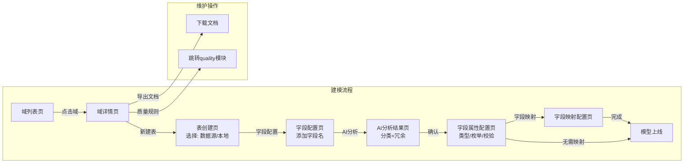

# 设计日记 - 主数据建模引擎（modeling）

> 说明：该模块是系统的基石，管理主数据模型全生命周期——域、表（数据源表/本地表）、字段定义与属性、字段映射关系，配套 AI 字段分类/冗余检测和模型文档导出。

---

## 2026-07-30 v11 — 第八十八轮问题1/2/3：设主字段改图标按钮 + 属性配置分组修复 + 删属性表主字段列【局部推翻 v10 文字链接】

1. **「设为主字段」改图标按钮**（问题1，局部推翻 v10 文字链接形式）：组合字段表主字段列蓝色长文字链接 → KeyOutlined 灰色图标按钮 + tooltip「设为主字段」，列宽 110→70；已设主字段仍显金色 tag。
2. **属性配置分组与字段分组不一致修复**（问题2）：根因为 loadAttrTabData 计算字段行硬编码 `group: null`，导致已分组计算字段在属性 Tab 永远落入「未分组」；改为 `group: c.group ?? null`（ComputedFieldModel 类型已含 group）。
3. **删属性配置「主字段」列**（问题3）：主字段能力已由组合字段表（v10 独立列）承载，属性表重复；删 attrColumns 主字段列 + 模板分支 + openMembersDistinctFromAttr 函数（删前 grep 零引用）。

**验证**：vue-tsc 0 errors；Browser 端到端 PASS（/modeling/domains/8/fields 三项均确认）。

## 2026-07-30 v10 — 组合字段表新增「主表/主字段」独立列（第八十七轮测试报告问题1）

- DomainFieldConfig 组合字段表在「操作」列前插入两列：**主表**（只读金色 tag，无主表显灰色「—」，不可点击）、**主字段**（已设显金色 tag；未设/可改时提供「设为主字段」链接→`setPrimaryFromComposite` 走 set-primary-field 端点）；移除原内联在字段名旁的 tag 展示。
- 与 v9 主字段机制兼容：仅 UI 层重排，后端端点/自动分配逻辑不变。
- 验证：vue-tsc 0 errors；Browser 端到端 PASS（截图 output\A1_combined_fields_table.png）。

## 2026-07-30 v9 — 组合字段主字段机制（档案更新数据源头+一致性检查+未设置拦截）

### 设计决策（第八十五轮，用户三条背景，AskUserQuestion 三问确认）

1. **三决策**：①一致性规则=刷新时检测+告警不阻断（逐记录比对成员值与主字段值，数据以主字段为准落档）；②默认兜底=**无主表成员时留空强制人工设置**（⚠️ 非推荐项，用户明确选择），未设置主字段将拦截档案数据刷新；③主表变更=仅自动分配的跟随，人工指定的不动（primary_field_manual 标记）。
2. **根治旧缺陷**：原 `_upsert` 按表循环 `{**旧,**新}` 后写覆盖——组合字段实际是「最后处理的表」胜出而非主表。现 `_build_code_to_physical` 已设主字段时仅映射主字段成员（primary_locked 防兜底追加），其余成员仅进一致性检查。
3. **数据模型**：StandardField.primary_field(FK→Field SET_NULL) + primary_field_manual；`auto_assign_primary_field()`（active 成员仍有效不动→主表成员兜底→置空清 manual，filter(pk).update 绕 save 钩子）；Table.set_as_primary 加自动分配跟随循环；迁移 0026（AddField×2 + RunPython 存量取主表成员，无则留空）。
4. **API 契约**：set-primary-field 专用端点（field_id=id→manual=True，null→清标记重分配，非有效成员 400；序列化器 primary_field 只读）；4 处成员变更钩子（apply_standards/create/add_member/remove_member）；聚合输出 primary_field_id/label(表名.编码)/manual，members-distinct 输出 table_is_primary/is_primary_field。
5. **archive 侧**：`_validate_primary_fields`（域内活跃且有成员的 SF 必须有效主字段，同步/预检开头拦截 stats.errors+primary_field_missing）；一致性检查三方法 `_build_code_checks/_collect_check_values/_run_consistency_check`（每表拉取后按主键采集、字符串归一比对，产出 stats.consistency_check：checked_fields/mismatch_count/mismatch_records/samples≤20）。
6. **前端**：组合字段表成员行金色「主字段/主表」tag；成员抽屉主字段卡片金边框+「设为主字段」链接；属性配置 Tab「主字段」列（label+自动/手动小标，未设置红标可点开抽屉）；ArchiveDetail showConsistencyWarning（mismatch_count>0 时 Modal.warning 展示不一致样本≤10 行）。

### 验证（端到端 ALL PASS）

migrate 0026 OK（存量 STORE_NO→68、STORE_NAME→69 自动分配到主表成员）✓check 0 issues✓vue-tsc 0 errors✓API 五项实测（非法成员 400✓人工指定 manual=True✓null 恢复自动✓置空后 refresh-preview 拦截文案+primary_field_missing✓refresh-data 一致性检查真实生效：2 字段/33 记录/69 处不一致含主字段值 vs 成员值样本✓）✓Browser 端到端 6 步全 PASS 无控制台错误（测试残留已恢复自动态）。一致性检查发现真实数据质量问题：33 条记录的门店名称在成员表间不一致。

---

## 2026-07-30 v8 — 字段所有权更名「维护方」+ 默认 source + 属性表主表/主键标识

### 设计决策（第八十四轮测试报告 2 项，AskUserQuestion 三问确认）

1. **术语更名**（问题1）：「字段所有权：以源为准/以我为准」全链路更名为「字段维护方：源系统维护(source)/档案维护(archive)」——列名「所有权」→「维护方」，档案编辑抽屉橙标「以我为准」→「档案维护」，编辑拦截报错「以下字段由源系统维护，不可编辑」，refresh-preview diff 属性标签「所有权」→「维护方」且值经 ownership_labels 映射中文。历史迁移 0023 文案不动。
2. **默认值改 source + 存量全刷**（问题1）：Field/StandardField.ownership default 'archive'→'source'（迁移 0025 AlterField×2 + RunPython set_all_ownership_source 存量 exclude(ownership='source') 全刷，reverse=noop）。用户已确认接受：此前手动配置「以我为准」的字段被覆盖需重新配置；档案侧人工修正值下次刷新会被源覆盖。前端 loadAttrTabData ownership 兜底、types 注释同步改 source。
3. **属性表主表/主键标识**（问题2，只读展示，设置入口仍在管理表页）：standard-fields 聚合 API 新契约——equiv/solo 行加 `tables: [{name, is_primary}]`（equiv=成员表按 table_id 去重）+ `is_primary_key: bool`（equiv=任一成员为主键即 true）；前端属性表 11 列：「字段编码」列前主键字段加金色 KeyOutlined 钥匙标（#faad14 与 TableList 一致，tooltip「主键字段」），新增「所属表」列（表名+金色 gold tag「主表」，equiv 行列全成员表，空显 —）；计算字段行 tables=[]、is_primary_key=false。

### 验证（端到端 ALL PASS）

migrate 0025 OK（存量全刷生效）✓check 0 issues✓vue-tsc 0 errors✓API 实测 domain=8 28 行 ownership 全 source、STORE_NO is_primary_key=true+7 成员表含主表标记✓Browser 端到端 14/14 PASS（11 列表头/钥匙标/主表 tag×15/维护方开关文案/28 开关全 source/计算字段固定「档案维护」文本/无旧术语残留）无控制台错误✓。

---

## 2026-07-22 v7 — StandardField 架构重构（概念层/实现层分离）

### 背景

v6 的字段去重引入了 `FieldEquivalenceGroup`，但它只是一个"虚拟分组"，不承载属性配置。用户质疑"字段分组挂载在物理字段上"的架构——概念层和实现层没有分离，后续 REQ-005（API字段配置）、REQ-003（档案表单生成）、REQ-006（质量规则引用）都无法优雅支撑。

### 核心架构理念

**双层分离**：
- **概念层（StandardField）**：一等公民，承载属性配置（type/length/enum/required/default_value），是**配置源**
- **实现层（Physical Field）**：保留属性字段作为**同步缓存**，通过 `standard_field` 外键关联

**配置流向（单向依赖）**：
```
用户配置 → StandardField（概念层）
StandardField.save() 自动同步 → 所有成员 Physical Field（实现层）
```
Physical Field 依赖 StandardField，反向不依赖。

**分组挂载**：FieldGroup 挂载 StandardField（概念层），不再直接挂物理字段。分组 Tab 以标准字段为基本单位展示和操作。

### 关键决策

| 决策 | 选择 | 理由 |
|------|------|------|
| db_table | 从 modeling_fieldequivalencegroup 迁移到 modeling_standardfield | 语义一致性，Django 6 的 RenameModel 支持 ALTER TABLE RENAME |
| Physical Field 属性字段 | 保留（同步缓存） | 兼容现有查询，避免大规模重写 |
| 同步策略 | 自动同步（save() 钩子） | 概念层变更自动传播到实现层 |
| FieldGroup 挂载 | 挂 StandardField | 分组操作在概念层完成 |

### 后续扩展支撑

这个架构为以下需求奠定基础：
- **REQ-005 API字段配置**：StandardField 可作为 API 开放字段的配置单元
- **REQ-003 档案表单生成**：StandardField 驱动表单字段渲染
- **REQ-006 质量规则引用**：质量规则引用 StandardField 而非物理字段
- **REQ-009 版本管理**：StandardField 变更历史可追溯
- **跨表标准查询**（后续需求）：通过 StandardField → members → Field → Table 路径翻译查询

### 数据模型变更

**StandardField（原 FieldEquivalenceGroup 升级）**

| 字段 | 类型 | 说明 | 变更 |
|------|------|------|------|
| domain | FK → Domain | 所属域 | 保留 |
| standard_code | varchar(100) | 标准编码 | 保留 |
| standard_name | varchar(200) | 标准中文名 | 保留 |
| source | varchar(20) | 来源（ai/manual） | 保留 |
| field_type | varchar(30) | 数据类型 | **新增** |
| length | int | 长度 | **新增** |
| required | boolean | 必填 | **新增** |
| default_value | varchar(500) | 默认值 | **新增** |
| enum_values | JSON | 枚举值 | **新增** |
| date_format | varchar(50) | 日期格式 | **新增** |
| validation_rule | JSON | 校验规则 | **新增** |
| updated_at | datetime | 更新时间 | **新增** |

**Field 模型变更**
- `equivalence_group` → `standard_field`（related_name='members'）

**FieldGroup 模型变更**
- 新增 `standard_field` 外键（null=True，迁移期兼容旧 group）

### API 变更

| 接口 | 方法 | 路径 | 说明 | 变更 |
|------|------|------|------|------|
| 标准字段 CRUD | CRUD | /api/standard-fields/ | 原 /api/field-equivalence-groups/ | **重命名** |
| 检测标准字段 | POST | /api/fields/detect-standards/ | 原 detect-duplicates | **重命名** |
| 应用标准字段 | POST | /api/fields/apply-standards/ | 原 apply-equivalence | **重命名** |
| 标准字段聚合列表 | GET | /api/fields/standard-fields/ | 分组 Tab 用 | 保留 |

### 自动同步机制

`StandardField.save()` 重写：
1. 检测属性字段是否变更（field_type/length/required/default_value/enum_values/date_format/validation_rule）
2. 变更时调用 `_sync_attrs_to_members()`：批量 update 所有成员 Physical Field
3. enum_values 同步：同步到 FieldOption（删除旧选项、创建新选项）

### 数据迁移

- 迁移脚本：`backend/scripts/migrate_standard_field_attrs.py`
- 结果：9 个标准字段属性迁移完成，3 条冲突记录（取第一个成员为准）

### 前端类型映射

| 旧名称 | 新名称 | 说明 |
|--------|--------|------|
| FieldEquivalenceGroup | StandardFieldModel | 标准字段实体（CRUD 用） |
| StandardField | StandardFieldAggregate | 分组 Tab 聚合视图 |
| EquivalenceMember | StandardFieldMember | 成员字段 |
| EquivalenceSuggestion | StandardFieldSuggestion | 检测建议 |
| fieldEquivalenceApi | standardFieldApi | API 对象 |
| detectDuplicates | detectStandards | 检测方法 |
| applyEquivalence | applyStandards | 应用方法 |

**变更记录**：StandardField 架构重构 —— 概念层/实现层分离，StandardField 升级为概念层一等公民，承载属性配置，自动同步到成员物理字段。

---

## 2026-07-13 v3 — 域管理操作重构：管理表 / 关系管理 / 字段管理

### 变更概要

1. **域列表操作重新划分为 4 个入口**：管理表 | 关系管理 | 字段管理 | 删除。
2. **管理表 → 可展开查看字段**：TableList 页面新增 expandable 行，点击行展开显示该表所有字段及启用/停用开关。
3. **关系管理**：原「字段映射配置」重命名为「关系管理」，路径与功能不变。
4. **字段管理 → 全量字段平铺编辑**：DomainFieldConfig 页面改为展示域下所有表的全部字段，支持内联编辑属性（类型/长度/必填/默认值）和枚举值管理。
5. **batch_update_attributes 支持 status 字段**：后端新增 `status` 属性处理，支持前端字段启用/停用切换。

### 交互变更

**域列表操作**

| 操作 | 说明 | 目标页面 |
|------|------|---------|
| 管理表 | 列表展示所有表，支持新建/删除；点击行展开查看字段及启用/停用 | TableList |
| 关系管理 | 配置域内表与表之间的字段映射关系 | DomainFieldMapping |
| 字段管理 | 平铺展示域下所有字段，内联编辑属性与枚举值 | DomainFieldConfig |
| 删除 | 删除域 | 弹窗确认 |

**TableList — 管理表**

- 保留新建表、删除表功能
- 新增 expandable 行：点击表格行展开，显示该表的所有字段
- 展开行展示：字段名称、编码、类型、启用/停用开关
- 切换启用/停用调用 `batchUpdateAttributes` 更新 `status`
- 预加载所有表的字段数据

**DomainFieldConfig — 字段管理**

- 展示域下所有表的所有字段，按表分组
- 每组表有标题栏（表名、编码、字段数）
- 每个字段一行，支持内联编辑：
  - 类型（下拉选择）
  - 长度（数字输入）
  - 必填（开关）
  - 默认值（文本输入）
  - 枚举选项（添加/删除标签）
- 「全部保存」按钮统一调用 `batchUpdateAttributes` 持久化

### API 变更

| 接口 | 方法 | 路径 | 说明 | 变更 |
|------|------|------|------|------|
| 批量更新字段属性 | PUT | /api/fields/batch-attributes/ | 新增 `status` 属性支持 | **变更** |

---

## 2026-07-13 v2 — 数据源配置 + 域级字段映射

### 变更概要

1. **新增数据源配置（DataSource）模型**：将外部数据库连接从 Table.source_config（JSON 内嵌）抽取为独立的数据源配置实体，支持系统级管理，Table 通过 FK 关联。
2. **表 type 变为生命周期状态**：创建后不可修改（read_only），编辑表单中 type 选择器置灰。
3. **字段枚举选项持久化**：batch_update_attributes 接口增加 options 处理，删除旧选项、写入新选项。
4. **字段映射提升为域级功能**：新增 DomainFieldMapping 页面，从域维度查看和管理所有表间映射关系。
5. **新增系统设置模块**：包含数据源配置管理页面。

### 业务流程更新

**流程状态机变更**

| 节点 | 入口状态 | 出口状态 | 触发条件 | 异常处理 |
|------|---------|---------|---------|---------|
| 配置数据源 | 无数据源 | 已配置数据源 | 用户在系统设置中新建数据源 | 连接信息校验失败→提示 |
| 建表（数据源） | 已建域 | 已建数据源表 | 用户选择已有数据源+外部表名 | 数据源不可用→提示检查状态 |

**变更记录**：v1→v2 新增数据源配置流程，建表时的数据源配置从自由输入改为选择已有数据源。

---

### 功能更新

**功能清单变更**

| 功能ID | 功能名 | 类型 | 描述 | 来源需求 |
|--------|--------|------|------|---------|
| F-010 | 数据源配置 | CRUD | 系统设置中管理数据库连接（名称/类型/主机/端口/库名/用户/密码） | REQ-001（细化） |
| F-007 | 字段映射配置 | 业务操作 | **变更**：从表级页面提升为域级页面，以域维度展示和管理所有映射关系 | REQ-001（细化） |

**业务-功能-数据匹配矩阵更新**

| 业务操作 | 涉及功能 | 涉及表 | 数据流转 | 事务边界 |
|---------|--------|-------|---------|---------|
| 配置数据源 | F-010 | data_source | 表单→写入data_source表 | 单行插入 |

---

### 数据更新

#### 新增表：md_data_source

| 表名 | 说明 | 主键 | 核心字段 | 关联表 |
|------|------|------|---------|-------|
| md_data_source | 数据源配置 | ds_id | name, db_type, host, port, db_name, username, password, status, created_at, updated_at | — |

**md_data_source 数据字典**

| 字段 | 类型 | 长度 | 约束 | 枚举值 | 说明 |
|------|------|------|------|-------|------|
| ds_id | bigint | — | PK, AUTO | — | 主键 |
| name | varchar | 100 | NOT NULL, UNIQUE | — | 数据源名称 |
| db_type | varchar | 20 | NOT NULL | postgresql, mysql | 数据库类型 |
| host | varchar | 200 | NOT NULL | — | 主机地址 |
| port | int | — | DEFAULT 5432 | — | 端口 |
| db_name | varchar | 100 | NOT NULL | — | 数据库名 |
| username | varchar | 100 | — | — | 用户名 |
| password | varchar | 200 | write_only | — | 密码（仅写入，不返回） |
| status | varchar | 20 | DEFAULT 'active' | active, inactive | 状态 |
| created_at | datetime | — | NOT NULL | — | 创建时间 |
| updated_at | datetime | — | NOT NULL | — | 更新时间 |

#### md_table 变更

| 字段 | 类型 | 长度 | 约束 | 枚举值 | 变更说明 |
|------|------|------|------|-------|---------|
| data_source_id | bigint | — | FK → md_data_source, NULLABLE | — | **新增**：关联数据源 |
| external_table_name | varchar | 100 | — | — | **新增**：外部表名 |
| source_config | jsonb | — | DEPRECATED | — | **废弃**：改用 data_source + external_table_name |
| type | varchar | 20 | read_only（创建后） | local, source | **变更**：变为生命周期状态 |

#### 跨模块数据关系更新

| 本模块表 | 外部模块 | 关联方式 | 说明 |
|---------|---------|---------|------|
| md_data_source | — | — | 仅被 md_table 引用，独立管理 |

---

### 交互更新

**页面/界面变更**

| 页面 | 说明 | 涉及功能 | 操作入口 |
|------|------|---------|---------|
| 系统设置-数据源管理 | 新增页面，数据源CRUD | F-010 | 侧边导航→系统设置 |
| 表编辑弹窗 | type 选择器在编辑时置灰 | F-002 | 域详情页→编辑表 |
| 表创建弹窗（数据源） | 数据源选择改为下拉选择已有数据源+外部表名输入 | F-002 | 域详情页→新建表（选择数据源表） |
| 域级字段映射页 | 新增页面，展示域下所有表间映射关系 | F-007 | 域列表页→字段映射 |

**变更记录**：v1→v2

---

### API 契约更新

| 接口 | 方法 | 路径 | 说明 | 变更 |
|------|------|------|------|------|
| 数据源列表 | GET | /api/data-sources | 分页查询数据源 | **新增** |
| 创建数据源 | POST | /api/data-sources | 新建数据源 | **新增** |
| 更新数据源 | PUT | /api/data-sources/{id} | 编辑数据源 | **新增** |
| 删除数据源 | DELETE | /api/data-sources/{id} | 删除数据源 | **新增** |
| 字段映射列表 | GET | /api/field-mappings?domain={id} | 按域查询映射 | **变更**：新增 domain 过滤参数 |
| 批量更新字段属性 | PUT | /api/fields/batch-attributes/ | 批量更新字段属性+枚举选项 | **变更**：增加 options 处理 |

---

## 2026-07-13 初始设计 v1

### 业务流程

**流程状态机**（基于 reqa business-flow 流程一）

| 节点 | 入口状态 | 出口状态 | 触发条件 | 异常处理 |
|------|---------|---------|---------|---------|
| 创建域 | 无域 | 已建域 | 用户提交域信息 | 域编码重复→禁止创建 |
| 建表（本地） | 已建域 | 已建本地表 | 用户提交表名称/编码/描述 | — |
| 建表（数据源） | 已建域 | 已建数据源表 | 用户配置外部库连接+表名 | 连接失败→提示检查配置 |
| 配字段名称 | 已建表 | 字段名称已定义 | 用户添加字段名 | — |
| AI分析 | 字段名称已定义 | AI分类+冗余检测完成 | 用户点击"AI分析" | API超时→降级为平铺+提示 |
| 审核分类 | AI结果展示 | 分类已确认/冗余已排除 | 用户拖拽调整/确认 | — |
| 字段属性配置 | 分类已确认 | 属性已配置 | 用户配置类型/枚举/校验 | 存量不兼容→阻止+提示 |
| 字段映射 | 属性已配置 | 映射已配置 | 用户配置字段→字段映射 | 类型不匹配→提示 |
| 模型上线 | 映射已配置/无需映射 | 模型已上线 | 用户确认 | — |
| 新增字段（存量） | 模型已上线 | 字段已新增 | 用户在属性界面新增 | 自动处理存量默认值 |
| 修改字段属性 | 模型已上线 | 属性已变更 | 用户修改属性 | 存量不兼容→阻止 |
| 作废字段 | 模型已上线 | 字段已作废 | 用户确认作废 | 存量保留·历史可查 |

**变更记录**：初始设计

---

### 功能

**功能清单**

| 功能ID | 功能名 | 类型 | 描述 | 来源需求 |
|--------|--------|------|------|---------|
| F-001 | 域管理 | CRUD | 创建、编辑、删除主数据域 | REQ-001 |
| F-002 | 表管理 | CRUD | 在域下创建/编辑表，分数据源表和本地数据表 | REQ-001 |
| F-003 | 字段名称配置 | 业务操作 | 为表添加字段名称和基础信息 | REQ-001 |
| F-004 | AI字段分类与冗余检测 | AI业务 | AI自动分类字段+检测冗余字段 | REQ-002 |
| F-005 | 分类方案管理 | 业务操作 | 拖拽调整分组、合并/重命名、处理冗余 | REQ-002 |
| F-006 | 字段属性配置界面 | 业务操作 | 集中配置类型/枚举/长度/必填/校验 | REQ-010 |
| F-007 | 字段映射配置 | 业务操作 | 字段→字段映射，支持联合主键 | REQ-001 |
| F-008 | 字段作废 | 业务操作 | 标记字段为废弃，界面隐藏·存量保留 | REQ-001 |
| F-009 | 模型文档导出 | 导出 | 将模型导出为PDF/Markdown | REQ-011 |

**业务-功能-数据匹配矩阵**

| 业务操作 | 涉及功能 | 涉及表 | 数据流转 | 事务边界 |
|---------|--------|-------|---------|---------|
| 创建一个域+表+字段 | F-001, F-002, F-003 | domain, table, field | 表单→元数据仓库 | 各步骤独立提交 |
| AI分析 | F-004, F-005 | field, field_group | field名称→LLM API→分组建议→保存 | API调用非事务 |
| 配置字段属性 | F-006 | field, field_option | 属性表单→更新field+option | 单表更新事务 |
| 配置字段映射 | F-007 | field_mapping | 映射表单→写入mapping表 | 联合主键整体提交 |
| 作废字段 | F-008 | field | 更新field状态为废弃 | 单行更新 |

---

### 数据

#### 表结构

| 表名 | 说明 | 主键 | 核心字段 | 关联表 |
|------|------|------|---------|-------|
| md_domain | 主数据域 | domain_id | name, code, description, status, created_at, updated_at | — |
| md_table | 域下的实体表 | table_id | domain_id, name, code, description, type(local/source), status, source_config(JSON), created_at | md_domain |
| md_field | 表的字段定义 | field_id | table_id, name, code, field_type, length, required, default_value, validation_rule(JSON), group_id, sort_order, status(active/deprecated), created_at | md_table, md_field_group |
| md_field_group | 字段分类分组 | group_id | domain_id, name, sort_order, created_at | md_domain |
| md_field_option | 枚举类型的选项值 | option_id | field_id, label, value, sort_order, created_at | md_field |
| md_field_mapping | 字段映射关系 | mapping_id | source_table_id, source_field_id, target_table_id, target_field_id, created_at | md_field |

#### 数据字典

**md_domain**

| 字段 | 类型 | 长度 | 约束 | 枚举值 | 说明 |
|------|------|------|------|-------|------|
| domain_id | bigint | — | PK, AUTO | — | 主键 |
| name | varchar | 100 | NOT NULL | — | 域名称 |
| code | varchar | 50 | NOT NULL, UNIQUE | — | 域编码 |
| description | varchar | 500 | — | — | 域描述 |
| status | varchar | 20 | NOT NULL, DEFAULT 'active' | active, deprecated | 状态 |
| created_at | datetime | — | NOT NULL | — | 创建时间 |
| updated_at | datetime | — | — | — | 更新时间 |

**md_table**

| 字段 | 类型 | 长度 | 约束 | 枚举值 | 说明 |
|------|------|------|------|-------|------|
| table_id | bigint | — | PK, AUTO | — | 主键 |
| domain_id | bigint | — | FK → md_domain | — | 所属域 |
| name | varchar | 100 | NOT NULL | — | 表名称 |
| code | varchar | 50 | NOT NULL | — | 表编码 |
| description | varchar | 500 | — | — | 描述 |
| type | varchar | 20 | NOT NULL | local, source | 表类型 |
| source_config | jsonb | — | — | — | 数据源配置(连接串/库名/表名) |
| status | varchar | 20 | NOT NULL, DEFAULT 'active' | active, deprecated | 状态 |
| created_at | datetime | — | NOT NULL | — | 创建时间 |

**md_field**

| 字段 | 类型 | 长度 | 约束 | 枚举值 | 说明 |
|------|------|------|------|-------|------|
| field_id | bigint | — | PK, AUTO | — | 主键 |
| table_id | bigint | — | FK → md_table | — | 所属表 |
| name | varchar | 100 | NOT NULL | — | 字段名称 |
| code | varchar | 50 | NOT NULL | — | 字段编码 |
| field_type | varchar | 30 | NOT NULL | string, number, date, boolean, enum | 数据类型 |
| length | int | — | — | — | 最大长度 |
| required | boolean | — | DEFAULT false | — | 是否必填 |
| default_value | varchar | 500 | — | — | 默认值 |
| validation_rule | jsonb | — | — | — | 校验规则(正则等) |
| group_id | bigint | — | FK → md_field_group | — | 所属分组 |
| sort_order | int | — | DEFAULT 0 | — | 排序号 |
| status | varchar | 20 | NOT NULL, DEFAULT 'active' | active, deprecated | 状态 |
| created_at | datetime | — | NOT NULL | — | 创建时间 |

**md_field_group**

| 字段 | 类型 | 长度 | 约束 | 枚举值 | 说明 |
|------|------|------|------|-------|------|
| group_id | bigint | — | PK, AUTO | — | 主键 |
| domain_id | bigint | — | FK → md_domain | — | 所属域 |
| name | varchar | 100 | NOT NULL | — | 分组名称 |
| sort_order | int | — | DEFAULT 0 | — | 排序号 |
| created_at | datetime | — | NOT NULL | — | 创建时间 |

**md_field_option**

| 字段 | 类型 | 长度 | 约束 | 枚举值 | 说明 |
|------|------|------|------|-------|------|
| option_id | bigint | — | PK, AUTO | — | 主键 |
| field_id | bigint | — | FK → md_field | — | 所属字段 |
| label | varchar | 100 | NOT NULL | — | 选项显示名 |
| value | varchar | 100 | NOT NULL | — | 选项值 |
| sort_order | int | — | DEFAULT 0 | — | 排序号 |
| created_at | datetime | — | NOT NULL | — | 创建时间 |

**md_field_mapping**

| 字段 | 类型 | 长度 | 约束 | 枚举值 | 说明 |
|------|------|------|------|-------|------|
| mapping_id | bigint | — | PK, AUTO | — | 主键 |
| source_table_id | bigint | — | FK → md_table | — | 源表 |
| source_field_id | bigint | — | FK → md_field | — | 源字段 |
| target_table_id | bigint | — | FK → md_table | — | 目标表 |
| target_field_id | bigint | — | FK → md_field | — | 目标字段 |
| created_at | datetime | — | NOT NULL | — | 创建时间 |

> 联合主键：同一张 source_table 下的一组 mapping 记录构成一个组合映射。

#### 跨模块数据关系

| 本模块表 | 外部模块 | 关联方式 | 说明 |
|---------|---------|---------|------|
| md_table, md_field | archive | 作为元数据被 archive 消费 | archive 读取模型元数据渲染档案页面 |
| md_field | quality | 字段定义被 quality 读取 | quality 根据字段类型和校验规则执行质量检查 |

---

### 交互

**页面/界面**

| 页面 | 说明 | 涉及功能 | 操作入口 |
|------|------|---------|---------|
| 域列表页 | 展示所有域，支持新建/编辑/删除 | F-001 | 侧边导航→主数据建模 |
| 域详情页 | 展示域信息，含表列表Tab和规则Tab | F-001, F-002 | 点击域 |
| 表创建页 | 选择表类型，配置表信息或数据源连接 | F-002 | 域详情页→新建表 |
| 字段配置页 | 为表添加字段名称 | F-003 | 表详情→配置字段 |
| AI分析结果页 | 展示分类分组和冗余标记，可拖拽调整 | F-004, F-005 | 字段配置→AI分析 |
| 字段属性配置页 | 列表展示所有字段，逐行配置属性 | F-006 | AI分析确认后自动进入 |
| 字段映射配置页 | 配置本表字段→目标表字段的映射关系 | F-007 | 表详情→字段映射 |
| 模型文档导出 | 选择导出格式，生成并下载文档 | F-009 | 域详情页→导出 |

**页面线框图**（核心流程跳转）



**变更记录**：初始设计

---

### API 契约

| 接口 | 方法 | 路径 | 说明 |
|------|------|------|------|
| 域列表 | GET | /api/domains | 分页查询域列表 |
| 创建域 | POST | /api/domains | 新建域 |
| 更新域 | PUT | /api/domains/{id} | 编辑域 |
| 删除域 | DELETE | /api/domains/{id} | 删除域（有表时阻止） |
| 表列表 | GET | /api/domains/{id}/tables | 域下表列表 |
| 创建表 | POST | /api/tables | 建表（含数据源配置） |
| 更新表 | PUT | /api/tables/{id} | 编辑表 |
| 删除表 | DELETE | /api/tables/{id} | 删除表 |
| 字段列表 | GET | /api/tables/{id}/fields | 表下字段列表 |
| 批量保存字段 | POST | /api/tables/{id}/fields/batch | 批量添加/更新字段名称 |
| AI分析 | POST | /api/tables/{id}/ai-analyze | 调用AI分类+冗余检测 |
| 确认分类方案 | PUT | /api/tables/{id}/classification | 保存分类和冗余处理结果 |
| 批量更新字段属性 | PUT | /api/fields/batch | 集中配置字段属性 |
| 字段映射列表 | GET | /api/tables/{id}/mappings | 映射列表 |
| 保存映射 | POST | /api/tables/{id}/mappings | 批量保存映射关系 |
| 作废字段 | PUT | /api/fields/{id}/deprecate | 作废字段 |
| 模型文档导出 | GET | /api/domains/{id}/export | 导出文档（format=pdf|md） |
| 字段分组管理 | CRUD | /api/field-groups | 分组增删改 |
| 枚举选项管理 | CRUD | /api/fields/{id}/options | 枚举值增删改排序 |

---

## 域管理三页增强（迭代设计）

### 背景与目标
围绕「表管理 / 关系管理 / 字段管理」三页重构，补齐停用控制、字段注释维护、ER 图可视化，并引入 AI 服务层支撑自动分组与语义识别。

### 关键设计决策
- **AI 服务层抽象**：新增 `apps/modeling/ai_service.py`，统一入口 `auto_group_fields(fields)` 与 `semantic_recognition(fields)`。通过 `settings.AI_API_KEY` 是否配置决定走 OpenAI 兼容 `chat/completions`（`requests`，`response_format=json_object`）还是回退启发式模拟；LLM 返回解析失败时自动降级 fallback，保证不报错。配置项：`AI_API_BASE/AI_API_KEY/AI_MODEL/AI_TIMEOUT`（均读环境变量，默认空 key → 启发式）。
- **停用拦截**：`TableViewSet.toggle_status`（`PUT /api/tables/{id}/toggle-status/`）在目标为 `deprecated` 时检查 `FieldMapping`（源或目标含该表），存在则返回 400 + 受影响映射列表，提示先到关系管理解除；解决非星型模型中间表被误停用的问题。
- **ER 图可视化**：`DomainFieldMapping.vue` 引入 `@antv/x6`，节点=参与映射的表（网格布局），边=`FieldMapping`（label 为「源字段 → 目标字段」），随映射增删刷新。
- **字段管理双 Tab**：`DomainFieldConfig.vue` 拆为「字段分类」「字段属性配置」，两者均按 `field group` 分块（非按表），启用在前、停用在后，未分组置底。
  - 分类 Tab：注释内联编辑（失焦即存）、`a-auto-complete` 分组（匹配已有分组名 + 支持新建）、启用停用开关即时持久化；「AI自动分组」「AI字段语义识别」两按钮。
  - 属性 Tab：按字段类型动态显隐属性（`boolean` 无长度、默认值 TRUE/FALSE 选择；`date`/`number` 无长度；`string`/`enum` 才有长度）；枚举以「纯值」录入（后端存 `FieldOption.label=value=该值`）。
- **字段模型扩展**：`Field` 新增 `comment`（字段注释）、`semantic_note`（语义标识：同义词/歧义说明），迁移 `0003_field_comment_field_semantic_note`。

### 新增/变更 API

| 接口 | 方法 | 路径 | 说明 |
|------|------|------|------|
| 表状态切换 | PUT | /api/tables/{id}/toggle-status | 启用/停用；停用前校验字段映射，存在则 400 |
| AI 自动分组 | POST | /api/fields/ai-auto-group?domain={id} | 域下 active 字段自动分组，创建/复用分组并回写 |
| AI 语义识别 | POST | /api/fields/ai-semantic?domain={id} | 补全空注释 + 写入 semantic_note，返回更新后字段 |
| 批量更新字段属性（扩展） | PUT | /api/fields/batch-attributes | 属性列表新增 comment、semantic_note |

### 数据模型增量

**md_field（新增列）**

| 字段 | 类型 | 长度 | 约束 | 说明 |
|------|------|------|------|------|
| comment | varchar | 500 | DEFAULT '' | 字段注释（数据源带出则沿用，AI 仅补空缺） |
| semantic_note | varchar | 500 | DEFAULT '' | 语义标识：同义词/语义相似/歧义说明 |

**变更记录**：域管理三页增强 —— AI 服务层、ER 图、停用拦截、字段注释与语义标识、字段管理双 Tab。

---

## 2026-07-17 v4 — 域管理功能增强第二轮

### 变更概要

1. **ER 图位置持久化**：Table 模型新增 `er_node_x`/`er_node_y` 字段，拖拽后防抖 500ms 自动保存，刷新不再丢失布局。新增「重置布局」按钮。
2. **Excel 导入 + 本地建表**：新增 `excel_service.py`（parse_excel / infer_field_types / create_local_table_from_excel），AI 优先推断字段类型，降级启发式。本地建表直接执行 CREATE TABLE SQL。
3. **数据源 schema 浏览**：DataSourceViewSet 新增 `list_schemas` action，`list_external_tables` 支持 `?schema=` 参数。新建表对话框数据源分支改为左右分栏（左：schema 列表，右：表列表多选+搜索）。
4. **字段管理弹窗**：TableList 操作列新增「字段管理」按钮，打开 900px 弹窗，含字段列表 + 数据预览双 Tab。字段列表支持注释编辑（失焦自动保存）、启停开关。去掉了长度/必填/保存按钮。
5. **新建表对话框重构**：移除「创建方式」切换。本地数据表 = Excel 多文件上传 → 表格形式配置（编码/英文名/中文名/文件名一行一个）→ 预览字段 → 批量导入。数据源表 = 选数据源 → 左右分栏浏览 → 批量勾选创建。
6. **创建时间格式统一**：抽取 `formatDateTime()` 工具函数，TableList / DomainFieldMapping 统一 `yyyy-MM-dd HH:mm:ss`。

### 新增/变更 API

| 接口 | 方法 | 路径 | 说明 |
|------|------|------|------|
| Excel 预览 | POST | /api/tables/preview-excel/ | 单文件解析 + AI 推断字段 |
| Excel 批量导入 | POST | /api/tables/import-excel/ | 多文件批量 CREATE TABLE + 创建 Table/Field 记录 |
| 保存 ER 位置 | PUT | /api/tables/{id}/save-er-position/ | 保存节点 x/y 坐标 |
| 批量重置 ER 位置 | POST | /api/tables/batch-reset-er-position/?domain= | 清空域下所有表的 ER 位置 |
| 数据源 schema 列表 | GET | /api/data-sources/{id}/schemas/ | PostgreSQL 查 information_schema |
| 数据源表列表（扩展） | GET | /api/data-sources/{id}/external-tables/?schema= | 支持指定 schema |

### 数据模型增量

**md_table（新增列）**

| 字段 | 类型 | 约束 | 说明 |
|------|------|------|------|
| er_node_x | integer | NULL | ER 图节点 X 坐标 |
| er_node_y | integer | NULL | ER 图节点 Y 坐标 |

### BUG 修复

| Bug | 原因 | 修复 |
|-----|------|------|
| 所有 API 返回 500 | Django 6.0.7 要求 DATABASES 配置 ATOMIC_REQUESTS 键 | config/settings.py + local_settings.py 添加 `'ATOMIC_REQUESTS': False` |

**变更记录**：域管理第二轮增强 —— Excel 导入建表、数据源分栏浏览、ER 位置持久化、字段管理弹窗、新建表重构。

---

## 2026-07-21 v5 — 关系管理功能增强

### 变更概要

1. **列表数据模型修正**：映射列表从按表对分组改回每条映射独立一行（一行=一条关系）。
2. **n/m 表配置进度标识恢复**：重新加载 `pkStatusData` + 进度条，显示已配置/总数。
3. **主键字段黄色标识**：映射列表中主键字段用 ⚿ 图标 + 黄色文字标识。
4. **联合主键虚拟字段选项**：源/目标字段下拉均支持联合主键虚拟选项（2+ PK 字段时自动出现）。
5. **目标表下拉排除源表**：新建映射时目标表选择列表过滤掉当前源表。
6. **ER图联合主键虚拟字段**：2+ PK 字段合并为单个虚拟行，边去重+组合标签。
7. **ER图字段中文名优先**：两行布局（中文名 12px + 英文名 10px 灰色等宽）。

### 关键设计决策

- **列表不分组**：每条 FieldMapping 记录直接对应一行，附带 `is_source_pk` / `is_target_pk` 标记，不再按 `(source_table, target_table)` 分组。
**变更记录**：关系管理功能增强 —— 列表一行=一映射、主键标识、联合主键虚拟字段、ER图两行字段显示。

---

## 2026-07-21 v6 — 4项需求增强（主键列/ER缩放/分页/字段去重）

### 需求1：表列表主键列
- `TableListSerializer.get_primary_keys` 返回本表 `is_primary_key=True` 字段（id/code/name/comment），按 sort_order 排序。
- 前端 TableList.vue 新增“主键”列，gold 色 tag + KeyOutlined 图标，无主键显示“-”。

### 需求2：ER图缩放工具栏
- DomainFieldMapping.vue ER 卡片 extra 增加工具栏：缩小/百分比/放大/适应(zoomToFit)/1:1/重置布局。
- `erZoom` ref 经 `graph.on('scale')` 事件同步实时百分比；保留 Ctrl+滚轮。

### 需求3：分页限制（20条截断）
- **根因**：全局 PAGE_SIZE=20 且默认 PageNumberPagination 未启用 page_size_query_param，前端传 page_size 无效。
- **方案**：新建 `config/pagination.py` StandardPagination（page_size_query_param='page_size', max_page_size=100000）；api/modeling.ts 管理类列表默认 withFullPage 拉全量。

### 需求4：字段去重（等价组）—— 分组前前置步骤
- **语义**：不删物理字段，新增 `FieldEquivalenceGroup`（domain+standard_code 唯一）记录跨表重复字段的等价关系；Field.equivalence_group 外键（SET_NULL）挂靠。
- **检测**：ai_service.detect_duplicate_fields —— AI 优先（_has_llm）+ 启发式降级（_normalize_code 按 code 去空格/下划线/短横线后小写归一化分桶，跨2+表且成员≥2构成等价组）。
- **接口**：POST /fields/detect-duplicates/（仅返回建议不落库）、POST /fields/apply-equivalence/（update_or_create 等价组并回写 Field，仅本域）、FieldEquivalenceGroupViewSet（列表/解散，解散先置空成员再删组）。
- **UI**：DomainFieldConfig.vue 新增“字段去重”Tab（顶部，顺序 去重→分组→属性）：AI检测→建议卡片勾选（可改标准中文名）→应用去重→已确认等价组表格（可解散）。
- **分组 Tab 联动**：新增 `GET /fields/standard-fields/` 返回标准字段列表（等价组聚合 + 独立物理字段），分组 Tab 里等价组折叠成一行“标准字段”（带 ⚓ 标识 + 成员 tag），拖拽/下拉分组时批量更新其下所有物理字段的 group。

### 关键设计决策（需求4）
- **物理字段保留**：去重仅建立“逻辑归并”（等价关系），不物理删除。等价组是 modeling→quality 的契约，供后续生成跨表一致性校验规则。
- **回写防跨域**：apply-equivalence 回写 Field 时附加 table__domain=domain 过滤，防止跨域误挂。

**变更记录**：主键列 + ER缩放工具栏 + 自定义分页拉全量 + 字段去重等价组（migration 0009）+ 分组 Tab 标准字段折叠（standard-fields 接口）。
