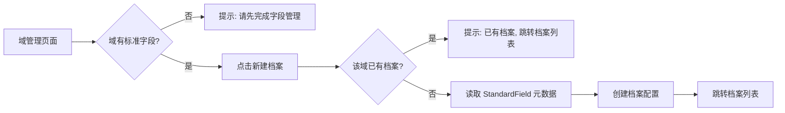
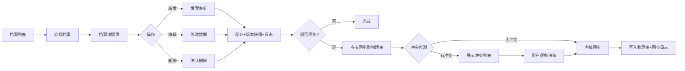
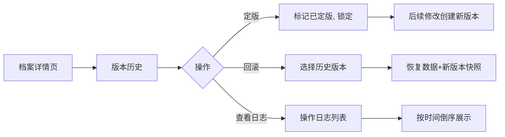
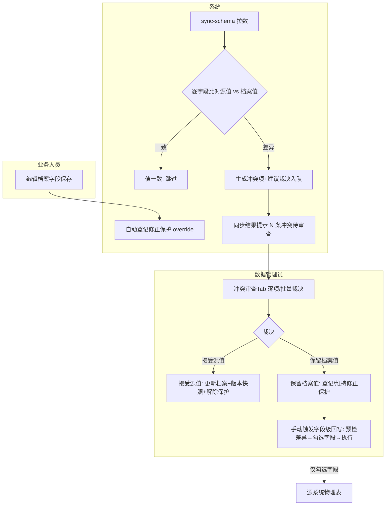
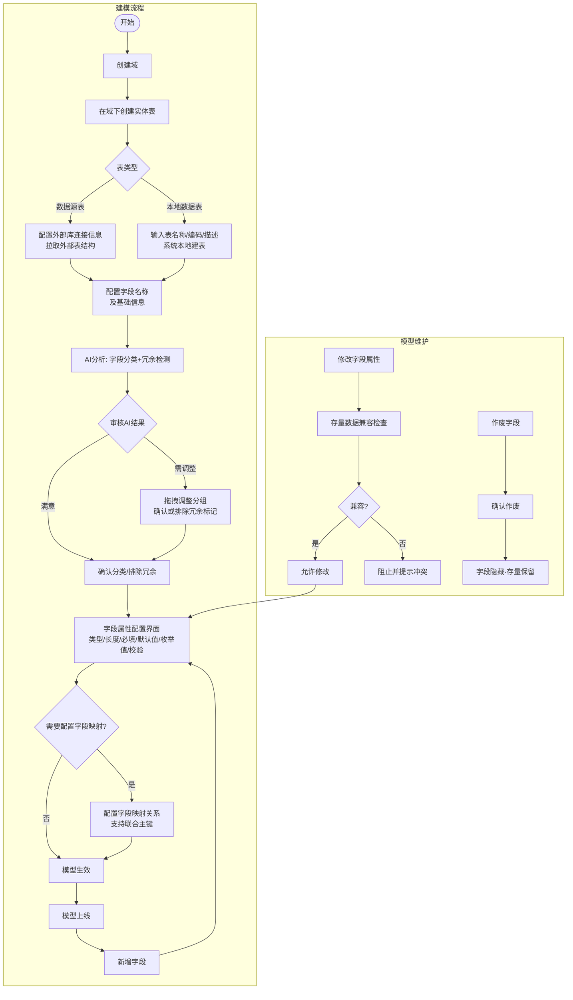
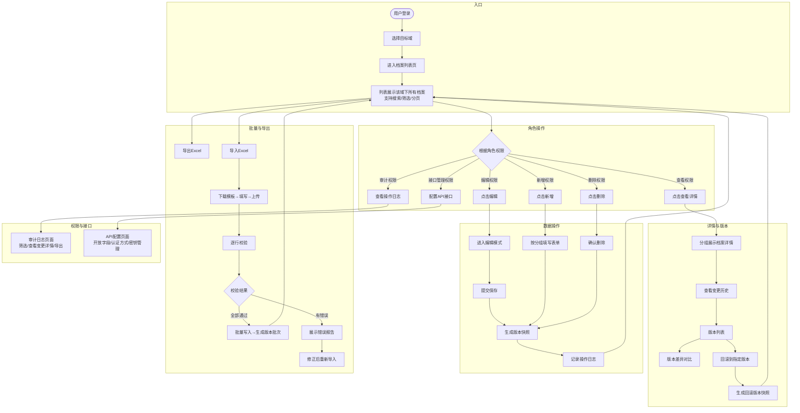
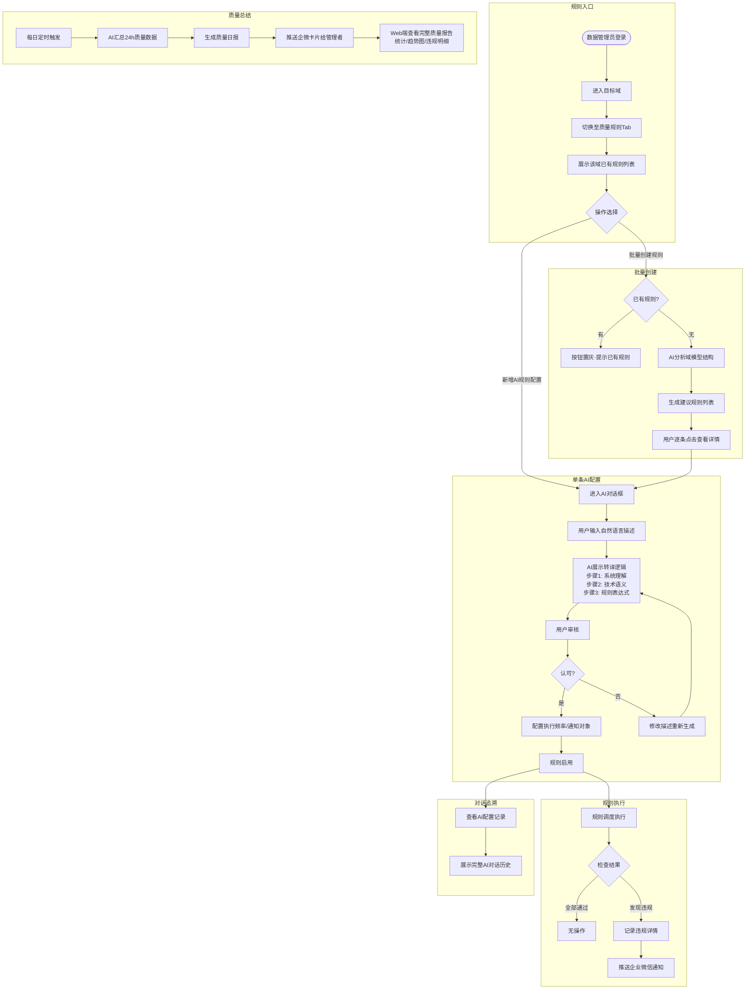
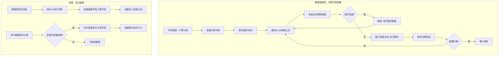
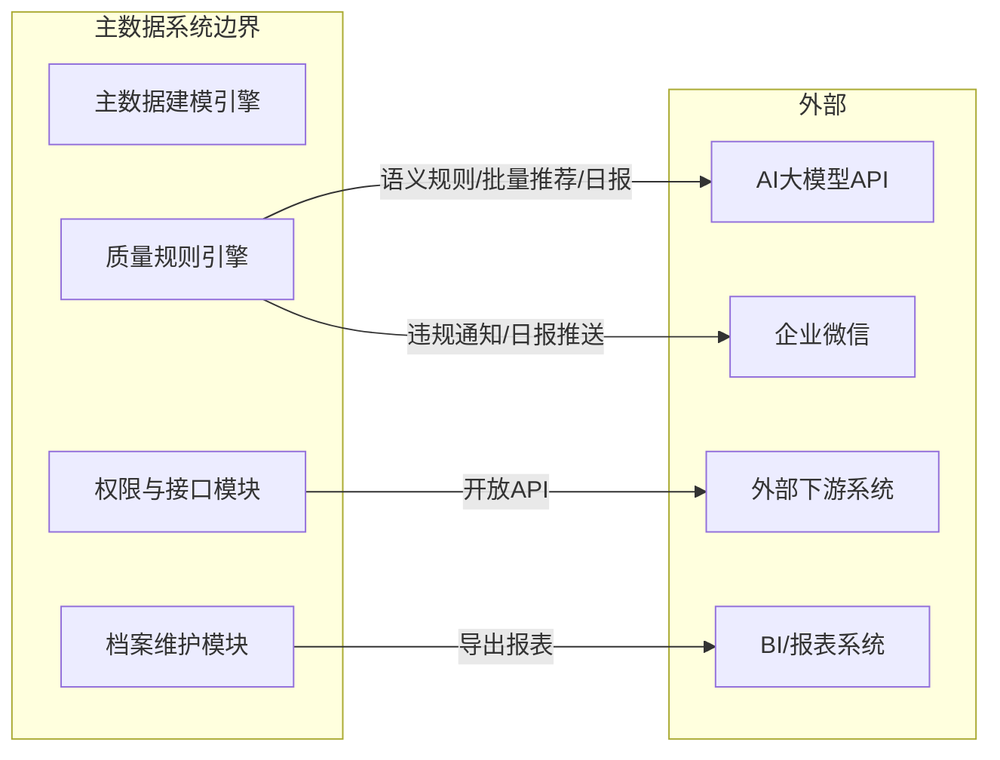

# 业务流程

---

## 流程一：域→档案创建

---

## 流程二：档案数据维护

---

## 流程三：版本管理与定版

---

## 流程四：MDM 存活裁决与冲突审查（REQ-018）

**异常路径**：同一字段重复冲突→旧项自动作废只留最新；回写失败→失败字段明细进同步日志不影响其他字段；裁决变更无版本快照→禁止提交。

---

## 数据流标注

| 操作 | 数据来源 | 数据去向 | 事务边界 |
|------|----------|----------|----------|
| 创建档案 | modeling.StandardField | archive.Archive（配置） | 单事务 |
| 新增记录 | 用户表单 | archive.ArchiveRecord（本地） | 单事务（记录+版本+日志） |
| 编辑记录 | 用户修改 | archive.ArchiveRecord（本地）+ 修正保护标记 | 单事务（版本+日志+保护登记） |
| 同步拉数（比对） | 源物理表 | 冲突队列（差异）/ ArchiveRecord（新增记录） | 分批事务 |
| 冲突裁决 | 冲突项 | archive.ArchiveRecord + 版本 + 血缘 | 单事务（逐项） |
| 字段级回写 | archive.ArchiveRecord（勾选字段） | modeling.DataSource（外部物理表） | 分批事务（每表独立） |
| 定版 | 用户操作 | archive.ArchiveVersion（状态变更） | 单事务 |
| 回滚 | archive.ArchiveVersion | archive.ArchiveRecord（覆盖） | 单事务（新版本+日志） |
# 业务流程

> 系统边界：主数据管理平台
> 外部系统：企业微信、AI大模型API

---

## 流程一：主数据建模全流程

**涉及角色**：数据管理员

**数据流标注**
| 步骤 | 数据输入 | 数据输出 | 存储 |
|------|----------|----------|------|
| 创建域 | 域名称/编码/描述 | 域元数据 | 元数据仓库 |
| 建表（数据源） | 外部库连接+表名 | 引入的表结构元数据 | 元数据仓库 |
| 建表（本地） | 表名称/编码/描述 | 表元数据+物理表 | 元数据仓库+数据库 |
| 配字段 | 字段名称列表 | 基础字段元数据 | 元数据仓库 |
| AI分析 | 字段名称+类型+语义 | 分类建议+冗余标记 | 元数据仓库 |
| 字段属性配置 | 类型/长度/枚举/校验 | 完整字段元数据 | 元数据仓库 |
| 字段映射 | 源字段→目标字段 | 关系元数据 | 元数据仓库 |

---

## 流程二：档案维护流程

**涉及角色**：业务人员、数据管理员、系统管理员、审计员

**数据流标注**
| 步骤 | 数据输入 | 数据输出 | 存储 |
|------|----------|----------|------|
| 选择域 | 域ID | 该域档案列表 | 元数据+档案数据库 |
| 新增/修改 | 分组表单数据 | 档案记录+版本快照 | 档案数据库+版本仓库 |
| 删除 | 记录ID | 删除标记 | 档案数据库（软删除） |
| 导入 | Excel文件 | 批量记录+版本批次 | 档案数据库+版本仓库 |
| 导出 | 筛选条件 | Excel文件 | 文件下载 |
| 版本操作 | 版本ID | 版本快照/差异对比 | 版本仓库 |
| 日志查询 | 筛选条件 | 操作日志列表 | 日志数据库 |

---

## 流程三：质量规则引擎流程（AI驱动）

**涉及角色**：数据管理员、AI大模型、企业微信

**数据流标注**
| 步骤 | 数据输入 | 数据输出 | 存储/外部 |
|------|----------|----------|-----------|
| AI语义配置 | 自然语言描述 | 规则表达式+转译记录 | AI大模型API+规则仓库 |
| AI批量生成 | 域模型元数据 | 推荐规则集 | AI大模型API |
| 规则执行 | 规则定义+档案数据 | 检查结果（通过/违规） | 规则结果仓库 |
| 企微通知 | 违规数据摘要 | 企微消息卡片 | 企业微信 |
| 质量日报 | 24h检查结果 | 日报内容+建议 | AI大模型API+企微 |

---

## 流程四：权限与接口管理流程

**涉及角色**：系统管理员、外部系统

```mermaid
flowchart TB
    subgraph 权限管理
        A([系统管理员登录]) --> B[进入权限管理]
        B --> C[创建角色]
        C --> D[分配角色权限\n角色×档案×操作]
        D --> E[用户分配到角色]
        E --> F[权限生效]
    end

    subgraph 接口管理
        G[进入接口配置] --> H[选择目标档案]
        H --> I[配置开放字段和操作]
        I --> J[配置认证方式]
        J --> K[生成API密钥]
        K --> L[发布接口文档]
    end

    subgraph 审计
        M[审计员登录] --> N[审计日志页面]
        N --> O[筛选/搜索日志]
        O --> P[查看变更详情]
        P --> Q[导出日志报表]
    end
```

---

## 流程五：计算字段配置与执行

### 流程说明

| 阶段 | 触发条件 | 数据流 |
|------|----------|--------|
| 配置 | 数据管理员主动操作 | 基础/组合字段元数据 → 公式定义 → DAG依赖图 |
| 批量重算 | sync-schema 完成后自动触发 | 档案记录基础字段值 → 公式引擎 → 计算结果落库 |
| 实时重算 | 用户编辑保存时自动触发 | 变更字段 → 依赖检查 → 重算受影响字段 |

---

## 系统边界与外部集成总图

---

## 异常路径汇总

| 流程 | 异常场景 | 处理方式 |
|------|----------|----------|
| 建模 | 域编码重复 | 提示已存在，禁止创建 |
| 建模 | 字段变更不兼容存量数据 | 阻止修改并列出冲突记录 |
| 建模 | AI分类API超时 | 降级为平铺展示，提示"分类暂不可用" |
| 档案维护 | 并发修改同一记录 | 乐观锁，后提交者提示冲突 |
| 导入 | 超过单次导入行数上限 | 提示拆分导入，建议异步处理 |
| 规则执行 | 企微推送失败 | 记录失败日志，自动重试3次 |
| 规则执行 | AI API断连 | 规则自动降级为延迟检查，AI功能提示不可用 |
| 权限 | 用户无操作权限 | 按钮置灰/API返回403 |
| 计算字段 | 循环依赖 | 阻止保存，高亮循环链路 |
| 计算字段 | 公式语法错误 | 实时标红错误位置，阻止保存 |
| 计算字段 | 重算失败（运行时） | 值置null + 记录错误日志，不阻塞主流程 |
| 计算字段 | 被依赖字段停用/删除 | 依赖方标记异常状态，提示用户修复 |
| 计算字段 | 试算时无去重缓存 | 提示先刷新去重数据 |
| 计算字段 | 笛卡尔积组合过多（>100） | 截断并提示“组合过多，建议手动输入” |
