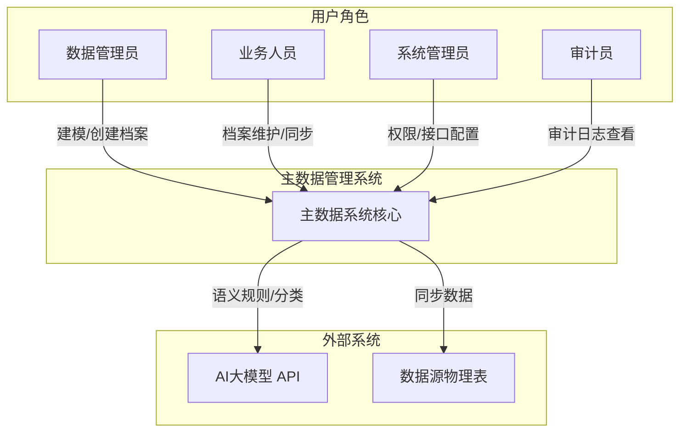
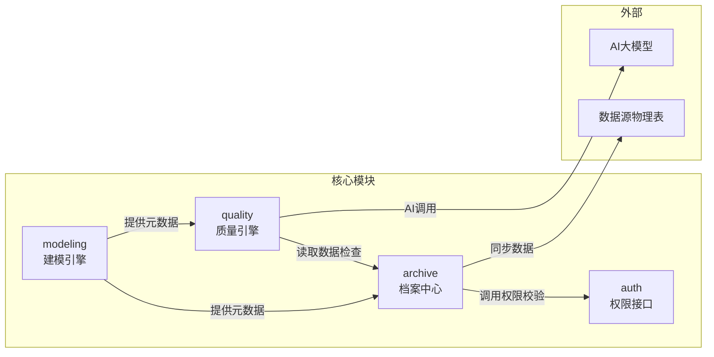
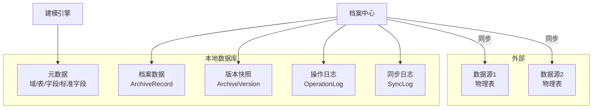
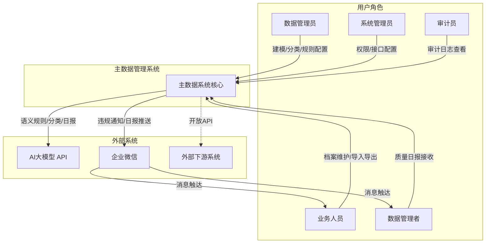
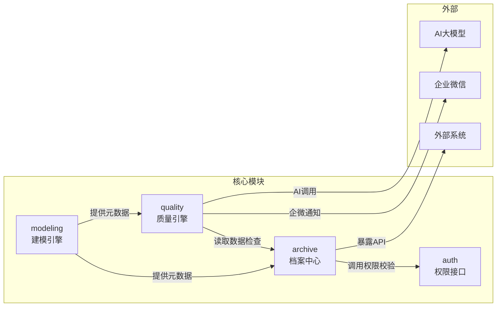
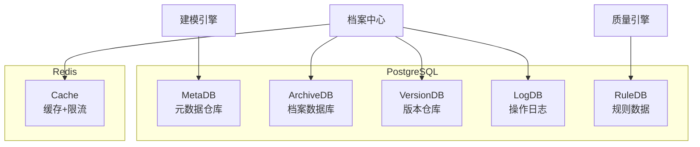

# 概念架构

---

## 技术栈

| 层级 | 选型 | 说明 |
|------|------|------|
| **前端** | Vue 3 + TypeScript + Ant Design Vue | 动态表单生成能力强，适合模型驱动渲染场景 |
| **后端** | Python 3.13 + Django 6.0.7 + Django REST Framework | Django ORM + DRF 快速搭建数据驱动的 REST API |
| **数据库** | SQLite（开发）/ PostgreSQL（生产） | JSONB 支持灵活的元数据存储 |
| **AI集成** | HTTP调用外部LLM API（DeepSeek/Qwen/OpenAI） | 预留模型切换能力 |
| **构建** | Docker + docker-compose | 容器化部署 |

---

## 系统上下文图

---

## 模块列表

### 主数据建模引擎（代号：modeling）

- **职责**：管理主数据模型全生命周期——域、表、字段映射、字段定义与属性配置、标准字段（StandardField）管理
- **边界**：不存储实际业务数据，只管理元数据；不处理档案数据的业务逻辑
- **对外接口**：
  - 提供模型元数据查询接口（供archive消费）
  - 提供标准字段聚合视图（供档案字段映射）
  - 提供数据源连接信息（供档案同步物理表）
- **依赖**：无（最底层模块）

### 档案维护中心（代号：archive）

- **职责**：基于标准模型维护主数据档案（Golden Record），支持增删改查、同步比对与冲突审查（MDM 存活机制）、字段级回写物理表、版本定版、操作日志
- **边界**：不管理模型定义（只消费 modeling 的元数据）；同步拉数不自动覆盖档案差异字段（全部人工审查）
- **对外接口**：
  - 档案数据增删改查 RESTful API
  - 同步拉数（逐字段比对+冲突入队）与字段级回写 API（含预检）
  - 冲突审查队列查询与裁决 API
  - 版本快照查询与定版/回滚
  - 操作日志查询
- **依赖**：modeling（模型元数据、数据源连接）

### 权限与接口管理（代号：auth）

- **职责**：管理用户身份、角色权限、API开放策略；提供审计日志查询能力
- **边界**：不控制业务逻辑，只做权限校验的中间层
- **依赖**：无（独立服务于其他模块）

### 质量规则引擎（代号：quality）

- **职责**：AI驱动的质量规则配置、执行调度、违规告警、每日质量总结
- **边界**：不存储原始档案数据，只读取和执行检查
- **依赖**：modeling（字段元数据）、archive（档案数据）

---

## 模块间交互

### 交互说明

| 调用方 | 被调用方 | 交互内容 | 方式 |
|--------|----------|----------|------|
| archive | modeling | 查询标准字段、数据源连接、物理表结构 | RPC（内部API） |
| archive | 数据源物理表 | 同步档案数据到物理表 | DB连接（动态数据源） |
| quality | modeling | 查询字段定义、类型、校验规则 | RPC（内部API） |
| quality | archive | 读取档案数据进行质量检查 | RPC（内部API） |
| archive | auth | 校验当前用户是否有操作权限 | RPC（内部API） |

---

## 数据存储架构

| 存储 | 内容 | 说明 |
|------|------|------|
| 元数据 | 域、表、关系、字段、标准字段 | modeling 模块核心元数据 |
| 档案数据 | 主数据档案记录（本地存储） | 实际业务数据 |
| 版本快照 | 每次修改的版本快照 | 支持定版/回滚 |
| 操作日志 | 所有操作的审计日志 | 只追加不修改 |
| 同步日志 | 同步到物理表的记录 | 成功/失败/冲突详情 |

---

## 关键设计决策

| 决策 | 选择 | 理由 |
|------|------|------|
| 档案创建方式 | 从域的标准模型生成 | 保证模型与档案一致性 |
| 档案数量 | 一个域一个档案 | 简化架构，避免歧义 |
| 数据存储位置 | 本地存储+同步推送 | 解耦档案维护与物理表，保证独立性 |
| 同步触发方式 | 手动点击按钮 | 用户可控，避免误操作 |
| 同步粒度 | 按记录同步 | 灵活性高，可选择性同步 |
| 冲突处理 | 检测+人工决策 | 数据安全优先，避免自动覆盖 |
| 版本定版 | 定版后锁定 | 满足审计合规，关键节点不可篡改 |
| 字段生命周期 | 只作废不删除 | 保证数据完整性和历史可追溯 |
| MDM 存活规则（REQ-018） | 三级优先（人工修正>源优先级>最新时间戳）+ 字段级粒度 | 业界主流 Survivorship 做法，逐字段裁决互不影响 |
| 同步差异处理（REQ-018） | 全部冲突人工审查，不自动覆盖 | 用户选择安全优先；规则仅生成建议裁决 |
| 回写源系统（REQ-018） | 字段级两阶段、仅手动触发 | 现有记录级 sync-to-source 重做；可控性最高 |
| MDM 机制归属（REQ-018） | 扩展 archive 模块，不新建独立模块 | 复用 ArchiveRecord/SyncLog/版本快照，改造成本最低 |

---

## 实现路径图

| 模块名 | 依赖项 | 优先级 | 开发顺序 |
|--------|--------|--------|---------|
| modeling（已完成） | 无 | P0 | 1（已完成） |
| archive（版本+日志） | 无 | P0 | 2 |
| archive（档案CRUD） | modeling（标准字段） | P0 | 3 |
| archive（同步物理表） | modeling（数据源连接） | P0 | 4 |
| archive（域→档案入口） | modeling + archive | P0 | 5 |
| auth | 无 | P1 | 后续 |
| quality | modeling + archive | P1 | 后续 |
| archive-mdm（同步比对+修正保护+冲突队列） | archive（同步/版本/日志） | P0 | 6 |
| archive-mdm（字段级回写重做） | archive-mdm（冲突裁决） | P0 | 7 |
| archive-mdm（字段级血缘/存活建议） | archive-mdm（冲突队列） | P1 | 8 |

---

## 追溯矩阵

| 需求 | 故事线 | 功能 | 流程 |
|------|--------|------|------|
| REQ-001 主数据建模引擎 | REQ-001.md | F-001~F-003, F-007~F-008 | — |
| REQ-002 AI字段分类与冗余检测 | REQ-002.md | F-004, F-005 | — |
| REQ-010 字段属性配置界面 | REQ-010.md | F-006 | — |
| REQ-011 模型文档导出 | REQ-011.md | F-009 | — |
| REQ-013 域→档案创建链路 | REQ-013.md | F-010, F-101 | 流程一 |
| REQ-014 档案数据维护与同步 | REQ-014.md | F-102~F-108 | 流程二 |
| REQ-015 档案版本管理与定版 | REQ-015.md | F-109~F-112 | 流程三 |
| REQ-016 档案模型变更同步 | REQ-016.md | F-113 | — |
| REQ-017 计算字段配置与自动计算 | REQ-017.md | F-011~F-017 | 流程五 |
| REQ-018 MDM 主数据存活机制 | REQ-018.md | F-114~F-119 | 流程四（MDM） |

### 覆盖检查

| 检查项 | 结果 |
|--------|------|
| 每条需求有对应故事线 | 10/10 ✅ |
| 每条需求有对应功能 | 10/10 ✅ |
| 每个功能可追溯到需求 | 36/36 ✅ |
| 每个功能出现在流程图中 | 35/36 ✅（F-113为独立操作） |
# 概念架构

---

## 技术栈

| 层级 | 选型 | 说明 |
|------|------|------|
| **前端** | Vue 3 + TypeScript + Ant Design Vue | 动态表单生成能力强，适合模型驱动渲染场景 |
| **后端** | Python 3.12 + Django 5.0 + Django REST Framework | Django ORM + DRF 快速搭建数据驱动的 REST API |
| **数据库** | PostgreSQL 15+（核心）+ Redis（缓存/队列） | PostgreSQL JSONB 支持灵活的元数据存储 |
| **消息队列** | RabbitMQ | 规则异步执行、日报定时调度 |
| **AI集成** | HTTP调用外部LLM API（DeepSeek/Qwen/OpenAI） | 预留模型切换能力 |
| **外部集成** | 企业微信服务端API | 通知与消息推送 |
| **API文档** | drf-spectacular (OpenAPI) | DRF 配套的 API 文档生成 |
| **构建** | Docker + docker-compose | 容器化部署 |

---

## 系统上下文图

---

## 模块列表

### 主数据建模引擎（代号：modeling）

- **职责**：管理主数据模型全生命周期——域、表（数据源表/本地表）、字段映射关系、字段定义与属性配置，配套AI字段分类/冗余检测和模型文档导出
- **边界**：不存储实际业务数据，只管理元数据；不处理档案数据的业务逻辑
- **对外接口**：
  - 提供模型元数据查询接口（供archive/quality模块消费）
- **依赖**：无（最底层模块）

### 档案维护中心（代号：archive）

- **职责**：面向业务人员的档案操作中心，包含增删改查、分类展示、导入导出、版本管理、操作日志
- **边界**：不管理模型定义（只消费建模模块的元数据）；不执行质量规则（只配合规则引擎扫描数据）
- **对外接口**：
  - 档案数据增删改查 RESTful API（开放给外部系统）
  - 版本快照查询与回滚
  - 导入导出文件服务
- **依赖**：modeling（模型元数据）

### 权限与接口管理（代号：auth）

- **职责**：管理用户身份、角色权限、API开放策略；提供审计日志查询能力
- **边界**：不控制业务逻辑，只做权限校验的中间层
- **对外接口**：
  - 权限校验接口（供archive调用）
  - API密钥认证（供外部系统鉴权）
- **依赖**：无（独立服务于其他模块）

### 质量规则引擎（代号：quality）

- **职责**：AI驱动的质量规则配置（域入口→AI对话式配置），规则执行调度、违规告警、AI批量规则创建、每日AI质量总结
- **边界**：不存储原始档案数据，只读取和执行检查；不负责数据修复，只发现问题并通知；不支持手动规则配置
- **对外接口**：
  - 规则执行结果查询
  - 企业微信通知集成
  - AI对话记录查询
  - AI模型调用（语义规则/批量推荐/日报）
- **依赖**：modeling（字段元数据）、archive（档案数据）

---

## 模块间交互

### 交互说明

| 调用方 | 被调用方 | 交互内容 | 方式 |
|--------|----------|----------|------|
| archive | modeling | 查询模型定义、字段配置、分类方案 | RPC（内部API） |
| quality | modeling | 查询字段定义、类型、校验规则 | RPC（内部API） |
| quality | archive | 读取档案数据进行质量检查 | RPC（内部API） |
| archive | auth | 校验当前用户是否有操作权限 | RPC（内部API） |
| quality | LLM API | 语义规则转化、批量推荐、每日总结 | HTTP（外部） |
| quality | 企业微信 | 违规通知、日报推送 | HTTP（外部） |
| archive | 外部系统 | 档案数据读写 | HTTP（开放API） |

---

## 数据存储架构

| 存储 | 内容 | 说明 |
|------|------|------|
| 元数据仓库 | 域、表、关系、字段、分类方案 | 系统核心元数据 |
| 档案数据库 | 主数据档案记录 | 实际业务数据 |
| 版本仓库 | 每次修改的版本快照 | 可独立归档 |
| 操作日志 | 所有操作的审计日志 | 只追加，不修改 |
| 规则数据 | 规则定义、执行结果、违规记录 | 质量相关 |
| Redis缓存 | API限流、热点数据缓存 | 性能优化 |

---

## 追溯矩阵

| 需求 | 故事线 | 功能 | 流程 |
|------|--------|------|------|
| REQ-001 主数据建模引擎 | REQ-001-主数据建模引擎.md | F-001, F-002, F-003, F-007, F-008 | 流程一 |
| REQ-002 AI字段分类与冗余检测 | REQ-002-AI字段分类.md | F-004, F-005 | 流程一 |
| REQ-003 档案维护 | REQ-003-档案维护.md | F-101~F-105, F-112 | 流程二 |
| REQ-004 档案导入导出 | REQ-004-档案导入导出.md | F-106~F-108 | 流程二 |
| REQ-005 接口开放与权限配置 | REQ-005-接口开放与权限配置.md | F-201~F-205 | 流程四 |
| REQ-006 数据质量规则引擎（AI驱动） | REQ-006-数据质量规则引擎.md | F-301~F-304, F-308, F-311 | 流程三 |
| REQ-007 AI语义规则与批量生成 | REQ-007-AI语义规则与批量生成.md | F-305~F-307 | 流程三 |
| REQ-008 每日AI质量总结 | REQ-008-每日AI质量总结.md | F-309, F-310 | 流程三 |
| REQ-009 数据版本管理与回滚 | REQ-009-数据版本管理与回滚.md | F-109~F-111 | 流程二 |
| REQ-010 字段属性配置界面 | REQ-010-字段属性配置界面.md | F-006 | 流程一 |
| REQ-011 模型文档导出 | REQ-011-模型文档导出.md | F-009 | 流程一 |
| REQ-012 审计角色与日志查询 | REQ-012-审计角色与日志查询.md | F-206~F-208 | 流程四 |

### 覆盖检查

| 检查项 | 结果 |
|--------|------|
| 每条需求有对应故事线 | 12/12 ✅ |
| 每条需求有对应功能 | 12/12 ✅ |
| 每个功能可追溯到需求 | 40/40 ✅ |
| 每个功能出现在流程图中 | 40/40 ✅ |
| 功能清单覆盖所有需求描述场景 | ✅ |
| 业务流程覆盖所有功能操作路径 | ✅ |

---

## 关键设计决策总结

| 决策 | 选择 | 理由 |
|------|------|------|
| 字段生命周期 | 只作废不删除 | 保证数据完整性和历史可追溯 |
| 建模方式 | 逻辑建模（元数据+JSONB） | 模型变更灵活，无需DDL操作 |
| 版本策略 | 每次修改生成快照 | 实现回滚和历史追溯 |
| AI定位 | 辅助建议，人工确认生效 | 保证数据安全，AI不做最终决策 |
| 通知渠道 | 企业微信 | 国内企业通讯主流选择 |
| 权限模型 | 角色×档案×操作 | 粒度适中，维护成本可控 |
